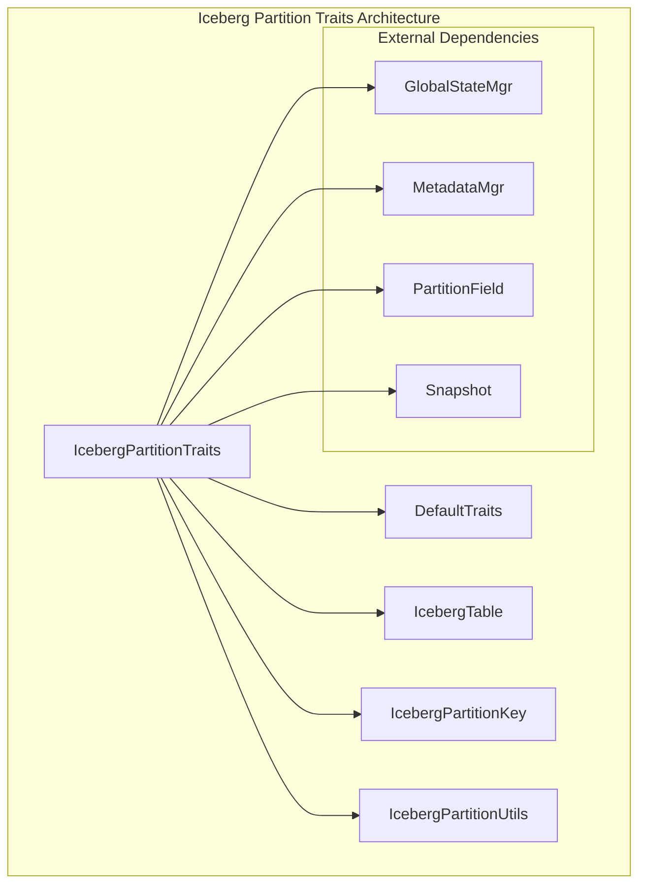
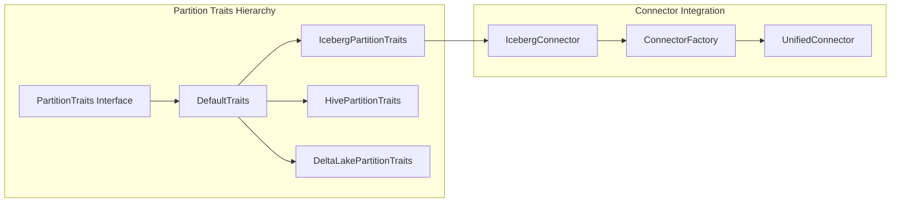
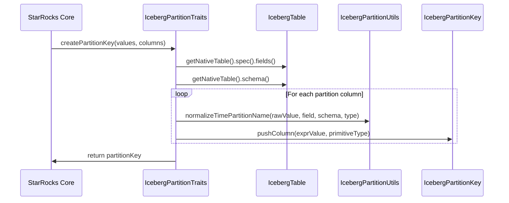
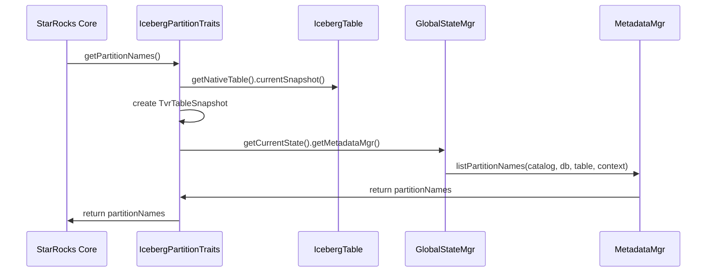

# Iceberg Partition Traits Module

## Overview

The `iceberg_partition_traits` module provides specialized partition handling capabilities for Apache Iceberg tables within the StarRocks connector framework. This module implements the `IcebergPartitionTraits` class, which extends `DefaultTraits` to provide Iceberg-specific partition operations, metadata management, and partition key creation functionality.

## Purpose and Core Functionality

The primary purpose of this module is to bridge the gap between StarRocks' internal partition management system and Apache Iceberg's partition specification. It enables StarRocks to:

- Understand and interpret Iceberg partition schemes
- Create appropriate partition keys for Iceberg tables
- Handle partition-specific operations like partition pruning and refresh
- Support partition change tracking (PCT) for materialized views
- Manage time-based partitioning transformations (year, month, day, hour)

## Architecture

### Component Structure

### Integration with Connector Framework

## Key Components

### IcebergPartitionTraits Class

The core component of this module, providing specialized implementations for:

#### Partition Support Operations
- **PCT Refresh Support**: Enables partition change tracking for materialized views
- **Partition Key Creation**: Creates `IcebergPartitionKey` instances with proper type handling
- **Partition Name Listing**: Retrieves partition names with snapshot-aware context

#### Time-based Partitioning
- Handles Iceberg's time transformation deduplication (year, month, day, hour)
- Normalizes time partition values using `IcebergPartitionUtils`
- Supports complex time-based partition schemes

#### Metadata Operations
- **Last Update Time Tracking**: Retrieves table's last update time from snapshots
- **Max Partition Refresh Timestamp**: Gets the latest snapshot timestamp for refresh operations
- **Partition Information Retrieval**: Fetches detailed partition metadata

## Data Flow

### Partition Key Creation Process

### Partition Name Retrieval Flow

## Dependencies

### Internal Dependencies
- **IcebergTable**: Provides access to native Iceberg table metadata
- **IcebergPartitionKey**: Specialized partition key implementation for Iceberg
- **IcebergPartitionUtils**: Utility functions for Iceberg-specific operations
- **GlobalStateMgr**: Central metadata management system

### External Dependencies
- **Apache Iceberg API**: Core Iceberg functionality including `PartitionField`, `Snapshot`, and table operations
- **StarRocks Catalog System**: Integration with table and column metadata
- **Connector Framework**: Base traits and interfaces from the partition traits system

## Integration Points

### With Iceberg Connector
The module integrates closely with the [iceberg_connector](iceberg_connector.md) to provide:
- Partition-aware query planning
- Metadata synchronization
- Partition pruning optimization

### With Query Execution
Works with [query_execution](query_execution.md) for:
- Partition filtering during scan operations
- Runtime partition pruning
- Partition-based data skipping

### With Materialized Views
Cooperates with [materialized_views](materialized_views.md) for:
- Partition change tracking (PCT) refresh
- Incremental refresh based on partition changes
- Partition-level refresh optimization

## Configuration and Usage

### Enabling Iceberg Partition Traits
The `IcebergPartitionTraits` is automatically instantiated when working with Iceberg tables through the connector framework. No explicit configuration is required.

### Key Features
1. **Automatic Partition Detection**: Automatically detects and handles Iceberg partition specifications
2. **Time Transformation Support**: Handles complex time-based partitioning schemes
3. **Snapshot Awareness**: Uses Iceberg snapshots for consistent partition metadata
4. **Null Value Handling**: Properly handles null partition values with dedicated support
5. **Type Preservation**: Maintains precision and scale for decimal types during partition key creation

## Error Handling

The module includes comprehensive validation:
- **Size Validation**: Ensures partition values match column definitions
- **Field Mapping Validation**: Verifies partition field correspondence
- **Type Compatibility**: Validates type compatibility during partition key creation
- **Null Safety**: Handles null values gracefully with appropriate literal creation

## Performance Considerations

### Optimization Strategies
- **Lazy Evaluation**: Partition metadata is fetched only when needed
- **Snapshot Caching**: Leverages Iceberg's snapshot mechanism for consistent views
- **Batch Operations**: Supports bulk partition operations for efficiency

### Memory Management
- **Minimal Object Creation**: Reuses partition key objects where possible
- **Streamlined Data Structures**: Uses efficient Guava collections for partition management

## Future Enhancements

Potential areas for improvement include:
- Enhanced support for complex partition transformations
- Improved caching mechanisms for partition metadata
- Advanced partition pruning strategies
- Support for Iceberg's hidden partitioning features

## Related Documentation

- [Iceberg Connector](iceberg_connector.md) - Main Iceberg connector implementation
- [Partition Traits System](partition_traits.md) - Overview of the partition traits framework
- [Query Execution](query_execution.md) - Query execution and partition filtering
- [Materialized Views](materialized_views.md) - PCT refresh and partition tracking