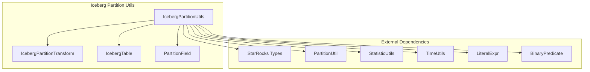
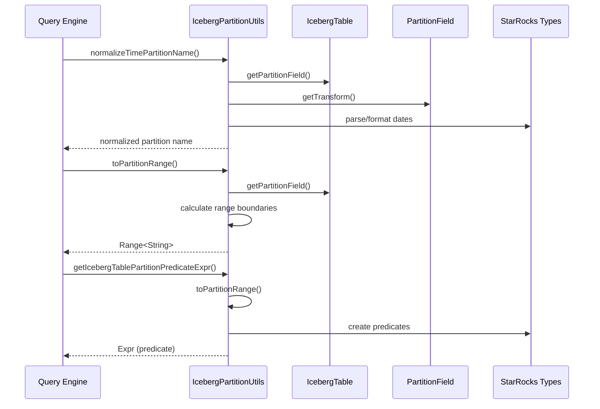
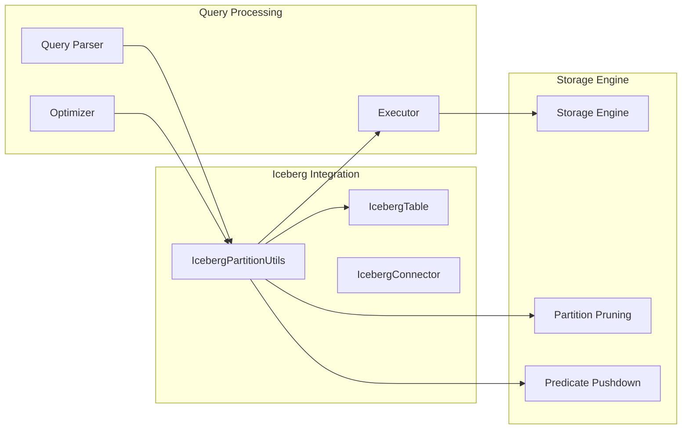

# Iceberg Partition Utils Module

## Introduction

The `iceberg_partition_utils` module provides essential utilities for handling Apache Iceberg table partitioning within the StarRocks system. This module bridges the gap between Iceberg's partitioning schemes and StarRocks' query processing requirements, enabling efficient partition pruning, predicate pushdown, and partition-aware query optimization.

## Core Functionality

The module specializes in:
- **Partition Name Normalization**: Converting Iceberg partition values to standardized formats
- **Partition Transform Handling**: Supporting Iceberg's various partition transformations (year, month, day, hour)
- **Predicate Generation**: Creating range predicates for partition pruning
- **Time Zone Management**: Handling timestamp with timezone conversions
- **Partition Range Calculation**: Determining partition boundaries for query optimization

## Architecture

### Component Structure



### Data Flow Architecture



## Core Components

### IcebergPartitionUtils Class

The main utility class providing static methods for partition operations:

#### Key Methods

1. **Partition Name Normalization**
   ```java
   normalizeTimePartitionName(String partitionName, PartitionField partitionField, Schema schema, Type type)
   ```
   - Converts Iceberg partition values to standardized date/datetime formats
   - Handles timezone conversions for timestamp with timezone types
   - Supports year, month, day, and hour transformations

2. **Partition Range Calculation**
   ```java
   toPartitionRange(IcebergTable table, String partitionColumn, String partitionValue, boolean isFromIcebergTime)
   ```
   - Converts partition values to time ranges
   - Handles both identity and transformed partitions
   - Returns `Range<String>` objects for predicate generation

3. **Predicate Expression Generation**
   ```java
   getIcebergTablePartitionPredicateExpr(IcebergTable table, String partitionColName, SlotRef slotRef, List<Expr> exprs)
   ```
   - Creates optimized partition predicates for query execution
   - Uses range predicates instead of date_trunc functions for better Iceberg SDK performance
   - Handles both identity and transformed partitions

#### Partition Transform Support

The module supports Iceberg's partition transformations:

| Transform | Input Format | Output Format | Example |
|-----------|--------------|---------------|---------|
| YEAR | 2023 | 2023-01-01 (Date) or 2023-01-01 00:00:00 (Datetime) |
| MONTH | 2023-01 | 2023-01-01 (Date) or 2023-01-01 00:00:00 (Datetime) |
| DAY | 2023-01-01 | 2023-01-01 (Date) or 2023-01-01 00:00:00 (Datetime) |
| HOUR | 2023-01-01-12 | 2023-01-01 12:00:00 (Datetime) |

### Integration with StarRocks System



## Dependencies

### Internal Dependencies
- **[partition_util](partition_util.md)**: Provides date/time interval utilities
- **[statistic_utils](statistic_utils.md)**: Handles column quoting and statistics
- **[time_utils](time_utils.md)**: Manages timezone operations
- **[literal_expr](literal_expr.md)**: Expression creation and manipulation
- **[binary_predicate](binary_predicate.md)**: Predicate construction

### External Dependencies
- **Apache Iceberg**: Core table format and partitioning logic
- **Java Time API**: Date/time parsing and formatting
- **Google Guava**: Range operations and utilities

## Usage Patterns

### Partition Pruning
```java
// Generate partition predicates for query optimization
Expr partitionPredicate = IcebergPartitionUtils.getIcebergTablePartitionPredicateExpr(
    icebergTable, 
    "event_time", 
    slotRef, 
    partitionValues
);
```

### Partition Name Processing
```java
// Normalize partition names for consistent handling
String normalizedName = IcebergPartitionUtils.normalizeTimePartitionName(
    partitionName,
    partitionField,
    schema,
    columnType
);
```

### Range Calculation
```java
// Calculate partition ranges for time-based partitions
Range<String> partitionRange = IcebergPartitionUtils.toPartitionRange(
    table,
    columnName,
    partitionValue,
    true
);
```

## Performance Considerations

### Optimization Strategies
1. **Range Predicates**: Uses range predicates instead of function-based predicates for better Iceberg SDK performance
2. **Timezone Caching**: Efficient timezone conversion with proper caching
3. **String Interning**: Optimized string handling for partition values
4. **Lazy Evaluation**: Deferred computation of partition ranges until needed

### Memory Management
- Minimal object creation during partition processing
- Reuse of DateTimeFormatter instances
- Efficient Range object usage from Guava

## Error Handling

The module implements comprehensive error handling:
- **Validation**: Input parameter validation with Preconditions
- **Exception Translation**: Converts Java exceptions to StarRocksConnectorException
- **Logging**: Detailed logging for debugging partition processing issues
- **Graceful Degradation**: Falls back to identity partitioning when transforms are unsupported

## Testing and Validation

### Test Coverage Areas
- Partition transform edge cases (leap years, timezone boundaries)
- Invalid partition name handling
- Timezone conversion accuracy
- Predicate generation correctness
- Integration with query optimizer

### Validation Points
- Partition field existence verification
- Transform support validation
- Date/time format compliance
- Range boundary accuracy

## Future Enhancements

### Planned Improvements
1. **Additional Transforms**: Support for bucket and truncate transforms
2. **Vectorized Operations**: Batch processing of partition operations
3. **Caching Layer**: Cache frequently used partition mappings
4. **Metrics Integration**: Enhanced partition statistics collection

### Extension Points
- Custom partition transform plugins
- Pluggable timezone handling strategies
- Configurable date/time format patterns
- Extended predicate optimization rules

## Related Documentation

- [Iceberg Connector](iceberg_connector.md) - Main Iceberg integration module
- [Partition Management](partition_management.md) - General partition handling
- [Query Optimization](query_optimization.md) - Query planning and optimization
- [Time Utilities](time_utils.md) - Timezone and date/time operations
- [Predicate Evaluation](predicate_evaluation.md) - Predicate processing and pushdown