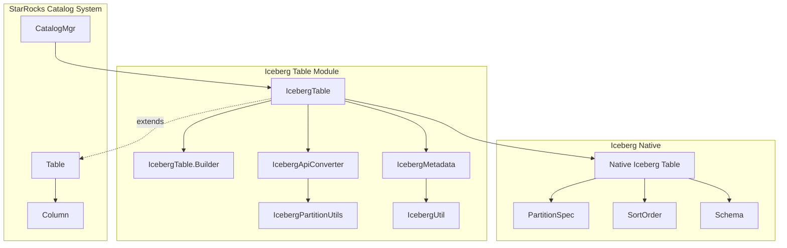
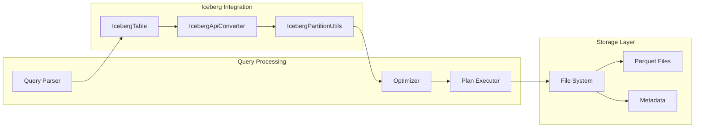
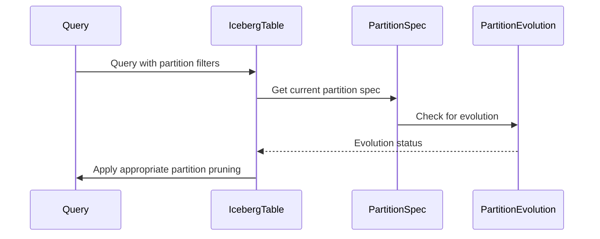
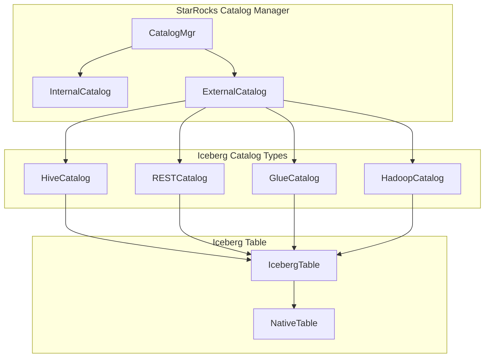
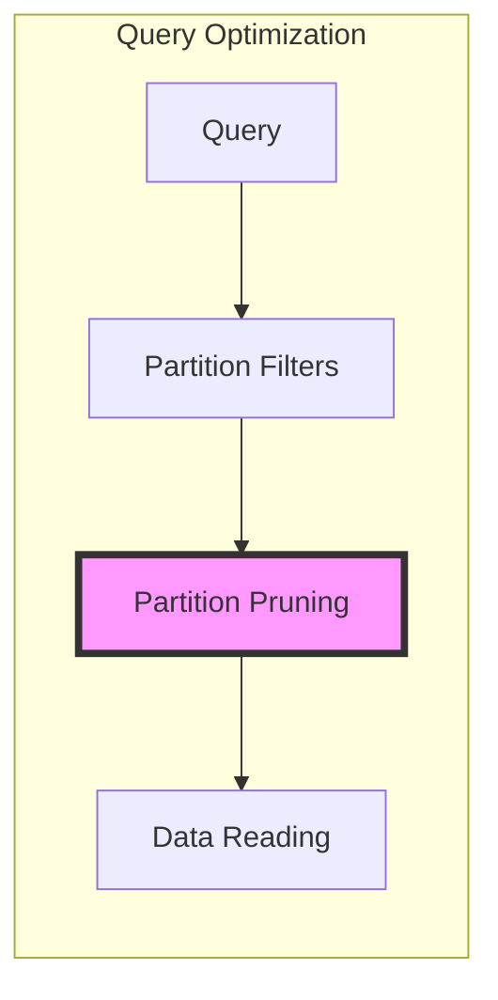

# Iceberg Table Module Documentation

## Overview

The Iceberg Table module provides comprehensive support for Apache Iceberg table format integration within StarRocks. This module enables StarRocks to query, analyze, and manage Iceberg tables as external tables, bridging the gap between StarRocks' analytical capabilities and Iceberg's table format features.

## Purpose and Core Functionality

The Iceberg Table module serves as the primary interface between StarRocks and Apache Iceberg tables, providing:

- **Table Metadata Management**: Handles Iceberg table schema, partitioning, and properties
- **Partition Evolution Support**: Manages partition transformations and evolution scenarios
- **Catalog Integration**: Integrates with various Iceberg catalog implementations (Hive, REST, Hadoop)
- **Query Optimization**: Provides partition pruning and predicate pushdown capabilities
- **Data Format Support**: Supports Parquet file format for optimal analytical performance
- **Table Operations**: Supports Iceberg table maintenance procedures (snapshot management, file compaction, etc.)

## Architecture

### Component Architecture



### Data Flow Architecture



## Core Components

### IcebergTable

The main class representing an Iceberg table in StarRocks. It extends the base `Table` class and provides Iceberg-specific functionality:

- **Table Identity**: Manages unique table identification using catalog, database, and table names
- **Schema Management**: Handles column schemas and type mappings between Iceberg and StarRocks
- **Partition Handling**: Supports complex partitioning schemes including transformed partitions
- **Property Management**: Manages Iceberg-specific table properties and configurations

### IcebergTable.Builder

A builder pattern implementation for creating IcebergTable instances:

```java
public static class Builder {
    private long id;
    private String srTableName;
    private String catalogName;
    private String resourceName;
    private String catalogDBName;
    private String catalogTableName;
    private String comment;
    private List<Column> fullSchema;
    private Map<String, String> icebergProperties;
    private org.apache.iceberg.Table nativeTable;
    
    public IcebergTable build() {
        return new IcebergTable(id, srTableName, catalogName, resourceName, catalogDBName, catalogTableName,
                comment, fullSchema, nativeTable, icebergProperties);
    }
}
```

### Key Features

#### 1. Partition Evolution Support

The module handles Iceberg's partition evolution feature, allowing tables to change partitioning schemes over time:



#### 2. Catalog Type Support

Supports multiple Iceberg catalog types:

- **Hive Catalog**: Integration with Hive Metastore
- **REST Catalog**: REST-based catalog service
- **Hadoop Catalog**: File-system based catalog
- **Glue Catalog**: AWS Glue Data Catalog integration

#### 3. Table Operations

Provides support for Iceberg table maintenance procedures:

- **Snapshot Management**: Expire snapshots, rollback to snapshots
- **File Management**: Remove orphan files, rewrite data files
- **Partition Management**: Add files, cherry-pick snapshots
- **Fast Forward**: Advance table to specific snapshot

## Integration Points

### Catalog Integration



### Query Engine Integration

The module integrates with StarRocks' query execution engine through:

- **Descriptor Table**: Provides table metadata for query planning
- **Partition Pruning**: Optimizes queries by eliminating unnecessary partitions
- **Predicate Pushdown**: Pushes filters to the storage layer
- **Sort Order Optimization**: Utilizes Iceberg's sort order for query optimization

## Dependencies

### Internal Dependencies

- **[catalog](../catalog.md)**: Core catalog management functionality
- **[connector_framework](../connector_framework.md)**: Connector infrastructure
- **[sql_parser_optimizer](../sql_parser_optimizer.md)**: Query parsing and optimization
- **[storage_engine](../storage_engine.md)**: Storage layer integration

### External Dependencies

- **Apache Iceberg**: Core Iceberg library for table format support
- **Apache Parquet**: Columnar storage format support
- **Apache Hadoop**: File system abstraction

## Configuration and Usage

### Table Creation

Iceberg tables are typically created through the connector framework:

```sql
CREATE EXTERNAL TABLE iceberg_table (
    id BIGINT,
    name STRING,
    created_date DATE
)
ENGINE=ICEBERG
PROPERTIES (
    "resource" = "iceberg_resource",
    "database" = "iceberg_db",
    "table" = "iceberg_table"
);
```

### Supported Operations

- **SELECT**: Query Iceberg tables with full SQL support
- **INSERT**: Insert data into Iceberg tables (Parquet format only)
- **ANALYZE**: Collect statistics for query optimization
- **SHOW PARTITIONS**: Display partition information
- **DESCRIBE**: Show table structure and properties

## Performance Considerations

### Partition Pruning

The module implements sophisticated partition pruning to minimize data scanning:



### Metadata Caching

- **Schema Caching**: Caches table schemas to avoid repeated metadata calls
- **Partition Metadata**: Caches partition information for frequently accessed tables
- **Statistics Caching**: Maintains table statistics for query optimization

## Error Handling

The module implements comprehensive error handling for:

- **Catalog Connectivity**: Handles connection failures to Iceberg catalogs
- **Schema Mismatches**: Manages schema evolution and compatibility issues
- **File Access**: Handles missing or corrupted data files
- **Permission Issues**: Manages access control and authorization failures

## Future Enhancements

Planned improvements include:

- **Write Support**: Enhanced INSERT and UPDATE capabilities
- **Time Travel**: Query historical snapshots
- **Branch Support**: Work with Iceberg branches
- **Advanced Transformations**: Support for more partition transformations
- **Performance Optimization**: Enhanced predicate pushdown and vectorization

## References

- [Apache Iceberg Specification](https://iceberg.apache.org/spec/)
- [StarRocks Connector Framework](../connector_framework.md)
- [Catalog Management](../catalog.md)
- [Query Execution Engine](../query_execution.md)