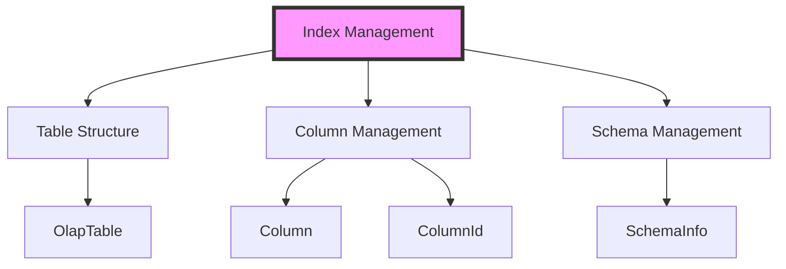
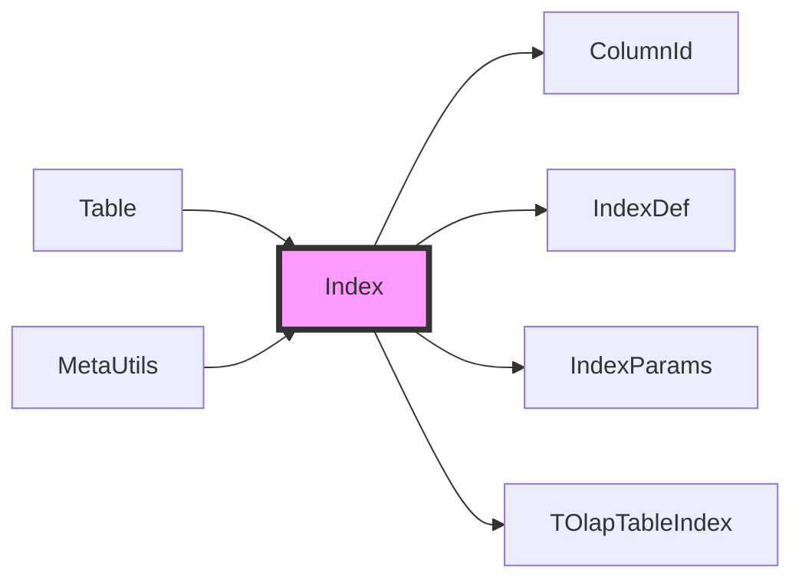
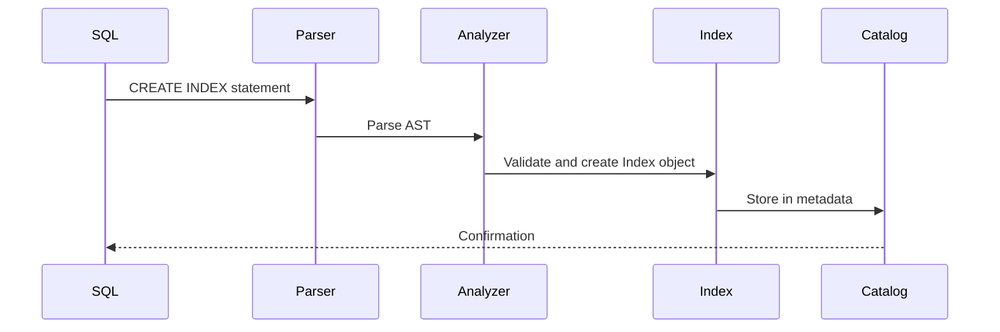
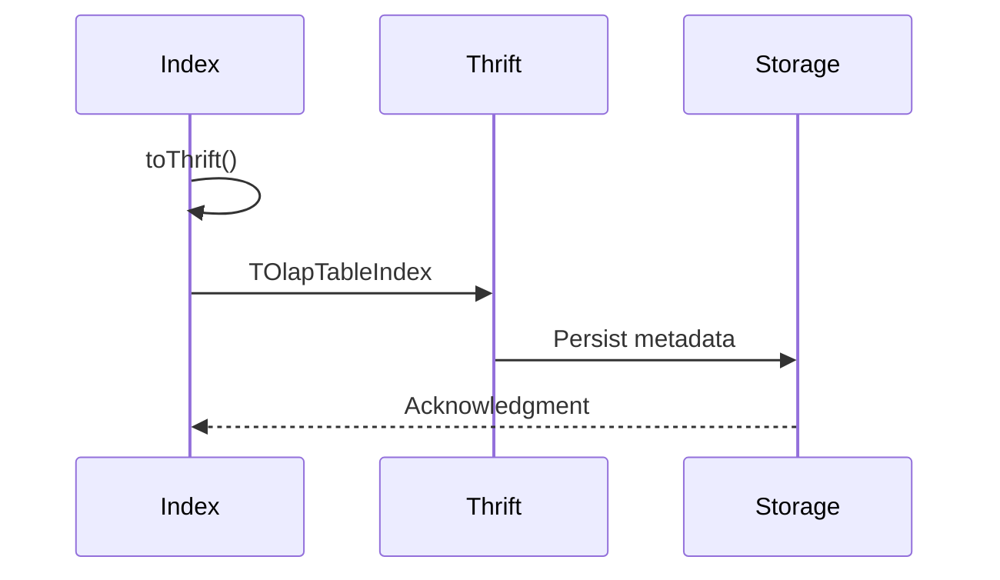

# Index Management Module

## Introduction

The index_management module is a core component of StarRocks' catalog system that handles the creation, storage, and management of database indexes. This module provides the foundational infrastructure for defining and maintaining various types of indexes on tables, enabling efficient data retrieval and query optimization.

## Overview

The index management system is responsible for:
- Defining and storing index metadata
- Managing different index types (bitmap, bloom filter, etc.)
- Handling index properties and configurations
- Providing serialization/deserialization for index objects
- Supporting index operations in SQL statements

## Core Architecture

### Index Class Structure

The primary component of this module is the `Index` class, which represents an internal index definition with the following key attributes:

```
Index
├── indexId: long                    # Unique identifier for the index
├── indexName: String                # Human-readable index name
├── columns: List<ColumnId>          # Columns included in the index
├── indexType: IndexType             # Type of index (BITMAP, BLOOM_FILTER, etc.)
├── comment: String                  # Optional description
└── properties: Map<String, String>  # Index-specific properties
```

### Index Types Support

The module supports multiple index types through the `IndexDef.IndexType` enumeration:
- **BITMAP**: Bitmap indexes for low-cardinality columns
- **BLOOM_FILTER**: Bloom filter indexes for membership testing
- **NGRAM**: N-gram indexes for text search
- And other specialized index types

## Component Relationships

### Integration with Catalog System



### Dependencies



## Data Flow

### Index Creation Flow



### Index Serialization Flow



## Key Features

### 1. Index Property Management

The module categorizes index properties into four types:
- **COMMON**: General properties applicable to all index types
- **INDEX**: Index-specific configuration properties
- **SEARCH**: Properties related to search functionality
- **EXTRA**: Additional custom properties

### 2. SQL Generation

Supports generating SQL DDL statements from index objects:
```sql
INDEX index_name (column1, column2) USING index_type PROPERTIES(...) COMMENT '...'
```

### 3. Validation and Compatibility

- Validates index definitions for compatibility
- Ensures proper column references
- Checks index type validity

## Integration Points

### Frontend Integration

The index management module integrates with:
- **SQL Parser**: For parsing CREATE INDEX statements
- **Query Analyzer**: For validating index usage
- **Metadata System**: For persisting index definitions
- **Table Management**: For associating indexes with tables

### Backend Integration

Indexes are communicated to backend nodes through:
- Thrift serialization (`TOlapTableIndex`)
- Property categorization for different processing
- Index-specific parameter handling

## Usage Examples

### Creating an Index

```java
List<ColumnId> columns = Arrays.asList(columnId1, columnId2);
Index bitmapIndex = new Index("user_index", columns, 
    IndexDef.IndexType.BITMAP, "Bitmap index on user columns");
```

### Converting to Thrift

```java
TOlapTableIndex thriftIndex = index.toThrift();
// Use thriftIndex for backend communication
```

## Related Modules

- **[column_management](column_management.md)**: For column reference validation
- **[table_structure](table_structure.md)**: For table-index associations
- **[sql_parser_optimizer](sql_parser_optimizer.md)**: For index statement parsing
- **[storage_engine](storage_engine.md)**: For index implementation details

## Best Practices

1. **Index Naming**: Use descriptive names that indicate purpose and columns
2. **Column Selection**: Choose appropriate columns based on query patterns
3. **Property Configuration**: Set relevant properties for optimal performance
4. **Type Selection**: Choose the right index type for the use case

## Future Enhancements

- Support for more index types
- Advanced property validation
- Index usage statistics
- Automated index recommendations
- Performance monitoring integration

## Conclusion

The index_management module provides a robust foundation for index management in StarRocks, offering flexibility in index definition while maintaining consistency with the overall catalog system. Its design supports extensibility for new index types and properties while ensuring reliable metadata management.