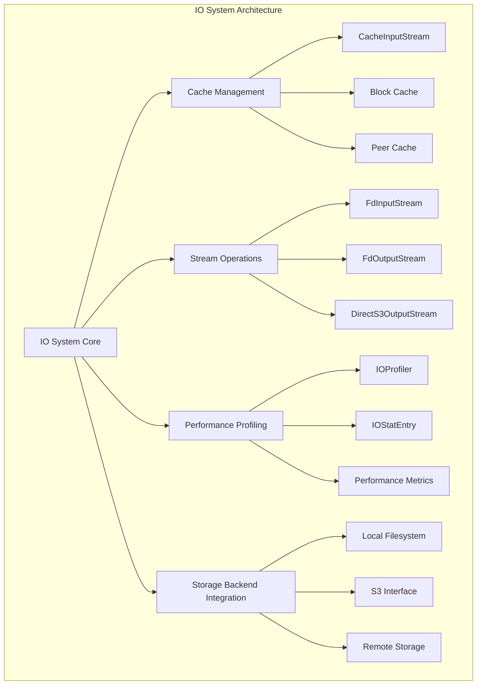
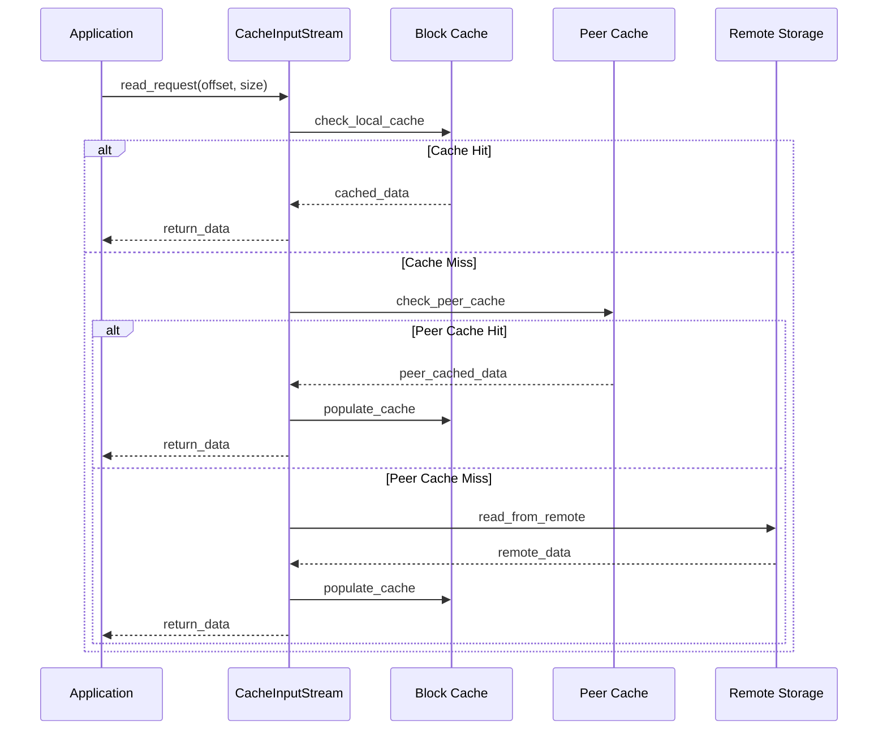

# IO System Module Documentation

## Overview

The IO System module is a critical component of StarRocks that provides comprehensive input/output operations management, caching mechanisms, and performance profiling capabilities. This module serves as the foundation for all data access patterns in the system, offering optimized read/write operations across various storage backends including local filesystem, cloud storage (S3), and distributed storage systems.

## Architecture

## Core Functionality

### 1. Cache Management Subsystem
The cache management system provides intelligent data caching to optimize read performance and reduce network overhead. It implements a multi-tier caching strategy including local block cache and peer-to-peer cache sharing.

**Key Components:**
- **CacheInputStream**: Intelligent caching input stream that automatically manages cache population and retrieval
- **Block Cache**: Fixed-size block-based caching with configurable block sizes
- **Peer Cache**: Distributed caching mechanism for sharing cached data across cluster nodes

### 2. Stream Operations
Provides unified interfaces for various input/output operations across different storage backends.

**Key Components:**
- **FdInputStream**: File descriptor-based input stream for local filesystem operations
- **FdOutputStream**: File descriptor-based output stream with automatic resource management
- **DirectS3OutputStream**: Optimized S3 output stream with multipart upload support

### 3. Performance Profiling
Comprehensive IO performance monitoring and profiling system for performance analysis and optimization.

**Key Components:**
- **IOProfiler**: Central profiling engine that tracks IO operations across different contexts
- **IOStatEntry**: Statistical data collection for read/write operations
- **Context-aware Tracking**: Per-tablet and per-operation-type performance metrics

## Sub-modules

### [cache_management](cache_management.md)
Implements intelligent caching strategies for optimizing data access patterns. Manages both local block cache and distributed peer cache systems. This sub-module provides the core caching infrastructure that significantly improves read performance by reducing redundant network operations and disk I/O.

### [stream_operations](stream_operations.md)
Provides unified stream interfaces for various storage backends including local filesystem, cloud storage, and remote storage systems. This sub-module abstracts the complexity of different storage systems and provides consistent APIs for read/write operations across diverse storage platforms.

### [performance_profiling](performance_profiling.md)
Offers comprehensive IO performance monitoring, statistics collection, and profiling capabilities for system optimization. This sub-module enables detailed performance analysis and bottleneck identification through context-aware metrics collection and real-time profiling tools.

## Data Flow

## Integration Points

The IO System module integrates with several other StarRocks modules:

- **[storage_engine](storage_engine.md)**: Provides optimized data access for storage operations
- **[query_execution](query_execution.md)**: Enables efficient data reading during query processing
- **[backend_server](backend_server.md)**: Supports backend server operations with optimized IO
- **[file_systems](file_systems.md)**: Integrates with various filesystem implementations

## Performance Characteristics

### Cache Performance
- **Hit Rate**: Configurable cache policies optimize for different access patterns
- **Block Size**: Default 256KB blocks with configurable sizing
- **Memory Management**: Efficient memory usage with automatic eviction policies

### Stream Performance
- **Zero-copy Operations**: Minimizes data copying for improved performance
- **Async Operations**: Supports asynchronous IO operations for better throughput
- **Batch Processing**: Optimized for batch read/write operations

### Profiling Overhead
- **Minimal Impact**: Designed for low-overhead performance monitoring
- **Context-aware**: Tracks performance metrics per operation type and tablet
- **Real-time Metrics**: Provides real-time performance statistics

## Configuration

The IO System module supports various configuration options:

- **Cache Configuration**: Block size, cache capacity, eviction policies
- **Stream Configuration**: Buffer sizes, async operation settings
- **Profiling Configuration**: Sampling rates, metric collection levels

## Error Handling

The module implements comprehensive error handling:

- **Graceful Degradation**: Falls back to remote storage when cache operations fail
- **Resource Management**: Automatic cleanup and resource deallocation
- **Error Propagation**: Proper error reporting through Status objects

## Monitoring and Observability

The IO System provides extensive monitoring capabilities:

- **Performance Metrics**: Detailed IO statistics and performance counters
- **Cache Statistics**: Hit rates, miss rates, and cache efficiency metrics
- **Error Tracking**: Comprehensive error logging and tracking
- **Resource Usage**: Memory and disk usage monitoring

This documentation provides a comprehensive overview of the IO System module. For detailed information about specific sub-modules, please refer to their individual documentation files.