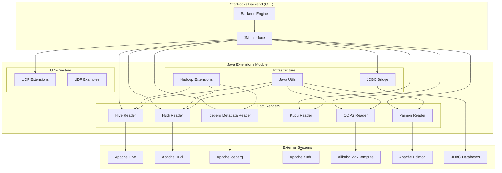

# Java Extensions Module Documentation

## Overview

The `java_extensions` module is a comprehensive Java-based extension framework within the StarRocks ecosystem that provides specialized connectors, data readers, and user-defined function (UDF) capabilities. This module serves as a bridge between StarRocks' native C++ backend and various external data sources and processing engines, enabling seamless integration with modern data lake formats, cloud storage systems, and custom business logic implementations.

## Purpose and Core Functionality

The primary purpose of the java_extensions module is to:

- **Enable External Data Access**: Provide native connectivity to diverse data sources including Hive, Hudi, Iceberg, Kudu, ODPS (MaxCompute), and Paimon
- **Support Data Lake Integration**: Offer specialized readers for modern table formats with optimized performance
- **Facilitate Custom Logic**: Enable user-defined functions in Java for extending SQL capabilities
- **Bridge Language Barriers**: Provide JNI-based integration between Java ecosystems and StarRocks' C++ backend
- **Ensure Scalability**: Support distributed processing with proper resource management and error handling

## Architecture Overview

## Module Structure and Components

### 1. Data Reader Sub-modules

#### [Hive Reader](hive_reader.md)
- **Purpose**: Reads data from Apache Hive tables with support for multiple file formats (ORC, Parquet, Text, Avro)
- **Key Features**: Schema evolution support, column pruning, predicate pushdown, partition processing
- **Components**: `HiveScanner`, `HiveScannerFactory`

#### [Hudi Reader](hudi_reader.md)
- **Purpose**: Specialized reader for Apache Hudi tables supporting both Copy-on-Write (CoW) and Merge-on-Read (MoR) formats
- **Key Features**: Real-time data access, incremental processing, time travel queries, schema evolution
- **Components**: `HudiSliceScanner`, `HudiSliceScannerFactory`, `HudiScannerUtils`

#### [Iceberg Metadata Reader](iceberg_metadata_reader.md)
- **Purpose**: Provides access to Apache Iceberg table metadata without scanning actual data files
- **Key Features**: Metadata-only queries, file listings, partition information, snapshot management
- **Components**: `IcebergMetadataScannerFactory`, `IcebergFilesTableScanner`, `IcebergSnapshotsTableScanner`

#### [Kudu Reader](kudu_reader.md)
- **Purpose**: Native integration with Apache Kudu for real-time analytical workloads
- **Key Features**: Split-based parallel processing, connection pooling, type conversion
- **Components**: `KuduSplitScanner`, `KuduSplitScannerFactory`, `KuduTypeUtils`

#### [ODPS Reader](odps_reader.md)
- **Purpose**: Connector for Alibaba Cloud MaxCompute (ODPS) service
- **Key Features**: Arrow format integration, columnar data access, split-based processing
- **Components**: `OdpsSplitScanner`, `OdpsSplitScannerFactory`

#### [Paimon Reader](paimon_reader.md)
- **Purpose**: Reader for Apache Paimon lake format supporting real-time lakehouse architecture
- **Key Features**: Streaming data ingestion, incremental processing, ACID transactions
- **Components**: `PaimonSplitScanner`, `PaimonSplitScannerFactory`, `PaimonTypeUtils`

### 2. Infrastructure Sub-modules

#### [Hadoop Extensions](hadoop_extensions.md)
- **Purpose**: Cloud storage integration and credential management
- **Key Features**: Multi-cloud support (AWS, Azure, GCP), authentication mechanisms, data lake integration
- **Components**: `TemporaryGCPAccessTokenProvider`, `IcebergAwsClientFactory`, `CloudConfigurationConstants`

#### [Java Utils](java_utils.md)
- **Purpose**: Foundation utilities for JNI integration and platform operations
- **Key Features**: Memory management, native method helpers, platform abstractions
- **Components**: `NativeMethodHelper`, `Platform`

#### [JDBC Bridge](jdbc_bridge.md)
- **Purpose**: Standardized interface for JDBC-compatible databases
- **Key Features**: Connection pooling, data type conversion, simplified JNI integration
- **Components**: `JDBCBridge`, `DataSourceCache`, `JDBCUtil`

### 3. UDF System Sub-modules

#### [UDF Extensions](udf_system.md)
- **Purpose**: Framework for user-defined function development and execution
- **Key Features**: Multi-language support (Java, Python), schema management, security isolation
- **Components**: `CallStubGenerator`, `UDFClassAnalyzer`, `UDFClassLoader`

#### [UDF Examples](udf_examples.md)
- **Purpose**: Reference implementations and best practices for UDF development
- **Key Features**: Working examples, development patterns, documentation
- **Components**: `JsonAgg`, `UDFAdd`

## Key Features and Capabilities

### 1. Multi-Format Data Access
- Support for major data lake formats (Iceberg, Hudi, Delta Lake)
- Native integration with cloud storage systems
- Optimized readers for each format with format-specific optimizations

### 2. Performance Optimization
- Columnar data processing with minimal serialization overhead
- Predicate pushdown and partition pruning
- Parallel processing with configurable batch sizes
- Off-heap memory management for large datasets

### 3. Type System Integration
- Comprehensive type mapping between external systems and StarRocks
- Support for complex data types (arrays, maps, structs)
- Automatic type conversion with proper null handling
- Timezone-aware datetime processing

### 4. Security and Isolation
- Classloader isolation to prevent dependency conflicts
- Secure credential management for cloud services
- Process isolation for UDF execution
- Resource limits and timeout controls

### 5. Scalability and Reliability
- Distributed processing across multiple nodes
- Connection pooling and resource management
- Comprehensive error handling and recovery
- Monitoring and logging capabilities

## Integration with StarRocks Ecosystem

The java_extensions module integrates seamlessly with:

- **[Storage Engine](storage_engine.md)**: Provides data access layer for external sources
- **[Query Execution](query_execution.md)**: Integrates with scan operators and execution pipeline
- **[Connector Framework](connectors.md)**: Implements standardized connector interfaces
- **[Format Support](format_support.md)**: Utilizes Arrow format for efficient data transfer

## Performance Characteristics

### Throughput
- Configurable batch processing for optimal memory usage
- Parallel reading with multiple scanner instances
- Minimal data copying through direct buffer access

### Latency
- Connection pooling reduces connection establishment overhead
- Lazy initialization for metadata operations
- Efficient serialization with Kryo for complex objects

### Resource Utilization
- Off-heap memory management reduces GC pressure
- Automatic resource cleanup and connection management
- Configurable memory limits per scanner instance

## Configuration and Usage

Each reader module accepts specific configuration parameters including:
- Connection details (endpoints, credentials, table information)
- Processing options (batch size, fetch size, required fields)
- Performance tuning (parallelism, memory limits, caching)
- Security settings (authentication, encryption, access controls)

## Future Enhancements

The java_extensions module continues to evolve with:
- Support for additional data formats and cloud services
- Enhanced performance optimizations and caching strategies
- Improved security features and access controls
- Better integration with StarRocks' cost-based optimizer
- Extended UDF capabilities with more language support

## Related Documentation

For detailed information about specific components:
- Individual reader module documentation
- [Java Extensions Framework](java_extensions.md) - This overview
- [Connector Architecture](connectors.md) - General connector framework
- [Storage Engine](storage_engine.md) - Underlying storage integration
- [Query Execution](query_execution.md) - Execution engine integration