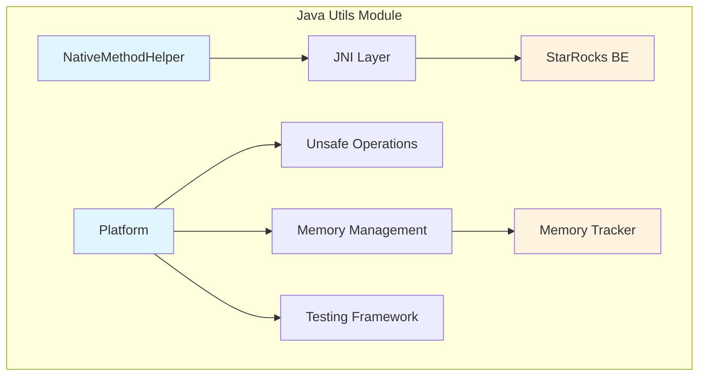
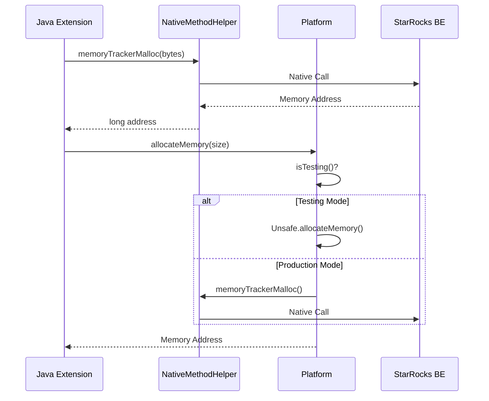

# Java Utils Module Documentation

## Overview

The `java_utils` module provides essential utility functions and platform abstractions for StarRocks Java extensions. This module serves as a foundational layer that bridges Java code with native C++ components through JNI (Java Native Interface), offering memory management, platform-specific operations, and low-level data access capabilities.

## Purpose and Core Functionality

The java_utils module is designed to:

1. **Provide JNI Bridge**: Enable seamless communication between Java extensions and native StarRocks backend components
2. **Memory Management**: Offer memory allocation and tracking capabilities with native integration
3. **Platform Abstraction**: Provide cross-platform utilities for low-level operations
4. **Performance Optimization**: Deliver high-performance utilities for data processing and memory operations

## Architecture Overview

## Module Structure

The java_utils module consists of two primary components:

### 1. NativeMethodHelper
Provides JNI-based native method calls for memory management and column operations. This component serves as the bridge between Java extensions and the StarRocks backend engine.

**Key Responsibilities:**
- Memory allocation with tracking
- Memory deallocation with tracking  
- String data resizing operations
- Column address management
- Column type information retrieval

For detailed documentation, see [native_method_helper.md](native_method_helper.md)

### 2. Platform
Offers platform-specific utilities and unsafe operations, inspired by Apache Spark's platform utilities with StarRocks-specific customizations.

**Key Responsibilities:**
- Unsafe memory operations
- Cross-platform memory management
- Testing framework integration
- Array offset calculations
- Memory copying operations

For detailed documentation, see [platform_utilities.md](platform_utilities.md)

## Data Flow Architecture

## Integration with StarRocks Ecosystem

The java_utils module integrates with various StarRocks components:

- **Storage Engine**: Provides memory management for data storage operations
- **Query Execution**: Supports runtime memory allocation for query processing
- **Java Extensions**: Serves as foundation for UDFs and other Java-based extensions
- **Connector Framework**: Enables memory operations for external data sources

## Performance Considerations

1. **Memory Tracking**: All memory operations in production mode are tracked to prevent leaks
2. **Unsafe Operations**: Utilizes sun.misc.Unsafe for high-performance memory operations
3. **JNI Optimization**: Native methods are registered once during JVM initialization
4. **Testing Support**: Provides fallback mechanisms for unit testing environments

## Security and Safety

- **Class Loader Restrictions**: NativeMethodHelper must be loaded by AppClassLoader only
- **Memory Safety**: All memory operations include proper bounds checking
- **Testing Isolation**: Separate memory management paths for testing and production

## Related Documentation

- [java_extensions.md](java_extensions.md) - Parent module documentation
- [connectors.md](connectors.md) - External connector framework
- [backend_server.md](backend_server.md) - Backend server integration

## Dependencies

This module depends on:
- JNI native libraries (registered by StarRocks BE)
- sun.misc.Unsafe for low-level operations
- Java standard library for basic utilities

## Future Enhancements

Potential areas for expansion:
- Additional platform-specific optimizations
- Enhanced memory tracking capabilities
- Support for more complex data type operations
- Performance monitoring and metrics collection