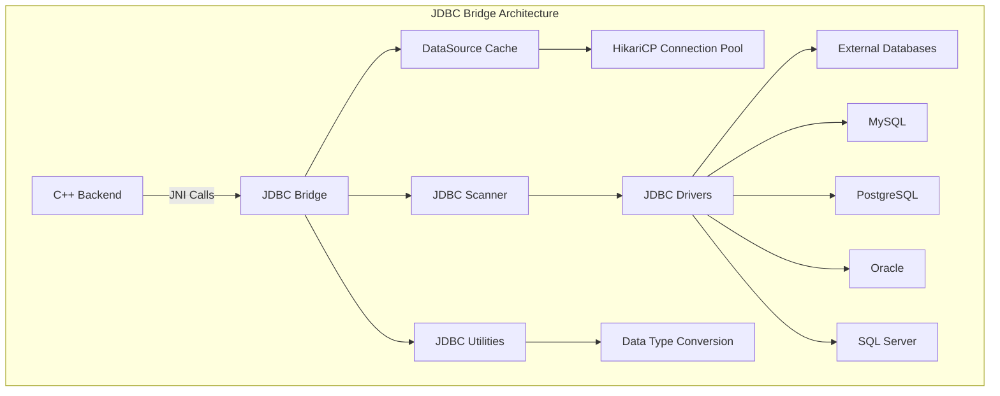
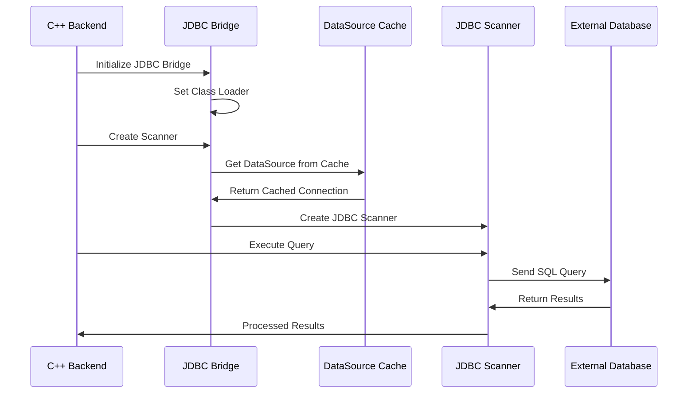

# JDBC Bridge Module Documentation

## Overview

The JDBC Bridge module serves as a critical integration layer between StarRocks and external JDBC-compatible databases. It provides a standardized interface for connecting to, querying, and managing data from various relational database systems through JDBC drivers. This module acts as a bridge that simplifies the complexity of JNI (Java Native Interface) interactions by encapsulating JDBC operations and providing clean interfaces for C++ backend components.

## Purpose and Core Functionality

The primary purpose of the JDBC Bridge module is to:

1. **Enable External Data Access**: Provide seamless access to external JDBC-compatible databases from within the StarRocks query engine
2. **Simplify JNI Integration**: Abstract complex JDBC operations behind simple interfaces that can be easily called from native C++ code
3. **Manage Database Connections**: Handle connection pooling, driver management, and connection lifecycle
4. **Support Data Type Conversion**: Convert between JDBC data types and StarRocks internal data formats
5. **Provide Caching Mechanisms**: Optimize performance through intelligent caching of database connections and metadata

## Architecture Overview



## Module Structure

The JDBC Bridge module consists of three main components:

### 1. DataSource Cache (`DataSourceCache`)
- **Purpose**: Manages cached database connections using HikariCP connection pooling
- **Key Features**: Thread-safe concurrent access, automatic connection lifecycle management
- **Documentation**: [DataSource Cache Documentation](data_source_cache.md)

### 2. JDBC Bridge Core (`JDBCBridge`)
- **Purpose**: Main entry point that provides simplified interfaces for C++ backend integration
- **Key Features**: Driver class loading, scanner creation, connection management
- **Documentation**: [JDBC Bridge Core Documentation](jdbc_bridge_core.md)

### 3. JDBC Utilities (`JDBCUtil`)
- **Purpose**: Provides utility functions for data type formatting and conversion
- **Key Features**: Date/time formatting, data type conversion utilities
- **Documentation**: [JDBC Utilities Documentation](jdbc_utilities.md)

## Detailed Component Documentation

For detailed information about each component, please refer to:
- [DataSource Cache](data_source_cache.md) - Connection pooling and cache management
- [JDBC Bridge Core](jdbc_bridge_core.md) - Main bridge interface and scanner creation
- [JDBC Utilities](jdbc_utilities.md) - Data formatting and utility functions

## Data Flow



## Integration with StarRocks Ecosystem

The JDBC Bridge module integrates with several other StarRocks components:

### Storage Engine Integration
- Works with the [storage_engine](storage_engine.md) module for data persistence and retrieval
- Utilizes connection pooling strategies similar to those in [lake_storage](lake_storage.md)

### Query Execution Integration
- Integrates with [query_execution](query_execution.md) for processing external data sources
- Supports connector scan operations through [connector_scan_node](connector_scan_node.md)

### Connector Framework Integration
- Part of the broader [connectors](connectors.md) ecosystem
- Specifically implements the [jdbc_connector](jdbc_connector.md) interface

## Performance Considerations

### Connection Management
- Uses HikariCP for high-performance connection pooling
- Implements thread-safe caching mechanisms to avoid connection overhead
- Supports concurrent access to multiple database connections

### Memory Management
- Efficient memory usage through connection reuse
- Proper cleanup of JDBC resources to prevent memory leaks
- Optimized data type conversion to minimize memory allocation

### Scalability
- Designed to handle multiple concurrent database connections
- Supports horizontal scaling through distributed query execution
- Caching mechanisms reduce database connection overhead

## Security Features

### Driver Isolation
- Each connection uses isolated class loaders for driver management
- Prevents driver conflicts and ensures clean separation
- Supports loading drivers from specified locations

### Connection Security
- Leverages HikariCP's built-in security features
- Supports standard JDBC security protocols
- Configurable connection parameters for security compliance

## Configuration and Usage

### Basic Configuration
```java
// Initialize JDBC Bridge
JDBCBridge bridge = new JDBCBridge();
bridge.setClassLoader("/path/to/jdbc/drivers");

// Create scanner for external database
JDBCScanContext context = new JDBCScanContext();
context.setConnectionString("jdbc:mysql://host:port/database");
context.setQuery("SELECT * FROM table");

JDBCScanner scanner = bridge.getScanner(context);
```

### Connection Pooling Configuration
The module automatically configures HikariCP with optimal settings for StarRocks workloads, including:
- Connection timeout management
- Pool size optimization
- Connection validation
- Automatic retry mechanisms

## Future Enhancements

Based on the TODO comments in the code, planned improvements include:

1. **Enhanced Connection Management**: Implement more sophisticated driver class loading and connection pooling
2. **Performance Optimization**: Reduce overhead of creating separate threads for each query
3. **Extended Database Support**: Add support for additional JDBC-compatible databases
4. **Advanced Caching**: Implement query result caching and metadata caching

## Dependencies

The JDBC Bridge module depends on:
- **HikariCP**: For connection pooling
- **JDBC Drivers**: For database-specific connectivity
- **StarRocks Core**: For integration with the query engine
- **Java Extensions Framework**: For consistent extension architecture

## Related Documentation

- [Storage Engine](storage_engine.md) - For data persistence integration
- [Query Execution](query_execution.md) - For query processing integration
- [Connectors](connectors.md) - For broader connector ecosystem
- [Lake Storage](lake_storage.md) - For storage management patterns