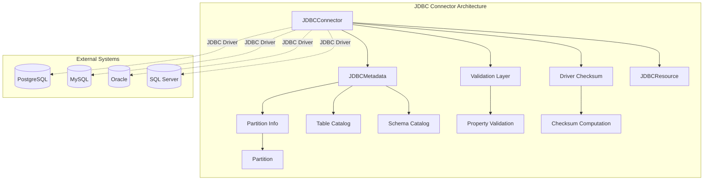

# JDBC Connector Module Documentation

## Overview

The JDBC Connector module provides StarRocks with the capability to connect to and query external databases through JDBC (Java Database Connectivity) interfaces. This module enables StarRocks to treat external databases as external catalogs, allowing users to perform federated queries across different database systems.

## Purpose and Core Functionality

The JDBC Connector serves as a bridge between StarRocks and external relational databases, providing:

- **Database Connectivity**: Establish connections to external databases via JDBC drivers
- **Metadata Integration**: Expose external database schemas, tables, and partitions to StarRocks
- **Query Federation**: Enable cross-database queries by integrating external tables into StarRocks query planning
- **Partition Awareness**: Support partitioned tables in external databases for optimized query execution
- **Driver Management**: Handle JDBC driver lifecycle, validation, and integrity checking

## Architecture Overview

## Module Structure

The JDBC Connector module consists of the following core components:

### 1. [JDBCConnector Core](jdbc_connector_core.md)
The main connector implementation that manages the lifecycle of JDBC connections and metadata. Handles driver validation, checksum computation, and connection establishment.

### 2. [Partition Management](jdbc_connector_partition.md)
Manages partition information for JDBC tables, providing necessary metadata for query planning and optimization.

## Key Features

### Driver Validation and Security
- **Property Validation**: Ensures all required JDBC connection properties are provided
- **Driver Integrity**: Computes and validates MD5 checksums of JDBC drivers
- **Connection Testing**: Validates driver availability before catalog creation

### Metadata Integration
- **Schema Discovery**: Automatically discovers database schemas and tables
- **Partition Awareness**: Handles partitioned tables for query optimization
- **Type Mapping**: Maps external database types to StarRocks types

### Performance Optimization
- **Lazy Initialization**: Metadata is loaded on-demand to reduce startup time
- **Connection Pooling**: Efficient connection management for concurrent queries
- **Partition Pruning**: Leverages partition information for query optimization

## Integration with StarRocks Ecosystem

The JDBC Connector integrates with several StarRocks components:

- **Catalog Framework**: Implements the Connector interface for seamless integration
- **Query Planning**: Provides metadata for cost-based optimization
- **Partition System**: Integrates with StarRocks partition management
- **Security Framework**: Supports authentication and authorization

## Supported Databases

The connector supports any database with a JDBC driver, including but not limited to:
- PostgreSQL
- MySQL
- Oracle
- SQL Server
- SQLite
- IBM DB2
- And many others

## Configuration

### Required Properties
- `driver_class`: Fully qualified JDBC driver class name
- `uri`: JDBC connection URL
- `user`: Database username
- `password`: Database password
- `driver_url`: URL to download the JDBC driver

### Optional Properties
- `check_sum`: MD5 checksum of the driver (computed automatically if not provided)

## Error Handling

The connector implements comprehensive error handling:
- **Connection Failures**: Graceful handling of network and authentication issues
- **Driver Issues**: Validation of driver availability and integrity
- **Metadata Errors**: Handling of schema discovery failures
- **Query Failures**: Proper error propagation to the query engine

## Security Considerations

- **Driver Integrity**: MD5 checksum validation prevents malicious driver injection
- **Credential Management**: Secure handling of database credentials
- **Network Security**: Support for encrypted JDBC connections
- **Access Control**: Integration with StarRocks authorization framework

## Performance Characteristics

- **Startup Time**: Lazy metadata loading minimizes catalog creation time
- **Query Latency**: Direct JDBC connections provide optimal performance
- **Scalability**: Connection pooling supports high concurrent query loads
- **Resource Usage**: Efficient memory usage through streaming result sets

## Monitoring and Troubleshooting

The connector provides logging and monitoring capabilities:
- **Connection Status**: Detailed logging of connection attempts and failures
- **Query Performance**: Integration with StarRocks query profiling
- **Error Diagnostics**: Comprehensive error messages for troubleshooting
- **Driver Management**: Logging of driver download and validation processes

## Future Enhancements

Potential areas for future development:
- **Connection Pooling**: Advanced connection pool management
- **Query Pushdown**: Pushdown of filters and aggregations to external databases
- **Caching**: Metadata caching for improved performance
- **Parallel Processing**: Parallel query execution across multiple partitions