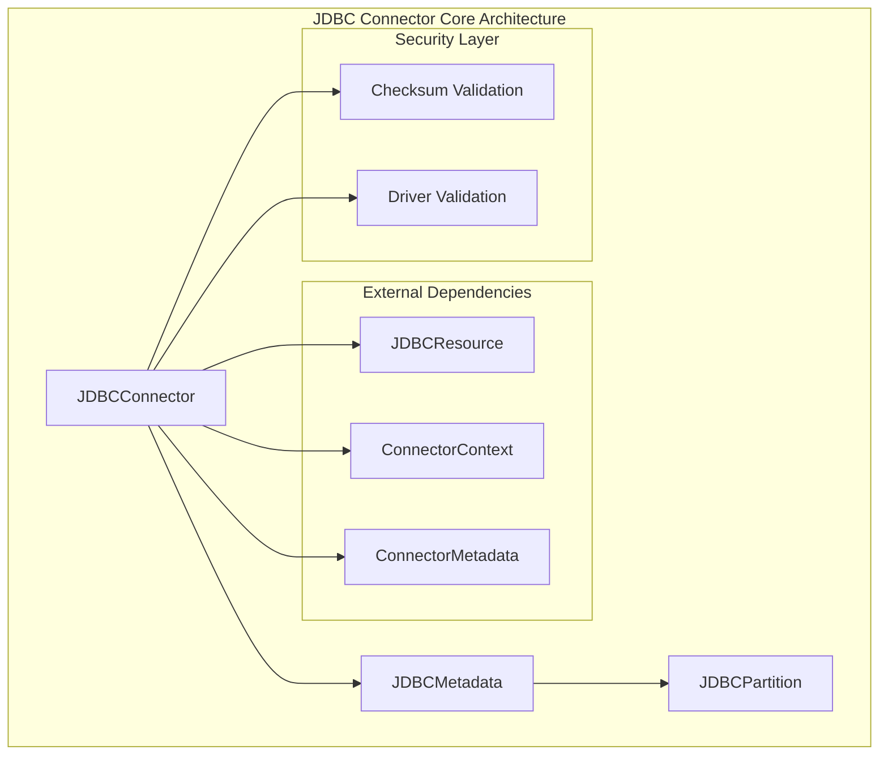
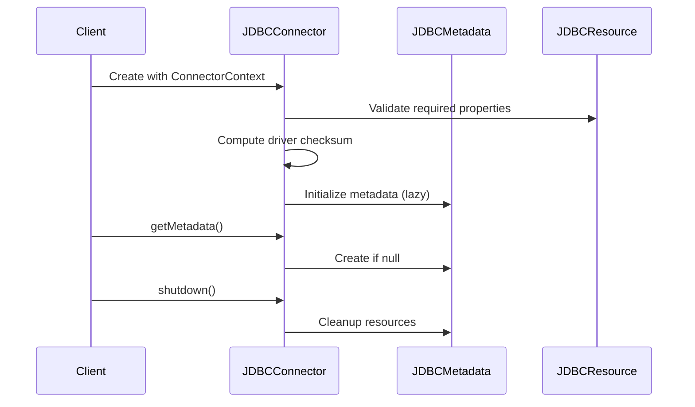
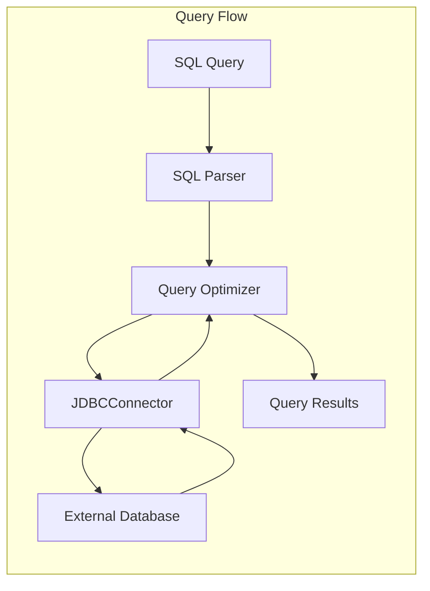
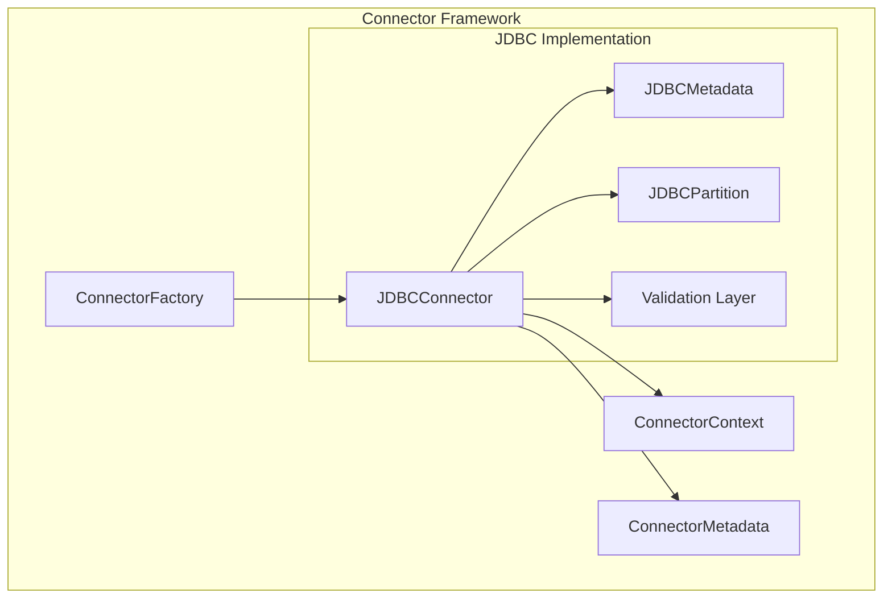
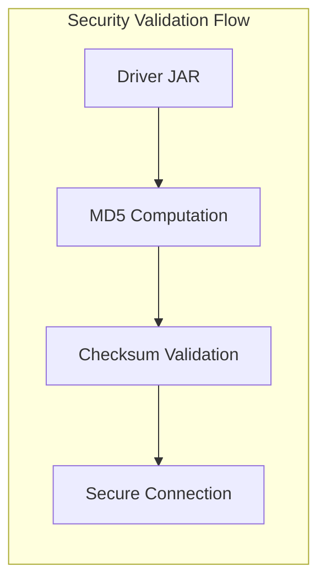

# JDBC Connector Core Module Documentation

## Introduction

The JDBC Connector Core module provides StarRocks with the ability to connect to and query external databases through JDBC (Java Database Connectivity) interfaces. This module serves as a bridge between StarRocks and various external database systems, enabling federated querying capabilities and data integration from traditional relational databases.

The module is designed with a focus on security, performance, and extensibility, supporting multiple database vendors while maintaining a consistent interface for query execution and metadata management.

## Architecture Overview

## Core Components

### JDBCConnector

The `JDBCConnector` class is the main entry point for the JDBC connector implementation. It implements the `Connector` interface and provides the following key functionalities:

- **Property Validation**: Validates required JDBC connection properties including driver class, URI, user credentials, and driver URL
- **Driver Integrity Check**: Computes and validates MD5 checksums of JDBC drivers to ensure security and integrity
- **Metadata Management**: Lazily initializes and manages JDBC metadata for catalog operations
- **Lifecycle Management**: Handles proper shutdown and cleanup of connector resources

#### Key Features:

#### Security Implementation:

The connector implements robust security measures:

1. **Driver Validation**: Ensures JDBC drivers are properly validated before use
2. **Checksum Verification**: Computes MD5 checksums of driver files to prevent tampering
3. **Property Validation**: Validates all required connection properties are present
4. **Exception Handling**: Provides detailed error messages for debugging while maintaining security

### JDBCPartition

The `JDBCPartition` class handles partition management for JDBC tables, enabling efficient data pruning and parallel processing:

- **Partition Pruning**: Supports partition elimination based on query predicates
- **Parallel Execution**: Enables distributed querying across multiple partitions
- **Metadata Caching**: Caches partition information for improved performance

## Data Flow Architecture

## Integration with StarRocks Ecosystem

### Connector Framework Integration

The JDBC connector integrates seamlessly with StarRocks' connector framework:

### Catalog Management

The connector participates in StarRocks' catalog management system:

- **Catalog Registration**: Registers as a external catalog type
- **Metadata Synchronization**: Synchronizes table metadata from external databases
- **Query Planning**: Participates in distributed query planning and optimization

## Configuration and Usage

### Required Properties

The JDBC connector requires the following configuration properties:

| Property | Description | Example |
|----------|-------------|---------|
| `driver_class` | JDBC driver class name | `com.mysql.jdbc.Driver` |
| `uri` | Database connection URI | `jdbc:mysql://host:port/database` |
| `user` | Database username | `username` |
| `password` | Database password | `password` |
| `driver_url` | URL to JDBC driver JAR | `http://host/driver.jar` |

### Optional Properties

Additional properties may be supported depending on the specific database implementation.

## Performance Considerations

### Connection Pooling

The connector supports connection pooling to minimize connection overhead and improve query performance.

### Metadata Caching

Table and partition metadata is cached to reduce repeated database queries during planning phases.

### Predicate Pushdown

The connector supports predicate pushdown where possible, pushing filtering operations to the external database to reduce data transfer.

## Security Features

### Driver Integrity

### Credential Management

- Credentials are stored securely and never logged
- Support for encrypted password storage
- Integration with StarRocks' security framework

## Error Handling

The connector implements comprehensive error handling:

- **Connection Errors**: Detailed error messages for connection failures
- **Authentication Errors**: Clear indication of authentication issues
- **Query Errors**: Propagation of database-specific error information
- **Network Errors**: Retry logic for transient network issues

## Dependencies

### Internal Dependencies

- [Connector Framework](connector_framework.md): Base connector infrastructure
- [Catalog Management](catalog.md): Catalog registration and management
- [Query Execution](query_execution.md): Query planning and execution

### External Dependencies

- JDBC drivers for target databases
- Network connectivity to external databases
- Proper security certificates for SSL connections

## Best Practices

### Performance Optimization

1. **Use Connection Pooling**: Enable connection pooling for better performance
2. **Implement Partitioning**: Use partitioned tables for large datasets
3. **Enable Predicate Pushdown**: Configure for optimal predicate pushdown
4. **Cache Metadata**: Leverage metadata caching for repeated queries

### Security Considerations

1. **Validate Drivers**: Always validate JDBC driver integrity
2. **Use SSL**: Enable SSL connections for production environments
3. **Secure Credentials**: Store credentials securely using StarRocks' security features
4. **Network Security**: Ensure proper network security and firewall configurations

## Troubleshooting

### Common Issues

1. **Driver Not Found**: Ensure JDBC driver is accessible at the specified URL
2. **Connection Timeout**: Check network connectivity and database availability
3. **Authentication Failure**: Verify credentials and database permissions
4. **Checksum Mismatch**: Re-download driver or check for corruption

### Debug Information

Enable debug logging to troubleshoot issues:
- Connection establishment details
- Query execution plans
- Metadata synchronization
- Error stack traces

## Future Enhancements

### Planned Features

- Enhanced partition pruning strategies
- Improved connection pooling algorithms
- Support for more database vendors
- Advanced query optimization techniques
- Better integration with StarRocks' cost-based optimizer

### Performance Improvements

- Parallel metadata fetching
- Advanced caching strategies
- Query result caching
- Improved predicate pushdown capabilities