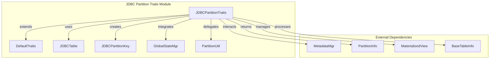
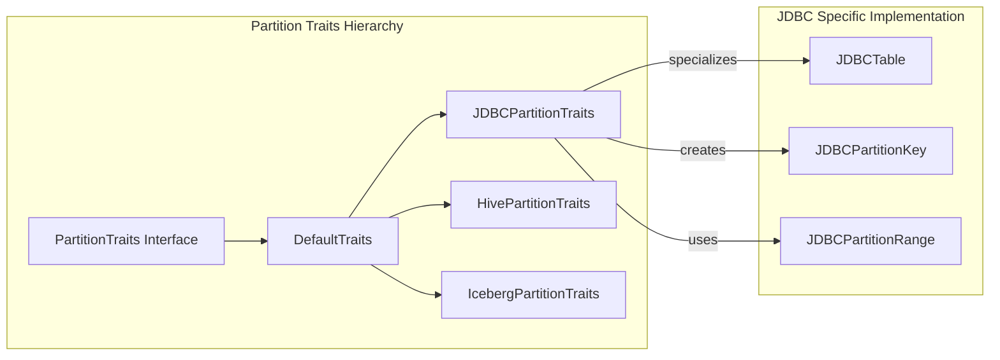
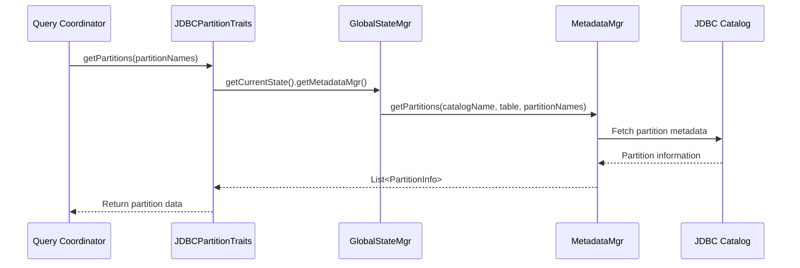
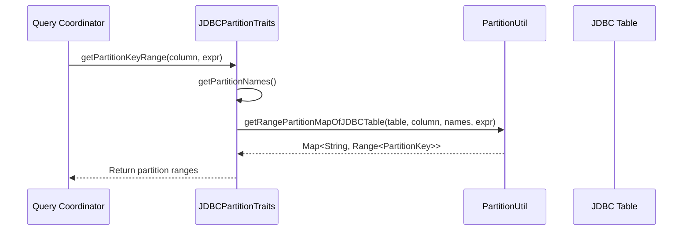

# JDBC Partition Traits Module

## Introduction

The JDBC Partition Traits module provides specialized partition handling capabilities for JDBC-connected external tables in StarRocks. It implements the partition traits interface specifically designed for JDBC data sources, enabling efficient partition pruning, metadata management, and refresh operations for materialized views based on JDBC tables.

## Core Functionality

The module's primary component, `JDBCPartitionTraits`, extends `DefaultTraits` to provide JDBC-specific implementations of partition operations. It serves as a bridge between StarRocks' partition management system and JDBC-connected external tables, enabling:

- Partition-aware query optimization and pruning
- Materialized view partition refresh capabilities
- Partition key range management for JDBC tables
- Integration with StarRocks' metadata management system

## Architecture

### Component Structure



### Integration with Partition Management System



## Key Components

### JDBCPartitionTraits Class

The main class that implements JDBC-specific partition behavior:

- **Table Name Resolution**: Uses catalog table name for JDBC tables
- **PCT Refresh Support**: Enables partition change tracking refresh for materialized views
- **Partition Retrieval**: Fetches partition metadata through GlobalStateMgr
- **Range Partition Mapping**: Creates partition key ranges for JDBC tables
- **Empty Key Creation**: Instantiates JDBC-specific partition keys
- **Refresh Timestamp Tracking**: Monitors partition modification times
- **Update Detection**: Identifies changed partitions for refresh operations

### Key Methods

#### getTableName()
Returns the catalog table name for JDBC tables, ensuring proper identification within the StarRocks catalog system.

#### isSupportPCTRefresh()
Enables partition change tracking refresh, allowing materialized views to refresh only affected partitions rather than the entire table.

#### getPartitions(List<String> partitionNames)
Retrieves partition information through the metadata manager, delegating to the appropriate JDBC catalog implementation.

#### getPartitionKeyRange(Column partitionColumn, Expr partitionExpr)
Creates range-based partition mappings using JDBC-specific partition utilities, enabling efficient partition pruning during query execution.

#### createEmptyKey()
Instantiates a new JDBCPartitionKey object, providing the foundation for partition key operations.

#### maxPartitionRefreshTs()
Determines the most recent partition modification timestamp across all partitions, supporting incremental refresh strategies.

#### getUpdatedPartitionNames()
Identifies partitions that have been modified since the last refresh, with fallback handling for external table implementations that may not support full partition introspection.

## Data Flow

### Partition Metadata Retrieval



### Partition Range Creation



## Dependencies

### Internal Dependencies

- **[partition_traits](partition_traits.md)**: Base partition traits framework and DefaultTraits implementation
- **[jdbc_connector](jdbc_connector.md)**: JDBC table definitions and catalog integration
- **[partition_util](partition_util.md)**: Utility functions for partition operations
- **[global_state_mgr](global_state_mgr.md)**: Global state management and metadata access
- **[materialized_view](materialized_view.md)**: Materialized view refresh mechanisms

### External Dependencies

- **JDBC Catalog Implementation**: Specific JDBC catalog connectors (MySQL, PostgreSQL, etc.)
- **Partition Key Infrastructure**: JDBC-specific partition key implementations
- **Metadata Management**: Integration with StarRocks' metadata management system

## Configuration and Usage

### Enabling JDBC Partition Traits

JDBC partition traits are automatically applied when a JDBC external table is created with partitioning information. The system detects the table type and applies the appropriate partition traits implementation.

### Partition Refresh Configuration

The module supports configurable refresh strategies:

- **Full Refresh**: Refresh all partitions (default fallback)
- **Incremental Refresh**: Refresh only modified partitions based on timestamp tracking
- **PCT Refresh**: Partition change tracking for materialized views

### Error Handling

The implementation includes robust error handling for external table operations:

- **Graceful Degradation**: Falls back to full refresh when partition introspection fails
- **Exception Management**: Catches and handles exceptions from external table implementations
- **Null Safety**: Returns null for unsupported operations rather than throwing exceptions

## Performance Considerations

### Partition Pruning

The module enables efficient partition pruning by:
- Creating accurate partition key ranges for JDBC tables
- Supporting partition-aware query optimization
- Minimizing data transfer through intelligent partition filtering

### Refresh Optimization

- **Timestamp-based Tracking**: Uses modification timestamps to identify changed partitions
- **Selective Refresh**: Only refreshes partitions that have actually changed
- **Batch Operations**: Groups partition operations for improved efficiency

### Memory Management

- **Lazy Loading**: Partition metadata is loaded on-demand
- **Caching Integration**: Works with StarRocks' metadata caching system
- **Resource Cleanup**: Proper cleanup of JDBC resources and connections

## Integration Examples

### Materialized View Refresh

```java
// JDBC table with partition traits enables PCT refresh
JDBCTable jdbcTable = new JDBCTable(...);
JDBCPartitionTraits traits = new JDBCPartitionTraits();

// Get updated partitions for refresh
Set<String> updatedPartitions = traits.getUpdatedPartitionNames(
    baseTables, 
    materializedView.getRefreshContext()
);

// Refresh only changed partitions
materializedView.refreshPartitions(updatedPartitions);
```

### Query Optimization

```java
// Partition key range creation for query pruning
Map<String, Range<PartitionKey>> ranges = traits.getPartitionKeyRange(
    partitionColumn,
    partitionExpression
);

// Use ranges for partition pruning
queryPlan.setPartitionRanges(ranges);
```

## Future Enhancements

### Planned Improvements

- **Advanced Partition Types**: Support for more complex JDBC partition schemes
- **Statistics Integration**: Enhanced partition statistics for better query optimization
- **Parallel Processing**: Multi-threaded partition operations for large tables
- **Caching Enhancements**: Improved partition metadata caching strategies

### Extension Points

- **Custom Partition Resolvers**: Plugin architecture for custom JDBC partition logic
- **Partition Strategy Plugins**: Extensible partition strategy implementations
- **Metrics Integration**: Enhanced monitoring and observability for partition operations

## Related Documentation

- [Partition Traits Framework](partition_traits.md) - Overview of the partition traits system
- [JDBC Connector](jdbc_connector.md) - JDBC catalog and table implementation
- [Materialized Views](materialized_view.md) - Materialized view refresh mechanisms
- [Partition Utilities](partition_util.md) - Common partition utility functions
- [Global State Manager](global_state_mgr.md) - Global metadata management system