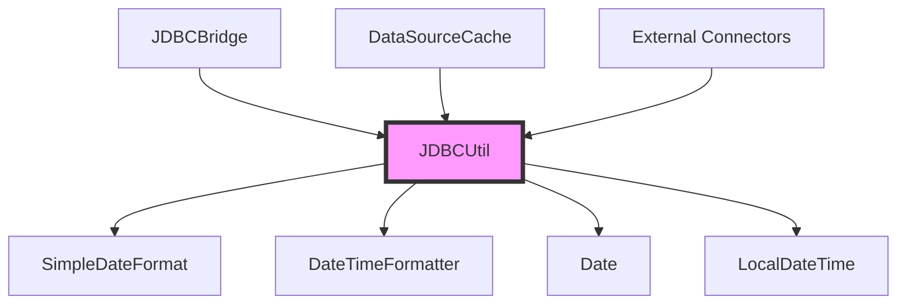
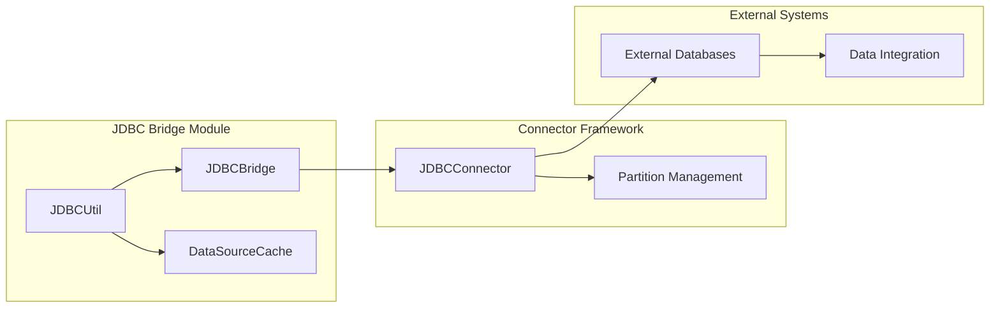
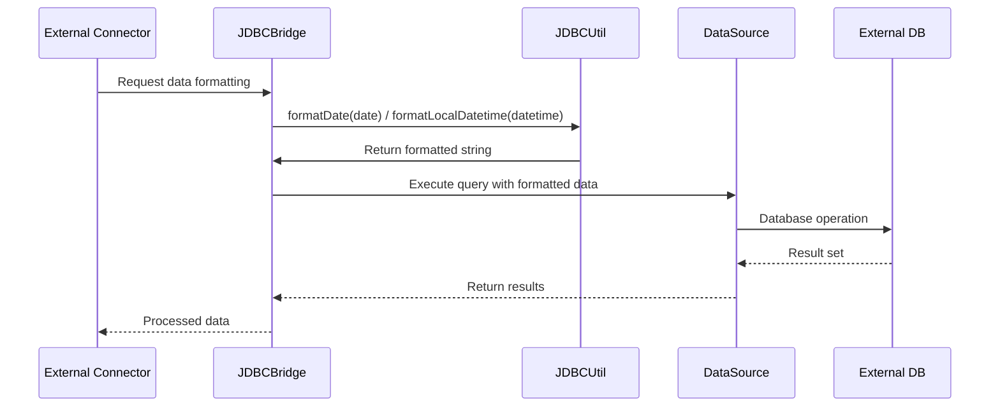
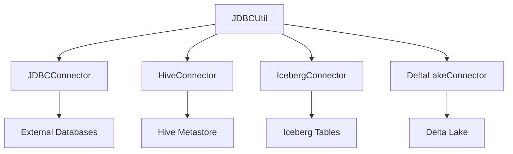

# JDBC Utilities Module Documentation

## Overview

The JDBC Utilities module provides essential utility functions for JDBC (Java Database Connectivity) operations within the StarRocks system. This module serves as a foundational component for database connectivity, offering standardized date and datetime formatting utilities that ensure consistent data handling across JDBC connections.

## Purpose and Core Functionality

The primary purpose of the JDBC Utilities module is to provide a centralized utility class that handles common JDBC-related operations, with a specific focus on date and datetime formatting. The module ensures data consistency and proper formatting when interacting with external databases through JDBC connections.

### Key Features

- **Date Formatting**: Standardized date formatting to 'YYYY-MM-dd' format
- **DateTime Formatting**: Consistent datetime formatting to 'yyyy-MM-dd HH:mm:ss' format
- **Thread-Safe Operations**: Utilizes thread-safe formatting utilities
- **Reusable Components**: Provides static utility methods for widespread use across the system

## Architecture and Component Structure

### Core Component

#### JDBCUtil Class
The `JDBCUtil` class serves as the main utility class containing static methods for JDBC-related operations:

```java
public class JDBCUtil {
    private static final SimpleDateFormat FORMAT = new SimpleDateFormat("yyyy-MM-dd");
    private static final DateTimeFormatter DATETIME_FORMATTER = DateTimeFormatter.ofPattern("yyyy-MM-dd HH:mm:ss");
    
    static String formatDate(Date date) {
        return FORMAT.format(date);
    }
    
    static String formatLocalDatetime(LocalDateTime localDateTime) {
        return DATETIME_FORMATTER.format(localDateTime);
    }
}
```

### Component Relationships



## System Integration

### Module Dependencies

The JDBC Utilities module integrates with several key components within the StarRocks ecosystem:



### Data Flow Architecture



## Usage Patterns and Best Practices

### Date Formatting Usage
The `formatDate` method is designed for formatting `java.sql.Date` objects to the standard 'YYYY-MM-dd' format, which is widely accepted across different database systems.

### DateTime Formatting Usage  
The `formatLocalDatetime` method handles `LocalDateTime` objects and formats them to 'yyyy-MM-dd HH:mm:ss' format, providing precise timestamp information for database operations.

### Thread Safety Considerations
- `SimpleDateFormat` is not thread-safe, but the static instance is used in a controlled manner
- `DateTimeFormatter` is thread-safe, ensuring reliable datetime formatting operations
- Consider using method-local formatters for high-concurrency scenarios

## Integration with External Systems

### JDBC Connector Integration
The JDBC Utilities module works in conjunction with the [JDBC Connector](connectors.md#jdbc_connector) to provide seamless database connectivity:

- **Data Type Conversion**: Ensures consistent date/datetime formatting across different database systems
- **Query Preparation**: Formats date/time values for SQL query construction
- **Result Processing**: Handles date/time data from external database results

### Connector Framework Integration
The module integrates with the broader [Connector Framework](connectors.md) to support various external data sources:



## Performance Considerations

### Memory Efficiency
- Static formatters reduce object creation overhead
- Reusable formatting patterns minimize memory allocation
- Efficient string handling for large-scale data operations

### Processing Optimization
- Direct formatting methods avoid unnecessary intermediate objects
- Optimized for batch processing scenarios
- Minimal overhead for single operations

## Error Handling and Reliability

### Exception Management
The utility methods handle standard Java formatting exceptions:
- `NullPointerException` for null input parameters
- `IllegalArgumentException` for invalid date/datetime values
- Proper exception propagation to calling components

### Data Validation
- Input parameter validation before formatting operations
- Consistent error handling across all utility methods
- Graceful degradation for edge cases

## Security Considerations

### Data Sanitization
- No direct SQL injection risks as methods only format data
- Proper handling of special characters in date/time strings
- Safe integration with parameterized queries

### Access Control
- Utility methods are package-private, limiting external access
- Controlled usage through the JDBC bridge module
- No sensitive data exposure through formatting operations

## Future Enhancements

### Potential Improvements
- Additional date/time format support for internationalization
- Performance optimizations for high-throughput scenarios
- Extended utility functions for other JDBC data types
- Configuration-driven formatting options

### Scalability Considerations
- Thread-local formatters for high-concurrency environments
- Caching mechanisms for frequently used format patterns
- Integration with connection pooling optimizations

## Related Documentation

- [JDBC Bridge Module](jdbc_bridge.md) - Core JDBC connectivity implementation
- [Connector Framework](connectors.md) - External system integration framework
- [Data Type System](backend_server.md#type_system) - Type conversion and handling
- [Query Execution](query_execution.md) - Query processing and optimization

## Conclusion

The JDBC Utilities module provides essential functionality for database connectivity within the StarRocks ecosystem. Its focused approach to date and datetime formatting ensures data consistency and reliability across JDBC operations, making it a critical component for external data source integration and data processing workflows.