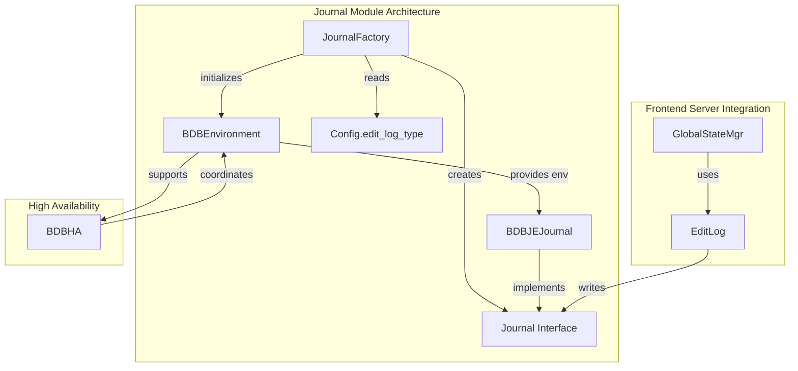
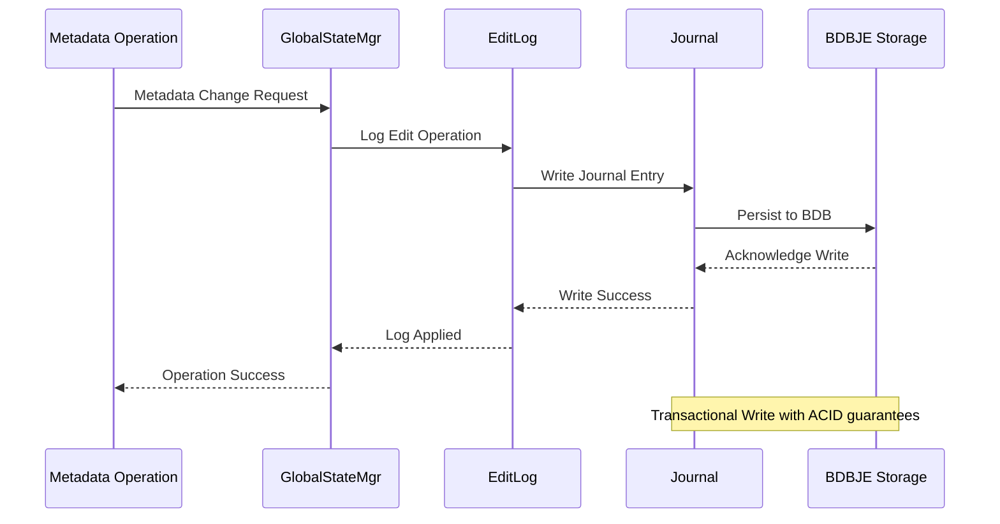

# Journal Module Documentation

## Introduction

The Journal module is a critical component of StarRocks' frontend server that provides reliable write-ahead logging (WAL) functionality for metadata persistence and recovery. It ensures durability of metadata changes by recording all modifications to a persistent journal before they are applied to the in-memory state, enabling the system to recover from failures and maintain consistency across cluster nodes.

## Architecture Overview

The Journal module implements a pluggable architecture that supports different backend storage implementations for the write-ahead log. Currently, it primarily uses Berkeley DB Java Edition (BDBJE) as the underlying storage engine for high-performance, transactional logging.



## Core Components

### JournalFactory

The `JournalFactory` class serves as the main entry point for creating journal instances. It implements a factory pattern that allows the system to support different journal implementations while maintaining a consistent interface.

**Key Responsibilities:**
- Journal type selection based on configuration
- BDBJE journal initialization and setup
- Environment preparation for the chosen journal type
- Exception handling during journal creation

**Configuration:**
The factory reads the `edit_log_type` configuration parameter to determine which journal implementation to create. Currently supports:
- `BDB`: Berkeley DB Java Edition (default and primary implementation)

### Journal Interface

The Journal interface defines the contract that all journal implementations must follow, providing a standardized API for:
- Writing journal entries
- Reading journal entries
- Managing journal cursors
- Handling journal rotation and cleanup
- Transaction management

### BDBJEJournal Implementation

The primary journal implementation using Berkeley DB Java Edition, offering:
- ACID transaction guarantees
- High-performance sequential writes
- Automatic log rotation
- Replication support for high availability
- Crash recovery capabilities

## Data Flow



## Integration with Frontend Server

The Journal module integrates deeply with the frontend server's metadata management system:

### EditLog Integration
- All metadata modifications go through the EditLog component
- EditLog uses the Journal interface to persist changes
- Journal entries are written before applying changes to in-memory state

### High Availability Coordination
- Works in conjunction with the [ha_coordination](ha_coordination.md) module
- Supports replication across multiple frontend nodes
- Coordinates with BDBHA for leader election and failover

### Metadata Persistence
- Integrates with [persist_metadata](persist_metadata.md) for long-term storage
- Ensures consistency between journal logs and metadata snapshots
- Supports point-in-time recovery capabilities

## Configuration and Deployment

### Journal Configuration
```properties
# Edit log type (currently only BDB is supported)
edit_log_type = bdb

# BDBJE specific configurations
bdbje_heartbeat_timeout_second = 30
bdbje_replica_ack_timeout_second = 10
bdbje_lock_timeout_second = 5
```

### Deployment Considerations
- Journal storage should be on reliable, high-performance storage
- For HA deployments, configure multiple replica nodes
- Monitor journal disk usage and implement appropriate retention policies
- Regular backup of journal files for disaster recovery

## Error Handling and Recovery

### Exception Handling
The JournalFactory handles various exception scenarios:
- `JournalException`: Thrown for journal-specific errors
- `InterruptedException`: Handles thread interruption during journal operations
- Configuration errors for invalid journal types

### Recovery Process
1. **Startup Recovery**: On frontend restart, the journal is replayed to reconstruct the metadata state
2. **Crash Recovery**: BDBJE provides automatic recovery from crashes
3. **Replication Recovery**: In HA setups, followers can recover from the leader's journal

## Performance Characteristics

### Write Performance
- Sequential writes optimized for high throughput
- Batched journal entries for reduced I/O overhead
- Asynchronous writes where appropriate to minimize latency

### Read Performance
- Efficient cursor-based reading for replay operations
- Indexed access for specific journal entries
- Memory-mapped file support for large journals

### Scalability
- Horizontal scaling through journal sharding (future enhancement)
- Vertical scaling with optimized BDBJE configurations
- Compression support for reducing storage footprint

## Monitoring and Maintenance

### Key Metrics
- Journal write latency and throughput
- Journal size and growth rate
- Replication lag in HA setups
- Error rates and recovery times

### Maintenance Tasks
- Regular journal rotation to manage disk space
- Periodic validation of journal integrity
- Backup and archival of old journal files
- Monitoring of BDBJE environment health

## Dependencies

### Internal Dependencies
- [common_config](common_config.md): Configuration management
- [ha_coordination](ha_coordination.md): High availability coordination
- [persist_metadata](persist_metadata.md): Metadata persistence layer

### External Dependencies
- Berkeley DB Java Edition (BDBJE) library
- Java NIO for file operations
- StarRocks common utilities and logging

## Future Enhancements

### Planned Features
- Support for additional journal backends (e.g., cloud storage)
- Enhanced compression algorithms for journal storage
- Improved replication protocols for better HA performance
- Integration with external logging systems for audit trails

### Performance Optimizations
- Parallel journal writing for multi-threaded operations
- Adaptive batching based on load patterns
- Memory pooling for reduced GC pressure
- SSD-optimized write patterns

## Best Practices

### Configuration
- Use SSD storage for journal files in production
- Configure appropriate timeout values based on network latency
- Set up monitoring alerts for journal errors and growth
- Implement regular backup procedures

### Operations
- Monitor journal disk usage proactively
- Test recovery procedures regularly
- Keep journal files on separate storage from data files
- Document journal retention policies and procedures

### Development
- Always test journal operations under failure scenarios
- Use the JournalFactory for creating journal instances
- Handle JournalException appropriately in calling code
- Consider the performance impact of synchronous vs asynchronous writes

## Related Documentation
- [Frontend Server](frontend_server.md) - Overall frontend architecture
- [High Availability Coordination](ha_coordination.md) - HA and replication details
- [Metadata Persistence](persist_metadata.md) - Long-term storage mechanisms
- [Configuration Management](common_config.md) - Configuration system details