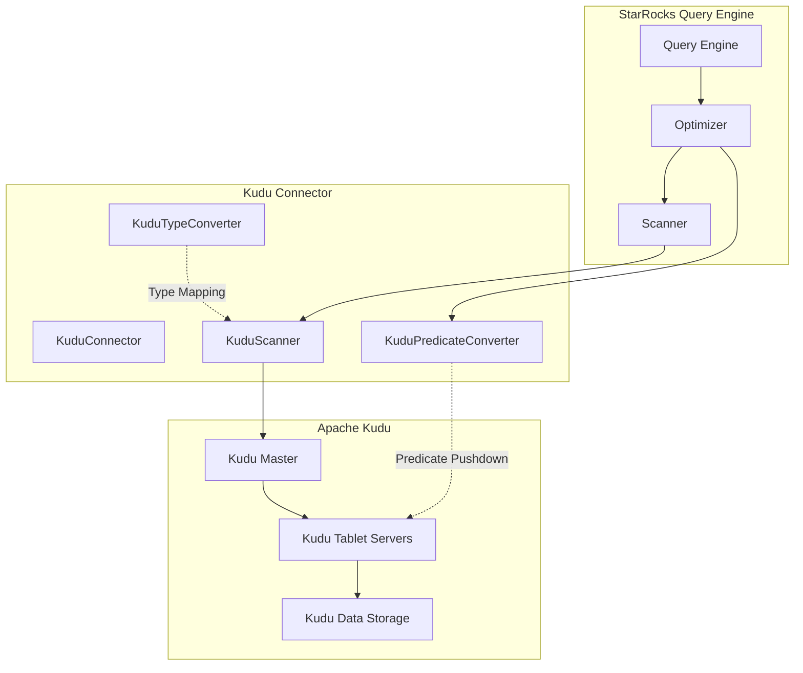
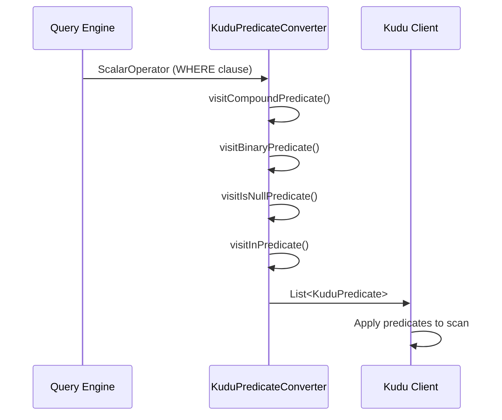
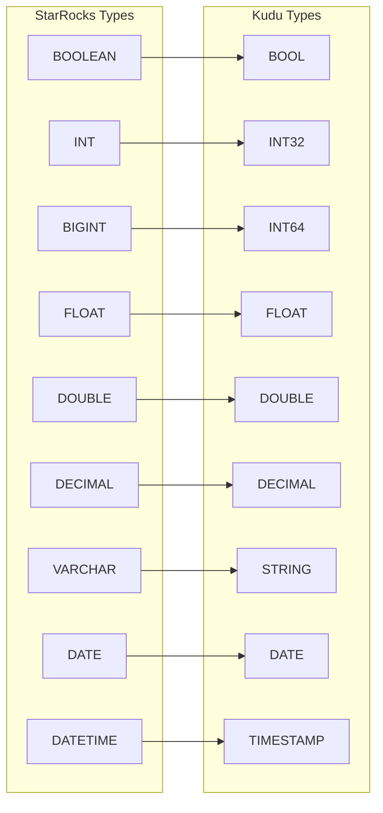
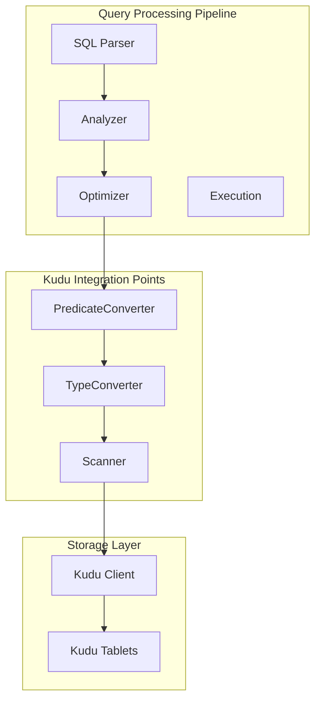
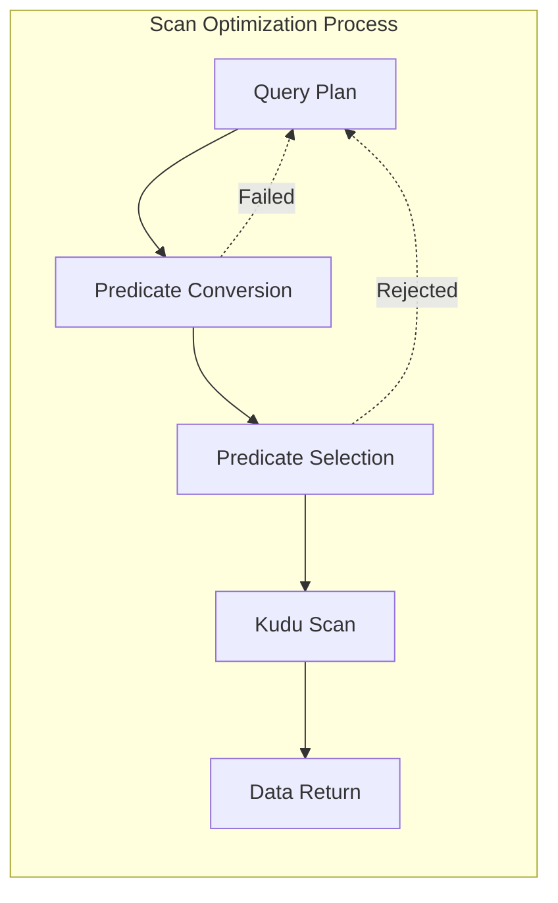

# Kudu Connector Module Documentation

## Introduction

The Kudu Connector module provides StarRocks with the capability to integrate with Apache Kudu, a distributed columnar storage engine designed for fast analytics on fast data. This module enables StarRocks to query and analyze data stored in Kudu tables, extending the system's data lakehouse capabilities to include Kudu as a first-class data source.

The connector implements predicate pushdown, type conversion, and schema mapping to ensure efficient query execution and seamless integration with StarRocks' query optimization engine.

## Architecture Overview



## Core Components

### KuduPredicateConverter

The `KuduPredicateConverter` is the primary component responsible for converting StarRocks' internal predicate representations into Kudu-native predicates. This enables efficient predicate pushdown, reducing data transfer and improving query performance.

#### Key Features:
- **Scalar Operator Visitor Pattern**: Implements `ScalarOperatorVisitor` to traverse and convert various predicate types
- **Type-Aware Conversion**: Handles type conversion between StarRocks and Kudu data types
- **Compound Predicate Support**: Supports AND, OR, and NOT logical operations
- **Comparison Operations**: Maps StarRocks binary predicates to Kudu comparison operations
- **NULL Handling**: Converts IS NULL and IS NOT NULL predicates
- **IN Clause Support**: Handles IN and NOT IN predicates with multiple values

#### Predicate Conversion Flow



#### Supported Predicate Types

| StarRocks Predicate | Kudu Predicate | Notes |
|-------------------|---------------|--------|
| Binary (=, <, >, <=, >=) | ComparisonPredicate | Full support with type conversion |
| IS NULL | IsNullPredicate | Direct mapping |
| IS NOT NULL | IsNotNullPredicate | Direct mapping |
| IN | InListPredicate | Multi-value support |
| NOT IN | Not supported | Returns empty result |
| LIKE | Not supported | Returns empty result |
| OR | Compound logic | Limited support |
| AND | Compound logic | Full support |
| NOT | Compound logic | Limited support |

#### Type Conversion Matrix

The converter handles various data type mappings between StarRocks and Kudu:



#### ExtractColumnName Inner Class

The `ExtractColumnName` class is a specialized visitor that extracts column names from scalar operators:

- **ColumnRefOperator**: Direct name extraction from variable references
- **CastOperator**: Recursive extraction through cast operations
- **Other operators**: Returns null (unsupported)

This ensures that only valid column references are processed for predicate conversion.

## Integration with StarRocks Ecosystem

### Query Optimization Integration



### Connector Framework Integration

The Kudu connector integrates with StarRocks' connector framework through:

1. **ConnectorFactory**: Creates Kudu-specific connector instances
2. **MetadataTable**: Provides schema information for Kudu tables
3. **PartitionTraits**: Handles partition-aware query planning
4. **RemoteFileInfo**: Manages data location and access information

## Performance Optimizations

### Predicate Pushdown Strategy

The converter implements intelligent predicate pushdown:

- **Early Filtering**: Pushes filters as close to data as possible
- **Predicate Combination**: Combines multiple predicates for optimal performance
- **Fallback Handling**: Gracefully handles unsupported predicates
- **Type Coercion**: Ensures type compatibility during conversion

### Scan Optimization



## Error Handling and Limitations

### Supported Operations
- Basic comparison predicates (=, <, >, <=, >=)
- NULL checks (IS NULL, IS NOT NULL)
- IN clauses with multiple values
- AND logical operations
- Simple column references

### Limitations
- **NOT IN predicates**: Not supported by Kudu, returns empty results
- **LIKE predicates**: Not supported, returns empty results
- **Complex expressions**: Limited support for nested expressions
- **OR operations**: Restricted support based on predicate compatibility

### Error Recovery
- **Type Cast Failures**: Gracefully skips predicate pushdown
- **Schema Mismatches**: Falls back to post-scan filtering
- **Unsupported Operations**: Returns empty predicate lists

## Dependencies

The Kudu connector module depends on several StarRocks components:

### Internal Dependencies
- [ColumnTypeConverter](column_type_converter.md): Type conversion utilities
- [ScalarOperatorVisitor](scalar_operator_visitor.md): Query expression traversal
- [ConnectorFramework](connector_framework.md): Base connector infrastructure

### External Dependencies
- Apache Kudu Client Library: Native Kudu connectivity
- Google Guava: Collection utilities
- Apache Logging: Log4j for debugging and monitoring

## Configuration and Usage

### Connector Configuration

The Kudu connector requires minimal configuration:

```sql
CREATE EXTERNAL CATALOG kudu_catalog 
PROPERTIES (
    "type" = "kudu",
    "kudu.master_addresses" = "host1:7051,host2:7051,host3:7051"
);
```

### Query Examples

```sql
-- Basic query with predicate pushdown
SELECT * FROM kudu_catalog.default.table1 
WHERE column1 > 100 AND column2 IS NOT NULL;

-- Query with IN clause
SELECT * FROM kudu_catalog.default.table1 
WHERE status IN ('active', 'pending');

-- Query with compound predicates
SELECT * FROM kudu_catalog.default.table1 
WHERE column1 > 100 AND (column2 = 'value' OR column3 IS NULL);
```

## Monitoring and Debugging

### Logging

The converter provides detailed logging through Log4j:
- Predicate conversion success/failure
- Type conversion issues
- Schema resolution problems
- Performance metrics

### Performance Metrics

Key performance indicators:
- Predicate pushdown ratio
- Scan efficiency improvement
- Data transfer reduction
- Query latency improvement

## Future Enhancements

### Planned Features
- Enhanced OR predicate support
- LIKE predicate implementation
- Complex expression handling
- Partition pruning optimization
- Statistics integration

### Performance Improvements
- Batch predicate processing
- Caching mechanisms
- Parallel scan optimization
- Adaptive predicate selection

## Related Documentation

- [Connector Framework](connector_framework.md) - General connector architecture
- [Predicate Evaluation](predicate_evaluation.md) - Query predicate processing
- [Type System](type_system.md) - Data type handling
- [Query Optimization](query_optimization.md) - Query planning and execution
- [Storage Engine](storage_engine.md) - Underlying storage integration