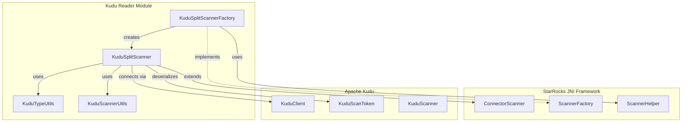
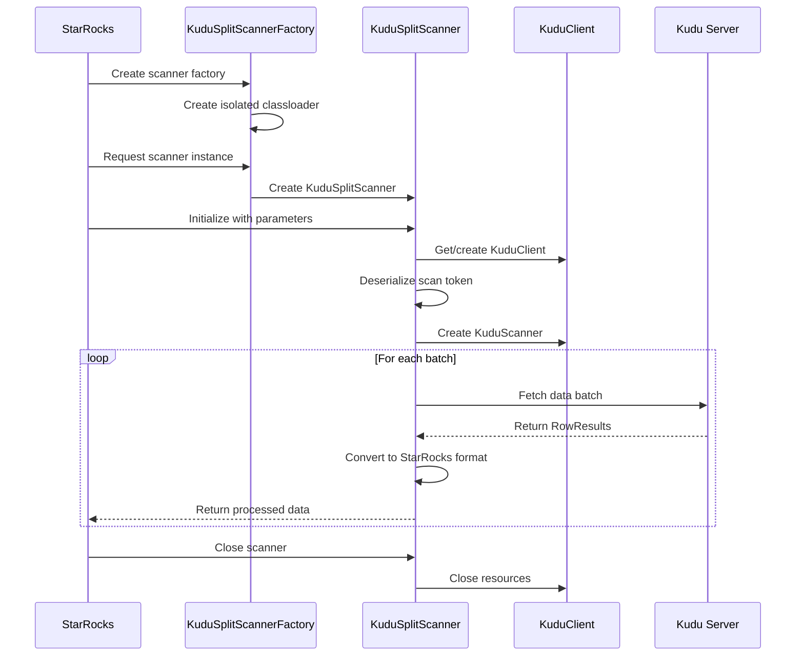

# Kudu Reader Module Documentation

## Overview

The Kudu Reader module is a specialized Java extension within the StarRocks ecosystem designed to provide efficient data reading capabilities from Apache Kudu databases. This module serves as a bridge between StarRocks and Kudu, enabling seamless integration and data access for analytical workloads.

## Purpose and Core Functionality

The primary purpose of the Kudu Reader module is to:
- Provide native Kudu data source connectivity for StarRocks
- Enable efficient parallel scanning of Kudu tables
- Handle data type conversion between Kudu and StarRocks formats
- Support distributed query execution across multiple Kudu splits
- Implement proper resource management and connection pooling

## Architecture Overview

## Module Components

### 1. KuduSplitScannerFactory
The factory class responsible for creating Kudu scanner instances with proper classloader isolation to handle Hadoop version conflicts.

**Key Responsibilities:**
- Creates isolated classloader for Kudu operations
- Instantiates KuduSplitScanner instances
- Manages version compatibility issues between Hadoop 2.x and 3.x

### 2. KuduSplitScanner
The core scanner implementation that handles actual data reading from Kudu tables.

**Key Responsibilities:**
- Manages Kudu client connections and connection pooling
- Deserializes scan tokens and creates Kudu scanners
- Handles data type conversion and projection
- Implements batch data fetching with configurable fetch sizes
- Manages resource cleanup and error handling

### 3. KuduTypeUtils
Utility class for converting between Kudu data types and StarRocks/Hive type representations.

**Key Responsibilities:**
- Maps Kudu types to equivalent Hive string representations
- Handles decimal precision and scale information
- Supports all major Kudu data types including complex types

### 4. KuduScannerUtils
Utility class providing common functionality for Kudu scanning operations.

**Key Responsibilities:**
- Date/time formatting utilities
- Base64 encoding/decoding for scan tokens
- Timezone handling for temporal data

## Data Flow Architecture

## Integration with StarRocks

The Kudu Reader module integrates with StarRocks through the JNI connector framework:

1. **Connector Framework Integration**: Implements the `ConnectorScanner` interface
2. **Factory Pattern**: Uses `ScannerFactory` for scanner instantiation
3. **Classloader Isolation**: Maintains separate classloader to avoid dependency conflicts
4. **Off-heap Memory Management**: Utilizes off-heap table writers for efficient data transfer

## Key Features

### Parallel Processing
- Supports parallel scanning across multiple Kudu tablet splits
- Configurable fetch size for optimal memory usage
- Connection pooling for efficient resource utilization

### Data Type Support
- Comprehensive type mapping from Kudu to StarRocks types
- Support for decimal types with precision and scale
- Proper handling of temporal data with timezone support

### Error Handling
- Robust exception handling with proper resource cleanup
- Detailed logging for debugging and monitoring
- Graceful degradation on connection failures

### Performance Optimizations
- Batch data fetching to minimize network round trips
- Projection pushdown to reduce data transfer
- Connection reuse through client pooling

## Dependencies

The module depends on several key components:

- **Apache Kudu Client**: For Kudu connectivity and data access
- **StarRocks JNI Framework**: For integration with StarRocks execution engine
- **Hadoop Libraries**: For underlying storage operations
- **Java Time API**: For temporal data handling

## Configuration

The scanner accepts the following parameters:
- `required_fields`: Comma-separated list of columns to read
- `kudu_scan_token`: Base64-encoded Kudu scan token
- `kudu_master`: Kudu master server address
- `fetch_size`: Number of rows to fetch per batch

## Error Handling and Monitoring

The module implements comprehensive error handling:
- Connection failure recovery
- Data format validation
- Resource leak prevention
- Detailed logging at different levels (INFO, ERROR)

## Performance Considerations

- **Memory Management**: Uses off-heap memory for large data transfers
- **Connection Pooling**: Reuses Kudu clients across multiple operations
- **Batch Processing**: Configurable batch sizes for optimal throughput
- **Parallel Execution**: Supports concurrent scanning of multiple splits

## Related Documentation

For more information about related modules:
- [java_extensions.md](java_extensions.md) - Overview of Java extensions framework
- [connectors.md](connectors.md) - General connector architecture
- [storage_engine.md](storage_engine.md) - Storage engine integration

## Future Enhancements

Potential areas for improvement:
- Support for Kudu complex types (arrays, maps)
- Advanced predicate pushdown optimization
- Connection pool configuration options
- Metrics and monitoring integration