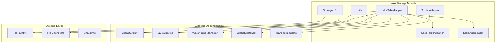
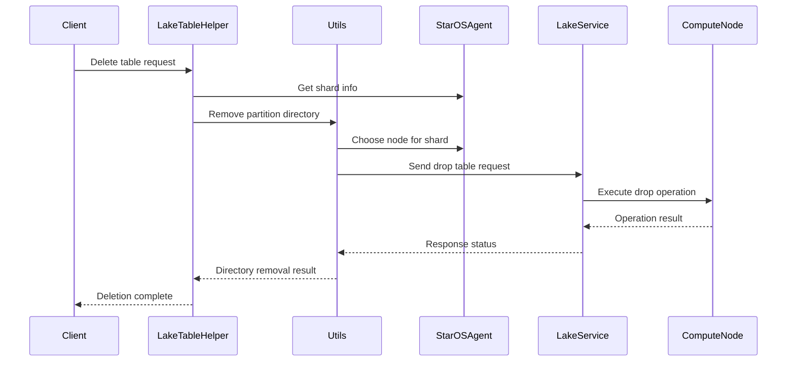

# Lake Storage Module Documentation

## Overview

The Lake Storage module is a core component of StarRocks that provides cloud-native storage capabilities for lake tables. It implements a disaggregated storage architecture where compute and storage are separated, enabling elastic scaling and cost-effective data lake solutions. The module manages the lifecycle of lake tables, handles transaction logs, coordinates with StarOS for shard management, and provides utilities for table operations in shared-data mode.

## Architecture

## Core Components

### 1. LakeTableHelper

**Purpose**: Provides utility methods for managing lake table operations including deletion, alteration, and directory management.

**Key Responsibilities**:
- Table deletion and recycle bin management
- Partition directory cleanup
- Shard metadata management
- Column unique ID restoration for backward compatibility
- Combined transaction log support detection

**Key Methods**:
- `deleteTable()`: Handles table deletion with recycle bin integration
- `deleteTableFromRecycleBin()`: Performs final cleanup from recycle bin
- `removePartitionDirectory()`: Cleans up partition directories
- `deleteShardGroupMeta()`: Removes shard group metadata from StarOS
- `restoreColumnUniqueIdIfNeeded()`: Restores column unique IDs for compatibility

### 2. StorageInfo

**Purpose**: Encapsulates storage configuration for lake tables, including object storage information and cache settings.

**Key Features**:
- Manages FilePathInfo for object storage configuration
- Handles FileCacheInfo for data caching settings
- Supports Gson serialization/deserialization for persistence
- Provides data cache and async write-back configuration

**Key Methods**:
- `isEnableDataCache()`: Checks if data caching is enabled
- `isEnableAsyncWriteBack()`: Checks if async write-back is enabled
- `getFilePathInfo()`: Returns object storage path information
- `getDataCacheInfo()`: Returns cache configuration

### 3. TxnInfoHelper

**Purpose**: Converts transaction state information to protocol buffer format for communication with backend services.

**Key Features**:
- Transforms TransactionState to TxnInfoPB format
- Handles combined transaction log flags
- Manages force publish scenarios for compaction
- Supports load ID tracking for streaming operations

**Key Methods**:
- `fromTransactionState()`: Converts transaction state to protocol buffer format

### 4. Utils

**Purpose**: Provides comprehensive utility functions for lake storage operations, including version publishing, node selection, and tablet management.

**Key Responsibilities**:
- Node selection and assignment for tablets
- Version publishing coordination
- Aggregate publish version handling
- Log version management
- Dynamic tablet processing

**Key Methods**:
- `chooseNode()`: Selects appropriate compute node for shard operations
- `publishVersion()`: Coordinates version publishing across nodes
- `publishVersionBatch()`: Handles batch version publishing
- `aggregatePublishVersion()`: Manages aggregated publish operations
- `publishLogVersion()`: Handles transaction log version publishing

## Data Flow

## Integration Points

### StarOS Integration
The module heavily integrates with StarOS for:
- Shard information management
- Compute node assignment
- File path resolution
- Shard group operations

### Transaction Management
Integration with transaction system for:
- Combined transaction log support
- Version publishing coordination
- Transaction state conversion
- Force publish scenarios

### Warehouse Management
Coordination with warehouse system for:
- Compute resource allocation
- Node assignment strategies
- Background warehouse fallback
- Resource availability checking

## Configuration

### Key Configuration Parameters
- `lake_use_combined_txn_log`: Enables combined transaction log optimization
- Data cache settings via StorageInfo
- Async write-back configuration
- Partition directory sharing policies

### Compatibility Features
- Column unique ID restoration for upgraded tables
- Shared directory detection for partition optimization
- Version compatibility checks
- File bundling support detection

## Error Handling

The module implements comprehensive error handling for:
- Node unavailability scenarios
- Shard information retrieval failures
- RPC communication errors
- Directory removal failures
- Transaction publishing failures

## Performance Optimizations

### Combined Transaction Logs
Supports combined transaction logs for loading and compaction operations to reduce metadata overhead.

### Aggregate Publishing
Implements aggregate publish version requests to minimize RPC calls and improve throughput.

### Background Warehouse Fallback
Automatically falls back to background warehouse when primary resources are unavailable.

### Dynamic Tablet Processing
Handles dynamic tablet operations efficiently during version publishing.

## Related Documentation

- [Storage Engine Module](storage_engine.md) - Core storage engine functionality
- [Transaction Management](transaction_management.md) - Transaction handling and coordination
- [Warehouse Management](warehouse_management.md) - Compute resource management
- [StarOS Integration](staros_integration.md) - Shard and storage management

## Sub-modules

The lake_storage module contains several specialized sub-modules that handle specific aspects of lake table management:

### [Async Delta Writer](async_delta_writer.md)
Handles asynchronous delta writing operations for lake tables, providing high-performance write capabilities with proper transaction isolation.

### [Compaction Policy](compaction_policy.md)
Implements size-tiered compaction policies for lake storage optimization, ensuring efficient data organization and query performance.

### [Delta Writer](delta_writer.md)
Manages delta writing operations with transaction log support, coordinating data ingestion and metadata updates.

### [Meta File Management](meta_file.md)
Handles metadata file operations and discovery for lake tables, managing file system interactions and metadata persistence.

### [Rowset Update State](rowset_update_state.md)
Manages rowset update states and sorting operations, ensuring data consistency during updates and maintaining proper row ordering.

### [Schema Change](schema_change.md)
Coordinates schema change operations for lake tables, handling table structure modifications while maintaining data integrity.

### [Tablet Manager](tablet_manager.md)
Manages tablet lifecycle and operations in lake storage context, including tablet discovery, assignment, and health monitoring.

### [Transaction Log Applier](txn_log_applier.md)
Applies transaction logs for primary key tables in lake storage, ensuring ACID properties and data consistency.