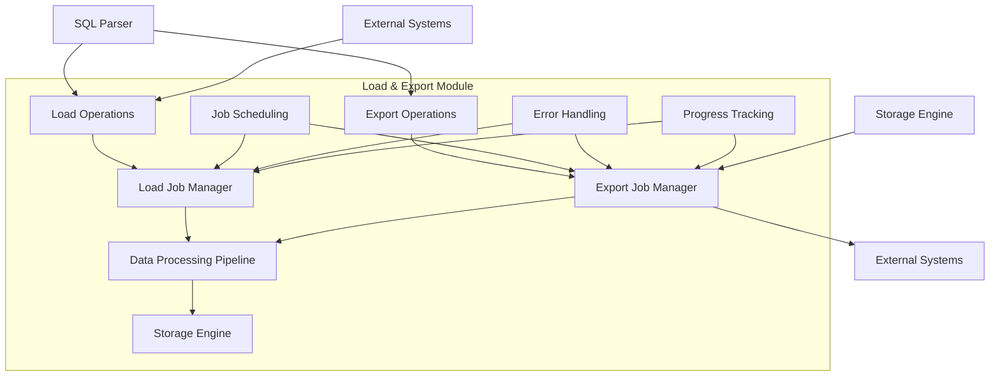
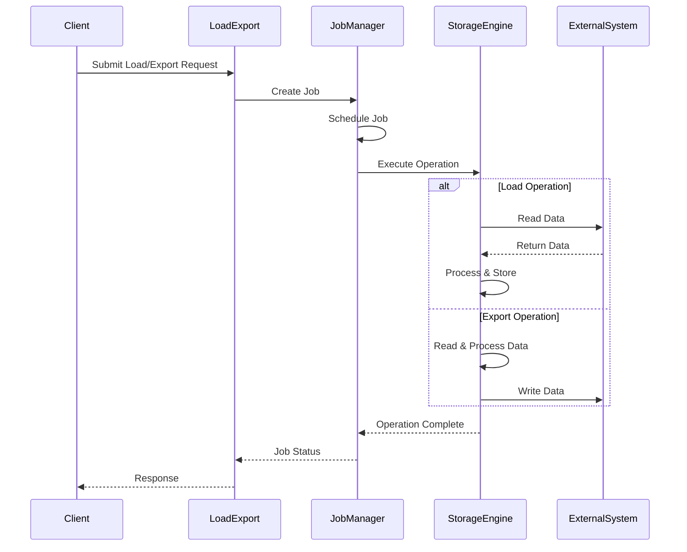

# Load and Export Module Documentation

## Overview

The load_export module is a core component of StarRocks that handles data ingestion and export operations. It provides comprehensive functionality for loading data from various sources into StarRocks tables and exporting data from StarRocks to external storage systems.

## Purpose and Core Functionality

The load_export module serves as the central hub for:
- **Data Loading**: Ingesting data from various sources (local files, HDFS, cloud storage, streaming sources)
- **Data Export**: Exporting query results and table data to external storage systems
- **Job Management**: Managing the lifecycle of load and export operations
- **Format Support**: Handling multiple data formats (CSV, JSON, Parquet, ORC, Avro)
- **Error Handling**: Providing comprehensive error reporting and recovery mechanisms

## Architecture Overview

## Sub-modules

The load_export module is organized into several specialized sub-modules:

### 1. [Load Operations](load_operations.md)
Handles all data ingestion operations including broker load, stream load, and routine load. This sub-module manages the core loading functionality, including ETL operations, partition management, and various load methods.

### 2. [Export Operations](export_operations.md)
Manages data export functionality for transferring data from StarRocks to external systems. This sub-module handles export job lifecycle, file generation, and external storage integration.

### 3. [Job Management](job_management.md)
Provides job lifecycle management, scheduling, and monitoring capabilities. This sub-module coordinates load and export jobs, manages job states, and provides progress tracking.

### 4. [Data Format Support](data_format_support.md)
Handles various data formats and provides format conversion capabilities. This sub-module supports CSV, JSON, Parquet, ORC, and Avro formats with appropriate parsing and serialization.

### 5. [Error Handling and Recovery](error_handling.md)
Implements comprehensive error handling, retry mechanisms, and recovery strategies. This sub-module provides functional expression evaluation and data filtering capabilities.

## Key Components

### Core Data Structures

- **DeleteInfo**: Manages deletion operations and metadata
- **EtlJobInfo**: Contains ETL job status and configuration
- **EtlSubmitResult**: Represents ETL job submission results
- **ExportJob**: Manages export operations and job lifecycle
- **LoadConstants**: Defines load operation constants and configurations

### Job Management

- **LoadMgr**: Central manager for all load operations
- **EstimateStats**: Provides load job statistics and estimation
- **ScheduleRule**: Implements routine load scheduling logic
- **StreamLoadHttpHeader**: Handles HTTP headers for stream load operations

### Data Processing

- **FunctionalExprProvider**: Provides functional expressions for data filtering and transformation
- **PartitionUtils**: Manages partition-related operations during load/export
- **PipePiece**: Abstract base for pipeline processing components

## Data Flow

## Integration Points

The load_export module integrates with several other StarRocks modules:

- **[Storage Engine](../storage_engine.md)**: For data persistence and retrieval
- **[SQL Parser/Optimizer](../sql_parser_optimizer.md)**: For query plan generation
- **[Frontend Server](../frontend_server.md)**: For job coordination and metadata management
- **[Backend Server](../backend_server.md)**: For distributed execution
- **[Connectors](../connectors.md)**: For external system integration

## Configuration and Constants

The module defines several important constants:

- **Runtime Details**: Load ID, transaction ID, client IP, ETL information
- **Properties**: Timeout, max filter ratio, job name
- **Format Support**: CSV, JSON, Parquet, ORC, Avro formats
- **HTTP Headers**: Stream load specific headers and parameters

## Error Handling

The module implements comprehensive error handling:

- **Validation**: Input validation and format checking
- **Retry Logic**: Automatic retry for transient failures
- **Error Reporting**: Detailed error messages and stack traces
- **Recovery**: Automatic recovery from failures
- **Monitoring**: Real-time monitoring and alerting

## Performance Considerations

- **Parallel Processing**: Supports parallel load and export operations
- **Memory Management**: Efficient memory usage for large datasets
- **Progress Tracking**: Real-time progress monitoring
- **Resource Management**: Proper resource allocation and cleanup

## Security Features

- **Authentication**: Integration with StarRocks authentication system
- **Authorization**: Role-based access control for load/export operations
- **Encryption**: Support for encrypted data transfer
- **Audit Logging**: Comprehensive audit trail for all operations

This documentation provides a comprehensive overview of the load_export module. For detailed information about specific sub-modules, please refer to their individual documentation files.