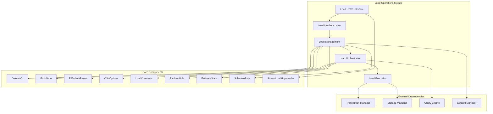
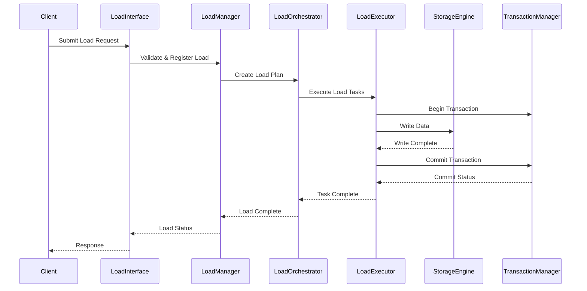
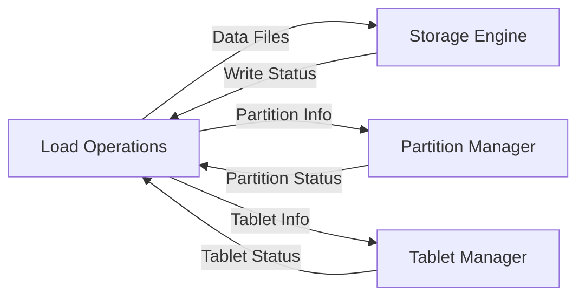
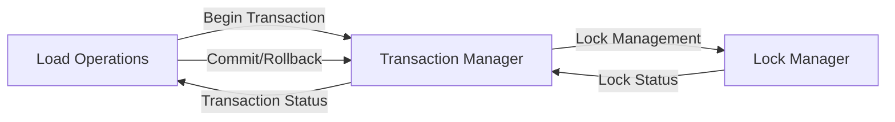
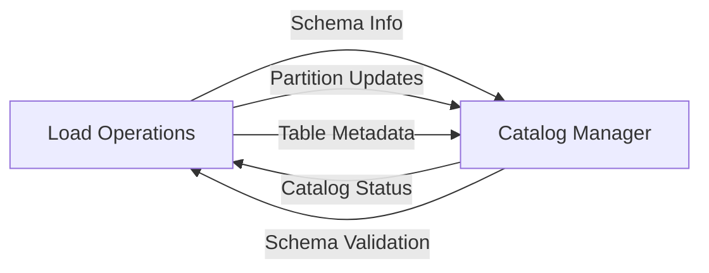

# Load Operations Module Documentation

## Introduction

The load_operations module is a core component of StarRocks' data ingestion system, responsible for managing various data loading operations including batch loads, stream loads, routine loads, and delete operations. This module provides the foundational infrastructure for data ingestion, handling everything from simple CSV file imports to complex streaming data pipelines with automatic error handling and retry mechanisms.

The module serves as the central coordination point for all data loading activities in the StarRocks system, integrating with storage engines, transaction management, and query execution components to ensure reliable and efficient data ingestion.

## Architecture Overview



## Core Components

### 1. DeleteInfo

**Purpose**: Manages metadata for delete operations on tables and partitions.

**Key Responsibilities**:
- Stores delete operation metadata including database ID, table ID, partition information
- Manages delete conditions and replica information
- Tracks partition versions for consistency
- Provides serialization support for persistence

**Key Attributes**:
- Database and table identifiers
- Partition details (ID, name, version)
- List of delete conditions
- Replica persistence information
- Creation timestamp

**Usage Pattern**:
```java
DeleteInfo deleteInfo = new DeleteInfo(dbId, tableId, tableName, 
                                       partitionId, partitionName, 
                                       partitionVersion, deleteConditions);
```

### 2. EtlJobInfo

**Purpose**: Encapsulates ETL (Extract, Transform, Load) job status and metadata.

**Key Responsibilities**:
- Maintains ETL job status information
- Provides job state tracking
- Supports serialization for job persistence

**Key Attributes**:
- ETL job status object
- Job state information

### 3. EtlSubmitResult

**Purpose**: Represents the result of ETL job submission operations.

**Key Responsibilities**:
- Contains submission status and error information
- Provides ETL job ID for tracking
- Supports result validation and error handling

**Key Attributes**:
- Submission status (TStatus)
- ETL job identifier

### 4. CSVOptions

**Purpose**: Configuration for CSV format data loading operations.

**Key Responsibilities**:
- Defines CSV parsing parameters
- Configures column and row delimiters
- Supports customizable CSV format options

**Key Attributes**:
- Column separator (default: tab)
- Row delimiter (default: newline)

### 5. LoadConstants

**Purpose**: Centralized constants for load operations configuration and monitoring.

**Key Responsibilities**:
- Defines runtime detail keys for load monitoring
- Provides configuration property names
- Standardizes load operation parameters

**Key Constants**:
- Runtime monitoring keys (load_id, txn_id, client_ip, etc.)
- Configuration properties (timeout, max_filter_ratio, job_name)
- ETL timing and statistics keys

### 6. PartitionUtils

**Purpose**: Utility class for partition management during load operations.

**Key Responsibilities**:
- Creates temporary partitions for load operations
- Manages partition boundaries and key calculations
- Handles partition metadata persistence
- Supports range, list, and unpartitioned tables

**Key Methods**:
- `createAndAddTempPartitionsForTable()`: Creates temp partitions for loading
- `calRangePartitionBoundary()`: Calculates partition boundaries
- `calListPartitionKeys()`: Processes list partition keys
- `convertDateLiteralToNumber()`: Handles date literal conversions

### 7. EstimateStats

**Purpose**: Provides load operation statistics and estimation data.

**Key Responsibilities**:
- Tracks estimated scan rows for load planning
- Monitors file count and size statistics
- Supports load optimization and resource planning

**Key Attributes**:
- Estimated scan row count
- File number estimation
- File size estimation

### 8. ScheduleRule

**Purpose**: Manages automatic scheduling and resumption of routine load jobs.

**Key Responsibilities**:
- Implements auto-scheduling logic for paused jobs
- Handles backend failure scenarios
- Manages resume counters and timing constraints
- Provides job state transition rules

**Key Features**:
- Automatic job resumption based on backend availability
- Dead backend count monitoring
- Resume attempt limiting and locking
- Time-based resume period management

### 9. StreamLoadHttpHeader

**Purpose**: Defines HTTP headers and parameters for stream load operations.

**Key Responsibilities**:
- Standardizes stream load HTTP headers
- Provides header validation and management
- Supports various data formats (CSV, JSON)
- Enables batch write configurations

**Key Header Categories**:
- Format specification headers
- CSV-specific headers (column_separator, row_delimiter)
- JSON-specific headers (jsonpaths, json_root)
- Batch write headers (enable_merge_commit, merge_commit_async)
- General load parameters (timeout, max_filter_ratio, partitions)

## Data Flow Architecture



## Load Operation Types

### 1. Batch Load Operations
- **Purpose**: Large-scale data ingestion from files
- **Components**: EtlJobInfo, EtlSubmitResult, PartitionUtils
- **Process**: File parsing → Data transformation → Partition creation → Data loading

### 2. Stream Load Operations
- **Purpose**: Real-time data ingestion via HTTP
- **Components**: StreamLoadHttpHeader, LoadConstants
- **Process**: HTTP request → Data validation → Direct loading → Immediate response

### 3. Routine Load Operations
- **Purpose**: Continuous data ingestion from message queues
- **Components**: ScheduleRule, EstimateStats
- **Process**: Job scheduling → Data consumption → Automatic retry → Progress tracking

### 4. Delete Operations
- **Purpose**: Conditional data removal
- **Components**: DeleteInfo, PartitionUtils
- **Process**: Delete condition validation → Partition identification → Data deletion → Metadata update

## Integration Points

### Storage Engine Integration


### Transaction Management Integration


### Catalog Management Integration


## Error Handling and Recovery

### Load Failure Scenarios
1. **Data Format Errors**: Handled by format-specific parsers with detailed error reporting
2. **Network Failures**: Automatic retry with exponential backoff for stream loads
3. **Storage Failures**: Transaction rollback and cleanup procedures
4. **Partition Conflicts**: Automatic partition creation and conflict resolution

### Recovery Mechanisms
- **Transaction Rollback**: Automatic cleanup on load failure
- **Temporary Partition Cleanup**: Removal of incomplete partitions
- **Job Resumption**: Automatic retry for routine loads based on ScheduleRule
- **Error Logging**: Comprehensive error tracking and reporting

## Performance Optimization

### Load Planning
- **Statistics-Based Planning**: Uses EstimateStats for optimal resource allocation
- **Partition Pruning**: Leverages PartitionUtils for efficient partition selection
- **Parallel Processing**: Multi-threaded execution for large loads

### Memory Management
- **Streaming Processing**: Memory-efficient streaming for large files
- **Batch Processing**: Configurable batch sizes for optimal performance
- **Resource Limits**: Enforced memory limits via LoadConstants

### Network Optimization
- **Compression Support**: Built-in compression for stream loads
- **Connection Pooling**: Efficient HTTP connection management
- **Batch Operations**: Batched network operations for routine loads

## Configuration and Monitoring

### Load Configuration
- **Timeout Settings**: Configurable timeouts via LoadConstants
- **Filter Ratios**: Maximum error tolerance configuration
- **Memory Limits**: Load-specific memory constraints
- **Parallelism**: Configurable load parallelism settings

### Monitoring Integration
- **Runtime Details**: Comprehensive load metrics via LoadConstants
- **Progress Tracking**: Real-time load progress monitoring
- **Error Metrics**: Detailed error reporting and statistics
- **Performance Metrics**: Load performance and resource utilization

## Security Considerations

### Authentication
- **User Validation**: Load operation permission checking
- **Resource Authorization**: Table and partition access control
- **Network Security**: Secure HTTP endpoints for stream loads

### Data Security
- **Encryption Support**: Encrypted data transmission options
- **Audit Logging**: Comprehensive load operation audit trails
- **Data Validation**: Input validation and sanitization

## Dependencies

### Internal Dependencies
- **[storage_engine](../storage_engine.md)**: Data persistence and storage management
- **[transaction](../transaction.md)**: Transaction coordination and management
- **[catalog](../catalog.md)**: Metadata and schema management
- **[query_execution](../query_execution.md)**: Query processing and coordination

### External Dependencies
- **File Systems**: HDFS, S3, local file system support
- **Message Queues**: Kafka, Pulsar integration for routine loads
- **Network Libraries**: HTTP/HTTPS for stream loads

## Best Practices

### Load Operation Design
1. **Partition Strategy**: Use appropriate partition keys for optimal performance
2. **File Format Selection**: Choose optimal file formats (CSV, JSON, Parquet)
3. **Batch Size Optimization**: Configure optimal batch sizes for your workload
4. **Error Handling**: Implement proper error handling and retry logic

### Performance Tuning
1. **Parallel Loading**: Utilize parallel loading for large datasets
2. **Memory Configuration**: Configure appropriate memory limits
3. **Network Optimization**: Use compression and connection pooling
4. **Monitoring**: Monitor load performance and adjust configurations

### Operational Considerations
1. **Load Scheduling**: Schedule loads during low-traffic periods
2. **Resource Management**: Monitor resource usage during loads
3. **Error Monitoring**: Set up alerts for load failures
4. **Backup Strategy**: Implement proper backup and recovery procedures

## Future Enhancements

### Planned Features
- **Enhanced Streaming**: Improved real-time streaming capabilities
- **Machine Learning Integration**: ML-based load optimization
- **Multi-Cloud Support**: Enhanced cloud storage integration
- **Advanced Monitoring**: Real-time load performance analytics

### Scalability Improvements
- **Distributed Loading**: Enhanced distributed load processing
- **Auto-Scaling**: Automatic resource scaling based on load
- **Intelligent Routing**: Smart load routing based on cluster state
- **Predictive Optimization**: Predictive load performance optimization