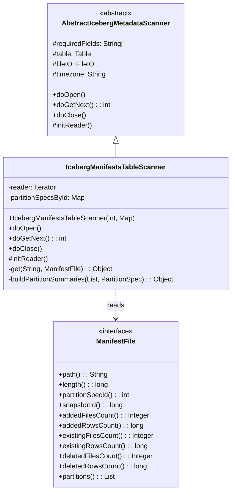
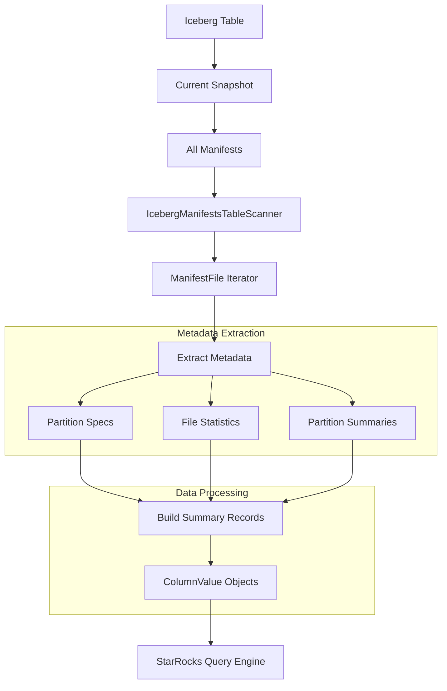
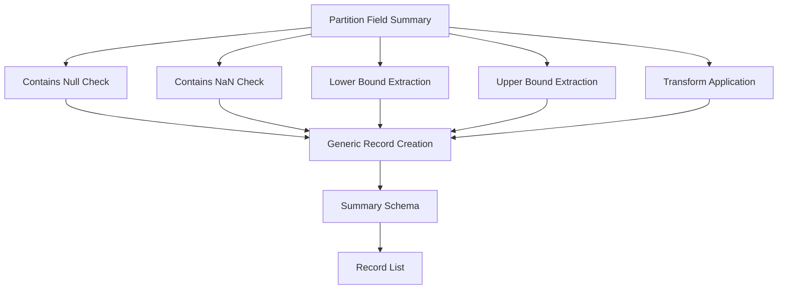
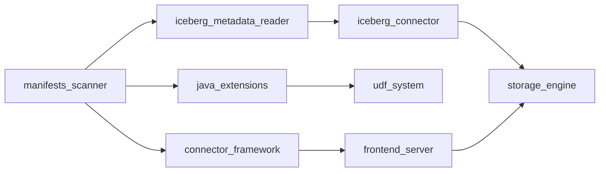
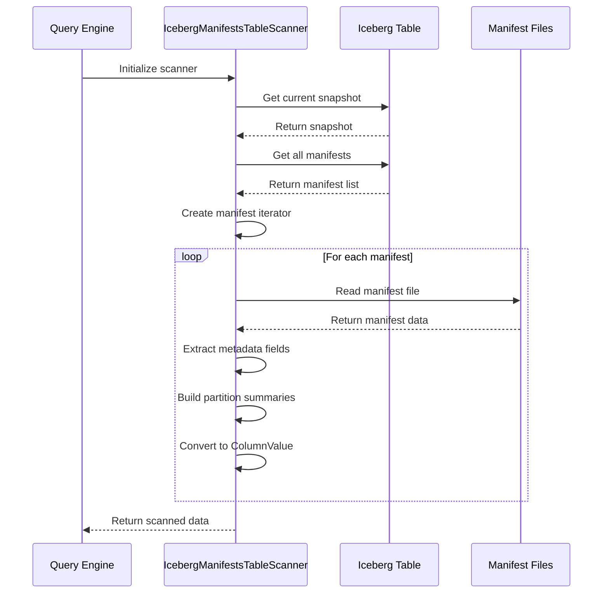
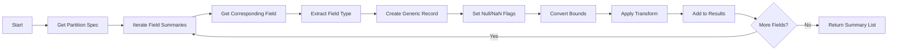

# Manifests Scanner Module Documentation

## Overview

The Manifests Scanner module is a specialized component within the Iceberg metadata reader system that provides functionality to scan and extract metadata information from Iceberg table manifests. This module is part of the broader Java extensions framework and serves as a critical component for reading Iceberg table metadata, particularly focusing on manifest files that contain information about data files, partitions, and their statistical summaries.

## Purpose and Core Functionality

The primary purpose of the Manifests Scanner module is to:

1. **Extract Manifest Metadata**: Read and parse Iceberg manifest files to extract comprehensive metadata about data files within Iceberg tables
2. **Provide Partition Summaries**: Generate detailed partition summaries including bounds, null counts, and statistical information
3. **Support Metadata Queries**: Enable efficient querying of Iceberg table manifests for catalog operations and query optimization
4. **Integrate with StarRocks**: Provide seamless integration with the StarRocks query engine for Iceberg table metadata access

## Architecture and Component Structure

### Core Component

The module centers around the `IcebergManifestsTableScanner` class, which extends `AbstractIcebergMetadataScanner` and implements the core scanning functionality.



### Data Flow Architecture



## Key Features and Capabilities

### 1. Comprehensive Manifest Scanning

The scanner extracts the following metadata from each manifest file:

- **File Information**: Path, length, and identification details
- **Snapshot Data**: Associated snapshot ID and timing information
- **File Counts**: Added, existing, and deleted file counts
- **Row Counts**: Corresponding row counts for file operations
- **Partition Information**: Detailed partition specifications and summaries

### 2. Partition Summary Generation

The module generates comprehensive partition summaries including:



### 3. Type-Aware Data Conversion

The scanner handles various Iceberg data types and performs appropriate conversions:

- **Primitive Types**: Direct value extraction and conversion
- **Complex Types**: Structured data handling for nested types
- **Temporal Types**: Timezone-aware datetime processing
- **Transform Types**: Application of partition transforms for human-readable bounds

## Integration with StarRocks Ecosystem

### Module Dependencies

The Manifests Scanner module integrates with several key StarRocks components:



### Related Modules

- **[iceberg_metadata_reader](iceberg_metadata_reader.md)**: Parent module providing base scanning functionality
- **[iceberg_connector](iceberg_connector.md)**: Provides Iceberg table access and metadata management
- **[connector_framework](connector_framework.md)**: Supplies connector infrastructure and utilities
- **[java_extensions](java_extensions.md)**: Hosts the Java extension framework and UDF support

## Process Flow

### Manifest Scanning Workflow



### Partition Summary Building Process



## Error Handling and Validation

### Exception Management

The module implements comprehensive error handling:

- **IllegalArgumentException**: Thrown for unrecognized column names during metadata extraction
- **Null Safety**: Proper null checking for optional manifest fields
- **Type Safety**: Safe type conversions with appropriate fallbacks

### Data Validation

- **Field Existence**: Validates required fields before processing
- **Type Compatibility**: Ensures data types match expected schemas
- **Bounds Checking**: Validates partition bounds and summary data

## Performance Considerations

### Optimization Strategies

1. **Iterator-Based Processing**: Memory-efficient streaming of large manifest lists
2. **Lazy Initialization**: Deferred reader initialization until needed
3. **Batch Processing**: Configurable fetch size for optimal memory usage
4. **Type Caching**: Cached partition specifications to avoid repeated lookups

### Scalability Features

- **Configurable Fetch Size**: Adjustable batch processing size based on available memory
- **Streaming Architecture**: Iterator-based processing for large datasets
- **Memory Management**: Efficient object reuse and cleanup

## Configuration and Usage

### Scanner Initialization

```java
// Example initialization
Map<String, String> params = new HashMap<>();
params.put("table_location", "s3://bucket/table");
params.put("timezone", "UTC");

IcebergManifestsTableScanner scanner = new IcebergManifestsTableScanner(1000, params);
```

### Supported Column Names

The scanner supports extraction of the following manifest columns:

- `path`: Manifest file path
- `length`: File size in bytes
- `partition_spec_id`: Associated partition specification ID
- `added_snapshot_id`: Snapshot ID when manifest was added
- `added_data_files_count`: Number of data files added
- `added_rows_count`: Number of rows added
- `existing_data_files_count`: Number of existing data files
- `existing_rows_count`: Number of existing rows
- `deleted_data_files_count`: Number of deleted data files
- `deleted_rows_count`: Number of deleted rows
- `partitions`: Detailed partition summaries

## Future Enhancements

### Planned Improvements

1. **Enhanced Filtering**: Support for predicate pushdown on manifest metadata
2. **Caching Layer**: Intelligent caching of frequently accessed manifest data
3. **Parallel Processing**: Multi-threaded manifest scanning for large tables
4. **Metrics Integration**: Enhanced performance monitoring and metrics collection

### Extension Points

- **Custom Transform Support**: Plugin architecture for custom partition transforms
- **Additional Metadata Fields**: Extensible framework for new manifest fields
- **Format Evolution**: Support for future Iceberg manifest format changes

## Conclusion

The Manifests Scanner module serves as a critical component in the StarRocks Iceberg integration, providing efficient and comprehensive access to Iceberg table manifest metadata. Its robust architecture, comprehensive feature set, and seamless integration with the broader StarRocks ecosystem make it an essential tool for modern data lakehouse operations. The module's focus on performance, scalability, and extensibility ensures it can handle the demands of large-scale analytical workloads while maintaining compatibility with evolving Iceberg specifications.