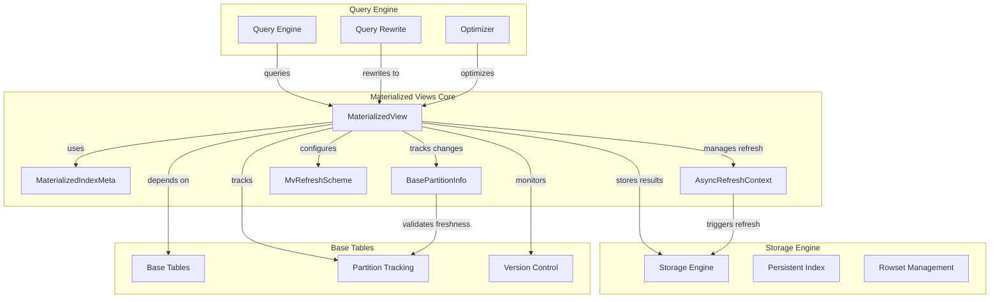
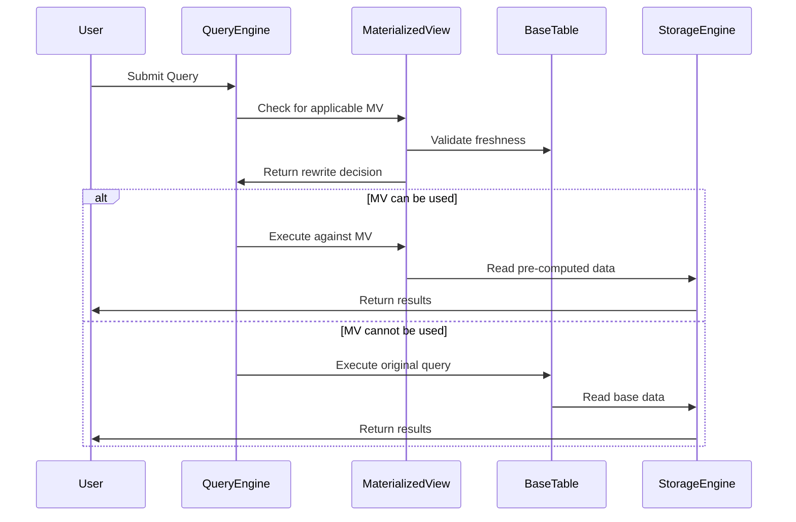

# Materialized Views Module

## Overview

The Materialized Views module is a core component of StarRocks that provides pre-computed query results storage and automatic refresh capabilities. Materialized views significantly improve query performance by storing the results of complex queries and automatically maintaining them as base tables change.

## Purpose and Core Functionality

Materialized views serve as a performance optimization mechanism that:
- Stores pre-computed query results to accelerate complex analytical queries
- Provides automatic refresh strategies to maintain data consistency
- Supports query rewrite to transparently redirect queries to materialized views
- Enables partition-level refresh for efficient incremental updates
- Manages relationships between materialized views and their base tables

## Architecture Overview



## Key Components

### 1. MaterializedView
The main class representing a materialized view with:
- Schema definition and metadata management
- Refresh scheme configuration
- Base table relationship tracking
- Partition information management
- Query rewrite capabilities

### 2. MaterializedIndexMeta
Manages the index metadata for materialized views:
- Schema version and hash management
- Storage type and key type configuration
- Column definitions and aggregation information
- Sort key specifications

### 3. BasePartitionInfo
Tracks partition-level information for base tables:
- Partition ID and version tracking
- Last refresh timestamp management
- File modification time monitoring
- Partition change detection

### 4. AsyncRefreshContext
Handles asynchronous refresh operations:
- Base table version mapping
- Partition change tracking
- Refresh timing and scheduling
- Incremental update management

### 5. MvRefreshScheme
Defines refresh strategies and configurations:
- Refresh mode selection (AUTO, PCT, FULL, INCREMENTAL)
- Refresh moment configuration (IMMEDIATE, DEFERRED)
- Partition refresh strategies (FORCE, STRICT, ADAPTIVE)

## Sub-modules

### [Materialized View Core](materialized_view_core.md)
Core materialized view functionality including schema management, refresh schemes, and base table relationships.

### [Partition Management](partition_management.md)
Partition tracking, change detection, and partition-level refresh capabilities.

### [Refresh Management](refresh_management.md)
Refresh strategies, scheduling, and incremental update mechanisms.

## Data Flow



## Integration Points

### With Storage Engine
- Uses storage engine for persisting materialized view data
- Leverages rowset management for efficient data organization
- Integrates with persistent indexing for fast lookups

### With Query Engine
- Provides metadata for query rewrite decisions
- Integrates with optimizer for cost-based optimization
- Supports transparent query acceleration

### With Catalog System
- Registers materialized views in the system catalog
- Manages relationships with base tables
- Handles metadata persistence and recovery

## Key Features

### Automatic Refresh
- Multiple refresh modes (AUTO, PCT, FULL, INCREMENTAL)
- Partition-level incremental refresh
- Configurable refresh scheduling
- Base table change detection

### Query Acceleration
- Transparent query rewrite
- Cost-based optimization integration
- Staleness tolerance configuration
- Multi-table join optimization

### Partition Management
- Range and list partitioning support
- Partition change tracking
- Incremental partition refresh
- Cross-table partition mapping

### High Availability
- Metadata persistence and recovery
- Base table relationship management
- Inactive state handling
- Restoration support

## Configuration and Usage

Materialized views are created using SQL statements and configured through table properties:

```sql
CREATE MATERIALIZED VIEW mv_name
REFRESH [ASYNC | SYNC | INCREMENTAL]
PARTITION BY partition_column
AS SELECT ...
```

Key configuration options include:
- Refresh mode and scheduling
- Partition strategy
- Staleness tolerance
- Storage properties
- Query rewrite settings

## Performance Considerations

- Materialized views trade storage space for query performance
- Refresh frequency impacts data freshness vs. system load
- Partition strategies affect refresh efficiency
- Base table change frequency influences refresh overhead

## Related Documentation

- [Storage Engine](../storage_engine.md) - Underlying storage mechanisms
- [Query Execution](../query_execution.md) - Query processing and optimization
- [Catalog System](../frontend_server.md) - Metadata management
- [SQL Parser & Optimizer](../sql_parser_optimizer.md) - Query analysis and optimization