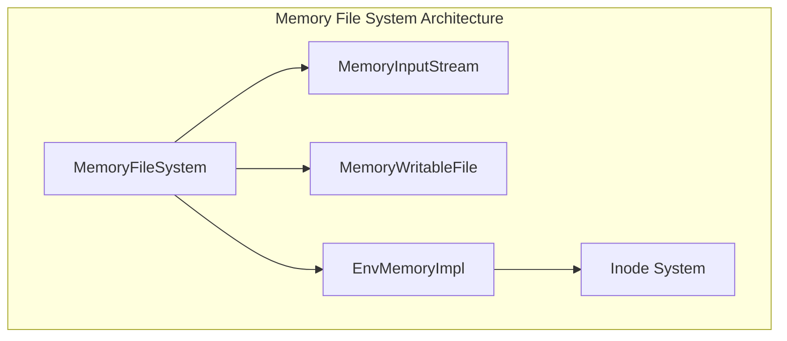
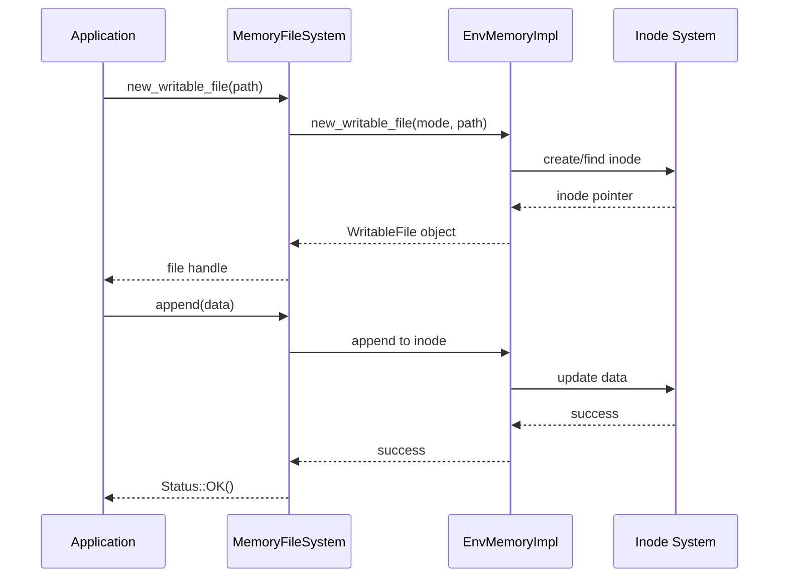
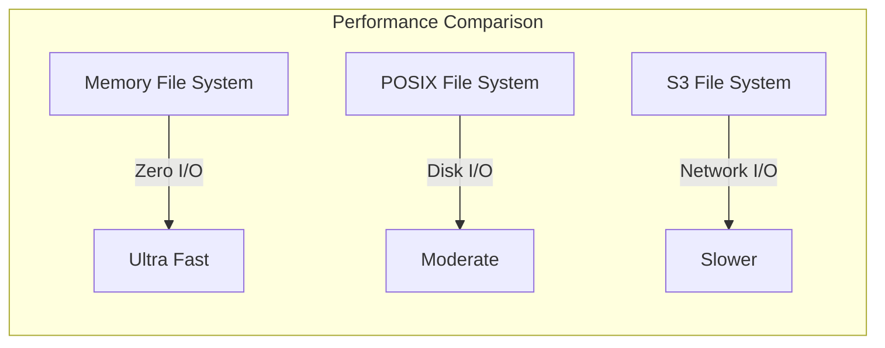
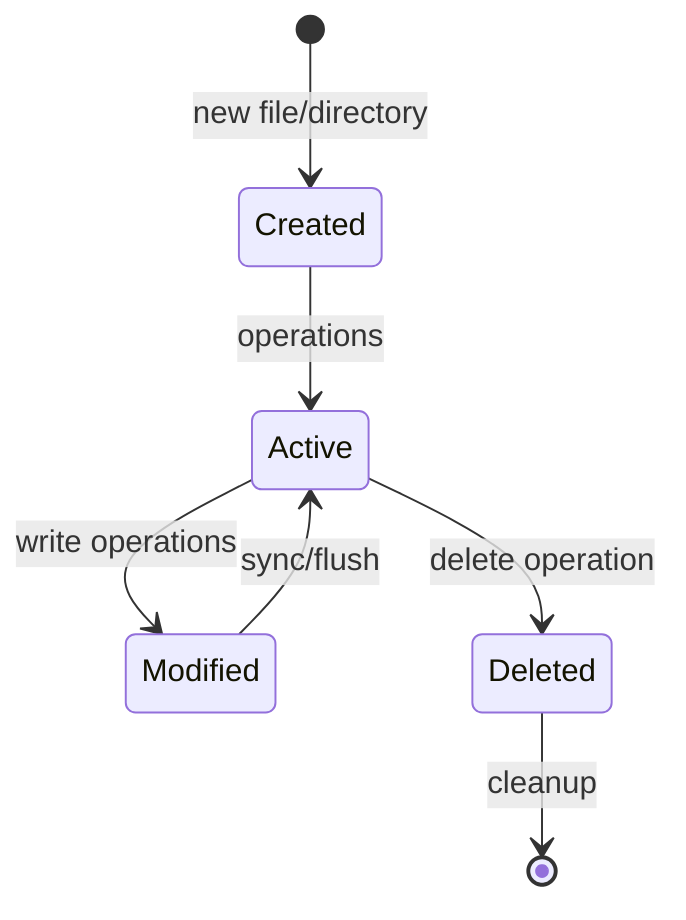

# Memory File System Module Documentation

## Introduction

The memory_file_system module provides a complete in-memory file system implementation for StarRocks, offering high-performance file operations without disk I/O overhead. This module is particularly useful for testing, temporary data storage, and scenarios requiring ultra-fast file operations where data persistence is not required.

## Core Purpose

The memory file system serves as a volatile storage backend that:
- Provides POSIX-like file system semantics entirely in memory
- Eliminates disk I/O bottlenecks for temporary operations
- Supports all standard file operations (read, write, create, delete, etc.)
- Integrates seamlessly with StarRocks' storage abstraction layer
- Enables efficient testing and development workflows

## Architecture Overview

### Component Structure



### Key Components

#### 1. MemoryFileSystem (Main Interface)
The primary file system implementation that provides the standard FileSystem interface:
- Path canonicalization and validation
- File creation and management
- Directory operations
- Integration with encryption layer (though encryption is not supported)

#### 2. MemoryInputStream (Read Operations)
Implements efficient in-memory reading:
- Zero-copy data access using ArrayInputStream
- Seekable input stream capabilities
- Reference counting for memory management

#### 3. MemoryWritableFile (Write Operations)
Handles all file write operations:
- Append operations with automatic memory management
- Pre-allocation for performance optimization
- Proper file lifecycle management

#### 4. EnvMemoryImpl (Core Implementation)
The underlying implementation providing:
- Inode-based file/directory management
- Namespace organization using ordered maps
- Atomic operations for consistency

#### 5. Inode System (Data Storage)
Core data structure for storing file metadata and content:
- Type differentiation (normal files vs directories)
- Shared ownership model for efficient memory usage
- Support for hard links through reference counting

## Data Flow Architecture



## File System Operations

### File Operations

#### Creation and Writing
```cpp
// Create a new file
auto file_result = memory_fs->new_writable_file("/path/to/file.txt");
if (file_result.ok()) {
    auto file = std::move(file_result.value());
    file->append("Hello, World!");
    file->close();
}
```

#### Reading
```cpp
// Read from existing file
auto read_result = memory_fs->read_file("/path/to/file.txt", &content);
if (read_result.ok()) {
    // content contains file data
}
```

#### Random Access
```cpp
// Create random access file
auto file_result = memory_fs->new_random_access_file(path);
if (file_result.ok()) {
    auto file = std::move(file_result.value());
    // Perform random reads
}
```

### Directory Operations

#### Directory Creation
```cpp
// Create directory
memory_fs->create_dir("/new/directory");

// Create directory recursively
memory_fs->create_dir_recursive("/deep/nested/directory");
```

#### Directory Iteration
```cpp
// List directory contents
std::vector<std::string> children;
memory_fs->get_children("/directory", &children);

// Iterate with callback
memory_fs->iterate_dir("/directory", [](std::string_view name) {
    process_file(name);
    return true; // continue iteration
});
```

### Advanced Operations

#### File System Traversal
```cpp
// Recursive directory deletion
memory_fs->delete_dir_recursive("/directory");

// File renaming
memory_fs->rename_file("/old/path", "/new/path");

// Hard links
memory_fs->link_file("/original", "/link");
```

## Integration with StarRocks Storage Layer

### File System Interface Compliance

The memory file system implements the standard StarRocks FileSystem interface, ensuring compatibility with:
- [Storage Engine](../storage_engine.md)
- [Lake Storage](../lake_storage.md) 
- [File Systems](../file_systems.md)

### Performance Characteristics



#### Advantages
- **Zero I/O latency**: All operations in memory
- **High throughput**: No disk/network bottlenecks
- **Predictable performance**: Consistent operation timing
- **Thread-safe**: Safe for concurrent access

#### Limitations
- **Volatile storage**: Data lost on process termination
- **Memory constraints**: Limited by available RAM
- **No encryption**: Encryption not supported
- **No persistence**: Cannot survive restarts

## Error Handling and Edge Cases

### Common Error Scenarios

#### File Not Found
```cpp
auto result = memory_fs->new_random_access_file("/nonexistent");
if (!result.ok()) {
    // Status::NotFound returned
    handle_error(result.status());
}
```

#### Directory Not Empty
```cpp
auto status = memory_fs->delete_dir("/nonempty");
if (!status.ok()) {
    // Status::IOError("directory not empty")
}
```

#### Invalid Path
```cpp
auto status = memory_fs->path_exists("relative/path");
if (!status.ok()) {
    // Status::InvalidArgument("Invalid path")
}
```

### Path Resolution

The memory file system implements comprehensive path canonicalization:
- Absolute path enforcement (must start with '/')
- Dot segment resolution ('.' and '..')
- Duplicate slash removal
- Trailing slash handling

## Memory Management

### Inode Lifecycle



### Memory Efficiency

- **Shared ownership**: Inodes use shared_ptr for automatic cleanup
- **String optimization**: Efficient string storage and movement
- **Pre-allocation**: Optional pre-allocation for better performance
- **Reference counting**: Automatic memory deallocation

## Testing and Development Usage

### Unit Testing

The memory file system is ideal for testing scenarios:
```cpp
class MyTest : public ::testing::Test {
protected:
    void SetUp() override {
        fs_ = std::make_unique<MemoryFileSystem>();
    }
    
    std::unique_ptr<MemoryFileSystem> fs_;
};

TEST_F(MyTest, FileOperations) {
    // Test file operations without disk I/O
    ASSERT_OK(fs_->create_file("/test.txt"));
    // ... test operations
}
```

### Performance Benchmarking

```cpp
// Benchmark memory file system performance
void BM_MemoryFileSystem(benchmark::State& state) {
    auto fs = std::make_unique<MemoryFileSystem>();
    std::string data(1024, 'x');
    
    for (auto _ : state) {
        auto file = fs->new_writable_file("/bench.txt");
        file.value()->append(data);
        file.value()->close();
        fs->delete_file("/bench.txt");
    }
}
```

## Configuration and Tuning

### Runtime Configuration

The memory file system operates with minimal configuration:
- No disk space management required
- Memory usage scales with data size
- No tuning parameters needed

### Memory Monitoring

```cpp
// Monitor memory usage through inode count
size_t inode_count = memory_fs->get_inode_count();
size_t total_memory = memory_fs->get_total_memory_usage();
```

## Security Considerations

### Access Control

- No built-in access control mechanisms
- Relies on application-level security
- All operations allowed if path exists

### Data Isolation

- Process-scoped data isolation
- No cross-process sharing
- Automatic cleanup on process termination

## Dependencies and Integration Points

### Internal Dependencies

- **[IO System](../io_system.md)**: ArrayInputStream for efficient data access
- **[Utility Functions](../utility_functions.md)**: String processing and error handling
- **[Common System](../common_system.md)**: Status codes and error reporting

### External Dependencies

- **butil**: File path utilities and canonicalization
- **fmt**: String formatting for error messages

## Future Enhancements

### Potential Improvements

1. **Memory Pool Management**: Pre-allocated memory pools for better performance
2. **Compression Support**: Optional in-memory compression for large files
3. **Encryption Support**: Add encryption capabilities for sensitive data
4. **Memory Limits**: Configurable memory usage limits
5. **Statistics**: Detailed performance and usage statistics

### Integration Opportunities

- **[Cache System](../cache_system.md)**: Integration with memory caching
- **[Runtime System](../runtime_system.md)**: Enhanced memory management
- **[Column Serialization](../column_serialization.md)**: Optimized data serialization

## Conclusion

The memory file system module provides a robust, high-performance in-memory storage solution that seamlessly integrates with StarRocks' storage architecture. Its zero-I/O design makes it ideal for scenarios requiring ultra-fast file operations, while its complete POSIX semantics ensure compatibility with existing code. The module's clean architecture and comprehensive error handling make it suitable for both production use cases and development/testing scenarios.