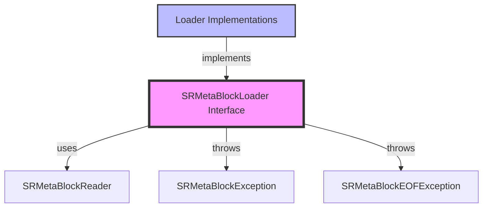
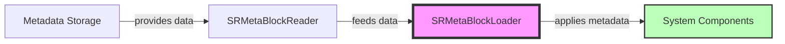
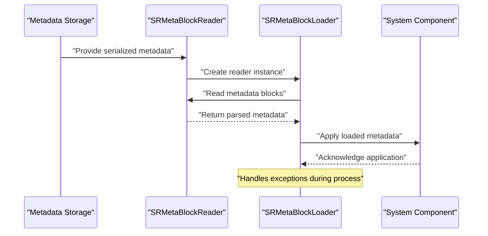
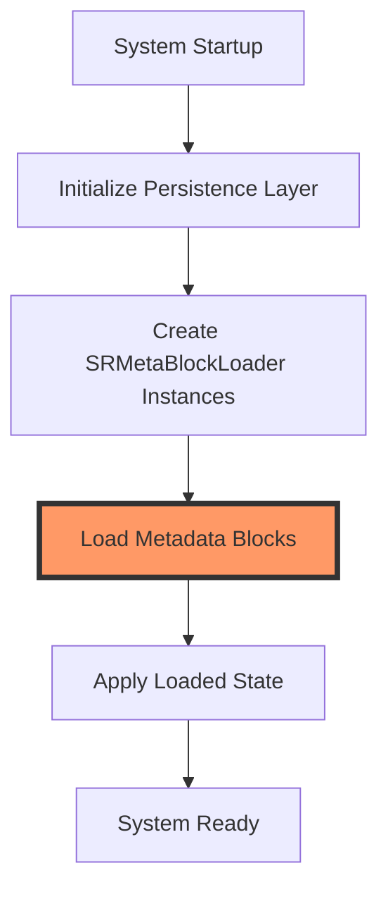

# Meta Block Loader Module

## Introduction

The meta_block_loader module provides a framework for loading metadata blocks in StarRocks' persistence layer. It defines the `SRMetaBlockLoader` interface, which serves as a contract for components that need to deserialize and apply metadata from persistent storage during system startup or recovery operations.

## Core Functionality

### SRMetaBlockLoader Interface

The `SRMetaBlockLoader` interface is the central component of this module, providing a standardized way to load metadata blocks from persistent storage.

**Key Characteristics:**
- **Interface Type**: Functional interface with a single abstract method
- **Purpose**: Defines contract for metadata block loading operations
- **Exception Handling**: Comprehensive exception handling for I/O and metadata parsing errors
- **Integration**: Works with SRMetaBlockReader for reading serialized metadata

**Method Signature:**
```java
void apply(SRMetaBlockReader reader) throws IOException, SRMetaBlockException, SRMetaBlockEOFException;
```

**Parameters:**
- `reader`: SRMetaBlockReader instance that provides access to the serialized metadata

**Exceptions:**
- `IOException`: Thrown when I/O errors occur during metadata reading
- `SRMetaBlockException`: Thrown when metadata block parsing or validation fails
- `SRMetaBlockEOFException`: Thrown when unexpected end of metadata block is encountered

## Architecture

### Component Relationships



### Integration with Persistence Layer



## Data Flow

### Metadata Loading Process



## Module Dependencies

### Internal Dependencies

The meta_block_loader module is part of the broader persistence framework and integrates with:

- **[persist_metadata](persist_metadata.md)**: Parent module containing metadata persistence infrastructure
- **[frontend_server](frontend_server.md)**: Uses metadata loading for system initialization and recovery
- **[storage_engine](storage_engine.md)**: Coordinates with storage layer for metadata consistency

### Related Components

- **SRMetaBlockReader**: Provides the data source for metadata loading operations
- **SRMetaBlockException**: Handles metadata parsing and validation errors
- **SRMetaBlockEOFException**: Handles unexpected end-of-file conditions

## Usage Patterns

### Implementation Strategy

Components implementing `SRMetaBlockLoader` typically follow these patterns:

1. **State Restoration**: Load previously saved system state during startup
2. **Configuration Loading**: Deserialize system configuration and settings
3. **Schema Recovery**: Restore table schemas, partitions, and metadata
4. **Transaction Recovery**: Load transaction logs and state information

### Error Handling

The interface design emphasizes robust error handling:

- **I/O Errors**: Caught and propagated as `IOException`
- **Data Corruption**: Detected and reported via `SRMetaBlockException`
- **Incomplete Data**: Identified through `SRMetaBlockEOFException`

## System Integration

### Startup Sequence



### Recovery Scenarios

The meta_block_loader module plays a crucial role in various recovery scenarios:

1. **System Restart**: Loads saved metadata to restore system state
2. **Failover**: Recovers metadata on standby nodes
3. **Backup Restoration**: Loads metadata from backup files
4. **Schema Changes**: Applies pending schema modifications

## Best Practices

### Implementation Guidelines

1. **Idempotency**: Ensure loader implementations can handle repeated calls
2. **Validation**: Validate loaded metadata before applying to system
3. **Logging**: Provide comprehensive logging for debugging and monitoring
4. **Performance**: Optimize for efficient metadata loading during startup

### Exception Handling

1. **Graceful Degradation**: Handle partial metadata loading failures
2. **Rollback Support**: Implement rollback mechanisms for failed operations
3. **Error Reporting**: Provide detailed error information for troubleshooting
4. **Recovery Strategies**: Implement fallback mechanisms for critical metadata

## Future Considerations

### Potential Enhancements

1. **Async Loading**: Support for asynchronous metadata loading
2. **Incremental Updates**: Support for incremental metadata updates
3. **Compression**: Integration with compression for large metadata blocks
4. **Encryption**: Support for encrypted metadata storage
5. **Versioning**: Enhanced versioning support for metadata evolution

### Scalability Considerations

1. **Large Metadata Sets**: Optimization for handling large metadata volumes
2. **Parallel Loading**: Support for parallel metadata loading operations
3. **Memory Management**: Efficient memory usage during loading operations
4. **Network Optimization**: Optimization for distributed metadata loading

## Conclusion

The meta_block_loader module provides a foundational interface for metadata loading operations in StarRocks. Its simple yet powerful design enables reliable and consistent metadata restoration across various system components, supporting critical operations such as system startup, recovery, and maintenance tasks. The interface's emphasis on exception handling and standardization makes it a robust component in StarRocks' persistence architecture.