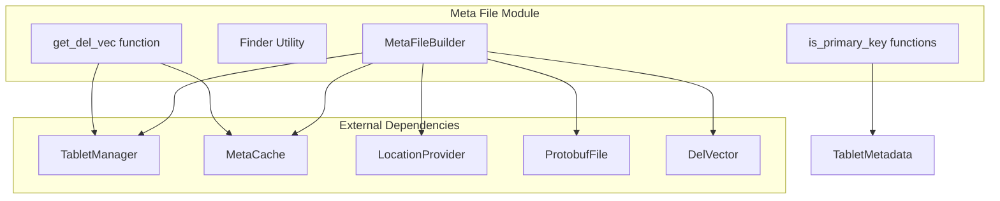
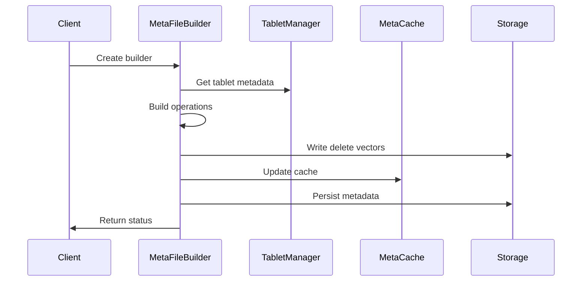
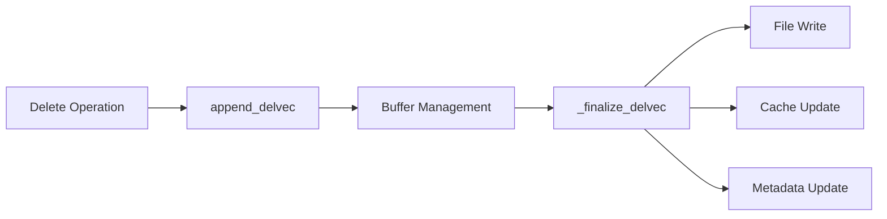
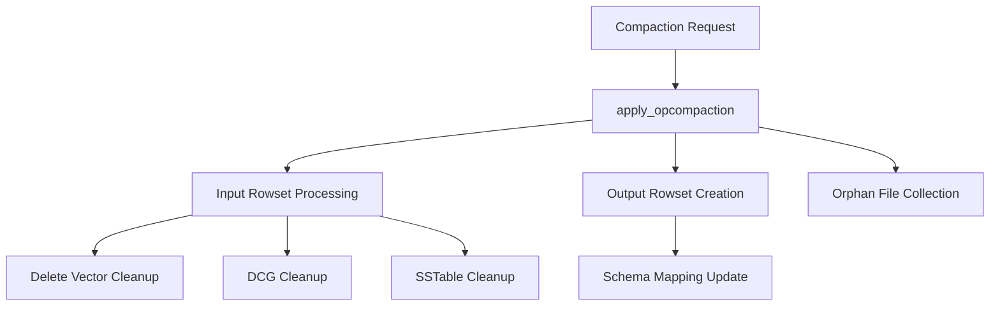
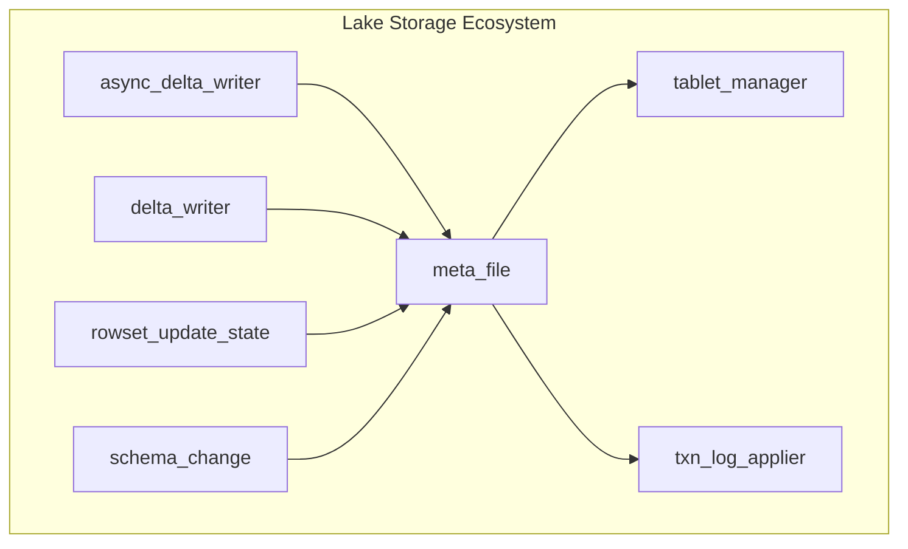

# Meta File Module Documentation

## Overview

The meta_file module is a critical component of StarRocks' lake storage architecture, responsible for managing tablet metadata files and their associated operations. This module handles the persistence and manipulation of tablet metadata, including delete vectors, delta column groups, rowset management, and compaction operations.

## Purpose and Core Functionality

The meta_file module serves as the central coordinator for tablet metadata operations in the lake storage system. Its primary responsibilities include:

- **Metadata Persistence**: Managing the lifecycle of tablet metadata files
- **Delete Vector Management**: Handling delete vector creation, storage, and retrieval
- **Delta Column Group Operations**: Managing column-level updates and modifications
- **Rowset Lifecycle**: Coordinating rowset creation, updates, and cleanup
- **Compaction Support**: Facilitating compaction operations by managing input/output rowsets
- **Schema Evolution**: Supporting schema changes and historical schema tracking

## Architecture

### Component Structure

### Data Flow Architecture

## Core Components

### MetaFileBuilder

The `MetaFileBuilder` class is the primary interface for constructing and manipulating tablet metadata. It provides methods for:

- **Delete Vector Management**: `append_delvec()`, `_finalize_delvec()`
- **Delta Column Group Operations**: `append_dcg()`
- **Rowset Operations**: `apply_opwrite()`, `apply_opcompaction()`
- **Batch Operations**: `batch_apply_opwrite()`, `set_final_rowset()`
- **Statistics Updates**: `update_num_del_stat()`

### Finder Utility

The `Finder` struct provides utility functions for locating specific elements within collections, used primarily for:
- Rowset identification and searching
- Segment ID matching during compaction operations

### Delete Vector Functions

- **`get_del_vec()`**: Retrieves delete vectors from storage or cache
- **`delvec_cache_key()`**: Generates cache keys for delete vector caching

## Key Operations

### 1. Delete Vector Management

The module handles delete vectors through a multi-stage process:
1. **Collection**: Delete vectors are collected during write operations
2. **Buffering**: Vectors are buffered in memory before persistence
3. **Finalization**: Vectors are written to dedicated files and metadata is updated
4. **Caching**: Frequently accessed vectors are cached for performance

### 2. Compaction Operations

Compaction operations involve:
- **Input Processing**: Removing input rowsets and associated metadata
- **Cleanup Operations**: Cleaning up delete vectors, delta column groups, and SSTables
- **Output Generation**: Creating new output rowsets with updated metadata
- **File Management**: Collecting orphaned files for later cleanup

### 3. Delta Column Group Management

The module supports column-level updates through delta column groups:
- **New DCG Creation**: Adding new column files with unique column IDs
- **Old DCG Cleanup**: Removing outdated column files
- **Orphan Management**: Tracking unused column files for cleanup

## Integration with Lake Storage

The meta_file module integrates closely with other lake storage components:

### Dependencies

- **[tablet_manager](tablet_manager.md)**: Provides tablet management and metadata persistence
- **[txn_log_applier](txn_log_applier.md)**: Applies transaction logs to tablet metadata
- **[async_delta_writer](async_delta_writer.md)** and **[delta_writer](delta_writer.md)**: Generate metadata updates during write operations
- **[rowset_update_state](rowset_update_state.md)**: Manages rowset update operations
- **[schema_change](schema_change.md)**: Handles schema evolution operations

## Performance Considerations

### Caching Strategy

The module implements a multi-level caching strategy:
- **Delete Vector Cache**: Frequently accessed delete vectors are cached in memory
- **Metadata Cache**: Tablet metadata is cached to reduce I/O operations
- **Cache Key Generation**: Efficient cache key generation using protobuf serialization

### File Management

- **Orphan File Collection**: Unused files are collected for cleanup rather than immediately deleted
- **Batch Operations**: Multiple operations are batched to reduce I/O overhead
- **Lazy Finalization**: Operations are buffered and finalized only when necessary

## Error Handling

The module implements comprehensive error handling:
- **Status Codes**: All operations return Status objects for error propagation
- **Validation**: Input parameters are validated before processing
- **Recovery Flags**: Recovery flags are set when consistency issues are detected
- **Metrics Integration**: Errors are reported through StarRocks metrics system

## Configuration

Key configuration options:
- `experimental_lake_ignore_pk_consistency_check`: Controls primary key consistency checking
- Various file system and caching configurations inherited from the storage engine

## Future Enhancements

Potential areas for improvement:
- **Parallel Processing**: Multi-threaded metadata operations
- **Advanced Caching**: More sophisticated caching strategies
- **Compression**: Metadata compression for reduced storage overhead
- **Incremental Updates**: More granular metadata update mechanisms

## References

- [Lake Storage Overview](lake_storage.md)
- [Tablet Manager](tablet_manager.md)
- [Transaction Log Applier](txn_log_applier.md)
- [Delete Vector Management](delete_vector.md)
- [Rowset Management](rowset_management.md)