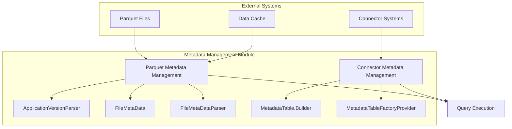
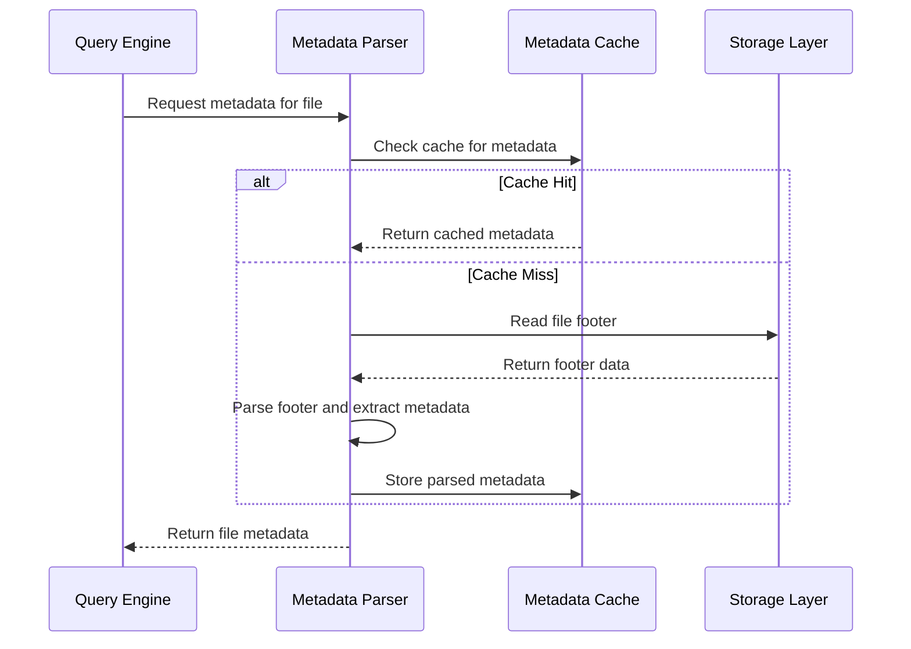

# Metadata Management Module

## Introduction

The metadata_management module is responsible for handling metadata operations within the StarRocks system. This module encompasses two primary areas: Parquet file metadata parsing and connector metadata table management. It provides critical functionality for reading, parsing, and managing metadata information from various data sources and file formats.

## Architecture Overview

## Core Components

### Parquet Metadata Management

#### ApplicationVersionParser

The `ApplicationVersionParser` is a sophisticated parser designed to handle Parquet application version strings. It parses the "created_by" field from Parquet file metadata to extract version information that is crucial for determining file compatibility and feature support.

**Key Features:**
- Parses complex version string formats compatible with parquet-mr
- Extracts application name, version numbers, pre-release identifiers, and build information
- Handles various version formats including semantic versioning
- Provides version comparison capabilities for compatibility checking

**Version Format Support:**
- Basic formats: `"application"`, `"application version 1.2.3"`
- Complex formats: `"application version 1.2.3-cdh5.5.0+build123 (build abc123)"`
- Semantic versioning with pre-release and build metadata

#### FileMetaData

The `FileMetaData` class represents the metadata structure of a Parquet file, providing essential information about the file's schema, row count, and writer version.

**Key Responsibilities:**
- Stores and manages Parquet file schema information
- Tracks the number of rows in the file
- Maintains writer version information for compatibility checks
- Provides debug information for troubleshooting

#### FileMetaDataParser

The `FileMetaDataParser` handles the parsing and caching of Parquet file metadata, optimizing performance through intelligent caching mechanisms.

**Core Functionality:**
- Parses Parquet file footers to extract metadata
- Implements metadata caching to reduce I/O operations
- Handles both cached and remote file metadata retrieval
- Provides error handling for corrupted or unsupported files
- Supports split context optimization for distributed processing

### Connector Metadata Management

#### MetadataTable.Builder

The `MetadataTable.Builder` provides a builder pattern for constructing metadata tables that represent external system metadata in a structured format.

**Purpose:**
- Creates metadata table structures for external connectors
- Defines schema and properties for metadata representation
- Enables standardized access to external system metadata

#### MetadataTableFactoryProvider

The `MetadataTableFactoryProvider` serves as a factory for creating appropriate metadata table implementations based on connector types.

**Responsibilities:**
- Provides metadata table factories for different connector types
- Manages metadata table creation and configuration
- Ensures consistent metadata table interfaces across connectors

## Data Flow

## Integration with Other Modules

### Storage Engine Integration

The metadata_management module integrates closely with the [storage_engine](storage_engine.md) module:
- Provides metadata parsing for Parquet files stored in the system
- Enables efficient file format detection and handling
- Supports columnar storage optimizations through metadata analysis

### Query Execution Integration

Integration with the [query_execution](query_execution.md) module enables:
- Query planning based on file metadata
- Optimization decisions using column statistics
- Runtime filter application based on metadata information

### Connector Framework Integration

The module works with the [connector_framework](frontend_server.md#connector_framework) to:
- Provide metadata tables for external systems
- Enable unified metadata access across different data sources
- Support connector-specific metadata formats

## Key Features

### Version Compatibility Management

The ApplicationVersionParser ensures compatibility across different Parquet writer versions by:
- Detecting known issues in specific versions
- Enabling version-specific workarounds
- Providing statistics validation based on writer version

### Performance Optimization

Metadata caching mechanisms provide:
- Reduced I/O operations for frequently accessed files
- Faster query planning through cached metadata
- Efficient memory usage through intelligent cache management

### Error Handling and Validation

Comprehensive error handling includes:
- Corruption detection for invalid Parquet files
- Version compatibility validation
- Graceful degradation for unsupported features

## Configuration and Usage

### Cache Configuration

The metadata cache can be configured through:
- Cache size limits
- Eviction policies
- Cache key generation strategies

### Version Detection

The system automatically detects and handles:
- Parquet writer applications (parquet-mr, parquet-cpp, etc.)
- Version-specific features and limitations
- Build information for debugging purposes

## Best Practices

1. **Cache Utilization**: Leverage metadata caching for frequently accessed files to improve performance
2. **Version Awareness**: Be aware of version-specific limitations when working with older Parquet files
3. **Error Handling**: Implement proper error handling for metadata parsing failures
4. **Performance Monitoring**: Monitor cache hit rates and metadata parsing performance

## Future Enhancements

Potential areas for improvement include:
- Enhanced support for encrypted Parquet files
- Additional metadata formats beyond Parquet
- Improved caching strategies for distributed environments
- Extended connector metadata table support

## Related Documentation

- [Storage Engine](storage_engine.md) - For file storage and retrieval mechanisms
- [Query Execution](query_execution.md) - For metadata usage in query planning
- [Connector Framework](frontend_server.md#connector_framework) - For external system integration
- [Parquet Format Support](backend_server.md#parquet_format) - For detailed Parquet format handling