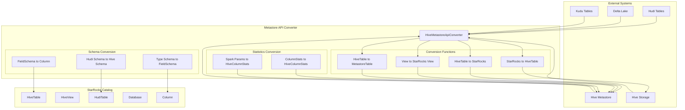
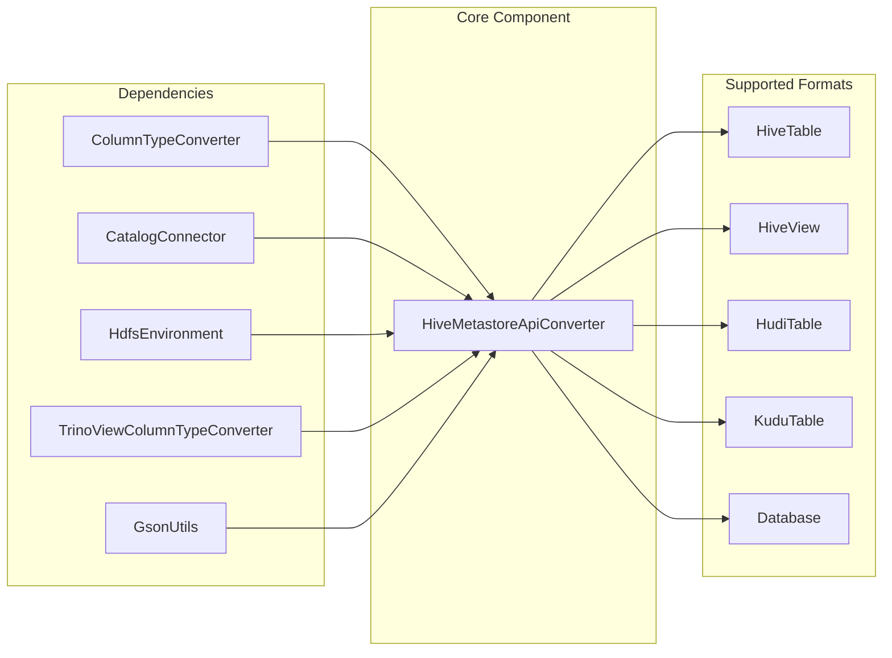
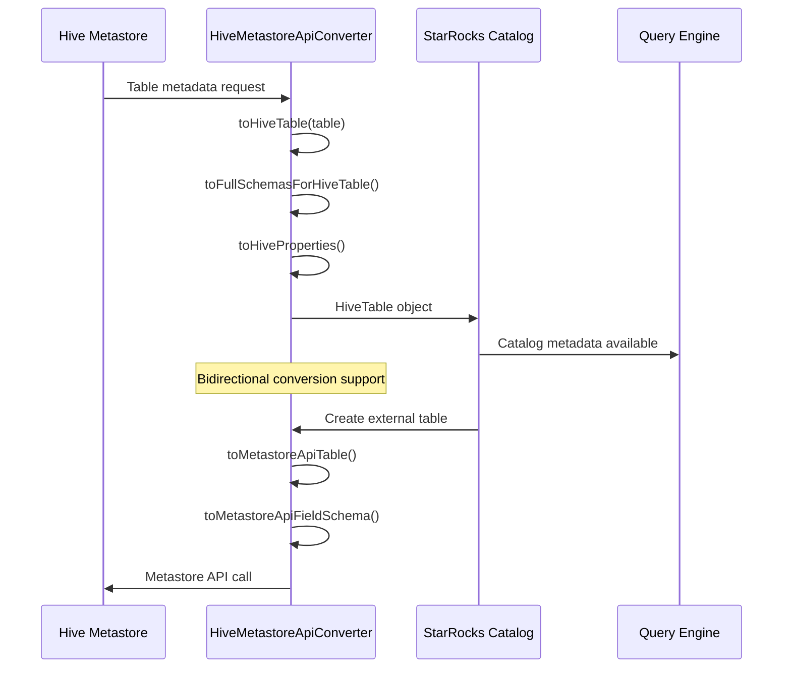
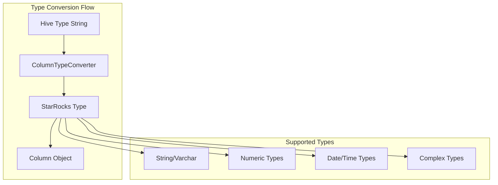

# Metastore API Converter Module

## Introduction

The Metastore API Converter module serves as a critical bridge between StarRocks and external metastore systems, particularly Hive Metastore. This module provides comprehensive conversion utilities that translate between StarRocks internal representations and external metastore API objects, enabling seamless integration with Hive, Hudi, Delta Lake, and other table formats.

## Core Functionality

The module's primary responsibility is to handle bidirectional conversion between StarRocks catalog objects and metastore API representations, supporting multiple table formats and ensuring data consistency across different storage systems.

## Architecture Overview



## Component Relationships



## Key Components

### HiveMetastoreApiConverter

The central converter class that provides static methods for converting between StarRocks and metastore representations:

#### Table Conversion Methods
- `toHiveTable()`: Converts Hive metastore Table to StarRocks HiveTable
- `toKuduTable()`: Converts Hive metastore Table to StarRocks KuduTable
- `toHudiTable()`: Converts Hive metastore Table to StarRocks HudiTable
- `toMetastoreApiTable()`: Converts StarRocks HiveTable back to metastore API format

#### Schema Conversion Methods
- `toFullSchemasForHiveTable()`: Converts Hive table schema to StarRocks column list
- `toFullSchemasForHudiTable()`: Converts Hudi table schema to StarRocks column list
- `toFullSchemasForTrinoView()`: Converts Trino view schema to StarRocks column list
- `toMetastoreApiFieldSchema()`: Converts StarRocks Column to Hive FieldSchema

#### Statistics Conversion Methods
- `toHiveColumnStatistics()`: Converts column statistics objects
- `toPartitionColumnStatistics()`: Converts partition-level statistics
- `convertSparkColumnStatistics()`: Converts Spark-generated statistics to Hive format

## Data Flow



## Supported Table Formats

### Hive Tables
- **External Tables**: Full support with location and properties conversion
- **Managed Tables**: Complete metadata conversion
- **Views**: Both Hive and Trino view support with SQL parsing
- **Materialized Views**: Metadata conversion support

### Hudi Tables
- **Copy-on-Write**: Full schema and partition conversion
- **Merge-on-Read**: Complete metadata handling
- **Timeline Management**: Integration with Hudi's metadata timeline

### Delta Lake Tables
- **Spark Provider**: Detection and special handling
- **Location Resolution**: Path extraction from serde parameters

### Kudu Tables
- **Input Format Detection**: Kudu-specific format recognition
- **Schema Mapping**: Complete type conversion support

## Type System Integration

The converter integrates with StarRocks' type system through [ColumnTypeConverter](column_type_converter.md):



## Statistics and Metadata Handling

### Column Statistics Conversion
The module provides comprehensive statistics conversion from multiple sources:

- **Hive Metastore Statistics**: Native column stats conversion
- **Spark Statistics**: Spark-generated statistics integration
- **Partition Statistics**: Per-partition statistics handling
- **Common Statistics**: Row count, file size, and file count aggregation

### Properties Management
- **Table Properties**: Conversion of table-level metadata
- **Serde Properties**: Serialization/deserialization parameter handling
- **Storage Properties**: Input/output format and storage format management

## Error Handling and Validation

### Table Type Validation
```java
validateHiveTableType(String hiveTableType)
```
Supports: VIRTUAL_VIEW, EXTERNAL_TABLE, MANAGED_TABLE, MATERIALIZED_VIEW

### Schema Validation
- Type compatibility checking
- Column name validation
- Comment preservation
- Default value handling

### Exception Handling
- **StarRocksConnectorException**: For connector-specific errors
- **StarRocksPlannerException**: For SQL parsing errors in views
- **InternalError**: For type conversion failures

## Integration Points

### Catalog Integration
The converter works closely with:
- [Catalog Connector Framework](connector_framework.md)
- [Hive Connector](hive_connector.md)
- [Hudi Integration](hudi_connector.md)

### Storage Integration
- [HDFS Environment](hdfs_environment.md)
- [Cloud Configuration](cloud_configuration.md)
- [Remote File Operations](remote_file_operations.md)

## Configuration and Extensibility

### Supported Properties
- **Statistics Properties**: ROW_COUNT, TOTAL_SIZE, NUM_FILES
- **Spark Statistics**: Integration with Spark-generated statistics
- **Custom Properties**: User-defined table properties preservation

### Extension Points
- Custom type converters via ColumnTypeConverter
- Additional table format support
- Custom statistics providers
- View definition parsers

## Performance Considerations

### Caching Strategy
- Metadata caching at connector level
- Statistics caching for query optimization
- Schema caching to reduce conversion overhead

### Batch Operations
- Bulk statistics conversion
- Multi-partition metadata handling
- Stream-based large table processing

## Security and Access Control

### Authentication
- Integration with Hadoop authentication
- Cloud credential management
- Kerberos support for secure clusters

### Authorization
- Table-level access control
- Column-level security integration
- View security context preservation

## Monitoring and Observability

### Logging
- Comprehensive conversion logging
- Error tracking and reporting
- Performance metrics collection

### Metrics
- Conversion success/failure rates
- Processing time statistics
- Memory usage tracking

## Future Enhancements

### Planned Features
- Additional table format support (Iceberg, Paimon)
- Enhanced statistics collection
- Improved type mapping precision
- Better error recovery mechanisms

### Optimization Opportunities
- Parallel conversion processing
- Incremental metadata updates
- Smart caching strategies
- Memory-efficient large table handling