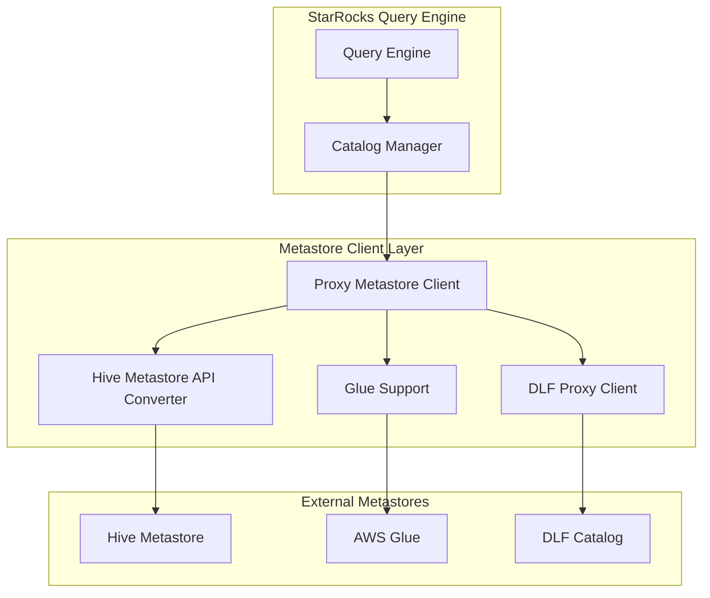
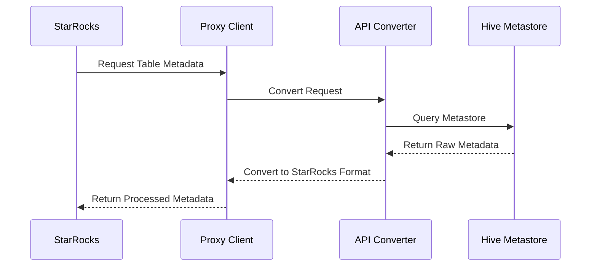

# Metastore Client Layer Documentation

## Overview

The metastore_client_layer module serves as the primary interface between StarRocks and external Hive metastore systems. This module provides a unified abstraction layer that enables StarRocks to interact with various Hive-compatible metastores, including traditional Hive metastores, AWS Glue Data Catalog, and Alibaba Cloud's Data Lake Formation (DLF).

## Purpose and Core Functionality

The metastore client layer is responsible for:

- **Metastore Abstraction**: Providing a consistent interface to different metastore implementations
- **Schema Management**: Handling table and partition metadata operations
- **Data Discovery**: Enabling StarRocks to discover and access external table structures
- **Statistics Management**: Managing table and column statistics for query optimization
- **Multi-Cloud Support**: Supporting various cloud-based metastore services

## Architecture Overview



## Key Components

### 1. DLFProxyMetaStoreClient
The `DLFProxyMetaStoreClient` is a sophisticated proxy implementation that provides dual-client architecture for Alibaba Cloud's Data Lake Formation service. It supports multiple proxy modes to handle different failure scenarios and performance requirements.

**Key Features:**
- Dual-client architecture (DLF + Hive metastore)
- Configurable proxy modes for different operational requirements
- Automatic failover and error handling
- Support for both read and write operations

**Proxy Modes:**
- `METASTORE_ONLY`: Uses only Hive metastore
- `DLF_ONLY`: Uses only DLF metastore
- `METASTORE_DLF_SUCCESS`: Hive primary, DLF secondary
- `DLF_METASTORE_SUCCESS`: DLF primary, Hive secondary
- `METASTORE_DLF_FAILURE`: Hive with DLF failure tolerance
- `DLF_METASTORE_FAILURE`: DLF with Hive failure tolerance

For detailed implementation details, see [metastore_client_core.md](metastore_client_core.md).

### 2. HiveMetastoreApiConverter
The `HiveMetastoreApiConverter` provides comprehensive conversion utilities between Hive metastore API objects and StarRocks internal representations. It handles complex type mappings, statistics conversion, and schema transformations.

**Core Responsibilities:**
- Table metadata conversion (Hive → StarRocks)
- Partition information transformation
- Column statistics mapping
- Storage format handling
- View definition parsing (including Trino views)

For detailed implementation details, see [metastore_api_converter.md](metastore_api_converter.md).

## Data Flow Architecture



## Integration with Other Modules

The metastore client layer integrates with several other StarRocks modules:

- **[Connector Framework](connectors.md)**: Provides the foundation for external data source integration
- **[Catalog Management](frontend_server.md#catalog)**: Manages external catalog configurations
- **[Query Execution](query_execution.md)**: Supplies metadata needed for query planning and execution
- **[SQL Parser/Optimizer](sql_parser_optimizer.md)**: Provides table schema information for query analysis

## Supported Metastore Types

### Hive Metastore
Traditional Apache Hive metastore service, providing comprehensive metadata management for Hive tables.

### AWS Glue Data Catalog
Cloud-native metadata service with automatic schema discovery and integration with AWS analytics services.

### Alibaba Cloud DLF
Data Lake Formation service providing unified metadata management across multiple storage systems.

## Configuration and Deployment

The metastore client layer supports various configuration options:

```properties
# Proxy mode configuration
hive.metastore.proxy.mode=DLF_METASTORE_SUCCESS

# DLF specific settings
dlf.catalog.endpoint=dlf-vpc.cn-region.aliyuncs.com
dlf.catalog.access.key=your-access-key
dlf.catalog.secret.key=your-secret-key

# Hive metastore settings
hive.metastore.uris=thrift://hive-metastore:9083
```

## Error Handling and Resilience

The module implements comprehensive error handling strategies:

- **Automatic Retry**: Configurable retry mechanisms for transient failures
- **Circuit Breaker**: Prevents cascading failures in distributed environments
- **Fallback Mechanisms**: Alternative client selection when primary fails
- **Graceful Degradation**: Continues operation with reduced functionality when possible

## Performance Optimizations

- **Connection Pooling**: Reuses metastore connections to reduce overhead
- **Metadata Caching**: Caches frequently accessed metadata to reduce API calls
- **Batch Operations**: Groups multiple operations for better throughput
- **Lazy Loading**: Defers expensive operations until absolutely necessary

## Security Considerations

- **Authentication**: Supports Kerberos and cloud-native authentication mechanisms
- **Authorization**: Integrates with existing authorization frameworks
- **Encryption**: Supports encrypted communication with metastore services
- **Credential Management**: Secure handling of cloud provider credentials

## Monitoring and Observability

The module provides comprehensive monitoring capabilities:

- **Metrics Collection**: Tracks API call latency, success rates, and error types
- **Logging**: Detailed logging for debugging and audit purposes
- **Health Checks**: Regular health monitoring of metastore connections
- **Performance Profiling**: Detailed performance metrics for optimization

## Future Enhancements

Planned improvements for the metastore client layer include:

- **Multi-Region Support**: Enhanced support for geographically distributed metastores
- **Incremental Metadata Sync**: Real-time metadata synchronization capabilities
- **Advanced Caching**: Intelligent caching strategies based on access patterns
- **Plugin Architecture**: Extensible framework for custom metastore implementations