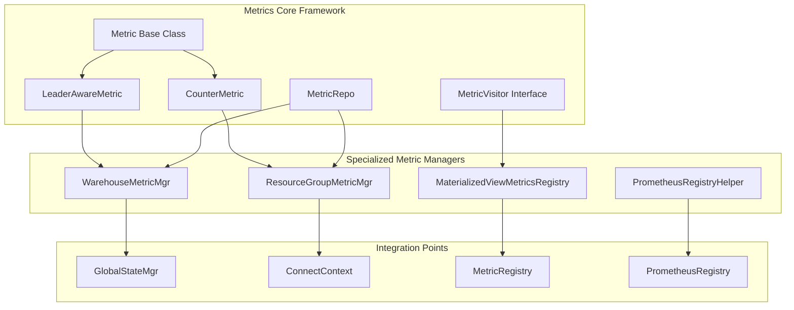

# Metrics Module Documentation

## Overview

The metrics module in StarRocks provides a comprehensive monitoring and observability framework for tracking system performance, resource utilization, and operational health. It implements a multi-dimensional metrics collection system that supports various metric types including counters, gauges, histograms, and specialized metrics for different system components.

## Architecture



## Core Functionality

### 1. Base Metric Framework
The foundation of the metrics system provides abstract base classes and interfaces for creating and managing metrics:

- **CounterMetric**: Abstract base class for monotonically increasing counter metrics
- **LeaderAwareMetric**: Automatically distinguishes between leader and follower nodes in the cluster
- **MetricVisitor**: Visitor pattern implementation for metric collection and export

### 2. Resource Group Metrics
Tracks query performance and resource utilization at the resource group level:

- Query execution counters and error rates
- Query latency histograms with percentile tracking
- Queue management metrics (total, pending, timeout)
- Automatic metric creation based on resource group usage

### 3. Warehouse Metrics
Monitors warehouse-level operations and job execution:

- Unfinished query tracking
- Backup and restore job monitoring
- Last finished job timestamp tracking
- Warehouse-specific metric labeling

### 4. Materialized View Metrics
Specialized metrics for materialized view performance:

- Per-MV metrics collection and management
- Automatic metrics cleanup with daily scheduled tasks
- Configurable metrics collection (can be disabled)
- Integration with metric visitors for export

### 5. Prometheus Integration
Provides seamless integration with Prometheus monitoring:

- Registry helper for converting Prometheus metrics
- Support for Prometheus metric formats and labels
- Error handling and logging for metric conversion

## Key Features

### Multi-Dimensional Metrics
- Support for labeled metrics with key-value pairs
- Dynamic label addition based on system state
- Context-aware metric collection

### Cluster-Aware Metrics
- Automatic leader/follower distinction
- Node role-based metric values
- Cluster-wide metric aggregation

### Configurable Collection
- Enable/disable specific metric types
- Configurable collection intervals
- Minified metrics collection for performance

### Thread-Safe Operations
- Concurrent metric updates
- Synchronized metric registration
- Atomic operations for counters

## Sub-Module Documentation

For detailed information about specific metric types and their implementations, refer to the following sub-module documentation:

- **[Base Metrics Framework](base_metrics.md)**: Core metric abstractions and base classes
- **[Resource Group Metrics](resource_group_metrics.md)**: Query performance and resource utilization tracking
- **[Warehouse Metrics](warehouse_metrics.md)**: Warehouse-level operations and job monitoring
- **[Materialized View Metrics](materialized_view_metrics.md)**: Specialized MV performance metrics
- **[Prometheus Integration](prometheus_integration.md)**: Prometheus monitoring system integration

## Integration with Other Modules

The metrics module integrates extensively with other StarRocks components:

- **[Query Execution](query_execution.md)**: Tracks query performance and resource usage
- **[Resource Management](frontend_server.md)**: Monitors resource groups and warehouses
- **[Materialized Views](frontend_server.md)**: Specialized MV performance metrics
- **[Storage Engine](storage_engine.md)**: Storage-level performance metrics
- **[Frontend Server](frontend_server.md)**: System-wide health and performance metrics

## Metric Types

### Counter Metrics
Monotonically increasing values for tracking cumulative events:
- Query counts
- Error counts
- Queue operations

### Gauge Metrics
Point-in-time measurements:
- Current queue depths
- System resource usage
- Active connection counts

### Histogram Metrics
Statistical distributions for latency tracking:
- Query latency percentiles
- Response time distributions
- Performance percentiles (P50, P75, P95, P98, P99, P99.9)

## Performance Considerations

### Memory Management
- Automatic cleanup of unused metrics
- Configurable retention policies
- Memory-efficient metric storage

### Collection Overhead
- Minimal performance impact during metric collection
- Configurable collection frequency
- Selective metric collection based on configuration

### Scalability
- Support for high-cardinality metrics
- Efficient metric lookup and updates
- Concurrent access handling

## Usage Examples

### Resource Group Metrics
```java
// Track query execution
ResourceGroupMetricMgr.increaseQuery(context, 1);

// Track query errors
ResourceGroupMetricMgr.increaseQueryErr(context, 1);

// Update query latency
ResourceGroupMetricMgr.updateQueryLatency(context, elapsedMs);
```

### Warehouse Metrics
```java
// Track unfinished queries
WarehouseMetricMgr.increaseUnfinishedQueries(warehouseId, 1);

// Track job completion
WarehouseMetricMgr.increaseUnfinishedBackupJobs(warehouseId, -1);
```

### Materialized View Metrics
```java
// Get metrics entity for an MV
IMaterializedViewMetricsEntity entity = 
    MaterializedViewMetricsRegistry.getMetricsEntity(mvId);

// Collect all MV metrics
MaterializedViewMetricsRegistry.collectMaterializedViewMetrics(visitor, false);
```

## Configuration

The metrics system supports various configuration options:

- `enable_materialized_view_metrics_collect`: Enable/disable MV metrics
- Metric retention policies
- Collection intervals and frequencies
- Export formats and destinations

## Monitoring and Alerting

The metrics module provides comprehensive data for:

- System health monitoring
- Performance analysis
- Capacity planning
- Troubleshooting and diagnostics
- SLA compliance tracking

This metrics framework forms the foundation for StarRocks' observability capabilities, enabling operators to monitor system health, optimize performance, and maintain reliable operations at scale.