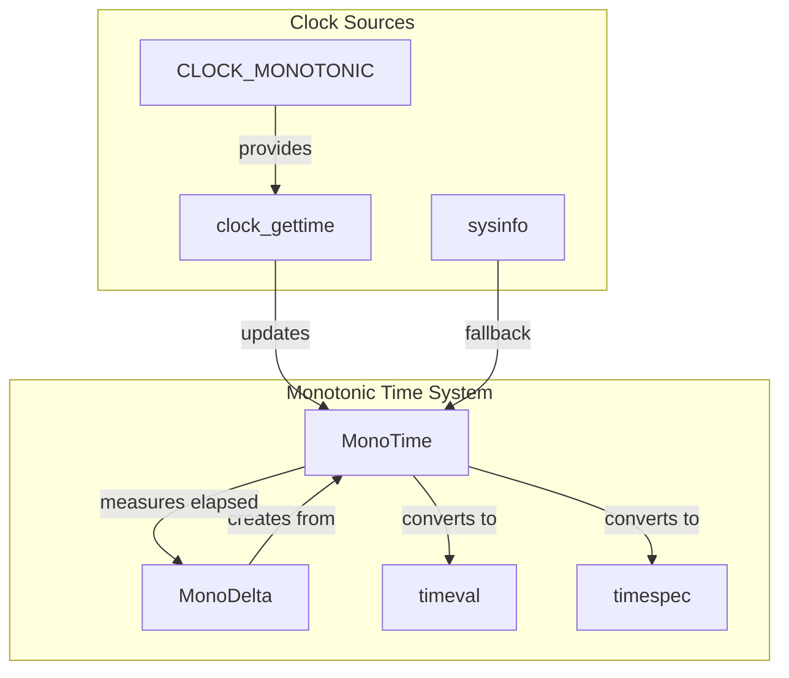

# Monotonic Time Sub-module

## Overview

The Monotonic Time sub-module provides high-precision, monotonic clock operations that are essential for accurate timing measurements, performance profiling, and timeout management. Unlike system time, monotonic time is guaranteed to never go backwards, making it ideal for measuring elapsed time intervals.

## Core Components

### Timeval Integration

The sub-module integrates with standard `timeval` structures for system compatibility:

```cpp
struct timeval {
    time_t tv_sec;      // seconds
    suseconds_t tv_usec; // microseconds
};
```

## Architecture



## Key Features

### 1. Monotonic Clock Guarantee
- Never goes backwards (unlike system time)
- Immune to system clock adjustments
- Consistent across system sleep/wake cycles
- Reliable for measuring elapsed time

### 2. High Precision
- Nanosecond resolution on supported systems
- Microsecond precision for timeval compatibility
- Hardware clock source when available
- Minimal overhead for time queries

### 3. Cross-Platform Support
- POSIX-compliant implementation
- Windows compatibility layer
- Consistent API across platforms
- Graceful fallbacks for unsupported features

## Implementation Details

### MonoTime Class

```cpp
class MonoTime {
public:
    static MonoTime Now();
    static MonoTime Max();
    static MonoTime Min();
    
    MonoDelta GetDeltaSince(const MonoTime& rhs) const;
    void AddDelta(const MonoDelta& delta);
    bool ComesBefore(const MonoTime& rhs) const;
    
private:
    int64_t nanos_;  // nanoseconds since epoch
};
```

### MonoDelta Class

```cpp
class MonoDelta {
public:
    static MonoDelta FromSeconds(double seconds);
    static MonoDelta FromMilliseconds(int64_t ms);
    static MonoDelta FromMicroseconds(int64_t us);
    static MonoDelta FromNanoseconds(int64_t ns);
    
    double ToSeconds() const;
    int64_t ToMilliseconds() const;
    int64_t ToMicroseconds() const;
    int64_t ToNanoseconds() const;
    
    void ToTimeVal(struct timeval* tv) const;
    void ToTimeSpec(struct timespec* ts) const;
    
private:
    int64_t nano_delta_;
};
```

## Usage Patterns

### Performance Measurement
```cpp
// Example: Function execution time measurement
MonoTime start = MonoTime::Now();
perform_operation();
MonoTime end = MonoTime::Now();
MonoDelta elapsed = end.GetDeltaSince(start);
LOG(INFO) << "Operation took " << elapsed.ToMilliseconds() << " ms";
```

### Timeout Management
```cpp
// Example: Timeout-based operation
MonoTime deadline = MonoTime::Now();
deadline.AddDelta(MonoDelta::FromSeconds(30));
while (MonoTime::Now().ComesBefore(deadline)) {
    if (operation_complete()) {
        break;
    }
    SleepFor(MonoDelta::FromMilliseconds(100));
}
```

### Rate Limiting
```cpp
// Example: Rate-limited operation
MonoTime last_call = MonoTime::Now();
const MonoDelta min_interval = MonoDelta::FromMilliseconds(100);

void rate_limited_operation() {
    MonoTime now = MonoTime::Now();
    if (now.ComesBefore(last_call + min_interval)) {
        return; // Too soon, skip this call
    }
    last_call = now;
    perform_operation();
}
```

## Performance Characteristics

- **Time Resolution**: Nanosecond precision on modern systems
- **Query Overhead**: Single system call per time query
- **Memory Usage**: Minimal (8 bytes per MonoTime/MonoDelta)
- **Accuracy**: Hardware-dependent, typically microsecond accuracy

## Timeval Integration

The sub-module provides seamless integration with standard timeval structures:

```cpp
void MonoDelta::ToTimeVal(struct timeval* tv) const {
    tv->tv_sec = nano_delta_ / MonoTime::kNanosecondsPerSecond;
    tv->tv_usec = (nano_delta_ - (tv->tv_sec * MonoTime::kNanosecondsPerSecond)) / 
                  MonoTime::kNanosecondsPerMicrosecond;
    
    // Handle negative timevals
    if (tv->tv_usec < 0) {
        --(tv->tv_sec);
        tv->tv_usec += 1000000;
    }
}
```

## Error Handling

- Graceful handling of clock source unavailability
- Fallback to lower-precision timers when necessary
- Safe handling of time overflow conditions
- Proper error reporting for system call failures

## Thread Safety

- All operations are thread-safe
- No shared mutable state
- Lock-free time queries
- Atomic operations for time arithmetic

## Platform-Specific Considerations

### Linux
- Uses `CLOCK_MONOTONIC` for reliable monotonic time
- High-resolution timers (hrtimers) when available
- Fallback to `CLOCK_MONOTONIC_RAW` if needed

### macOS
- `CLOCK_MONOTONIC` support via mach_absolute_time()
- Conversion to nanoseconds using mach_timebase_info
- Consistent API with Linux implementation

### Windows
- QueryPerformanceCounter() for high-resolution timing
- Conversion to nanoseconds using performance frequency
- Monotonic guarantee across system sleep/wake

## Integration Points

The Monotonic Time sub-module integrates with:
- Performance profiling and measurement
- Timeout and deadline management
- Rate limiting and throttling
- System monitoring and metrics

This sub-module provides the reliable, high-precision timing foundation necessary for accurate performance measurement and time-sensitive operations throughout the StarRocks system.