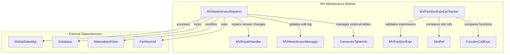
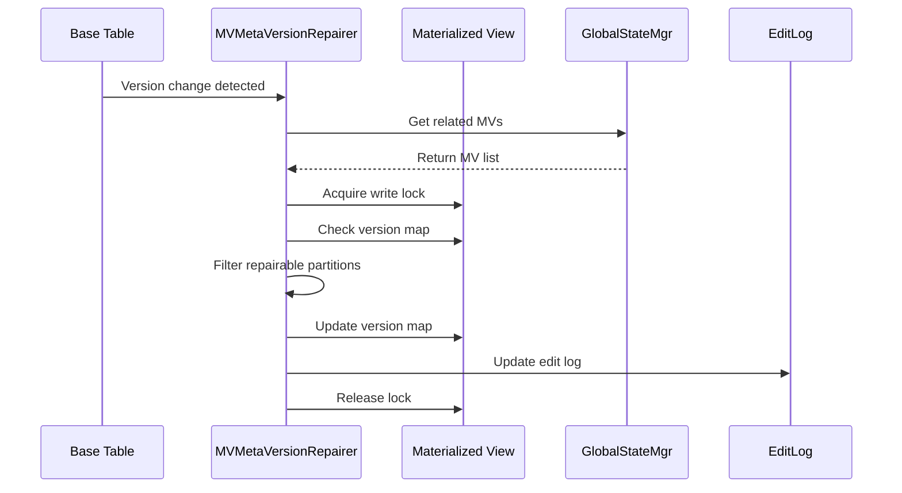

# MV Maintenance Module Documentation

## Overview

The MV (Materialized View) Maintenance module is a critical component of StarRocks that handles the lifecycle management, version tracking, and metadata consistency of materialized views. This module ensures that materialized views remain synchronized with their base tables and provides mechanisms for repairing metadata inconsistencies that may occur due to various operations like schema changes, compactions, or external table modifications.

## Purpose

The primary purpose of the MV Maintenance module is to:

1. **Maintain Metadata Consistency**: Ensure materialized view metadata remains consistent with base table changes
2. **Handle Version Synchronization**: Track and synchronize version changes between base tables and materialized views
3. **Provide Repair Mechanisms**: Offer automated repair capabilities for metadata inconsistencies
4. **Support Partition Expression Analysis**: Enable comparison and validation of partition expressions in materialized views

## Architecture

## Core Components

### 1. MVMetaVersionRepairer

The `MVMetaVersionRepairer` is responsible for repairing base table version changes in materialized views. It handles scenarios where base tables undergo version changes without data modifications, which commonly occurs in cloud-native environments during background operations like compactions.

**Key Responsibilities:**
- Repair version changes for native tables and materialized views
- Handle external base table information updates when tables are dropped and recreated
- Filter and validate partition repair information
- Update edit logs after metadata changes
- Manage connector table information for external tables

**Main Methods:**
- `repairBaseTableVersionChanges()`: Main entry point for repairing version changes
- `repairExternalBaseTableInfo()`: Handles external table metadata repairs
- `filterToRepairPartitionInfos()`: Validates which partitions need repair
- `toBasePartitionInfoMap()`: Converts repair information to base partition info

### 2. MVPartitionExprEqChecker

The `MVPartitionExprEqChecker` provides utilities for checking the equality of materialized view partition expressions. This is essential for validating partition compatibility between materialized views and their base tables.

**Key Responsibilities:**
- Compare slot references for equality
- Validate function call expressions in partition definitions
- Support various partition expression types (DATE_TRUNC, etc.)
- Ensure partition expression compatibility

**Main Methods:**
- `areEqualExprs()`: Main method for comparing expressions
- `areEqualSlotRefs()`: Compares slot references
- `areEqualTableNames()`: Validates table name equality
- `areEqualFuncExprWithSlot()`: Compares function expressions with slots

## Data Flow

## Integration Points

The MV Maintenance module integrates with several other StarRocks components:

### Storage Engine Integration
- **MaterializedView**: Core MV metadata management
- **BasePartitionInfo**: Partition-level version tracking
- **AsyncRefreshContext**: Asynchronous refresh context management

### Catalog Integration
- **GlobalStateMgr**: Global state and metadata management
- **Database**: Database-level locking and metadata access
- **ConnectorTableInfo**: External table metadata management

### Partition Management Integration
- **PartitionUtil**: Partition information utilities
- **MVPartitionExpr**: Partition expression validation
- **BaseTableInfo**: Base table information management

## Error Handling

The module implements comprehensive error handling:

1. **Null Safety**: All methods validate input parameters for null values
2. **Lock Management**: Proper database and table locking to prevent concurrent modifications
3. **Version Validation**: Strict version matching before applying repairs
4. **Logging**: Detailed logging for debugging and monitoring
5. **Graceful Degradation**: Continues processing other MVs if individual repairs fail

## Performance Considerations

- **Lock Optimization**: Uses write locks only when necessary and releases them promptly
- **Batch Processing**: Processes multiple partitions in batch where possible
- **Early Filtering**: Filters out non-repairable partitions early in the process
- **Memory Management**: Uses efficient data structures (Maps, Lists) for metadata handling

## Configuration

The module relies on several configuration parameters:

- **Lock Timeout**: Configurable timeout for database and table locks
- **Repair Batch Size**: Maximum number of partitions to repair in a single operation
- **Logging Level**: Configurable logging verbosity for debugging

## Monitoring and Metrics

Key metrics to monitor:

- **Repair Success Rate**: Percentage of successful metadata repairs
- **Repair Latency**: Time taken to complete repair operations
- **Lock Wait Time**: Time spent waiting for locks
- **Version Mismatch Count**: Number of version mismatches detected

## Related Documentation

- [storage_engine.md](storage_engine.md) - Storage engine integration details
- [frontend_server.md](frontend_server.md) - Frontend server integration
- [sql_parser_optimizer.md](sql_parser_optimizer.md) - SQL parsing and optimization integration

## Sub-modules

The MV Maintenance module consists of the following sub-modules:

1. **[mv_meta_version_repairer.md](mv_meta_version_repairer.md)** - Detailed documentation for the metadata version repairer component
2. **[mv_partition_expr_eq_checker.md](mv_partition_expr_eq_checker.md)** - Detailed documentation for the partition expression equality checker component

Each sub-module documentation provides in-depth analysis of the component's architecture, implementation details, and usage patterns.