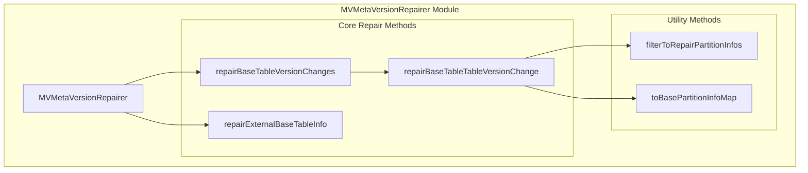
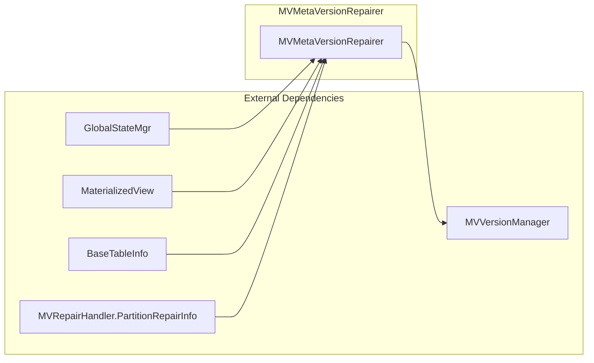
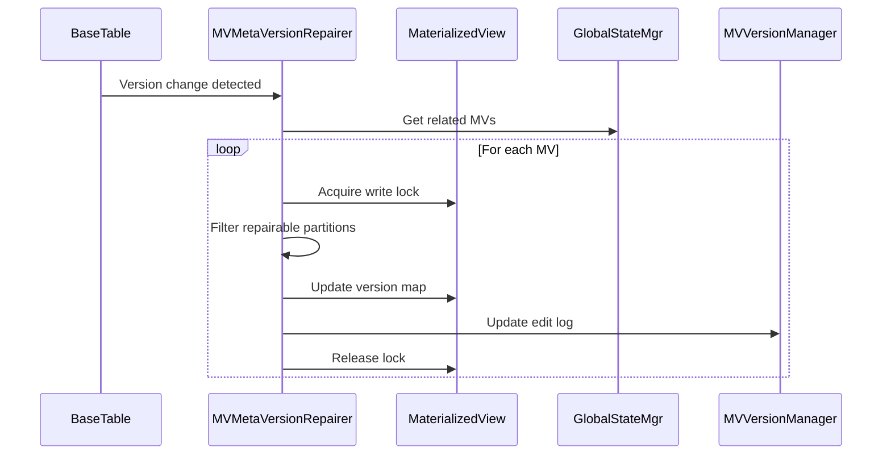
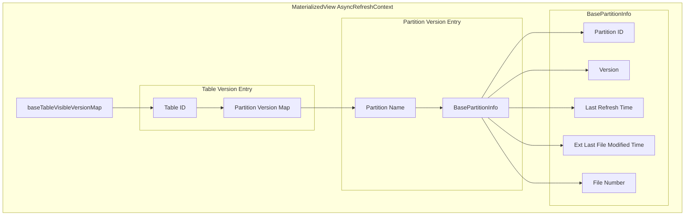
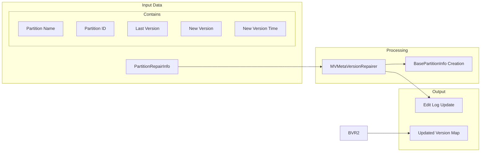
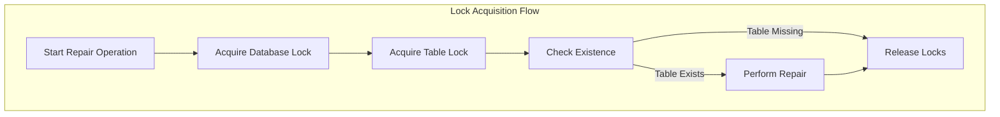

# MVMetaVersionRepairer Module Documentation

## Introduction

The `mv_meta_version_repairer` module is a critical component of StarRocks' Materialized View (MV) maintenance system. It provides specialized functionality for repairing and synchronizing materialized view metadata when base tables undergo version changes without data modifications. This module is essential for maintaining data consistency in cloud-native environments where background operations like compaction can trigger version updates.

## Core Purpose

The primary purpose of this module is to handle scenarios where base tables experience version changes (such as those caused by background compaction in cloud-native storage) without actual data modifications. In such cases, the materialized views need to update their metadata to reflect these version changes while preserving their validity and avoiding unnecessary refreshes.

## Architecture Overview

### Component Structure



### System Integration



## Core Components

### MVMetaVersionRepairer Class

The main class responsible for coordinating all materialized view metadata repair operations. It provides static methods for different repair scenarios and ensures thread-safe operations through proper locking mechanisms.

**Key Responsibilities:**
- Coordinate repair operations for multiple materialized views
- Manage database and table locks during repair operations
- Validate repair eligibility and preconditions
- Update metadata and persist changes to edit logs

## Key Methods and Functionality

### 1. Base Table Version Change Repair



**Method:** `repairBaseTableVersionChanges(Table table, List<MVRepairHandler.PartitionRepairInfo> partitionRepairInfos)`

This method handles the primary scenario where a base table experiences version changes without data modifications. It:

1. **Validation Phase**: Verifies the table is a native table or materialized view
2. **Discovery Phase**: Retrieves all related materialized views for the changed table
3. **Lock Acquisition**: Obtains write locks on materialized view databases and tables
4. **Repair Execution**: Updates the version metadata for each affected materialized view
5. **Persistence**: Updates edit logs to ensure changes are replicated across the cluster

### 2. External Base Table Info Repair

**Method:** `repairExternalBaseTableInfo(MaterializedView mv, BaseTableInfo oldBaseTableInfo, Table newTable, List<String> updatedPartitionNames)`

This specialized method handles external catalog tables that have been dropped and recreated, requiring base table info updates in materialized views.

**Process Flow:**
1. **Validation**: Ensures the table is from an external catalog
2. **Partition Mapping**: Maps old partition information to new table structure
3. **Info Reconstruction**: Creates new BaseTableInfo with updated table identifiers
4. **Metadata Update**: Updates materialized view's base table information
5. **Cache Reset**: Resets materialized view metadata cache
6. **Connector Update**: Updates connector table information in the metadata manager

### 3. Partition Filtering Logic

**Method:** `filterToRepairPartitionInfos(MaterializedView mv, Table table, Map<Long, Map<String, MaterializedView.BasePartitionInfo>> baseTableVersionMap, List<MVRepairHandler.PartitionRepairInfo> partitionRepairInfos)`

Implements sophisticated filtering to ensure only valid partition repairs are performed:

- **Existence Check**: Verifies base table exists in MV's version map
- **Partition Validation**: Confirms partition exists in the version map
- **Version Consistency**: Validates partition ID and version match between MV metadata and table state
- **Time Synchronization**: Ensures version timestamps are aligned

## Data Structures and Version Management

### Version Map Structure



### Repair Information Flow



## Integration with StarRocks Ecosystem

### Dependency Relationships

The module integrates with several key StarRocks components:

- **[GlobalStateMgr](../frontend_server.md)**: Provides access to database and table metadata
- **[MaterializedView](../catalog/materialized_views.md)**: Represents the MV objects being repaired
- **[MVVersionManager](../mv_maintenance.md)**: Handles version management and edit log updates
- **[MVRepairHandler](../mv_maintenance.md)**: Provides partition repair information
- **[ConnectorTableInfo](../connector_framework.md)**: Manages external catalog table metadata

### Locking Strategy

The module implements a robust locking strategy to ensure consistency:



## Error Handling and Logging

### Logging Strategy

The module implements comprehensive logging at different levels:

- **WARN**: For missing databases, tables, or validation failures
- **INFO**: For successful repair operations and version updates
- **DEBUG**: For detailed repair process information (implied)

### Error Scenarios

1. **Missing Database**: Skips repair with warning log
2. **Missing Materialized View**: Skips repair with warning log
3. **Lock Acquisition Failure**: Skips repair operation
4. **Version Mismatch**: Skips specific partition repair with detailed logging
5. **External Catalog Validation**: Ensures only external tables are processed

## Performance Considerations

### Optimization Strategies

1. **Batch Processing**: Processes multiple partitions in a single operation
2. **Selective Repair**: Only repairs partitions that pass validation checks
3. **Efficient Lookups**: Uses HashMap-based structures for O(1) lookups
4. **Minimal Locking**: Acquires locks only when necessary and releases promptly

### Scalability Factors

- **Concurrent MVs**: Handles multiple materialized views related to a single table
- **Partition Volume**: Efficiently processes tables with large numbers of partitions
- **External Catalog Support**: Handles complex external table scenarios

## Usage Examples

### Basic Version Repair

```java
// When a base table undergoes version-only changes
Table changedTable = getChangedTable();
List<MVRepairHandler.PartitionRepairInfo> repairInfos = getRepairInfos();

// Trigger repair operation
MVMetaVersionRepairer.repairBaseTableVersionChanges(changedTable, repairInfos);
```

### External Table Info Repair

```java
// When external table is dropped and recreated
MaterializedView mv = getMaterializedView();
BaseTableInfo oldInfo = getOldBaseTableInfo();
Table newTable = getNewTable();
List<String> updatedPartitions = getUpdatedPartitions();

// Repair base table info
MVMetaVersionRepairer.repairExternalBaseTableInfo(mv, oldInfo, newTable, updatedPartitions);
```

## Future Enhancements

### Potential Improvements

1. **Edit Log Integration**: Complete TODO for follower FE synchronization in external table repairs
2. **Metrics Collection**: Add repair operation metrics for monitoring
3. **Batch Optimization**: Further optimize batch processing for large-scale repairs
4. **Error Recovery**: Implement retry mechanisms for failed repair operations

### Monitoring and Observability

Future versions could include:
- Repair operation counters
- Repair duration metrics
- Success/failure rates
- Partition-level repair statistics

## Related Documentation

- [Materialized Views Maintenance](../mv_maintenance.md) - General MV maintenance operations
- [Catalog Management](../frontend_server.md#catalog) - Table and database management
- [Connector Framework](../connector_framework.md) - External catalog integration
- [Version Management](../common_config.md#version_management) - System version handling