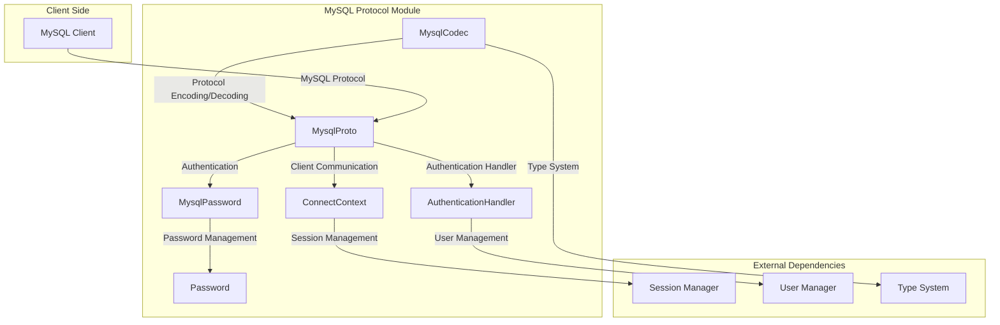
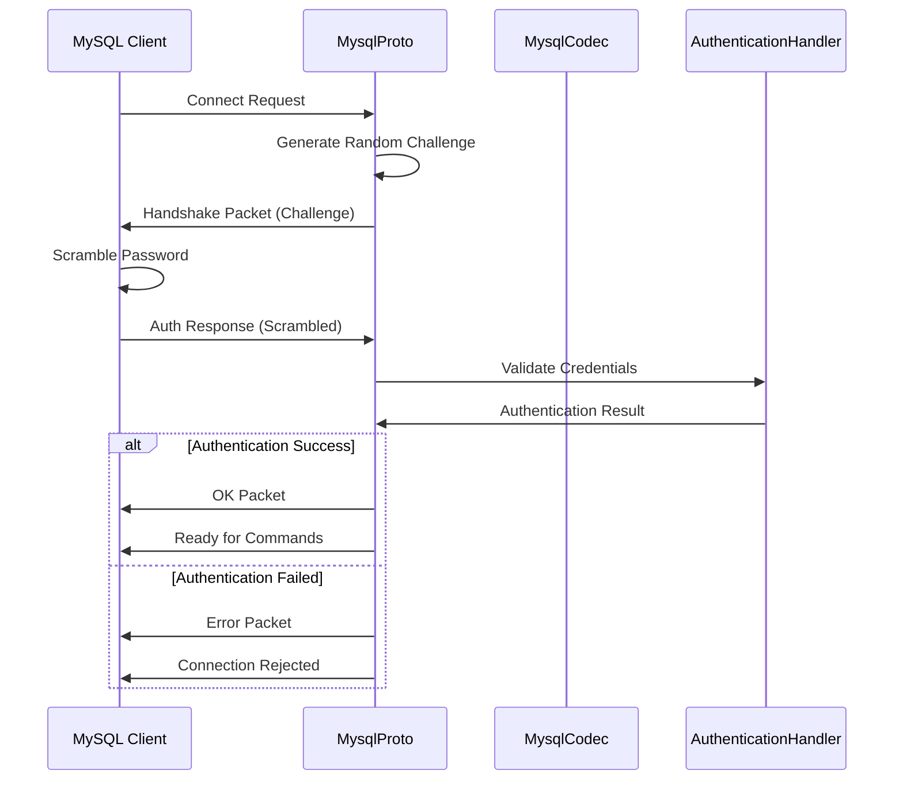

# MySQL Protocol Module Documentation

## Overview

The MySQL Protocol module is a critical component of StarRocks that implements the MySQL wire protocol, enabling MySQL-compatible clients to connect and interact with the StarRocks database system. This module provides the foundation for client-server communication, authentication, and data serialization/deserialization according to MySQL protocol specifications.

## Purpose and Scope

The MySQL Protocol module serves as the primary interface between StarRocks and MySQL-compatible clients, handling:

- **Protocol Implementation**: Complete MySQL wire protocol support for seamless client compatibility
- **Authentication Management**: Secure user authentication using MySQL-compatible authentication mechanisms
- **Data Serialization**: Conversion between StarRocks internal data types and MySQL protocol formats
- **Connection Management**: Establishment and maintenance of client connections
- **Security Integration**: Support for various authentication plugins and SSL/TLS encryption

## Architecture Overview

## Core Components

### 1. MysqlCodec
**Purpose**: Low-level protocol encoding and decoding utilities  
**Documentation**: [Protocol Encoding Details](protocol_encoding.md)

**Key Responsibilities**:
- Binary data serialization/deserialization for MySQL protocol
- Type conversion between StarRocks and MySQL formats
- Field definition encoding for result sets
- Variable-length integer encoding (VInt)
- String encoding with various termination styles

**Key Features**:
- Support for all MySQL protocol data types
- Efficient binary operations with minimal memory allocation
- Comprehensive type mapping from StarRocks to MySQL types
- Charset handling for international character sets

### 2. MysqlProto
**Purpose**: High-level protocol negotiation and connection management  
**Documentation**: [Authentication Protocol Details](authentication_protocol.md)

**Key Responsibilities**:
- MySQL handshake protocol implementation
- Client authentication negotiation
- SSL/TLS connection establishment
- Authentication plugin switching
- Connection state management

**Key Features**:
- Complete handshake protocol support
- Multi-factor authentication support
- SSL connection upgrade capability
- Authentication plugin extensibility
- Comprehensive error handling

### 3. MysqlPassword
**Purpose**: MySQL-compatible password authentication and encryption  
**Documentation**: [Password Security Details](password_security.md)

**Key Responsibilities**:
- MySQL password scrambling algorithm implementation
- SHA-1 based authentication hash generation
- Password validation and verification
- Random challenge string generation

**Key Features**:
- MySQL 4.1+ authentication protocol support
- Secure random challenge generation
- Two-stage SHA-1 hashing
- Scrambled password verification

### 4. Password (Privilege System)
**Purpose**: Password storage and management within the privilege system  
**Documentation**: [Privilege Integration Details](privilege_integration.md)

**Key Responsibilities**:
- Encrypted password storage
- Authentication plugin association
- User identity management for authentication

**Key Features**:
- Secure password serialization
- Plugin-specific user mapping
- Integration with authentication providers

## Protocol Flow

## Data Type Mapping

The MySQL Protocol module handles conversion between StarRocks internal data types and MySQL protocol types:

| StarRocks Type | MySQL Type | Protocol Code |
|----------------|------------|---------------|
| BOOLEAN | TINYINT | 0x01 |
| TINYINT | TINYINT | 0x01 |
| SMALLINT | SHORT | 0x02 |
| INT | LONG | 0x03 |
| BIGINT | LONGLONG | 0x08 |
| FLOAT | FLOAT | 0x04 |
| DOUBLE | DOUBLE | 0x05 |
| DECIMAL | NEWDECIMAL | 0xf6 |
| VARCHAR | VAR_STRING | 0xfd |
| DATE | DATE | 0x0a |
| DATETIME | DATETIME | 0x0c |

## Security Features

### Authentication Mechanisms
- **Native Authentication**: Traditional MySQL password authentication
- **Plugin-based Authentication**: Extensible authentication through plugins
- **SSL/TLS Support**: Encrypted connections for secure data transmission
- **Multi-factor Authentication**: Support for additional authentication factors

### Password Security
- **SHA-1 Hashing**: Two-stage SHA-1 password hashing
- **Challenge-Response**: Secure challenge-response authentication
- **Random Challenge**: Cryptographically secure random challenge generation
- **Password Validation**: Comprehensive password format validation

## Integration Points

### Authentication Integration
The module integrates with StarRocks authentication system through:
- [Authentication Handler](../authentication_authorization.md#authentication-management)
- [Security Integration](../authentication_authorization.md#authentication-management)
- [User Management](../frontend_server.md#authentication_authorization)

### Connection Context
Protocol operations are performed within the context of:
- [Connect Context](../query_execution.md#connection-management)
- [Session Management](../query_execution.md#session-management)
- [Global State Manager](../frontend_server.md#server_lifecycle)

## Error Handling

The module implements comprehensive error handling for:
- Protocol parsing errors
- Authentication failures
- SSL connection issues
- Unsupported authentication methods
- Network communication errors

## Performance Considerations

### Optimization Strategies
- **Buffer Reuse**: Efficient ByteBuffer management to minimize allocations
- **Streaming Operations**: Support for streaming large result sets
- **Binary Protocol**: Efficient binary protocol implementation
- **Connection Pooling**: Support for connection reuse and pooling

### Memory Management
- Minimal object creation during protocol operations
- Efficient string encoding with charset awareness
- Optimized buffer management for large data transfers

## Configuration

Key configuration options related to MySQL protocol:
- `ssl_force_secure_transport`: Enforce SSL connections
- `authentication_chain`: Authentication mechanism priority
- Connection timeout settings
- Protocol capability flags

## Future Enhancements

Planned improvements for the MySQL Protocol module:
- MySQL 8.0 protocol features
- Enhanced authentication plugin support
- Performance optimizations for high-concurrency scenarios
- Extended SSL/TLS configuration options

## Related Documentation

- [Authentication and Authorization](../authentication_authorization.md)
- [Query Execution](../query_execution.md)
- [Frontend Server](../frontend_server.md)
- [SQL Parser and Optimizer](../sql_parser_optimizer.md)