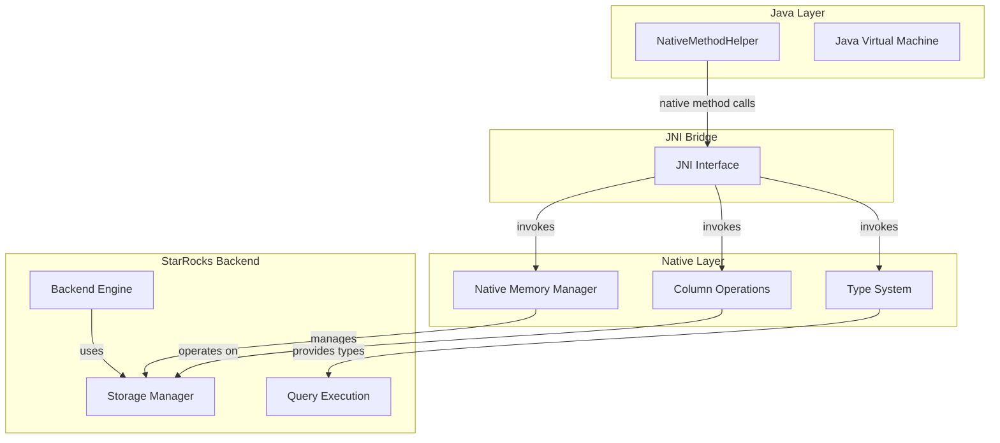
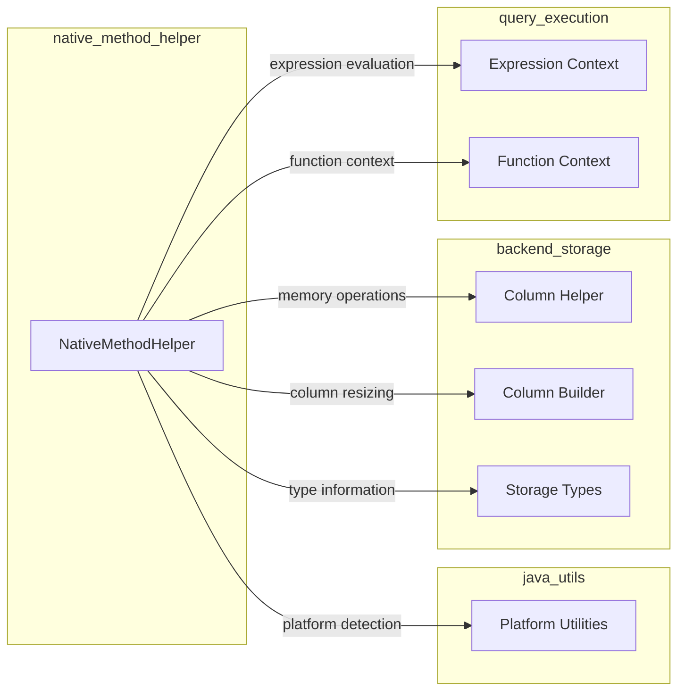
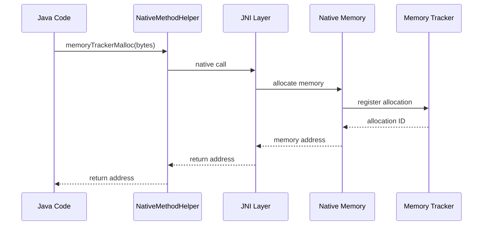
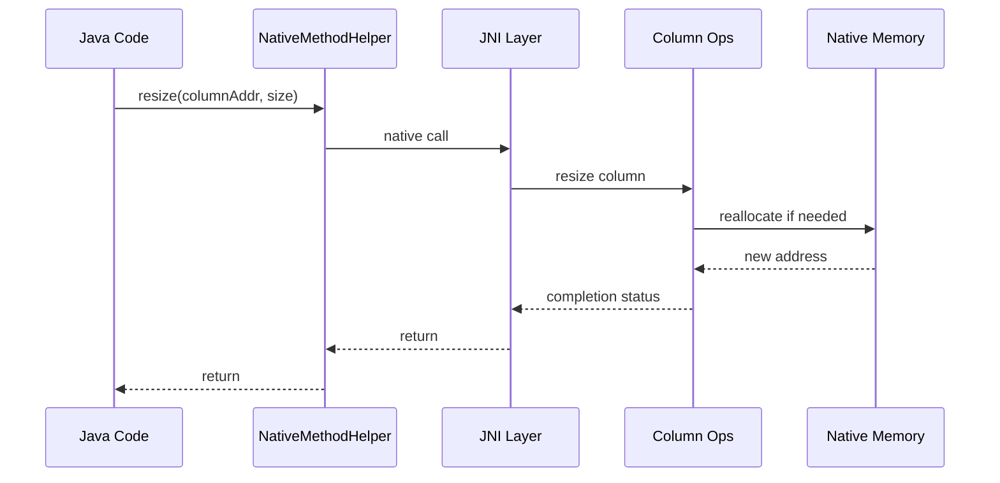

# Native Method Helper Module

## Introduction

The native_method_helper module provides a critical bridge between Java and native C++ code in the StarRocks system. This module serves as the JNI (Java Native Interface) gateway that enables Java components to interact directly with native memory management, column operations, and low-level data structures used by the StarRocks backend engine.

## Module Purpose and Core Functionality

The native_method_helper module is designed to facilitate efficient memory management and column data manipulation by providing native method bindings that Java code can invoke. It acts as a thin wrapper around native C++ implementations, offering high-performance operations that would be inefficient or impossible to implement purely in Java.

### Key Responsibilities

1. **Memory Management**: Provides tracked memory allocation and deallocation through native methods
2. **Column Data Operations**: Enables direct manipulation of column data structures in native memory
3. **Type System Integration**: Bridges Java and native type systems for seamless data exchange
4. **Performance Optimization**: Offers low-latency access to native operations bypassing JVM overhead

## Architecture and Component Relationships

### Module Architecture



### Component Dependencies



## Core Components

### NativeMethodHelper Class

The `NativeMethodHelper` class is the primary interface providing native method bindings for memory and column operations.

#### Memory Management Methods

- **`memoryTrackerMalloc(long bytes)`**: Allocates tracked memory in the native heap
- **`memoryTrackerFree(long address)`**: Frees previously allocated tracked memory
- **Purpose**: Provides memory allocation with tracking capabilities for debugging and resource management

#### Column Data Manipulation Methods

- **`resizeStringData(long columnAddr, int byteSize)`**: Resizes string data in a column
- **`resize(long columnAddr, int size)`**: Resizes column data structure
- **Purpose**: Enables dynamic resizing of column data without Java heap allocation

#### Column Information Methods

- **`getColumnLogicalType(long columnAddr)`**: Retrieves the logical type of a column
- **`getAddrs(long columnAddr)`**: Returns array containing null and data addresses
- **Purpose**: Provides access to column metadata and memory layout information

## Data Flow and Process Flows

### Memory Allocation Flow



### Column Resize Flow



## Integration with StarRocks System

### Connection to Storage Engine

The native_method_helper module integrates closely with the [storage_engine](storage_engine.md) module, particularly with:

- **Column Management**: Direct manipulation of column data structures
- **Memory Management**: Integration with storage engine's memory tracking
- **Type System**: Bridging Java and native type representations

### Connection to Query Execution

Integration with [query_execution](query_execution.md) includes:

- **Expression Evaluation**: Memory management for expression contexts
- **Function Context**: Column data access for UDF execution
- **Runtime Operations**: Dynamic memory allocation during query processing

### Connection to Java Extensions

The module is part of the broader [java_extensions](java_extensions.md) ecosystem:

- **UDF Support**: Memory management for user-defined functions
- **Connector Integration**: Column operations for external data sources
- **Platform Abstraction**: Cross-platform native method invocation

## Key Features and Benefits

### Performance Advantages

1. **Zero-Copy Operations**: Direct memory access without Java heap allocation
2. **Native Performance**: Bypass JVM overhead for memory-intensive operations
3. **Memory Efficiency**: Tracked allocation prevents memory leaks
4. **Type Safety**: Bridged type system maintains data integrity

### Safety and Reliability

1. **Memory Tracking**: All allocations are tracked for debugging
2. **Class Loader Restrictions**: Must be loaded by system class loader only
3. **Final Class Design**: Prevents inheritance-based security issues
4. **Native Method Registration**: Methods registered by JNI launcher

## Usage Patterns

### Memory Management Pattern

```java
// Allocate memory
long address = NativeMethodHelper.memoryTrackerMalloc(size);
try {
    // Use memory
    // ... operations ...
} finally {
    // Always free memory
    NativeMethodHelper.memoryTrackerFree(address);
}
```

### Column Operation Pattern

```java
// Get column information
int logicalType = NativeMethodHelper.getColumnLogicalType(columnAddr);
long[] addresses = NativeMethodHelper.getAddrs(columnAddr);

// Resize if needed
NativeMethodHelper.resize(columnAddr, newSize);
```

## Security Considerations

### Class Loader Restrictions

The module enforces strict class loader requirements:
- Must be loaded by `sun.misc.Launcher$AppClassLoader`
- Cannot be loaded by independent class loaders
- Prevents security sandbox bypasses

### Memory Safety

- All memory operations are tracked
- Native methods perform bounds checking
- Memory leaks are prevented through tracking

## Error Handling

### Native Method Failures

- Memory allocation failures throw appropriate exceptions
- Invalid addresses are detected and handled
- Type mismatches are caught at the JNI layer

### Recovery Mechanisms

- Automatic cleanup on JVM shutdown
- Memory tracking enables leak detection
- Graceful degradation for unsupported operations

## Future Enhancements

### Potential Improvements

1. **Expanded Type Support**: Additional native type conversions
2. **Performance Monitoring**: Enhanced memory usage tracking
3. **Async Operations**: Non-blocking native method calls
4. **Error Reporting**: Improved native error propagation

### Integration Opportunities

- Enhanced integration with [backend_server](backend_server.md) runtime systems
- Extended support for complex data types
- Integration with [format_support](format_support.md) for data conversion

## References

- [java_extensions](java_extensions.md) - Parent module containing native_method_helper
- [backend_server](backend_server.md) - Backend server utilizing native operations
- [storage_engine](storage_engine.md) - Storage engine with column management
- [query_execution](query_execution.md) - Query execution with expression contexts
- [format_support](format_support.md) - Format conversion utilities