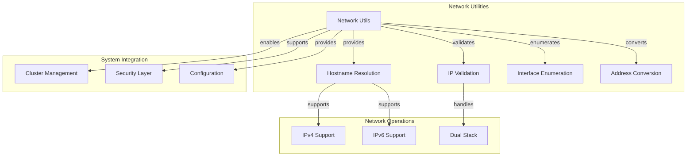

# Network Utilities Sub-module

## Overview

The Network Utilities sub-module provides comprehensive network interface management, IP address handling, and hostname resolution capabilities. It serves as the foundation for network operations, cluster communication, and network-aware system configuration.

## Core Components

### sockaddr_in6 Structure Integration

The sub-module extensively uses `sockaddr_in6` for IPv6 address handling:

```cpp
struct sockaddr_in6 {
    sa_family_t sin6_family;   // AF_INET6
    in_port_t sin6_port;       // Port number
    uint32_t sin6_flowinfo;    // IPv6 flow information
    struct in6_addr sin6_addr; // IPv6 address
    uint32_t sin6_scope_id;    // Scope ID
};
```

## Architecture



## Key Features

### 1. Hostname Resolution
- IPv4 and IPv6 hostname-to-IP conversion
- Dual-stack support with IPv4 preference
- Timeout handling for slow DNS responses
- Error handling for invalid hostnames

### 2. IP Address Validation
- IPv4 address format validation
- IPv6 address format validation
- Support for various IPv6 notations
- Loopback address detection

### 3. Network Interface Enumeration
- System network interface discovery
- IPv4 and IPv6 interface support
- Interface filtering capabilities
- Link-local address handling

### 4. Address Format Conversion
- IPv4-mapped IPv6 address support
- Network byte order handling
- Presentation format conversion
- Canonical address representation

## Implementation Details

### Hostname Resolution Process

```cpp
Status hostname_to_ip(const std::string& host, std::string& ip) {
    // 1. Try IPv4 resolution first
    Status status = hostname_to_ipv4(host, ip);
    if (status.ok()) {
        return status;
    }
    
    // 2. Fallback to IPv6 if IPv4 fails
    return hostname_to_ipv6(host, ip);
}
```

### IPv6 Address Handling

The implementation provides comprehensive IPv6 support:

```cpp
bool InetAddress::is_ipv6() const {
    return _family == AF_INET6;
}

bool InetAddress::is_loopback() const {
    if (_family == AF_INET6) {
        struct in6_addr addr;
        inet_pton(AF_INET6, _ip_addr.c_str(), &addr);
        return IN6_IS_ADDR_LOOPBACK(&addr);
    }
    // IPv4 loopback check
    return (_ip_addr.find("127.") == 0);
}
```

## Usage Patterns

### Network Interface Discovery
```cpp
// Example: Enumerate all network interfaces
std::vector<std::string> interfaces;
Status status = get_inet_interfaces(&interfaces, true); // include IPv6
if (status.ok()) {
    for (const auto& iface : interfaces) {
        LOG(INFO) << "Found interface: " << iface;
    }
}
```

### Hostname Resolution with Timeout
```cpp
// Example: Resolve hostname with performance monitoring
auto start = std::chrono::high_resolution_clock::now();
std::string ip_address;
Status status = hostname_to_ip("example.com", ip_address);
auto duration = std::chrono::duration_cast<std::chrono::milliseconds>(
    std::chrono::high_resolution_clock::now() - start);

if (duration.count() >= 500) {
    LOG(WARNING) << "DNS resolution took " << duration.count() << "ms";
}
```

### IP Address Validation
```cpp
// Example: Validate IP address format
std::string ip = "192.168.1.1";
if (is_valid_ip(ip)) {
    LOG(INFO) << "Valid IP address: " << ip;
} else {
    LOG(ERROR) << "Invalid IP address: " << ip;
}
```

## Performance Characteristics

- **Hostname Resolution**: Depends on DNS response time (typically 10-100ms)
- **IP Validation**: O(1) using inet_pton() system call
- **Interface Enumeration**: O(n) where n is the number of interfaces
- **Address Conversion**: O(1) for format conversion operations

## Error Handling

- Comprehensive DNS resolution error handling
- Graceful handling of network interface enumeration failures
- Proper error codes for different failure scenarios
- Timeout handling for slow network operations

## IPv6 Considerations

### Link-Local Address Filtering
The implementation filters out IPv6 link-local addresses (fe80::/10) as they are typically not useful for cluster communication:

```cpp
std::string addr_str(addr_buf);
boost::algorithm::to_lower(addr_str);
// Skip link-local addresses
if (addr_str.rfind("fe80", 0) == 0) {
    LOG(INFO) << "IPv6 link local address " << addr_str << " is skipped";
    continue;
}
```

### Dual-Stack Support
The module provides seamless dual-stack support with IPv4 preference for compatibility:

```cpp
// Prefer IPv4 when both IPv4 and IPv6 are available
Status hostname_to_ip(const std::string& host, std::string& ip) {
    auto status = hostname_to_ipv4(host, ip);
    if (status.ok()) {
        return status;
    }
    return hostname_to_ipv6(host, ip);
}
```

## Thread Safety

- All functions are thread-safe
- No shared mutable state
- System calls are inherently thread-safe
- Proper synchronization for shared resources

## Platform Compatibility

### Cross-Platform Support
- POSIX-compliant systems (Linux, macOS)
- Windows-specific implementations where needed
- Consistent API across platforms
- Platform-specific optimizations

### System Dependencies
- Standard socket library (sys/socket.h)
- Network interface enumeration (ifaddrs.h)
- DNS resolution (netdb.h)
- Address conversion (arpa/inet.h)

## Integration Points

The Network Utilities sub-module integrates with:
- [CIDR Processing](cidr.md) for network range validation
- Cluster management for node discovery
- Security systems for network access control
- Configuration management for network settings

This sub-module provides the essential network infrastructure capabilities that enable reliable cluster communication and network-aware operations throughout the StarRocks system.