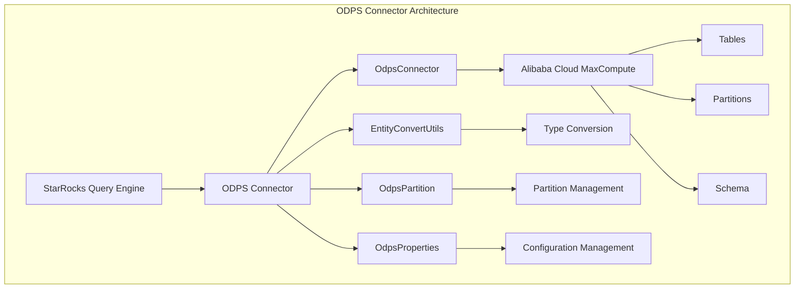
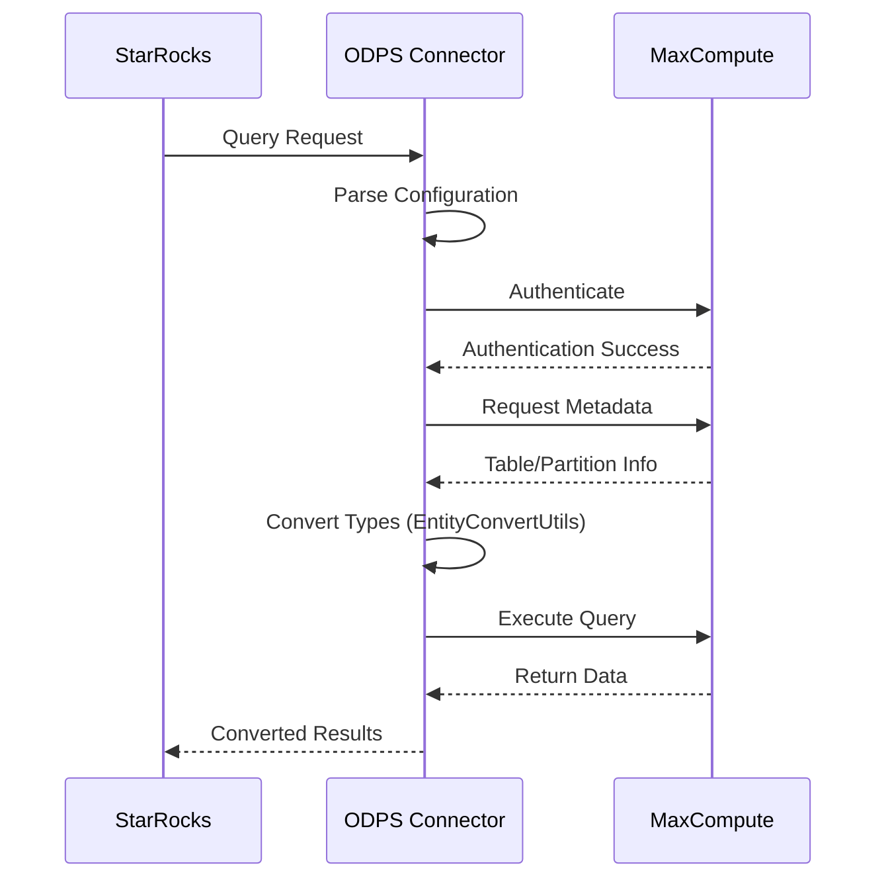

# ODPS Connector Module Documentation

## Overview

The ODPS (Open Data Processing Service) Connector module provides StarRocks with the capability to connect to and query data from Alibaba Cloud's MaxCompute (formerly ODPS) service. This connector enables seamless integration between StarRocks and MaxCompute, allowing users to perform federated queries across both systems.

## Purpose

The ODPS connector serves as a bridge between StarRocks and Alibaba Cloud MaxCompute, providing:
- **Data Federation**: Query MaxCompute tables directly from StarRocks without data migration
- **Type Mapping**: Automatic conversion between MaxCompute and StarRocks data types
- **Partition Support**: Efficient partition pruning and metadata caching
- **Authentication**: Secure connection using Alibaba Cloud credentials
- **Performance Optimization**: Configurable split policies and caching mechanisms

## Architecture



## Core Components

### 1. EntityConvertUtils
Handles the conversion between MaxCompute and StarRocks data types, ensuring seamless data type compatibility.

**Key Features:**
- Comprehensive type mapping from ODPS types to StarRocks types
- Support for complex types (Array, Map, Struct)
- Special handling for high-precision decimals
- Schema extraction from ODPS tables

**Supported Type Conversions:**
- Primitive types: BIGINT, INT, SMALLINT, TINYINT, FLOAT, DOUBLE, BOOLEAN, DATE, TIMESTAMP
- String types: CHAR, VARCHAR, STRING, JSON
- Binary types: BINARY
- Complex types: ARRAY, MAP, STRUCT
- Decimal handling with precision > 38 converted to STRING

**Detailed Documentation**: [Type Conversion](type_conversion.md)

### 2. OdpsConnector
The main connector implementation that manages the connection to MaxCompute service.

**Key Features:**
- Authentication using Alibaba Cloud credentials
- Connection lifecycle management
- Metadata provider integration
- Error handling and logging

**Configuration Requirements:**
- Access ID and Access Key for authentication
- Endpoint URL for MaxCompute service
- Default project name
- Tunnel endpoint for data transfer

**Detailed Documentation**: [Connector Core](connector_core.md)

### 3. OdpsPartition
Manages partition information for MaxCompute tables, enabling efficient partition pruning.

**Key Features:**
- Partition metadata extraction
- Last modified time tracking
- Integration with StarRocks partition framework

**Detailed Documentation**: [Partition Management](partition_management.md)

### 4. OdpsProperties
Comprehensive configuration management for the ODPS connector.

**Key Configuration Categories:**
- **Authentication**: Access credentials and endpoints
- **Performance**: Split policies and row count settings
- **Caching**: Table, partition, and metadata caching options
- **Tunnel**: Data transfer configuration

**Detailed Documentation**: [Configuration Management](configuration_management.md)

## Data Flow



## Configuration

### Required Properties
```properties
odps.access.id=your_access_id
odps.access.key=your_access_key
odps.endpoint=https://service.odps.aliyun.com/api
odps.project=your_project_name
odps.tunnel.quota=your_tunnel_quota
```

### Optional Properties
```properties
# Split Configuration
odps.split.policy=SIZE|ROW_COUNT
odps.split.row.count=4194304

# Caching Configuration
odps.cache.table.enable=true
odps.cache.table.expire=86400
odps.cache.table.size=1000
odps.cache.partition.enable=true
odps.cache.partition.expire=86400
odps.cache.partition.size=1000

# Tunnel Configuration
odps.tunnel.endpoint=https://dt.odps.aliyun.com
```

## Integration Points

### With Connector Framework
The ODPS connector integrates with StarRocks' unified connector framework, providing:
- Standardized connector interface
- Metadata management integration
- Query planning optimization
- Credential management

### With Type System
Through EntityConvertUtils, the connector ensures:
- Type safety across systems
- Automatic type inference
- Complex type support
- Precision handling for numeric types

## Performance Considerations

### Caching Strategy
- **Table Metadata Cache**: Reduces repeated metadata requests
- **Partition Cache**: Improves partition pruning efficiency
- **Configurable TTL**: Balance between freshness and performance

### Split Optimization
- **Size-based Splitting**: Default policy for balanced workload
- **Row Count Splitting**: Alternative for uniform data distribution
- **Configurable Split Size**: Tune based on data characteristics

### Network Optimization
- **Tunnel Endpoint**: Dedicated data transfer channel
- **Connection Pooling**: Reuse connections for better throughput
- **Compression**: Enable for large data transfers

## Error Handling

### Authentication Errors
- Invalid credentials detection
- Endpoint connectivity issues
- Permission validation

### Data Type Errors
- Unsupported type handling
- Precision overflow management
- Complex type conversion failures

### Network Errors
- Connection timeout handling
- Retry mechanisms
- Fallback strategies

## Security

### Credential Management
- Secure storage of access keys
- Credential rotation support
- Minimal privilege principle

### Data Security
- Encrypted data transfer
- Network isolation options
- Audit logging capabilities

## Monitoring and Observability

### Metrics
- Connection establishment time
- Query execution latency
- Data transfer throughput
- Cache hit rates

### Logging
- Authentication events
- Configuration validation
- Query execution details
- Error conditions

## Best Practices

### Configuration
1. Use dedicated tunnel endpoints for production
2. Enable appropriate caching based on data freshness requirements
3. Configure split policies based on data size and distribution
4. Set proper cache TTL values

### Performance
1. Partition large tables for better pruning
2. Use appropriate split sizes for optimal parallelism
3. Monitor cache hit rates and adjust sizes
4. Consider network latency when setting timeouts

### Security
1. Use IAM roles instead of access keys when possible
2. Regularly rotate access credentials
3. Enable audit logging for sensitive data access
4. Follow principle of least privilege

## Related Documentation

- [Connector Framework](connector_framework.md) - Unified connector architecture
- [Type System](type_system.md) - Data type handling across connectors
- [Partition Management](partition_management.md) - Partition strategies and optimization
- [Credential Management](credential_management.md) - Secure credential handling
- [Performance Tuning](performance_tuning.md) - Optimization strategies

## Troubleshooting

### Common Issues
1. **Authentication Failures**: Verify access credentials and endpoints
2. **Type Conversion Errors**: Check data type compatibility
3. **Performance Issues**: Review split configuration and caching settings
4. **Connection Timeouts**: Adjust network timeout parameters

### Debug Steps
1. Enable debug logging for connector operations
2. Verify network connectivity to MaxCompute endpoints
3. Check credential permissions and project access
4. Validate data type mappings for complex schemas