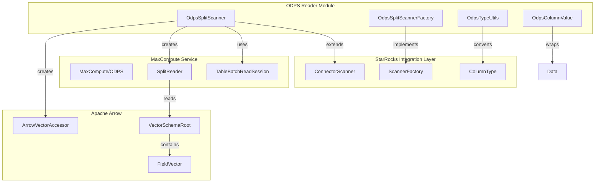
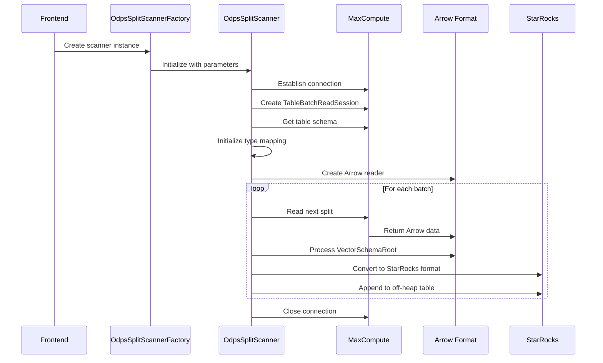

# ODPS Reader Module Documentation

## Overview

The ODPS (Open Data Processing Service) Reader module is a specialized connector component within the StarRocks ecosystem designed to facilitate efficient data reading from Alibaba Cloud's MaxCompute (formerly ODPS) service. This module provides seamless integration between StarRocks and MaxCompute, enabling users to query and analyze data stored in MaxCompute tables directly through StarRocks.

## Purpose and Core Functionality

The ODPS Reader module serves as a bridge between StarRocks and Alibaba Cloud MaxCompute, offering:

- **High-performance data scanning**: Optimized for reading large-scale datasets from MaxCompute
- **Columnar data access**: Supports projection pushdown to read only required columns
- **Split-based parallel processing**: Enables distributed data reading across multiple nodes
- **Arrow format integration**: Utilizes Apache Arrow for efficient columnar data transfer
- **Type system compatibility**: Handles data type conversion between MaxCompute and StarRocks

## Architecture Overview

## Module Structure

The ODPS Reader module consists of several key components organized into logical sub-modules:

### Core Components

1. **[OdpsSplitScanner](scanner_core.md)** - Main scanner implementation responsible for reading data splits from MaxCompute
2. **[OdpsSplitScannerFactory](scanner_factory.md)** - Factory class for creating scanner instances with proper class loading
3. **OdpsTypeUtils** - Utility class for data type conversion between MaxCompute and StarRocks
4. **OdpsColumnValue** - Wrapper class for column values with type information

### Data Flow Architecture

## Key Features

### 1. Split-Based Parallel Processing
The module supports two split policies:
- **Size-based splits**: Uses `IndexedInputSplit` for uniform data distribution
- **Row-range splits**: Uses `RowRangeInputSplit` for precise row control

### 2. Column Projection
- Supports reading only required columns to minimize data transfer
- Automatic column reordering to match StarRocks requirements
- Efficient column mapping through name-based indexing

### 3. Type System Integration
- Comprehensive type conversion between MaxCompute and StarRocks types
- Timezone-aware datetime handling
- Null value support with proper type information

### 4. Compression and Performance
- ZSTD compression support for efficient data transfer
- Configurable batch sizes for optimal memory usage
- Off-heap memory management for large datasets

## Configuration and Parameters

The scanner accepts the following key parameters:

| Parameter | Description | Required |
|-----------|-------------|----------|
| project_name | MaxCompute project name | Yes |
| table_name | Table name within the project | Yes |
| required_fields | Comma-separated list of columns to read | Yes |
| split_policy | Split strategy ("size" or "row_offset") | Yes |
| session_id | Read session identifier | Yes |
| endpoint | MaxCompute service endpoint | Yes |
| access_id | Alibaba Cloud access key ID | Yes |
| access_key | Alibaba Cloud access key secret | Yes |
| tunnel_endpoint | Tunnel service endpoint (optional) | No |
| quota_name | Compute quota name (optional) | No |
| time_zone | Timezone for datetime conversion | Yes |

## Error Handling and Logging

The module implements comprehensive error handling:
- **Connection failures**: Proper cleanup and resource management
- **Data conversion errors**: Detailed error messages with context
- **Serialization issues**: Base64 decoding and object deserialization safety
- **Resource leaks**: Automatic cleanup in try-with-resources blocks

## Integration with StarRocks

The ODPS Reader integrates seamlessly with StarRocks through:

1. **ConnectorScanner Interface**: Standardized interface for all external data sources
2. **JNI Integration**: Native Java interface for high-performance data transfer
3. **ClassLoader Isolation**: Separate class loading to avoid dependency conflicts
4. **Off-heap Memory Management**: Direct memory access for optimal performance

## Performance Considerations

### Optimization Strategies
- **Batch processing**: Configurable batch sizes to balance memory usage and throughput
- **Columnar access**: Arrow format minimizes data serialization overhead
- **Parallel execution**: Multiple scanner instances can process splits concurrently
- **Compression**: ZSTD compression reduces network bandwidth usage

### Resource Management
- **Memory limits**: Configurable fetch sizes to prevent memory exhaustion
- **Connection pooling**: Reuse of MaxCompute connections where possible
- **Cleanup procedures**: Proper resource disposal to prevent leaks

## Security and Authentication

The module supports Alibaba Cloud's standard authentication mechanisms:
- **Access Key authentication**: Using access_id and access_key parameters
- **Endpoint security**: HTTPS endpoints for secure data transfer
- **Credential isolation**: Separate credential management per scanner instance

## Dependencies and External Libraries

The module relies on several key external libraries:
- **Alibaba Cloud ODPS SDK**: For MaxCompute service interaction
- **Apache Arrow**: For columnar data representation
- **StarRocks JNI Connector**: For integration with StarRocks runtime

## Future Enhancements

Potential areas for future development:
- **Predicate pushdown**: Support for filtering at the MaxCompute level
- **Partition pruning**: Intelligent partition selection based on query predicates
- **Statistics integration**: Leveraging MaxCompute table statistics for query optimization
- **Incremental reading**: Support for change data capture (CDC) scenarios

## Related Documentation

For more information about related components:
- [Connector Framework](../connectors.md) - General connector architecture
- [Java Extensions](../java_extensions.md) - Java extension framework overview
- [Scanner Interface](../connectors.md#scanner-interface) - Standard scanner interface documentation