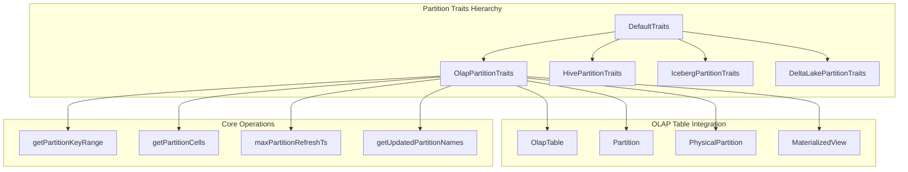
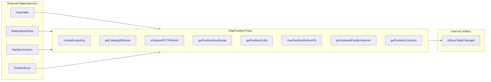
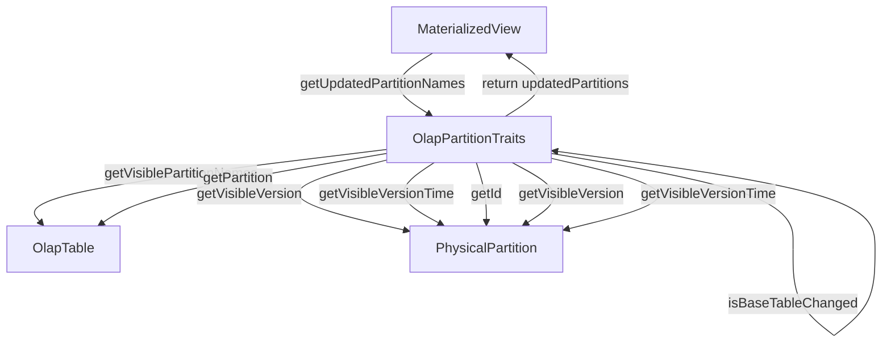
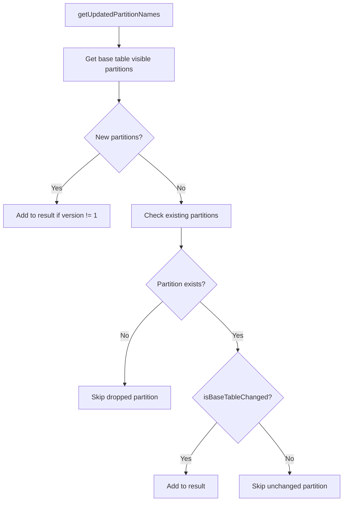
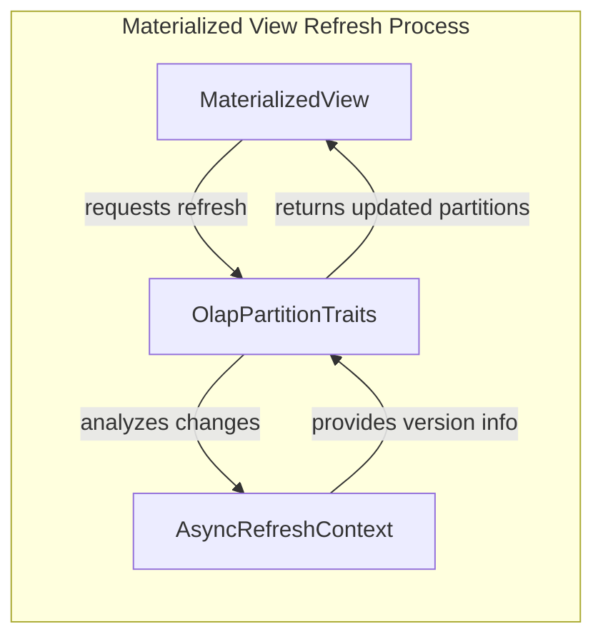
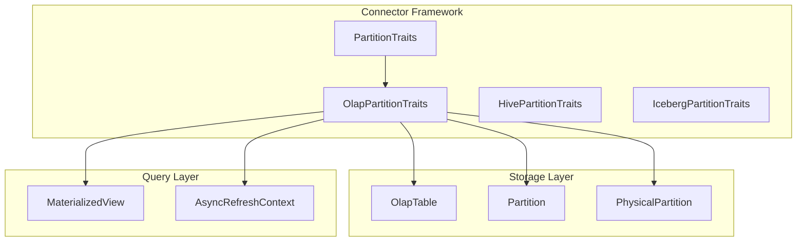

# OLAP Partition Traits Module

## Introduction

The OLAP Partition Traits module provides specialized partition management capabilities for OLAP (Online Analytical Processing) tables within the StarRocks connector framework. This module implements the `OlapPartitionTraits` class, which extends `DefaultTraits` to provide OLAP-specific partition operations, refresh mechanisms, and partition change detection for materialized views.

The module serves as a critical component in the partition traits hierarchy, enabling efficient partition management, incremental refresh capabilities, and change tracking for OLAP tables in the StarRocks ecosystem.

## Architecture Overview



## Core Components

### OlapPartitionTraits Class

The `OlapPartitionTraits` class is the primary component that provides OLAP-specific partition management functionality. It extends the base `DefaultTraits` class and implements specialized methods for handling OLAP table partitions.

**Key Characteristics:**
- Supports Partial Change Tracking (PCT) refresh for materialized views
- Provides partition key range management for range-partitioned tables
- Implements partition change detection and tracking
- Handles partition cell extraction and management

**Core Dependencies:**
- `OlapTable`: The underlying OLAP table structure
- `Partition`: Individual partition management
- `PhysicalPartition`: Physical partition representation
- `MaterializedView`: Materialized view refresh context
- `PartitionKey`: Partition key handling

## Component Relationships



## Data Flow Architecture



## Key Functionalities

### 1. Partition Key Range Management

The module provides specialized handling for range-partitioned OLAP tables:

```java
public Map<String, Range<PartitionKey>> getPartitionKeyRange(Column partitionColumn, Expr partitionExpr) {
    if (!((OlapTable) table).getPartitionInfo().isRangePartition()) {
        throw new IllegalArgumentException("Must be range partitioned table");
    }
    return ((OlapTable) table).getRangePartitionMap();
}
```

**Process Flow:**
1. Validates that the table uses range partitioning
2. Retrieves the range partition map from the OLAP table
3. Returns mapping of partition names to their key ranges

### 2. Partition Cell Extraction

Extracts partition cells for specified partition columns:

```java
public Map<String, PCell> getPartitionCells(List<Column> partitionColumns) {
    return ((OlapTable) table).getPartitionCells(Optional.of(partitionColumns));
}
```

### 3. Maximum Partition Refresh Timestamp

Determines the latest refresh timestamp across all physical partitions:

```java
public Optional<Long> maxPartitionRefreshTs() {
    OlapTable olapTable = (OlapTable) table;
    return olapTable.getPhysicalPartitions().stream()
            .map(PhysicalPartition::getVisibleVersionTime)
            .max(Long::compareTo);
}
```

### 4. Updated Partition Detection

Implements sophisticated logic to detect partitions that need refresh:



### 5. Base Table Change Detection

The `isBaseTableChanged` method implements the core change detection logic:

```java
public static boolean isBaseTableChanged(Partition partition,
                                         MaterializedView.BasePartitionInfo mvRefreshedPartitionInfo) {
    return mvRefreshedPartitionInfo.getId() != partition.getId()
            || partition.getDefaultPhysicalPartition().getVisibleVersion() != mvRefreshedPartitionInfo.getVersion()
            || partition.getDefaultPhysicalPartition().getVisibleVersionTime()
            > mvRefreshedPartitionInfo.getLastRefreshTime();
}
```

**Change Detection Criteria:**
- Partition ID mismatch
- Visible version difference
- Visible version time newer than last refresh time

## Integration with Materialized Views

The module plays a crucial role in materialized view refresh optimization:



## Error Handling and Limitations

### Unsupported Operations

The module explicitly throws `NotImplementedException` for certain operations:
- `createEmptyKey()`: Not supported for OLAP tables
- `getCatalogDBName()`: Not supported for OLAP tables

### Validation Requirements

- Range partition validation in `getPartitionKeyRange()`
- Partition existence checks in change detection
- Version consistency validation

## Performance Considerations

### Optimization Strategies

1. **Stream-based Processing**: Uses Java streams for efficient partition processing
2. **Early Filtering**: Skips dropped partitions early in the process
3. **Version-based Comparison**: Leverages version numbers for efficient change detection

### Logging and Debugging

The module includes comprehensive debug logging:
- Base table partition information
- Version and timestamp details
- Change detection results

## Dependencies and Interactions

### Related Modules

- **[partition_traits](partition_traits.md)**: Parent module containing all partition trait implementations
- **[olap_table](olap_table.md)**: Core OLAP table management
- **[materialized_view](materialized_view.md)**: Materialized view refresh mechanisms
- **[partition](partition.md)**: Base partition management

### Integration Points



## Configuration and Usage

### Typical Usage Pattern

```java
// Create OLAP partition traits instance
OlapPartitionTraits traits = new OlapPartitionTraits();

// Get updated partitions for materialized view refresh
Set<String> updatedPartitions = traits.getUpdatedPartitionNames(
    baseTables, 
    asyncRefreshContext
);

// Get partition key ranges for range-partitioned tables
Map<String, Range<PartitionKey>> ranges = traits.getPartitionKeyRange(
    partitionColumn, 
    partitionExpr
);
```

### Configuration Considerations

- Ensure proper OLAP table configuration
- Configure appropriate partition columns
- Set up materialized view refresh contexts
- Enable debug logging for troubleshooting

## Future Enhancements

### Potential Improvements

1. **Enhanced Change Detection**: More sophisticated algorithms for detecting partition changes
2. **Performance Optimization**: Caching mechanisms for frequently accessed partition information
3. **Extended Partition Support**: Support for additional partition types beyond range partitioning
4. **Better Error Handling**: More granular error types and recovery mechanisms

### Scalability Considerations

- Handle large numbers of partitions efficiently
- Optimize memory usage for partition metadata
- Support distributed partition management
- Implement partition pruning optimizations

## Conclusion

The OLAP Partition Traits module provides essential functionality for managing OLAP table partitions within the StarRocks connector framework. Its sophisticated change detection mechanisms, support for partial refresh operations, and integration with materialized views make it a critical component for efficient data warehouse operations. The module's design enables scalable partition management while maintaining consistency and performance across the StarRocks ecosystem.