# Optimizer Module Documentation

## Introduction

The optimizer module is the core component of StarRocks' SQL query optimization engine. It transforms parsed SQL statements into efficient execution plans by applying cost-based optimization techniques, rule-based transformations, and statistical analysis. The module serves as the bridge between the SQL parser/analyzer and the query execution engine, ensuring optimal query performance across distributed environments.

## Architecture Overview

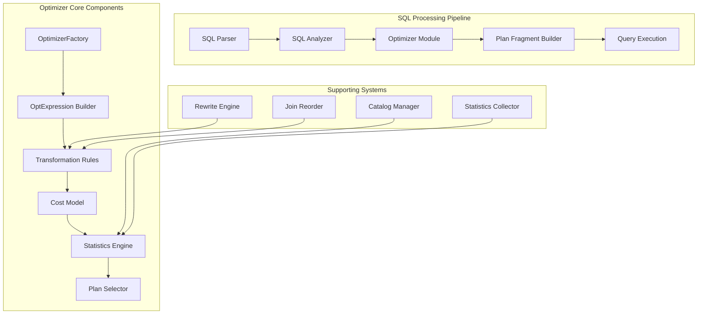

## Core Components

### 1. Optimizer Factory and Expression Building

The optimizer module provides a factory pattern for creating optimizer instances and building logical expressions:

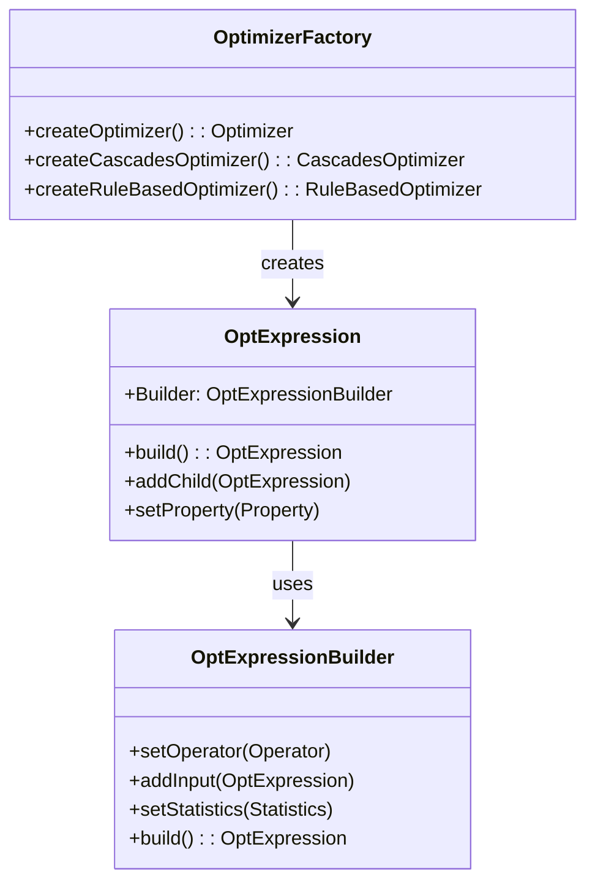

**Key Components:**
- `OptimizerFactory.OptimizerFactory`: Creates appropriate optimizer instances based on query characteristics
- `OptExpression.Builder`: Builds logical expression trees representing query operations
- `PropertyDeriverBase.PropertyDeriverBase`: Derives properties for logical expressions

### 2. Cost Model and Statistics

The cost model evaluates different execution strategies using statistical information:

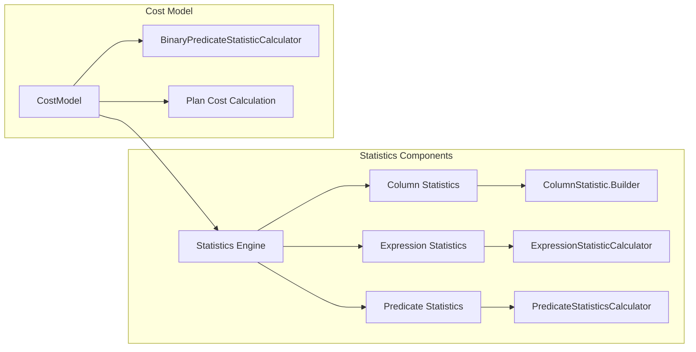

**Key Components:**
- `CostModel.CostModel`: Main cost evaluation engine for execution plans
- `Statistics.Statistics`: Statistical information about data distribution
- `ColumnStatistic.Builder`: Builder for column-level statistics
- `BinaryPredicateStatisticCalculator.BinaryPredicateStatisticCalculator`: Calculates statistics for binary predicates
- `ExpressionStatisticCalculator.ExpressionStatisticCalculator`: Computes statistics for expressions
- `PredicateStatisticsCalculator.PredicateStatisticsCalculator`: Evaluates predicate selectivity

### 3. Operator System

The operator system defines logical and physical operators for query representation:

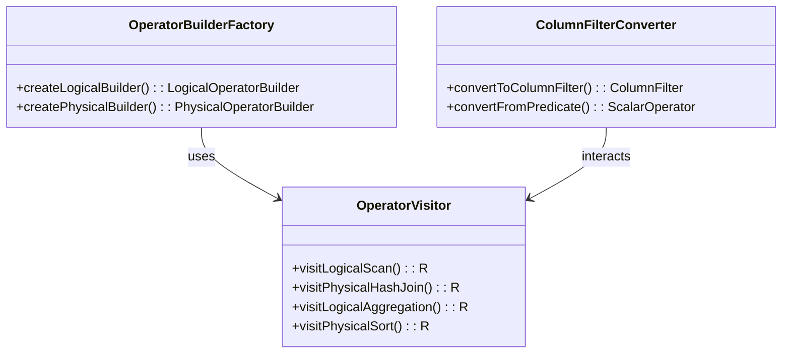

**Key Components:**
- `OperatorBuilderFactory.OperatorBuilderFactory`: Creates builders for different operator types
- `OperatorVisitor.OperatorVisitor`: Visitor pattern for operator traversal and processing
- `ColumnFilterConverter.ColumnFilterConverter`: Converts between different filter representations

### 4. Rule-Based Optimization

Transformation rules optimize logical plans through pattern matching and rewriting:

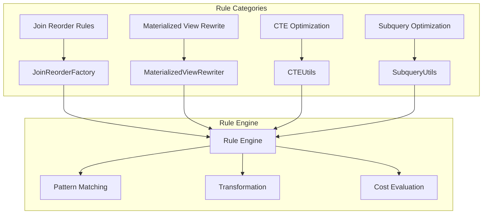

**Key Components:**
- `JoinReorderFactory.JoinReorderFactory`: Manages join reordering strategies
- `MaterializedViewRewriter.MaterializedViewRewriter`: Rewrites queries using materialized views
- `CTEUtils.CTEUtils`: Optimizes Common Table Expressions
- `SubqueryUtils.SubqueryUtils`: Handles subquery optimization
- `ConstantOperatorUtils.ConstantOperatorUtils`: Manages constant folding and propagation

### 5. Plan Enumeration and Selection

The optimizer explores the plan space and selects the optimal execution strategy:

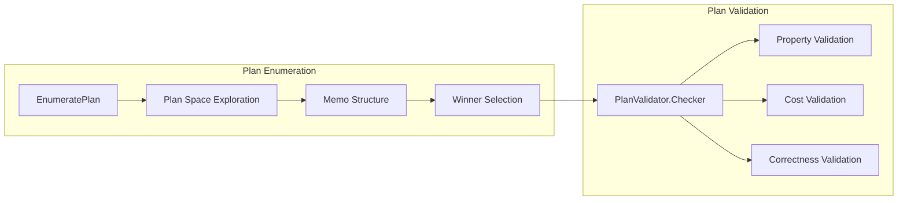

**Key Components:**
- `EnumeratePlan.EnumeratePlan`: Systematically explores the plan space
- `PlanValidator.Checker`: Validates generated execution plans
- `TaskContext.TaskContext`: Provides context for optimization tasks

### 6. Utility Components

Supporting utilities for optimization processes:

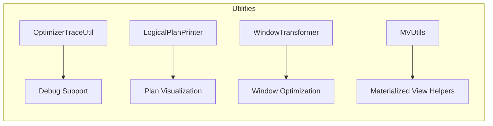

**Key Components:**
- `OptimizerTraceUtil.OptimizerTraceUtil`: Provides optimization tracing and debugging
- `LogicalPlanPrinter.LogicalPlanPrinter`: Prints logical plans for analysis
- `WindowTransformer.WindowTransformer`: Optimizes window functions
- `MVUtils.MVUtils`: Utilities for materialized view optimization

## Data Flow Architecture

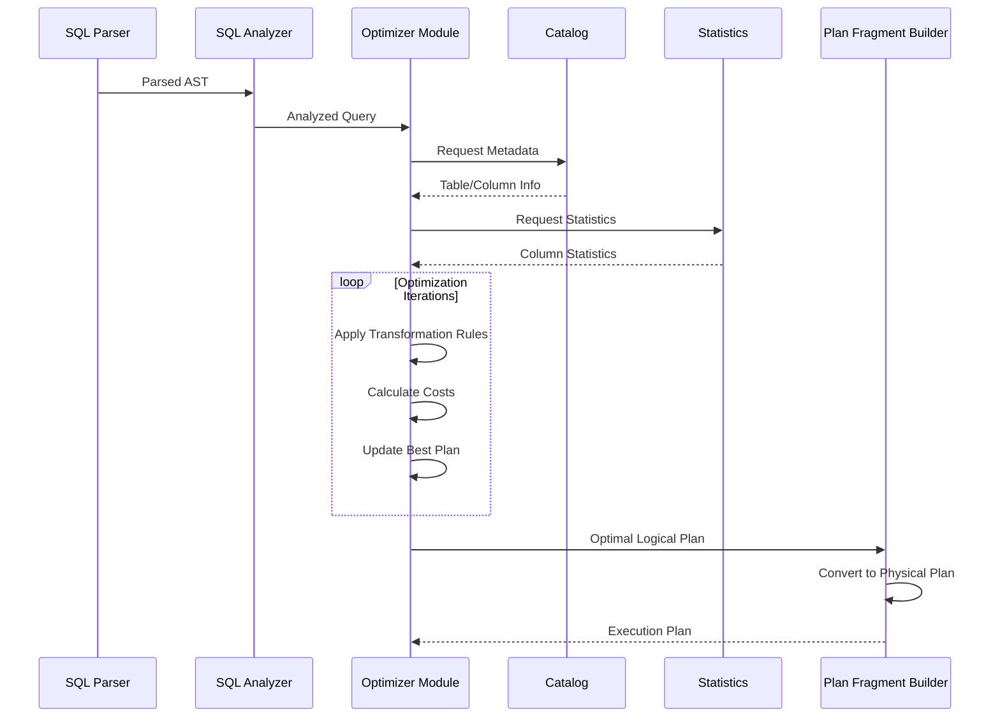

## Integration with Other Modules

### 1. Parser and Analyzer Integration

The optimizer receives analyzed query structures from the [parser](parser.md) and [analyzer](analyzer.md) modules:

- **Input**: Logical query representation with resolved tables, columns, and expressions
- **Output**: Optimized logical plan ready for physical planning
- **Coordination**: Shares expression contexts and metadata with analyzer components

### 2. Statistics Integration

Deep integration with the [statistics](statistics.md) module for cost-based decisions:

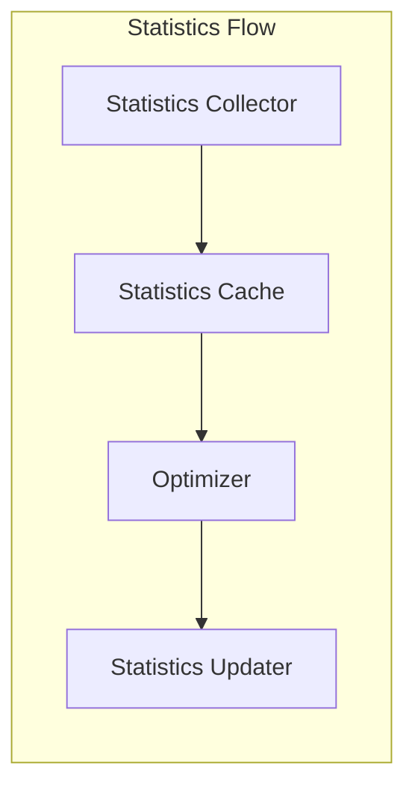

### 3. Catalog Integration

Relies on [catalog](catalog.md) for metadata and schema information:

- Table structure and partitioning information
- Index and constraint definitions
- Data distribution and storage format details

### 4. Execution Integration

Interfaces with [query execution](query_execution.md) through the planner:

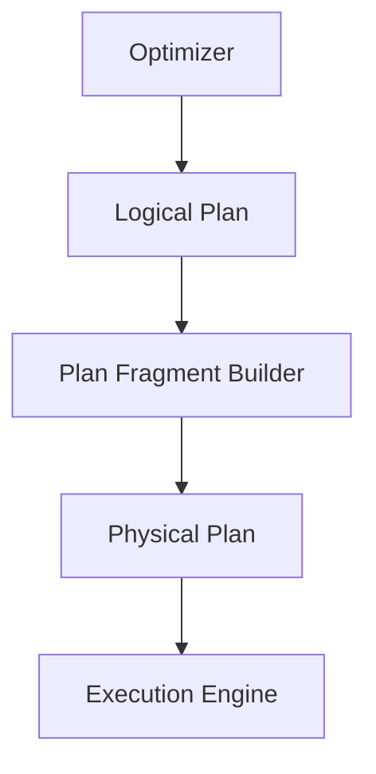

## Optimization Process Flow

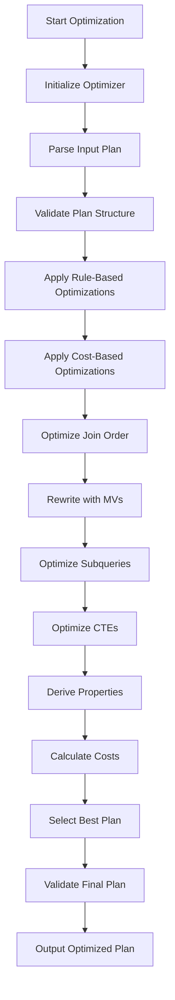

## Key Features

### 1. Cost-Based Optimization
- Sophisticated cost model considering CPU, memory, and I/O costs
- Statistical analysis for cardinality estimation
- Adaptive optimization based on runtime feedback

### 2. Rule-Based Transformation
- Extensive set of transformation rules
- Pattern matching for plan optimization
- Heuristic optimizations for common patterns

### 3. Advanced Join Optimization
- Multi-table join reordering
- Bushy tree exploration
- Join algorithm selection based on data characteristics

### 4. Materialized View Rewrite
- Automatic query rewriting using materialized views
- Partial and complete rewrite capabilities
- Incremental maintenance support

### 5. Distributed Optimization
- Partition-aware optimization
- Network cost consideration
- Parallel execution planning

## Performance Considerations

### 1. Optimization Time vs. Execution Time
- Configurable optimization timeout
- Progressive optimization for complex queries
- Plan caching for repeated queries

### 2. Memory Management
- Bounded memory usage during optimization
- Efficient data structures for plan representation
- Garbage collection optimization

### 3. Concurrency
- Thread-safe optimization for concurrent queries
- Resource isolation between optimization tasks
- Priority-based optimization scheduling

## Configuration and Tuning

### 1. Optimization Levels
- **Rule-based only**: Fast optimization for simple queries
- **Cost-based**: Full optimization with statistics
- **Adaptive**: Runtime feedback integration

### 2. Statistics Management
- Automatic statistics collection
- Manual statistics update
- Statistics approximation for large datasets

### 3. Rule Configuration
- Enable/disable specific transformation rules
- Rule priority configuration
- Custom rule development support

## Monitoring and Debugging

### 1. Optimization Tracing
- Detailed optimization step logging
- Plan transformation visualization
- Cost calculation debugging

### 2. Performance Metrics
- Optimization time tracking
- Plan quality assessment
- Rule effectiveness analysis

### 3. Troubleshooting Tools
- Plan comparison utilities
- Statistics validation tools
- Optimization hint system

## Future Enhancements

### 1. Machine Learning Integration
- ML-based cardinality estimation
- Adaptive cost model tuning
- Query performance prediction

### 2. Advanced Optimization Techniques
- Genetic algorithms for complex queries
- Simulated annealing for plan exploration
- Reinforcement learning for optimization decisions

### 3. Cloud-Native Optimization
- Serverless optimization capabilities
- Elastic resource utilization
- Multi-cloud optimization strategies

## References

- [Parser Module](parser.md) - SQL parsing and initial AST generation
- [Analyzer Module](analyzer.md) - Semantic analysis and query validation
- [Statistics Module](statistics.md) - Statistical information management
- [Catalog Module](catalog.md) - Metadata and schema management
- [Query Execution](query_execution.md) - Physical plan execution
- [Planner Module](planner.md) - Physical plan generation