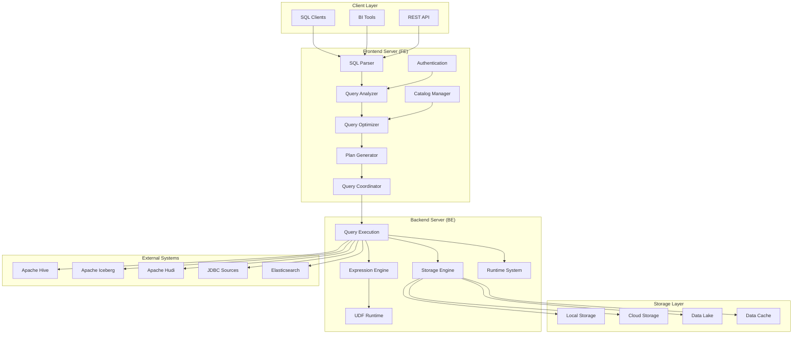

# StarRocks Repository Overview

## Purpose

StarRocks is a next-generation, massively parallel processing (MPP) analytical database designed for high-performance, real-time analytics. It provides a unified platform for both batch and streaming data processing, supporting both cloud-native and on-premises deployments. The repository contains the complete implementation of StarRocks, including the frontend server, backend server, storage engine, query execution engine, SQL parser and optimizer, connector framework, and supporting utilities.

## End-to-End Architecture

## Core Modules

### 1. Frontend Server (`frontend_server`)
The frontend server is the central coordination layer that handles client connections, SQL parsing, query optimization, metadata management, and cluster coordination. It provides multiple service interfaces including MySQL protocol compatibility, HTTP/REST APIs, and Arrow Flight SQL support.

**Key Components:**
- **Catalog Management**: Table schemas, partitions, indexes, and metadata
- **Authentication & Authorization**: Multi-method security framework
- **Query Coordination**: Distributed query planning and execution orchestration
- **High Availability**: Leader election and metadata replication

### 2. Backend Server (`backend_server`)
The backend server is the computational engine that executes query plans, manages data storage operations, and provides runtime services. It implements vectorized query processing, columnar storage management, and distributed execution capabilities.

**Key Components:**
- **Query Execution**: Vectorized processing with SIMD optimizations
- **Storage Engine**: Columnar storage with compression and indexing
- **Expression System**: Comprehensive SQL expression evaluation
- **Runtime Management**: Fragment lifecycle and resource coordination

### 3. Storage Engine (`storage_engine`)
The storage engine manages physical data storage, providing efficient data organization, indexing, and retrieval capabilities. It supports both local and cloud-native storage with advanced features like MVCC, compression, and predicate pushdown.

**Key Components:**
- **Lake Storage**: Cloud-native storage layer for data lake integration
- **Rowset Management**: Data organization and versioning
- **Data Compaction**: Storage optimization and cleanup
- **Indexing**: Multiple index types for query acceleration

### 4. Query Execution (`query_execution`)
The query execution module orchestrates distributed query processing across the cluster, managing query fragments, coordinating resources, and aggregating results from multiple backend nodes.

**Key Components:**
- **Query Coordination**: Fragment scheduling and execution management
- **Backend Selection**: Intelligent resource allocation
- **Session Management**: Connection handling and variable management
- **Performance Monitoring**: Query profiling and statistics collection

### 5. SQL Parser & Optimizer (`sql_parser_optimizer`)
This module transforms SQL text into optimized execution plans through parsing, semantic analysis, cost-based optimization, and physical plan generation.

**Key Components:**
- **Parser**: SQL text to Abstract Syntax Tree conversion
- **Analyzer**: Semantic validation and type checking
- **Optimizer**: Cost-based and rule-based optimization
- **Planner**: Logical to physical plan transformation

### 6. Connectors (`connectors`)
The connector framework provides unified access to external data sources including data lakes, databases, and cloud storage systems without data migration.

**Key Components:**
- **Unified Connector**: Single interface for multiple data sources
- **Data Lake Connectors**: Hive, Iceberg, Delta Lake, Hudi support
- **Database Connectors**: JDBC bridge for relational databases
- **Cloud Storage**: Direct integration with cloud object stores

### 7. Java Extensions (`java_extensions`)
Java-based extensions provide specialized connectors, data readers, and UDF capabilities, bridging StarRocks' C++ backend with Java ecosystems.

**Key Components:**
- **Data Readers**: Format-specific readers for external systems
- **UDF Framework**: Multi-language user-defined function support
- **Infrastructure**: JNI integration and utility services

### 8. Format Support (`format_support`)
The format support module enables bidirectional conversion between Apache Arrow and StarRocks native formats, facilitating integration with external data processing frameworks.

**Key Components:**
- **Format Conversion**: Arrow to StarRocks chunk conversion
- **I/O Operations**: Standardized format reading and writing
- **JNI Integration**: Cross-language interoperability

### 9. System Utilities (`system_utilities`)
Low-level system services provide compression, memory management, threading, and utility functions that support all other modules.

**Key Components:**
- **Compression**: Multiple algorithm support for data optimization
- **System Information**: Hardware detection and metrics collection
- **Threading**: Advanced concurrency and resource management
- **Utilities**: JSON processing, network, and debugging tools

## Key Features

### Performance
- **Vectorized Execution**: SIMD-optimized query processing
- **Columnar Storage**: Compressed columnar format with indexing
- **Distributed Processing**: MPP architecture with linear scalability
- **Runtime Optimization**: Adaptive execution based on data characteristics

### Scalability
- **Horizontal Scaling**: Multi-node cluster support
- **Resource Management**: Warehouse-based resource isolation
- **Dynamic Configuration**: Runtime parameter adjustment
- **Cloud-Native**: Kubernetes and cloud platform integration

### Compatibility
- **SQL Standards**: ANSI SQL compliance with extensions
- **MySQL Protocol**: Wire compatibility with MySQL clients
- **Multiple Formats**: Native support for Parquet, ORC, Arrow
- **External Systems**: Integration with major data platforms

### Reliability
- **High Availability**: Automatic failover and recovery
- **ACID Transactions**: Full transaction support
- **Data Consistency**: Strong consistency guarantees
- **Monitoring**: Comprehensive observability and alerting

## References

For detailed documentation of individual modules, refer to:
- [Frontend Server Documentation](frontend_server.md)
- [Backend Server Documentation](backend_server.md)
- [Storage Engine Documentation](storage_engine.md)
- [Query Execution Documentation](query_execution.md)
- [SQL Parser & Optimizer Documentation](sql_parser_optimizer.md)
- [Connectors Documentation](connectors.md)
- [Java Extensions Documentation](java_extensions.md)
- [Format Support Documentation](format_support.md)
- [System Utilities Documentation](system_utilities.md)