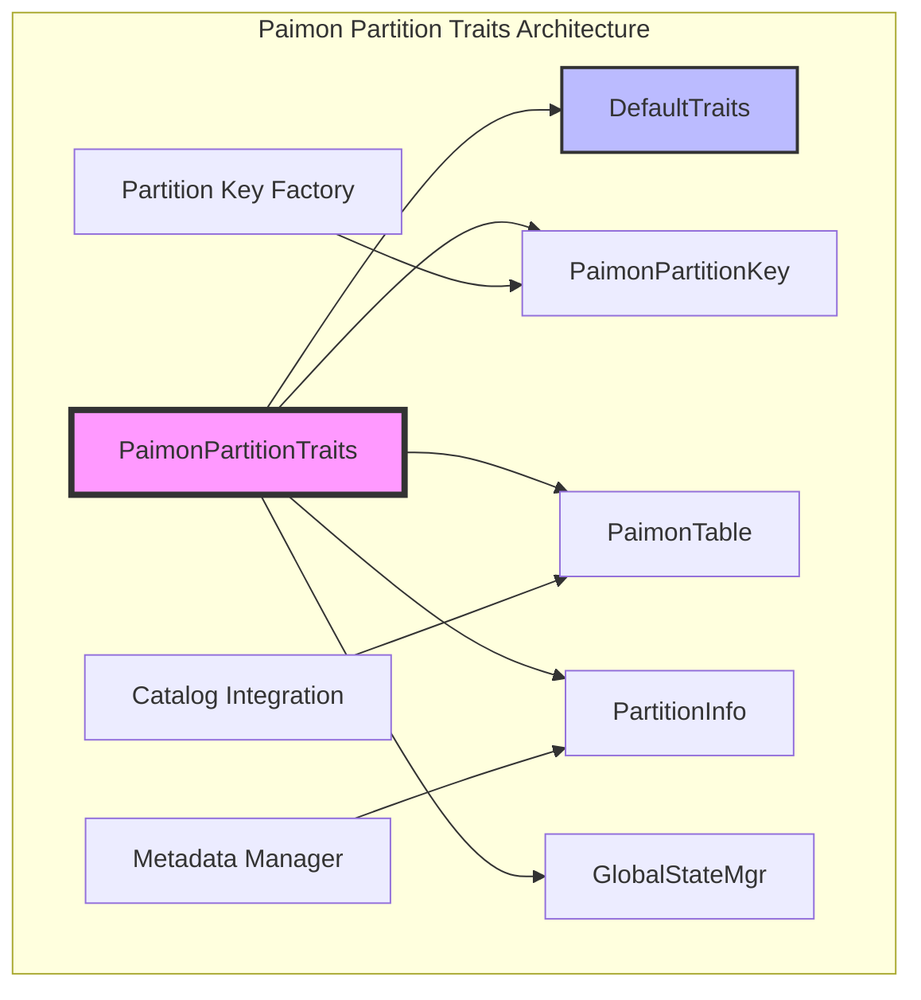
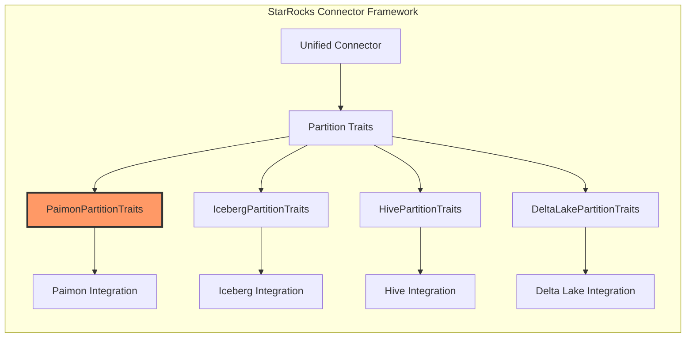
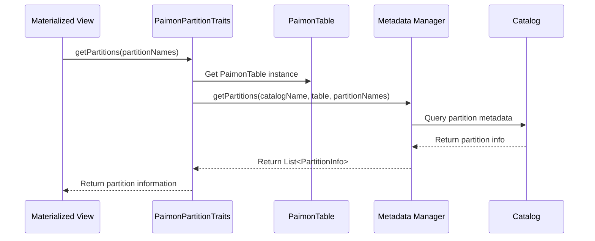
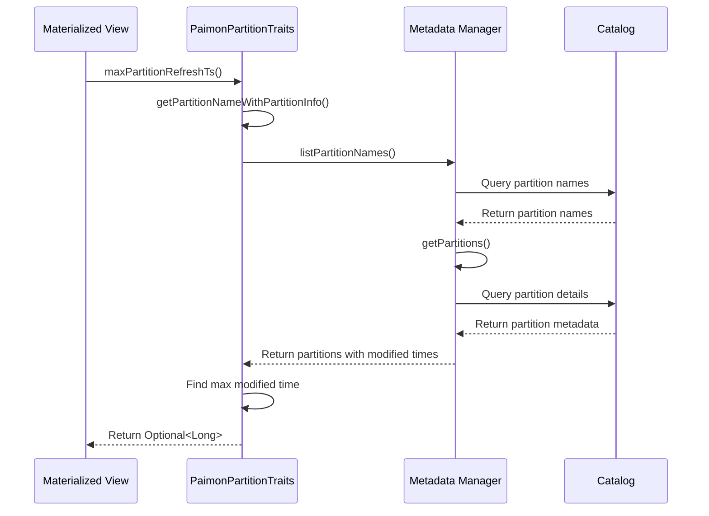
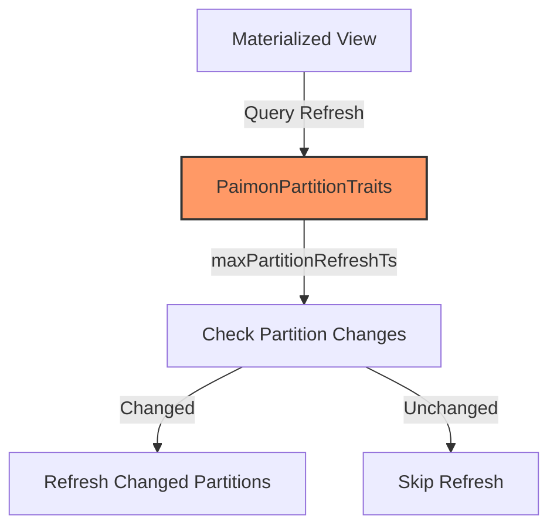

# Paimon Partition Traits Module

## Introduction

The Paimon Partition Traits module provides specialized partition management capabilities for Apache Paimon tables within StarRocks' unified connector framework. This module implements the `PaimonPartitionTraits` class that extends `DefaultTraits` to handle Paimon-specific partition operations, including partition key creation, partition information retrieval, and refresh timestamp management.

Paimon (formerly Flink Table Store) is a lakehouse storage format designed for real-time streaming and batch processing. The partition traits module enables StarRocks to seamlessly integrate with Paimon's partitioning scheme, supporting efficient partition pruning, metadata operations, and incremental data refresh for materialized views.

## Architecture

### Component Overview



### System Integration



## Core Components

### PaimonPartitionTraits Class

The `PaimonPartitionTraits` class is the primary component that implements Paimon-specific partition handling logic. It extends `DefaultTraits` to provide specialized functionality for Paimon tables.

**Key Responsibilities:**
- Partition key creation and management
- Partition information retrieval
- Refresh timestamp calculation for incremental updates
- Support for partition-level refresh operations (PCT Refresh)
- Table last update time tracking

**Core Methods:**

```java
public class PaimonPartitionTraits extends DefaultTraits {
    // Enables partition-level refresh for materialized views
    public boolean isSupportPCTRefresh()
    
    // Creates empty Paimon partition keys
    public PartitionKey createEmptyKey()
    
    // Retrieves partition information for specified partition names
    public List<PartitionInfo> getPartitions(List<String> partitionNames)
    
    // Calculates maximum partition refresh timestamp
    public Optional<Long> maxPartitionRefreshTs()
    
    // Determines table's last update time with extra seconds buffer
    public LocalDateTime getTableLastUpdateTime(int extraSeconds)
}
```

## Data Flow

### Partition Information Retrieval



### Refresh Timestamp Calculation



## Key Features

### 1. Partition-Level Refresh Support

The module enables **Partition Change Tracking (PCT) Refresh** for materialized views, allowing incremental updates based on changed partitions rather than full table refreshes.

```java
@Override
public boolean isSupportPCTRefresh() {
    return true;  // Enables efficient incremental refresh
}
```

### 2. Paimon-Specific Partition Keys

Creates specialized `PaimonPartitionKey` objects that understand Paimon's partitioning scheme and data types.

```java
@Override
public PartitionKey createEmptyKey() {
    return new PaimonPartitionKey();
}
```

### 3. Timestamp-Based Change Detection

Implements sophisticated timestamp tracking to determine when partitions were last modified, enabling efficient incremental processing.

```java
@Override
public Optional<Long> maxPartitionRefreshTs() {
    Map<String, PartitionInfo> partitionNameWithPartition = 
        getPartitionNameWithPartitionInfo();
    return partitionNameWithPartition.values().stream()
            .map(PartitionInfo::getModifiedTime)
            .max(Long::compareTo);
}
```

### 4. Table Update Time Tracking

Provides table-level last update time with configurable buffer seconds for handling timing variations across distributed systems.

```java
@Override
public LocalDateTime getTableLastUpdateTime(int extraSeconds) {
    // Query last modified time from all partitions
    // Convert millisecond timestamp to LocalDateTime with buffer
    // Handle timezone conversions appropriately
}
```

## Dependencies

### Internal Dependencies

- **[DefaultTraits](partition_traits.md#defaulttraits)**: Base class providing common partition trait functionality
- **[PaimonPartitionKey](paimon_table.md#paimonpartitionkey)**: Specialized partition key implementation for Paimon
- **[PaimonTable](paimon_table.md)**: Table metadata representation for Paimon tables
- **[PartitionInfo](partition_info.md)**: Generic partition information container
- **[GlobalStateMgr](global_state_mgr.md)**: Global state management for metadata operations

### External Dependencies

- **Apache Paimon**: The underlying lakehouse storage format
- **Java Time API**: For timestamp and datetime operations
- **StarRocks Metadata Manager**: For catalog and partition metadata operations

## Integration Points

### Catalog Integration

The module integrates with StarRocks' metadata management system through the `GlobalStateMgr` to access Paimon catalog information:

```java
PaimonTable paimonTable = (PaimonTable) table;
return GlobalStateMgr.getCurrentState().getMetadataMgr()
    .getPartitions(paimonTable.getCatalogName(), table, partitionNames);
```

### Materialized View Refresh

Enables efficient materialized view maintenance by providing partition-level change detection:



## Performance Considerations

### 1. Partition Metadata Caching

The module leverages StarRocks' metadata caching mechanisms to avoid repeated catalog queries for partition information.

### 2. Efficient Timestamp Queries

Implements optimized queries for maximum partition refresh timestamps, reducing overhead for incremental refresh operations.

### 3. Lazy Evaluation

Partition information is retrieved on-demand, minimizing memory usage and network overhead for tables with many partitions.

## Error Handling

### Catalog Access Errors

Handles scenarios where catalog metadata is unavailable or inconsistent:

```java
// Graceful fallback when partition metadata is unavailable
List<PartitionInfo> partitions = GlobalStateMgr.getCurrentState().getMetadataMgr()
    .getPartitions(catalogName, table, partitionNames);
// Returns empty list or appropriate default values
```

### Timestamp Processing

Safely handles timestamp conversions and edge cases:

```java
if (lastModifiedTime != 0L) {
    return LocalDateTime.ofInstant(
        Instant.ofEpochMilli(lastModifiedTime).plusSeconds(extraSeconds),
        Clock.systemDefaultZone().getZone());
}
return null;  // Graceful handling of missing timestamps
```

## Configuration

### Time Buffer Configuration

The `extraSeconds` parameter in `getTableLastUpdateTime` allows for configurable time buffers to handle:
- Clock synchronization differences across distributed systems
- Processing delays in streaming pipelines
- Metadata propagation delays

### Catalog Integration Settings

Configuration through StarRocks' catalog system for:
- Paimon catalog connection parameters
- Metadata refresh intervals
- Partition discovery mechanisms

## Usage Examples

### Basic Partition Operations

```java
// Create Paimon partition traits
PaimonPartitionTraits traits = new PaimonPartitionTraits();
traits.setTable(paimonTable);

// Check partition-level refresh support
if (traits.isSupportPCTRefresh()) {
    // Enable efficient incremental refresh
}

// Get partition information
List<String> partitionNames = Arrays.asList("dt=2023-01-01", "dt=2023-01-02");
List<PartitionInfo> partitions = traits.getPartitions(partitionNames);
```

### Refresh Timestamp Management

```java
// Get maximum partition refresh timestamp
Optional<Long> maxRefreshTs = traits.maxPartitionRefreshTs();
maxRefreshTs.ifPresent(ts -> {
    // Process partitions modified after this timestamp
});

// Get table last update time with buffer
LocalDateTime lastUpdate = traits.getTableLastUpdateTime(300); // 5-minute buffer
```

## Future Enhancements

### 1. Advanced Partition Pruning

Potential enhancements for more sophisticated partition filtering based on Paimon's metadata statistics.

### 2. Streaming Integration

Enhanced support for real-time partition discovery in streaming scenarios.

### 3. Performance Metrics

Addition of performance metrics for partition operations to enable optimization and monitoring.

## Related Documentation

- [Partition Traits Overview](partition_traits.md) - General partition traits framework
- [Paimon Table Integration](paimon_table.md) - Paimon table metadata management
- [Materialized View Refresh](mv_refresh.md) - Incremental refresh mechanisms
- [Connector Framework](connector_framework.md) - Unified connector architecture
- [Metadata Management](metadata_management.md) - Catalog and metadata operations