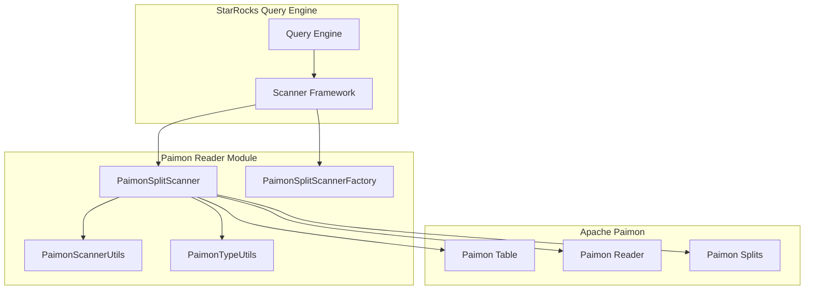
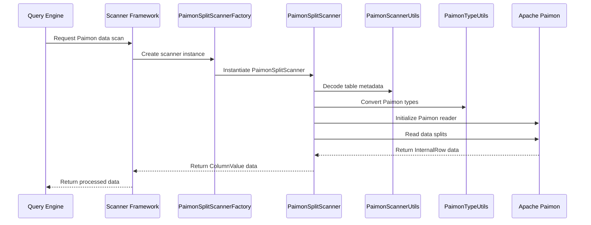

# Paimon Reader Module Documentation

## Overview

The Paimon Reader module is a specialized data access component within the StarRocks ecosystem that provides native integration with Apache Paimon table format. This module enables StarRocks to efficiently read and process data stored in Paimon format, supporting both batch and streaming data processing scenarios.

Apache Paimon is a lake format that enables building a real-time lakehouse architecture with the following characteristics:
- Streaming data ingestion with exactly-once semantics
- Real-time analytics on both batch and streaming data
- Incremental data processing capabilities
- ACID transaction support

## Architecture

### High-Level Architecture

### Component Interaction Flow

## Core Functionality

### 1. Data Type Conversion
The module provides comprehensive type mapping between Paimon data types and StarRocks internal types through the `PaimonTypeUtils` component. This ensures seamless data compatibility and proper type handling during data ingestion.

### 2. Split-based Parallel Processing
Utilizes Paimon's split-based architecture to enable parallel data processing, allowing StarRocks to efficiently distribute reading tasks across multiple workers.

### 3. Predicate Pushdown
Supports predicate pushdown to minimize data transfer by filtering data at the source level, improving query performance and reducing network overhead.

### 4. Schema Evolution Support
Handles schema changes in Paimon tables, allowing StarRocks to adapt to evolving data structures without requiring full data reloads.

## Sub-modules

### Scanner Core ([Paimon Split Scanner](paimon_split_scanner.md))
The main scanning logic that orchestrates data reading from Paimon tables, including split processing, data conversion, and error handling.

### Type System ([Paimon Type Utils](paimon_type_utils.md))
Comprehensive type conversion utilities that map between Paimon and StarRocks data types, ensuring data integrity and compatibility.

### Utilities ([Paimon Scanner Utils](paimon_scanner_utils.md))
Common utilities for date/time formatting, object serialization/deserialization, and field name extraction from Paimon schemas.

### Factory Pattern ([Paimon Split Scanner Factory](paimon_split_scanner_factory.md))
Factory implementation for creating scanner instances with proper classloader isolation to handle dependency conflicts.

## Integration Points

### With StarRocks Scanner Framework
The module integrates with StarRocks' scanner framework through the `ConnectorScanner` interface, providing a standardized way to access external data sources.

### With Apache Paimon
Direct integration with Paimon's Java API, utilizing components like:
- `RecordReader` for data iteration
- `Table` for metadata access
- `Split` for parallel processing
- `Predicate` for filter pushdown

## Performance Characteristics

### Parallel Processing
- Supports parallel split processing for improved throughput
- Configurable fetch size for optimal memory usage
- Efficient data batching to minimize JNI overhead

### Memory Management
- Off-heap memory management for large datasets
- Configurable memory limits per scanner instance
- Automatic resource cleanup and garbage collection

### Type Conversion Optimization
- Cached type conversion mappings
- Efficient data type transformations
- Minimal data copying during conversion

## Configuration

### Scanner Parameters
- `required_fields`: Comma-separated list of fields to read
- `nested_fields`: Nested field paths for complex types
- `split_info`: Encoded split information for parallel processing
- `predicate_info`: Encoded predicate information for filter pushdown
- `native_table`: Base64-encoded table metadata
- `time_zone`: Timezone configuration for temporal data

### Performance Tuning
- `fetch_size`: Number of rows to fetch per batch (default: 4096)
- Memory allocation strategies for different data types
- Parallel processing configuration

## Error Handling

### Exception Management
- Comprehensive error handling for Paimon API interactions
- Graceful degradation on schema mismatches
- Detailed error logging with context information

### Recovery Mechanisms
- Automatic retry logic for transient failures
- Resource cleanup on error conditions
- Proper exception propagation to query engine

## Dependencies

### External Dependencies
- Apache Paimon Core Library
- StarRocks JNI Connector Framework
- Apache Arrow (for data format compatibility)

### Internal Dependencies
- StarRocks Type System
- Scanner Framework Interfaces
- Memory Management Utilities

## Future Enhancements

### Planned Features
- Support for Paimon's latest features and optimizations
- Enhanced predicate pushdown capabilities
- Improved performance for complex data types
- Better integration with StarRocks' cost-based optimizer

### Performance Optimizations
- Vectorized data processing
- Advanced caching strategies
- Parallel I/O optimization
- Memory pool management

## Related Documentation
- [StarRocks Scanner Framework](scanner_framework.md)
- [Apache Paimon Documentation](https://paimon.apache.org/)
- [StarRocks Type System](type_system.md)
- [Connector Development Guide](connector_development.md)