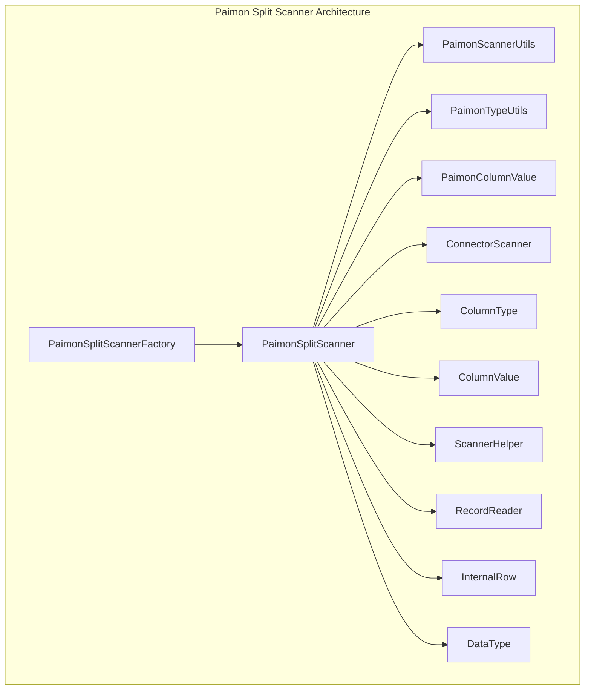
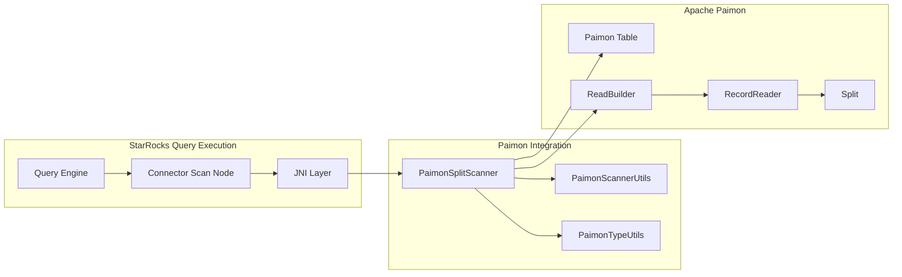
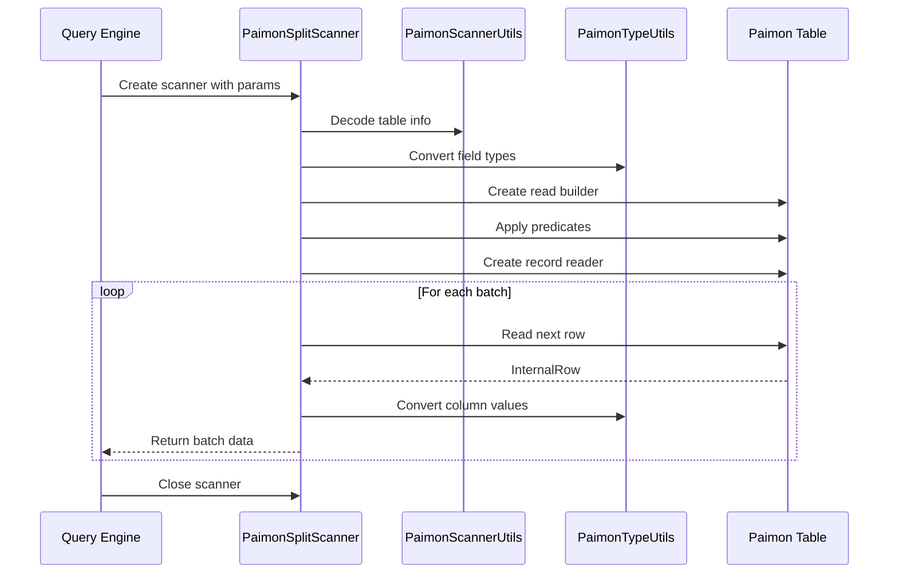
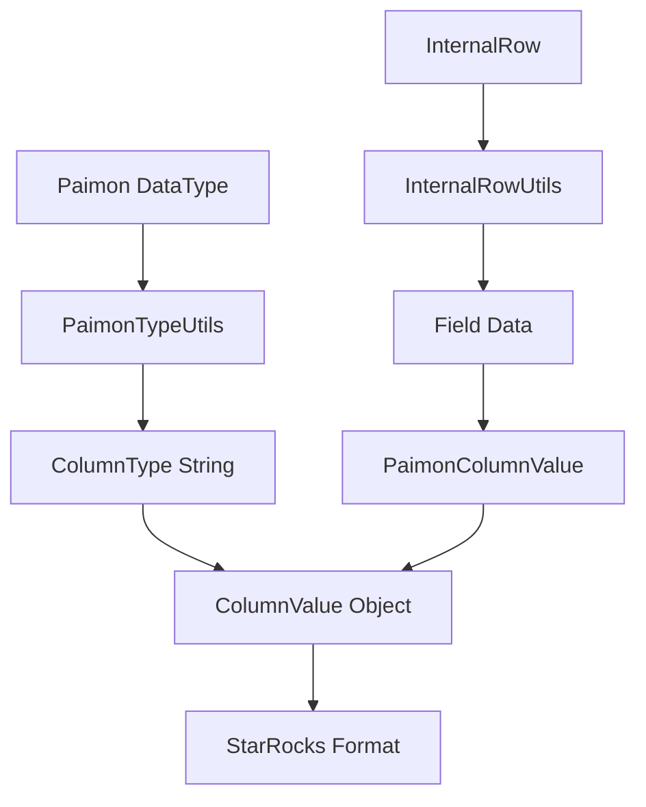

# Paimon Split Scanner Module

## Overview

The Paimon Split Scanner module provides specialized data scanning capabilities for Apache Paimon tables within the StarRocks connector framework. This module implements a JNI-based scanner that efficiently reads data from Paimon table splits, handling type conversion, predicate pushdown, and data serialization for seamless integration with StarRocks query execution engine.

## Purpose and Core Functionality

The primary purpose of the Paimon Split Scanner is to:

- **Split-based Data Reading**: Efficiently read data from individual splits of Paimon tables
- **Type System Integration**: Convert between Paimon's native data types and StarRocks column types
- **Predicate Pushdown**: Apply filters and predicates at the data source level for optimal performance
- **JNI Bridge**: Provide a Java Native Interface bridge for high-performance data transfer
- **Schema Projection**: Handle column selection and nested field access
- **Memory Management**: Manage off-heap memory for efficient data processing

## Architecture

### Component Structure



### Integration with StarRocks Ecosystem



## Core Components

### PaimonSplitScanner

The main scanner class that extends `ConnectorScanner` and implements the core scanning logic:

- **Split Processing**: Handles individual table splits for parallel processing
- **Predicate Application**: Applies pushdown predicates to minimize data transfer
- **Type Conversion**: Converts Paimon data types to StarRocks compatible formats
- **Memory Management**: Manages off-heap table writers for efficient data handling
- **Error Handling**: Provides comprehensive error handling and logging

### Key Features

#### 1. Split-based Parallel Processing
```java
// Split decoding and reader initialization
Split split = PaimonScannerUtils.decodeStringToObject(splitInfo);
RecordReader<InternalRow> reader = readBuilder.newRead().executeFilter().createReader(split);
```

#### 2. Schema Projection and Type Mapping
```java
// Type conversion from Paimon to StarRocks
DataType dataType = table.rowType().getTypeAt(index);
String type = PaimonTypeUtils.fromPaimonType(dataType);
requiredTypes[i] = new ColumnType(type);
```

#### 3. Predicate Pushdown
```java
// Filter application for optimal performance
List<Predicate> predicates = PaimonScannerUtils.decodeStringToObject(predicateInfo);
readBuilder.withFilter(predicates);
```

#### 4. Nested Field Support
```java
// Nested field handling for complex data types
SelectedFields ssf = new SelectedFields();
for (String nestField : nestedFields) {
    ssf.addNestedPath(nestField);
}
```

## Data Flow

### Scanning Process Flow



### Type Conversion Flow



## Dependencies

### Internal Dependencies

- **ConnectorScanner**: Base scanner interface providing JNI integration
- **ColumnType**: Type system for column metadata
- **ColumnValue**: Value container for data transfer
- **ScannerHelper**: Utility functions for scanner operations

### External Dependencies

- **Apache Paimon**: Core table format and reading capabilities
- **Apache Arrow**: Memory management and columnar data representation
- **Log4j**: Logging framework for error tracking and debugging

### Related Modules

- **PaimonScannerUtils**: Utility functions for Paimon integration
- **PaimonTypeUtils**: Type conversion utilities
- **PaimonSplitScannerFactory**: Factory for creating scanner instances
- **PaimonColumnValue**: Column value implementation for Paimon data

## Configuration and Parameters

### Scanner Parameters

| Parameter | Description | Example |
|-----------|-------------|---------|
| `required_fields` | Comma-separated list of fields to read | "id,name,age" |
| `nested_fields` | Nested field paths for complex types | "address.city,items.price" |
| `split_info` | Encoded split information | Base64 encoded |
| `predicate_info` | Encoded predicate information | Base64 encoded |
| `native_table` | Encoded table metadata | Base64 encoded |
| `time_zone` | Timezone for temporal data | "UTC" |
| `fetch_size` | Number of rows per batch | 4096 |

### Performance Tuning

- **Fetch Size**: Adjust based on available memory and data characteristics
- **Predicate Pushdown**: Enable for better performance by filtering at source
- **Projection**: Only select required fields to minimize data transfer
- **Split Size**: Configure optimal split sizes for parallel processing

## Error Handling

The scanner implements comprehensive error handling:

- **Initialization Errors**: Table decoding, type conversion failures
- **Runtime Errors**: Data reading, type conversion, memory allocation
- **Resource Cleanup**: Proper cleanup of readers and iterators
- **Logging**: Detailed error messages with context information

## Best Practices

1. **Predicate Pushdown**: Always push filters to minimize data transfer
2. **Field Selection**: Only project required fields
3. **Memory Management**: Monitor off-heap memory usage
4. **Error Handling**: Implement proper exception handling in calling code
5. **Resource Management**: Ensure proper scanner cleanup

## Integration Example

```java
// Create scanner parameters
Map<String, String> params = new HashMap<>();
params.put("required_fields", "id,name,age");
params.put("split_info", encodedSplit);
params.put("predicate_info", encodedPredicates);
params.put("native_table", encodedTable);
params.put("time_zone", "UTC");

// Create and open scanner
PaimonSplitScanner scanner = new PaimonSplitScanner(4096, params);
scanner.open();

// Read data in batches
try {
    while (true) {
        int rows = scanner.getNext();
        if (rows == 0) break;
        // Process batch data
    }
} finally {
    scanner.close();
}
```

## Performance Characteristics

- **Throughput**: High-throughput reading with batch processing
- **Latency**: Low-latency due to predicate pushdown and projection
- **Memory**: Efficient memory usage with off-heap management
- **Scalability**: Linear scalability with split-based parallel processing

## Future Enhancements

- **Vectorized Reading**: Support for vectorized column reading
- **Async Processing**: Asynchronous data reading capabilities
- **Caching**: Intelligent caching for frequently accessed data
- **Monitoring**: Enhanced metrics and monitoring capabilities