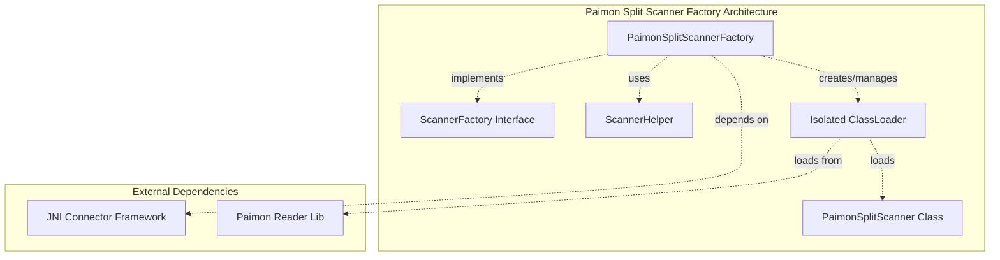
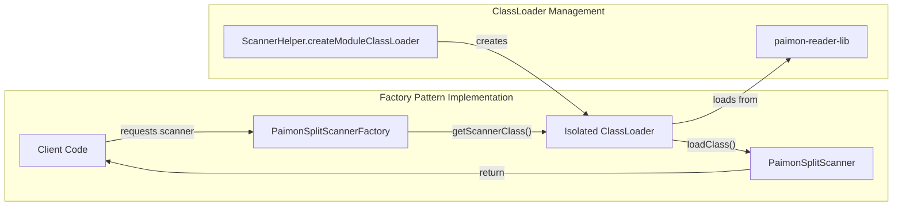
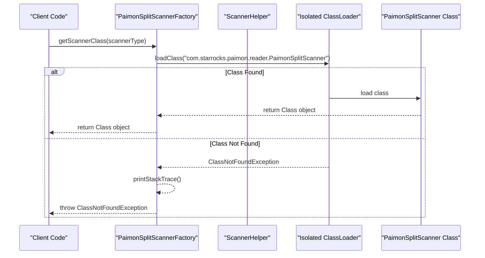
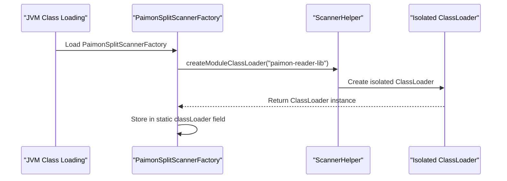
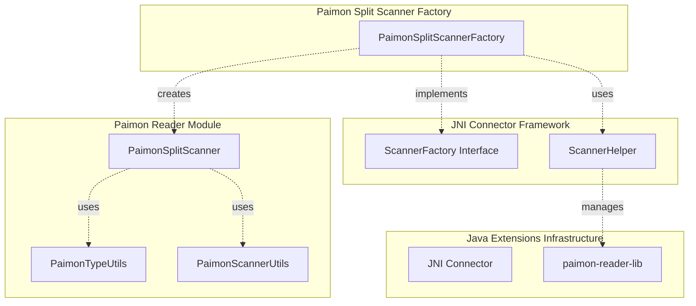

# Paimon Split Scanner Factory Module

## Introduction

The `paimon_split_scanner_factory` module is a specialized component within the StarRocks Java Extensions framework that provides factory functionality for creating Paimon split scanners. This module serves as a bridge between the StarRocks query execution engine and Apache Paimon table format, enabling efficient data scanning and reading operations from Paimon tables.

## Module Purpose and Core Functionality

### Primary Purpose
The module implements a factory pattern for instantiating `PaimonSplitScanner` instances, which are responsible for reading and processing data splits from Apache Paimon tables. It addresses classloading isolation requirements to handle potential dependency conflicts between different Hadoop versions used by Paimon and the StarRocks JNI framework.

### Core Functionality
- **Scanner Factory Implementation**: Implements the `ScannerFactory` interface to provide standardized scanner creation
- **ClassLoader Isolation**: Creates and manages an isolated classloader for Paimon-specific dependencies
- **Dynamic Scanner Instantiation**: Dynamically loads and instantiates `PaimonSplitScanner` classes at runtime
- **Dependency Management**: Handles version conflicts between Hadoop dependencies through isolated classloading

## Architecture and Component Relationships

### Module Architecture



### Component Relationships



## Data Flow and Process Flow

### Scanner Creation Process Flow



### Static Initialization Flow



## Integration with StarRocks Ecosystem

### Module Dependencies



### Related Modules

- **[paimon_split_scanner](paimon_split_scanner.md)**: The actual scanner implementation that this factory creates
- **[paimon_type_utils](paimon_type_utils.md)**: Type conversion utilities used by the scanner
- **[paimon_scanner_utils](paimon_scanner_utils.md)**: Utility functions for scanner operations
- **[java_extensions_framework](java_extensions_framework.md)**: Parent framework providing base interfaces

## Key Design Patterns and Technical Decisions

### Factory Pattern Implementation
The module implements the Factory design pattern to provide a standardized way of creating scanner instances. This approach:
- Decouples scanner creation from scanner usage
- Enables runtime scanner type selection
- Provides a consistent interface across different scanner types

### ClassLoader Isolation Strategy
The module employs an isolated ClassLoader to address dependency conflicts:
- **Problem**: Hadoop version conflicts between Paimon dependencies and StarRocks JNI framework
- **Solution**: Create isolated ClassLoader for Paimon-specific libraries
- **Benefits**: Prevents classpath conflicts, enables version independence

### Error Handling Strategy
The module implements comprehensive error handling:
- **ClassNotFoundException Handling**: Catches and re-throws with stack trace logging
- **Resource Management**: Static ClassLoader creation ensures single initialization
- **Exception Propagation**: Maintains exception chain for debugging

## Configuration and Usage

### Module Configuration
The module requires the following configuration:
- **Library Path**: `paimon-reader-lib` directory containing Paimon dependencies
- **ClassLoader Setup**: Automatic initialization through static block
- **Scanner Class**: `com.starrocks.paimon.reader.PaimonSplitScanner`

### Usage Pattern
```java
// Factory instantiation (typically handled by framework)
PaimonSplitScannerFactory factory = new PaimonSplitScannerFactory();

// Scanner class retrieval
Class<?> scannerClass = factory.getScannerClass("paimon");

// Scanner instantiation (via reflection)
Object scanner = scannerClass.getDeclaredConstructor().newInstance();
```

## Performance Considerations

### ClassLoader Performance
- **Static Initialization**: ClassLoader created once at class loading time
- **Caching**: Single ClassLoader instance reused for all scanner creations
- **Lazy Loading**: Scanner classes loaded on-demand

### Memory Management
- **Static Resource**: ClassLoader maintained as static field to prevent repeated creation
- **Garbage Collection**: Scanner instances can be garbage collected after use
- **Resource Cleanup**: No explicit cleanup required for ClassLoader

## Security and Isolation

### Security Features
- **ClassLoader Isolation**: Prevents access to system ClassLoader resources
- **Package Isolation**: Paimon classes loaded in separate namespace
- **Dependency Isolation**: Paimon dependencies don't interfere with StarRocks core

### Isolation Benefits
- **Version Independence**: Paimon can use different Hadoop versions
- **Conflict Prevention**: Prevents dependency version conflicts
- **Stability**: System stability maintained through isolation

## Future Considerations

### Scalability
- **Concurrent Access**: ClassLoader is thread-safe for concurrent scanner creation
- **Resource Scaling**: No additional resources required for increased usage
- **Performance Scaling**: Constant-time scanner creation regardless of load

### Extensibility
- **New Scanner Types**: Factory pattern supports adding new scanner implementations
- **Configuration Enhancement**: ClassLoader creation can be parameterized
- **Plugin Architecture**: Fits naturally into StarRocks plugin framework

## Conclusion

The `paimon_split_scanner_factory` module represents a critical component in StarRocks' connector ecosystem, providing robust and isolated access to Apache Paimon tables. Through its implementation of the factory pattern and ClassLoader isolation strategy, it ensures reliable and conflict-free integration between StarRocks and Paimon storage format, while maintaining system stability and performance.