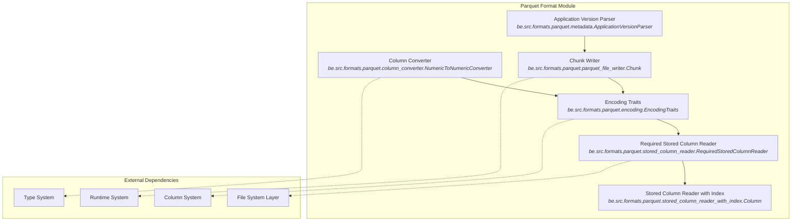
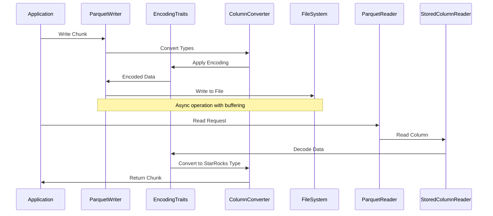

# Parquet Format Module Documentation

## Overview

The `parquet_format` module is a core component of StarRocks that provides comprehensive support for reading and writing Apache Parquet files. Parquet is a columnar storage format optimized for analytical workloads, and this module implements the complete Parquet specification with optimizations for high-performance data processing.

## Purpose and Core Functionality

The module serves as StarRocks' primary interface for Parquet file operations, providing:

- **Reading Capabilities**: Efficient reading and parsing of Parquet files with support for all major Parquet features
- **Writing Capabilities**: High-performance writing of Parquet files with configurable encoding and compression
- **Type Conversion**: Seamless conversion between Parquet data types and StarRocks internal types
- **Encoding Support**: Full support for Parquet encoding schemes including dictionary, delta, and plain encoding
- **Compression**: Integration with multiple compression algorithms (Snappy, GZIP, ZSTD, LZ4)
- **Metadata Handling**: Complete Parquet metadata parsing and generation
- **Columnar Operations**: Optimized column-wise reading and writing for analytical workloads

## Architecture Overview

## Sub-modules and Components

### 1. [Column Conversion System](column_conversion_system.md)
**File**: `be/src/formats/parquet/column_converter.cpp`

The column conversion system handles the transformation between Parquet's physical data types and StarRocks' logical types. It supports:

- **Numeric Type Conversions**: Efficient conversion between different numeric precisions
- **Date/Time Conversions**: Handling of Parquet's various timestamp representations (INT32, INT64, INT96)
- **Decimal Conversions**: Support for Parquet's decimal types with proper scale handling
- **Binary Data Handling**: Conversion of binary and fixed-length binary data

Key features:
- Template-based optimized conversions for performance
- Support for nullable columns
- Timezone-aware timestamp conversions
- Scale-aware decimal operations

### 2. [Encoding System](encoding_system.md)
**File**: `be/src/formats/parquet/encoding.cpp`

Manages Parquet's various encoding schemes through a traits-based architecture:

- **Plain Encoding**: Direct value storage for all types
- **Dictionary Encoding**: Value compression through dictionary lookup
- **Delta Encodings**: Efficient storage for sequential numeric data
- **Byte Stream Split**: Optimized encoding for floating-point data
- **RLE Dictionary**: Run-length encoded dictionary indices

The system uses template specialization to provide optimal implementations for each type-encoding combination.

### 3. [Metadata Management](metadata_management.md)
**File**: `be/src/formats/parquet/metadata.cpp`

Handles Parquet file metadata including:

- **File Metadata Parsing**: Reading and interpreting Parquet file footers
- **Application Version Detection**: Parsing writer application versions for compatibility
- **Schema Management**: Handling Parquet schema evolution and compatibility
- **Statistics Validation**: Ensuring statistics correctness across different Parquet versions

### 4. [File Writing System](file_writing_system.md)
**File**: `be/src/formats/parquet/parquet_file_writer.cpp`

Provides high-performance Parquet file writing with:

- **Chunk-based Writing**: Efficient batch processing of data chunks
- **Configurable Compression**: Support for multiple compression algorithms
- **Schema Generation**: Automatic Parquet schema creation from StarRocks types
- **Statistics Collection**: Automatic min/max/null statistics computation
- **Async I/O**: Non-blocking write operations for better throughput

### 5. [Column Reading System](column_reading_system.md)
**Files**: 
- `be/src/formats/parquet/stored_column_reader.cpp`
- `be/src/formats/parquet/stored_column_reader_with_index.cpp`

Implements optimized column reading with:

- **Three Reading Modes**: Required, Optional, and Repeated column readers
- **Page Index Support**: Fast page-level filtering using Parquet page indexes
- **Lazy Evaluation**: Deferred value loading for better performance
- **Vectorized Operations**: SIMD-optimized data processing
- **Predicate Pushdown**: Early filtering based on column statistics

## Data Flow Architecture

## Integration with StarRocks Ecosystem

The Parquet format module integrates seamlessly with other StarRocks components:

- **Storage Engine**: Provides columnar data access for the storage layer
- **Query Execution**: Enables efficient predicate pushdown and column pruning
- **Connector Framework**: Supports reading from external Parquet files
- **Type System**: Maintains type compatibility across the system

## Performance Optimizations

The module implements several performance optimizations:

1. **Vectorized Processing**: Batch operations on column data
2. **Memory Pool Management**: Efficient memory allocation and reuse
3. **Async I/O**: Non-blocking file operations
4. **Page Indexing**: Fast data location using Parquet page indexes
5. **Encoding Selection**: Automatic selection of optimal encoding schemes
6. **Compression Optimization**: Adaptive compression based on data characteristics

## Configuration and Options

The module supports various configuration options:

- **Compression Types**: None, Snappy, GZIP, ZSTD, LZ4
- **Encoding Preferences**: Dictionary, Plain, Delta variants
- **Version Compatibility**: Parquet 1.0, 2.4, 2.6
- **Timestamp Encoding**: INT96 (legacy) or INT64 (modern)
- **Decimal Encoding**: Legacy or modern encoding schemes

## Error Handling and Validation

Comprehensive error handling includes:

- **Format Validation**: Strict Parquet format compliance checking
- **Type Safety**: Runtime type validation and conversion safety
- **Memory Safety**: Bounds checking and memory leak prevention
- **Corruption Detection**: Early detection of file corruption
- **Version Compatibility**: Graceful handling of version mismatches

This module serves as the foundation for StarRocks' Parquet support, enabling efficient analytical processing of columnar data while maintaining full compatibility with the Apache Parquet ecosystem.