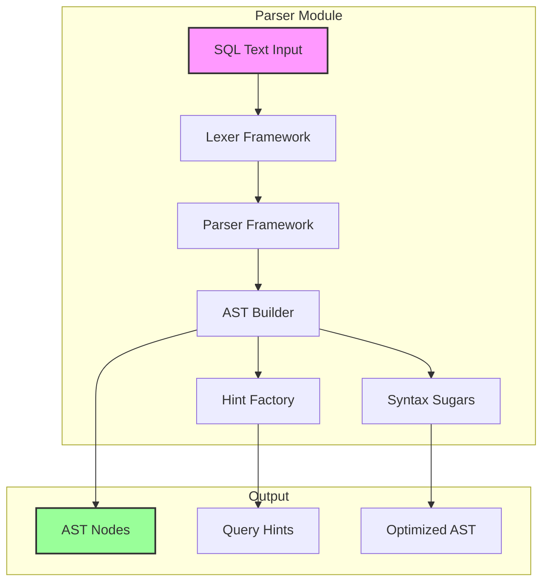
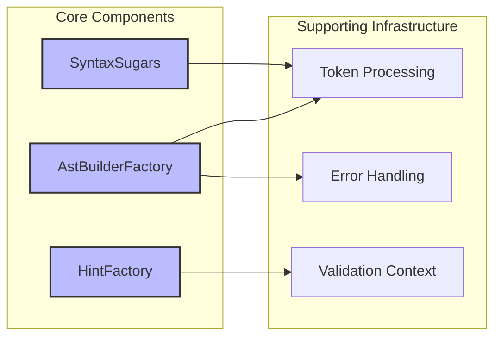
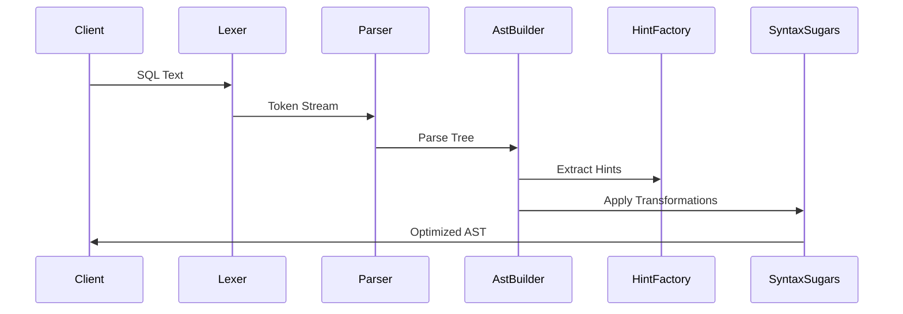
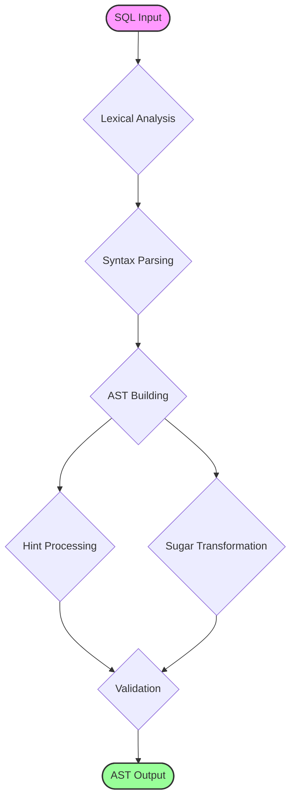
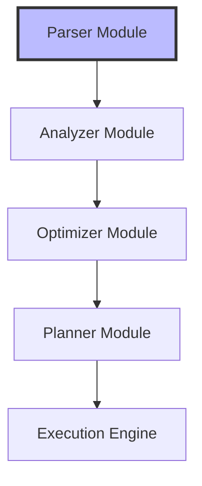

# Parser Module Documentation

## Introduction

The parser module is a core component of StarRocks' SQL processing engine, responsible for transforming raw SQL text into structured Abstract Syntax Trees (ASTs) that can be processed by subsequent query processing stages. As the entry point of the SQL compilation pipeline, the parser ensures that SQL statements are syntactically correct and converts them into a standardized internal representation.

## Overview

The parser module serves as the foundation of the SQL parsing and optimization framework within StarRocks. It handles the lexical analysis and syntactic parsing of SQL statements, converting human-readable SQL text into machine-processable AST nodes. The module is designed to be extensible, supporting various SQL dialects and providing hooks for custom parsing behaviors.

## Architecture

### High-Level Architecture

### Component Architecture

## Core Components

### AstBuilderFactory

The `AstBuilderFactory` is the primary factory class responsible for creating AST builder instances. It provides a standardized interface for constructing different types of AST nodes based on the parsed SQL statement type.

**Key Responsibilities:**
- Factory pattern implementation for AST builders
- Type-safe AST node creation
- Builder lifecycle management
- Custom builder registration

**Integration Points:**
- Receives parsed tokens from the lexer
- Coordinates with HintFactory for hint processing
- Interfaces with SyntaxSugars for optimization

### HintFactory

The `HintFactory` component handles the parsing and processing of SQL hints, which provide optimization directives to the query planner. It extracts hint information from SQL comments and special syntax constructs.

**Key Responsibilities:**
- Hint syntax parsing
- Hint validation
- Hint transformation
- Hint storage and retrieval

**Supported Hint Types:**
- Join order hints
- Index selection hints
- Parallel execution hints
- Memory allocation hints

### SyntaxSugars

The `SyntaxSugars` component provides syntactic sugar transformations that simplify complex SQL constructs into more fundamental forms. This normalization process ensures consistency across different SQL dialects and simplifies downstream processing.

**Key Transformations:**
- Implicit JOIN syntax to explicit JOIN
- Subquery flattening
- Expression simplification
- Alias resolution

## Data Flow

### Parsing Pipeline

### Processing Flow

## Integration with SQL Parser Optimizer

The parser module is part of the larger [sql_parser_optimizer](sql_parser_optimizer.md) framework, which includes:

- **[Analyzer](analyzer.md)**: Semantic analysis and validation
- **[Optimizer](optimizer.md)**: Query optimization and planning
- **[Planner](planner.md)**: Execution plan generation
- **[Statement Planner](statement_planner.md)**: Statement-level planning

### Dependency Relationships

## Error Handling

### Error Types

The parser module handles various error conditions:

1. **Syntax Errors**: Malformed SQL syntax
2. **Lexical Errors**: Invalid tokens or characters
3. **Semantic Errors**: Type mismatches, undefined references
4. **Hint Errors**: Invalid or conflicting hints

### Error Recovery

The parser implements sophisticated error recovery mechanisms:

- **Panic Mode Recovery**: Skip tokens until synchronization point
- **Phrase-Level Recovery**: Local error correction
- **Global Correction**: Multi-token error correction

## Performance Considerations

### Optimization Strategies

1. **Token Caching**: Reuse common token patterns
2. **Incremental Parsing**: Parse only changed portions
3. **Parallel Processing**: Multi-threaded parsing for large statements
4. **Memory Pooling**: Reduce allocation overhead

### Benchmarking

Key performance metrics:
- Parsing latency per statement type
- Memory usage during parsing
- Error recovery time
- AST generation speed

## Extension Points

### Custom Parsers

The parser module supports custom parser extensions through:

- **Plugin Architecture**: Register custom parsing rules
- **Dialect Support**: SQL dialect-specific parsing
- **User-Defined Functions**: Custom function parsing
- **External Integrations**: Connector-specific syntax

### Configuration Options

Parser behavior can be customized via:
- SQL mode settings
- Parser flags and options
- Hint processing rules
- Error handling policies

## Testing Framework

### Test Coverage

The parser module includes comprehensive test suites:

- **Unit Tests**: Individual component testing
- **Integration Tests**: End-to-end parsing scenarios
- **Regression Tests**: Historical bug prevention
- **Performance Tests**: Benchmarking and profiling

### Test Data

Test datasets include:
- Standard SQL statements
- Edge cases and boundary conditions
- Invalid syntax scenarios
- Complex nested queries
- Multi-dialect compatibility

## Security Considerations

### Input Validation

The parser implements robust input validation:

- **SQL Injection Prevention**: Parameterized query support
- **Resource Limits**: Statement size and complexity limits
- **Access Control**: Parser-level security checks
- **Audit Logging**: Parse activity tracking

### Secure Coding Practices

- Input sanitization
- Buffer overflow protection
- Memory safety checks
- Error information disclosure prevention

## Monitoring and Observability

### Metrics Collection

The parser module provides detailed metrics:

- Parse request count and rate
- Parse duration percentiles
- Error rate by type
- Memory usage statistics
- Cache hit rates

### Logging

Structured logging includes:
- Parse start/completion events
- Error details with context
- Performance measurements
- Debug information for troubleshooting

## Future Enhancements

### Planned Improvements

1. **Enhanced Error Messages**: More descriptive parsing errors
2. **Performance Optimization**: Faster parsing algorithms
3. **Extended SQL Support**: Additional SQL dialects
4. **Machine Learning Integration**: Intelligent error correction
5. **Cloud-Native Features**: Distributed parsing capabilities

### Research Areas

- Natural language to SQL conversion
- Automatic query optimization hints
- Predictive parsing based on usage patterns
- Real-time syntax validation in IDEs

## References

- [SQL Parser Optimizer](sql_parser_optimizer.md) - Parent module documentation
- [Analyzer](analyzer.md) - Semantic analysis module
- [Optimizer](optimizer.md) - Query optimization module
- [Frontend Server](frontend_server.md) - FE server architecture
- [Connectors](connectors.md) - External system integrations