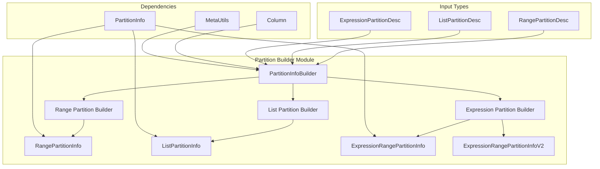
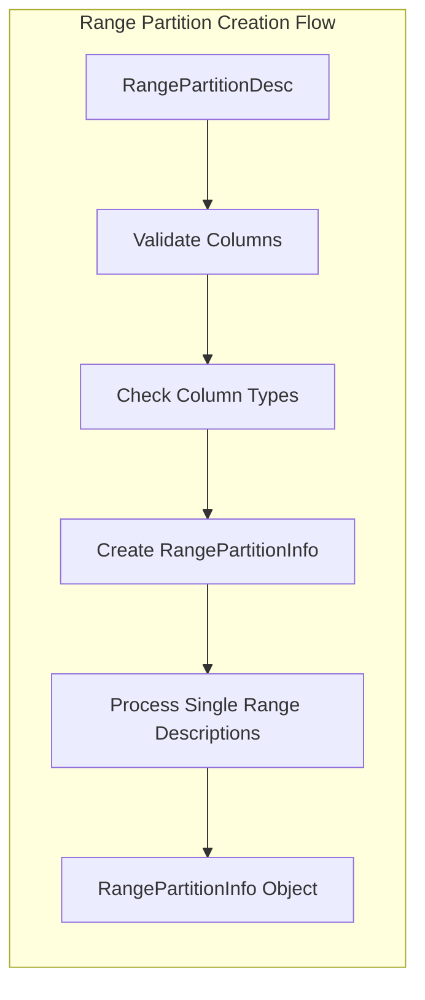
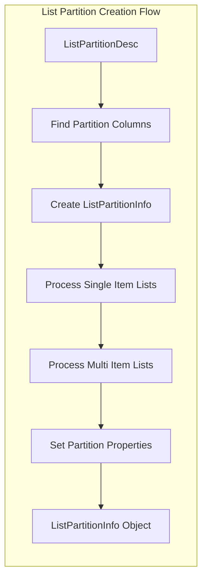
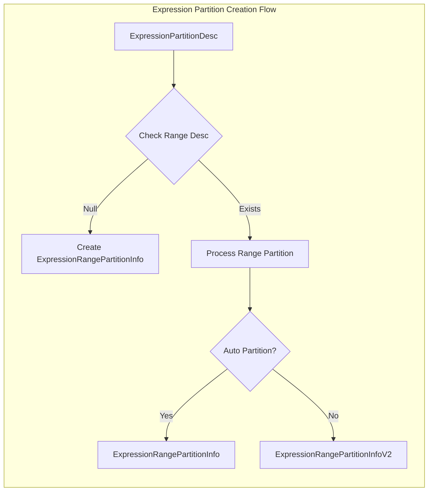
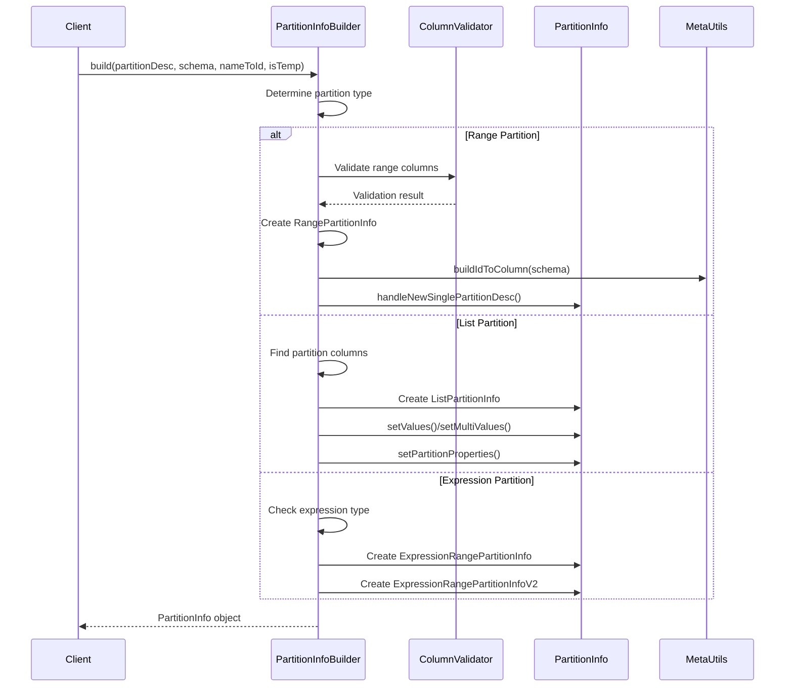
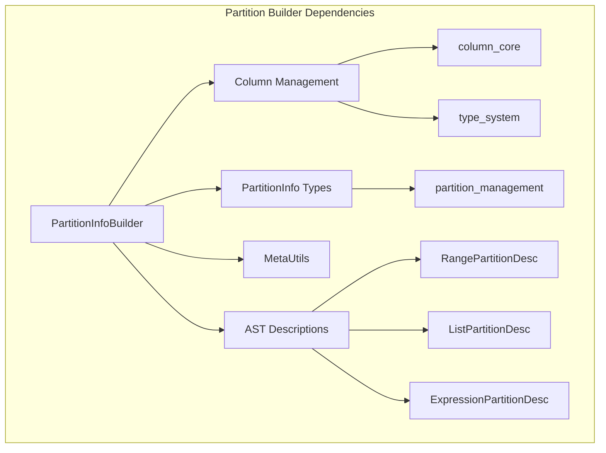
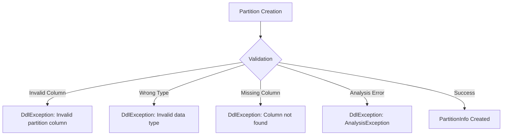

# Partition Builder Module Documentation

## Introduction

The partition_builder module is a critical component of StarRocks' catalog management system, responsible for creating and configuring partition information for tables. This module serves as a centralized builder that converts various partition description types into concrete PartitionInfo objects that can be used throughout the system for data organization and query optimization.

## Module Overview

The partition_builder module provides a unified interface for constructing different types of partition information, including range partitions, list partitions, and expression-based partitions. It acts as a factory pattern implementation that handles the complexity of partition validation, type checking, and configuration setup.

## Core Architecture

### Component Structure



### Key Components

#### PartitionInfoBuilder
The main builder class that provides static factory methods for creating different types of PartitionInfo objects. It serves as the entry point for all partition creation operations.

**Key Methods:**
- `build()`: Main factory method that dispatches to specific builders
- `buildRangePartitionInfo()`: Creates range partition information
- `buildListPartitionInfo()`: Creates list partition information  
- `buildExpressionPartitionInfo()`: Creates expression-based partition information

## Partition Types Supported

### 1. Range Partitions
Range partitions divide data based on value ranges of partition columns.



**Validation Rules:**
- Partition columns must be key columns
- Cannot be aggregated columns
- Must be non-floating point types
- Must be non-complex types

### 2. List Partitions
List partitions divide data based on discrete value lists.



**Features:**
- Supports single-item and multi-item list partitions
- Handles automatic partition detection
- Configures partition properties (data property, memory settings, replication)

### 3. Expression Partitions
Expression partitions use computed expressions to determine partition assignment.



**Types:**
- **Automatic Partition**: For time-based automatic partitioning
- **Expression Range**: For custom expression-based ranges

## Data Flow Architecture



## Integration with Catalog System

### Dependencies



### Related Modules

- **[column_management](column_management.md)**: Provides column validation and type checking
- **[partition_management](partition_management.md)**: Contains partition information classes
- **[type_system](type_system.md)**: Handles data type validation and conversion
- **[sql_parser_optimizer](sql_parser_optimizer.md)**: Provides AST description classes

## Error Handling

The module implements comprehensive error handling for various scenarios:



**Exception Types:**
- `DdlException`: Primary exception for DDL operations
- `AnalysisException`: Wrapped for analysis-related errors
- Custom messages for specific validation failures

## Configuration and Properties

### Partition Properties
Each partition can be configured with:
- **Data Property**: Storage and compression settings
- **Memory Settings**: In-memory storage configuration
- **Replication**: Number of replicas
- **Tablet Type**: Type of tablet storage
- **Data Cache**: Cache configuration for the partition
- **Temporary Flag**: Whether partition is temporary

### Validation Rules
- Partition columns must exist in the table schema
- Column names are case-insensitive
- Partition columns cannot be aggregated (except NONE)
- Floating point and complex types are prohibited
- Expression partitions support only single partition column

## Usage Examples

### Basic Usage Pattern
```java
// Create partition info from description
PartitionInfo partitionInfo = PartitionInfoBuilder.build(
    partitionDesc,      // Range/List/Expression partition description
    tableSchema,        // List of Column objects
    partitionNameToId,  // Map of partition names to IDs
    isTemporary         // Whether partitions are temporary
);
```

### Integration Points
The module integrates with:
- **Table Creation**: During CREATE TABLE operations
- **Schema Changes**: When modifying partition schemes
- **Query Planning**: For partition pruning optimization
- **Data Loading**: To determine target partitions

## Performance Considerations

- **Column Lookup**: Optimized column finding with early termination
- **Validation**: Type checking performed once during creation
- **Memory Usage**: Minimal temporary object creation
- **Error Handling**: Early validation to prevent costly operations

## Future Enhancements

Potential areas for improvement:
- Support for additional partition types
- Enhanced validation with better error messages
- Performance optimizations for large partition counts
- Integration with partition statistics
- Support for custom partition functions

## Conclusion

The partition_builder module serves as a critical foundation for StarRocks' partitioning capabilities, providing a robust and extensible framework for managing table partitions. Its design enables support for multiple partition strategies while maintaining consistency and validation across the system.