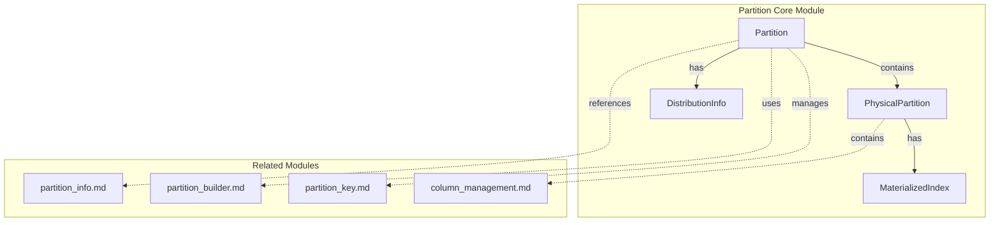
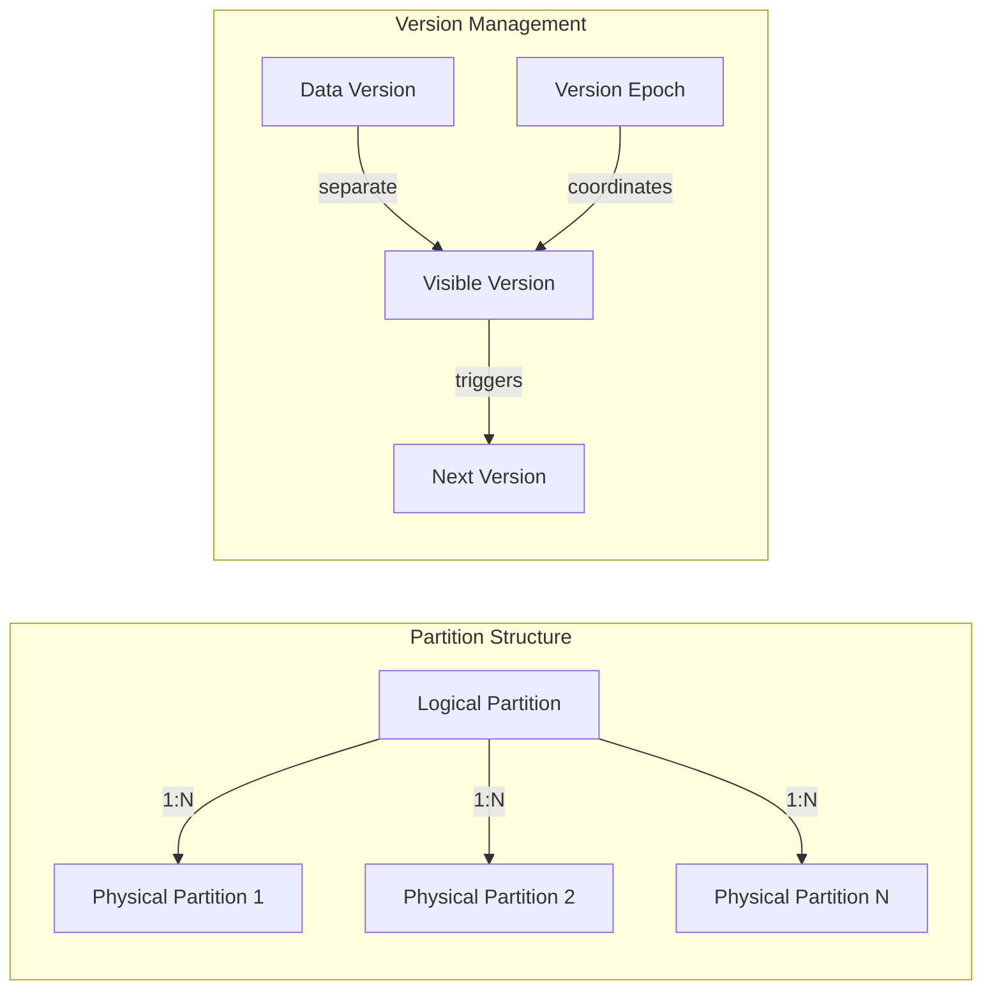
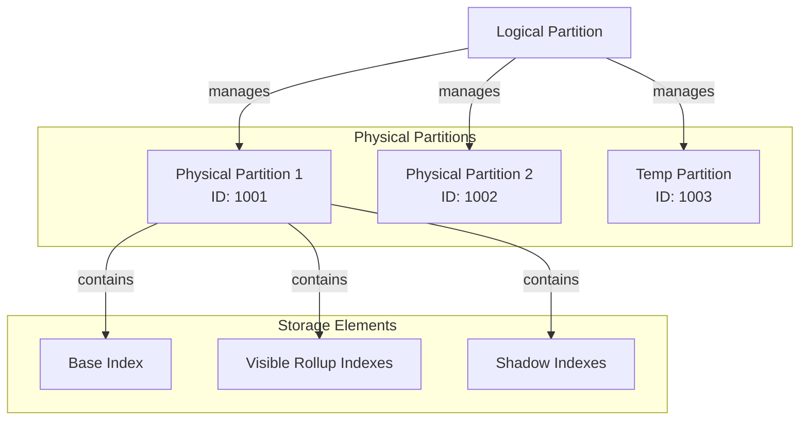
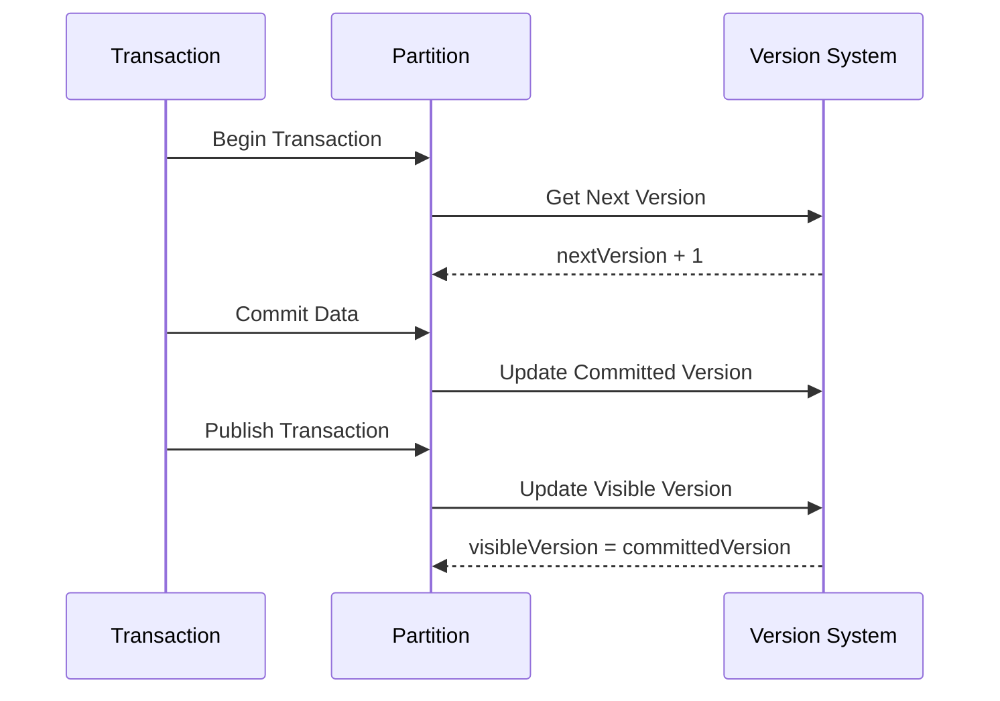
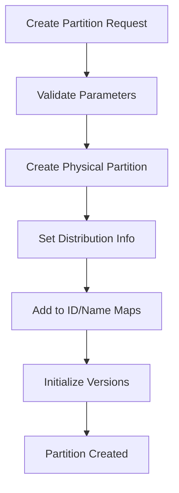
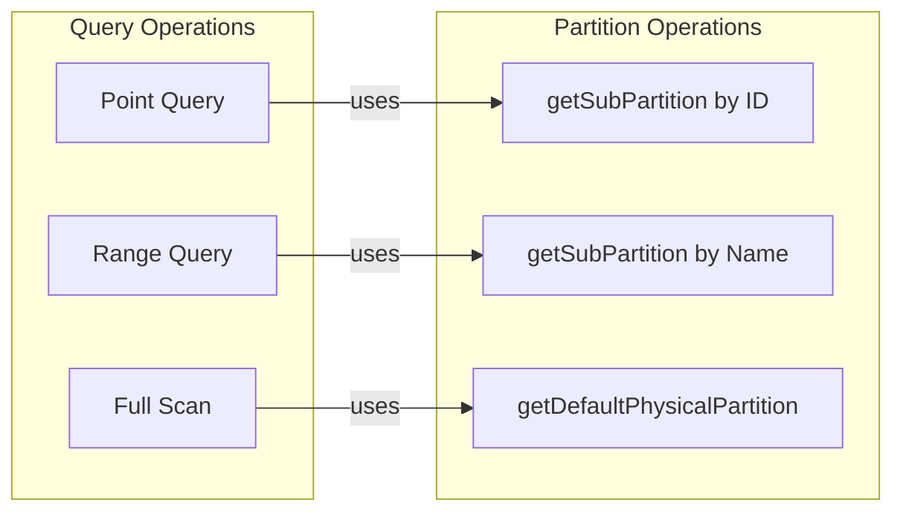
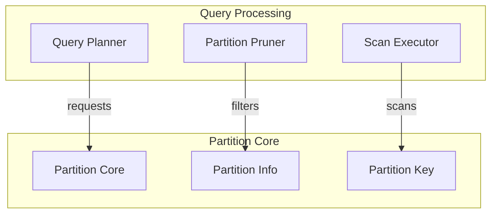
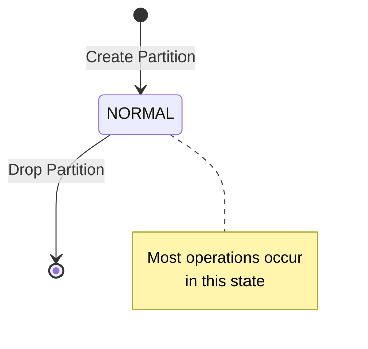
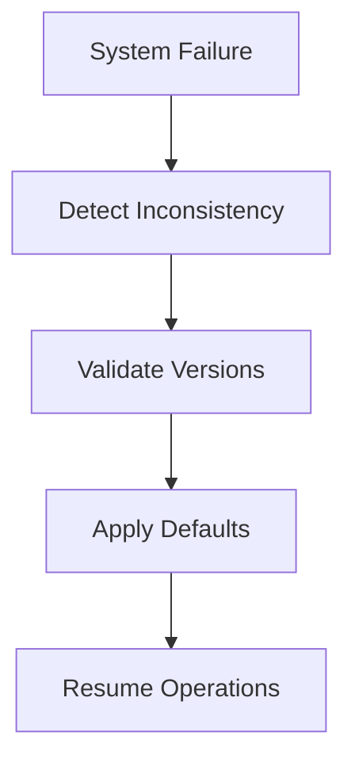

# Partition Core Module Documentation

## Overview

The partition_core module is a fundamental component of StarRocks' storage engine that manages partition metadata and lifecycle operations. It provides the core data structures and operations for handling table partitions, which are essential for data organization, query optimization, and distributed storage management.

## Purpose and Core Functionality

The partition_core module serves as the central hub for partition management in StarRocks, offering:

- **Partition Metadata Management**: Maintains comprehensive metadata for table partitions including version tracking, state management, and distribution information
- **Physical Partition Abstraction**: Manages the relationship between logical partitions and their physical storage representations
- **Version Control**: Implements sophisticated version management for partition data, supporting both shared-nothing and shared-data storage modes
- **Lifecycle Operations**: Handles partition creation, modification, and deletion operations
- **Data Organization**: Provides mechanisms for organizing data across multiple physical partitions within a logical partition

## Architecture

### Core Components

### Component Relationships

## Key Data Structures

### Partition Class

The `Partition` class is the central entity that represents a logical partition in StarRocks. It encapsulates:

- **Identity**: Unique ID and name for the partition
- **State Management**: Current partition state (NORMAL, ROLLUP, SCHEMA_CHANGE)
- **Physical Partitions**: Mapping of physical partitions that store the actual data
- **Version Information**: Comprehensive version tracking for data consistency
- **Distribution Info**: How data is distributed across nodes

### Physical Partition Management

Each logical partition can contain multiple physical partitions:

## Version Management System

### Version Types

The partition_core module implements a sophisticated version management system:

1. **Visible Version**: The current version visible to users
2. **Next Version**: The version that will be committed next
3. **Data Version**: Version tracking for data changes (separate from visible version in shared-data mode)
4. **Version Epoch**: Global transaction identifier for consistency

### Version Flow

## Data Flow and Operations

### Partition Creation Flow

### Data Access Patterns

## Integration with Other Modules

### Storage Engine Integration

The partition_core module integrates with various storage engine components:

- **[storage_engine](storage_engine.md)**: Provides physical storage management
- **[rowset_management](rowset_management.md)**: Manages rowset lifecycle within partitions
- **[data_compaction](data_compaction.md)**: Handles partition-level compaction operations

### Query Engine Integration

## State Management

### Partition States

The module supports different partition states:

- **NORMAL**: Standard operational state
- **ROLLUP**: Deprecated state for rollup operations
- **SCHEMA_CHANGE**: Deprecated state for schema modifications

### State Transitions

## Performance Considerations

### Memory Management

- **Lazy Initialization**: Physical partitions are created on-demand
- **Map-based Lookups**: Efficient O(1) access to sub-partitions by ID
- **TreeMap for Names**: Case-insensitive name lookups with ordering

### Concurrency Control

- **Atomic Operations**: Version updates use atomic variables
- **Immutable Flags**: Partition immutability controlled via AtomicBoolean
- **Concurrent Collections**: Thread-safe maps for partition storage

## Error Handling and Recovery

### Version Consistency

The module implements several mechanisms to ensure version consistency:

- **Gson Post-processing**: Handles version migration during deserialization
- **Default Value Assignment**: Provides sensible defaults for missing version fields
- **Validation Checks**: Ensures version coherence during operations

### Recovery Mechanisms

## Configuration and Tuning

### Key Parameters

- **PARTITION_INIT_VERSION**: Initial version for new partitions (default: 1L)
- **Version Epoch Generation**: Uses global GTID generator for consistency

### Best Practices

1. **Partition Size**: Keep partitions reasonably sized for optimal performance
2. **Version Management**: Monitor version gaps in shared-data mode
3. **Physical Partition Count**: Limit number of physical partitions per logical partition

## Monitoring and Observability

### Key Metrics

- **Partition Count**: Number of active partitions
- **Version Lag**: Difference between next and visible versions
- **Data Size**: Total data size across all physical partitions
- **Row Count**: Total row count for the partition

### Logging

The module provides comprehensive logging for:
- Partition creation and deletion
- Version changes and state transitions
- Error conditions and recovery operations

## Future Enhancements

### Planned Improvements

1. **Enhanced State Management**: More granular partition states
2. **Improved Version Tracking**: Better support for time-travel queries
3. **Dynamic Partitioning**: Automatic partition management based on data patterns
4. **Cross-Partition Operations**: Optimized operations spanning multiple partitions

## References

- [partition_info](partition_info.md) - Detailed partition information management
- [partition_builder](partition_builder.md) - Partition construction utilities
- [partition_key](partition_key.md) - Partition key handling
- [storage_engine](storage_engine.md) - Storage engine integration
- [rowset_management](rowset_management.md) - Rowset lifecycle management