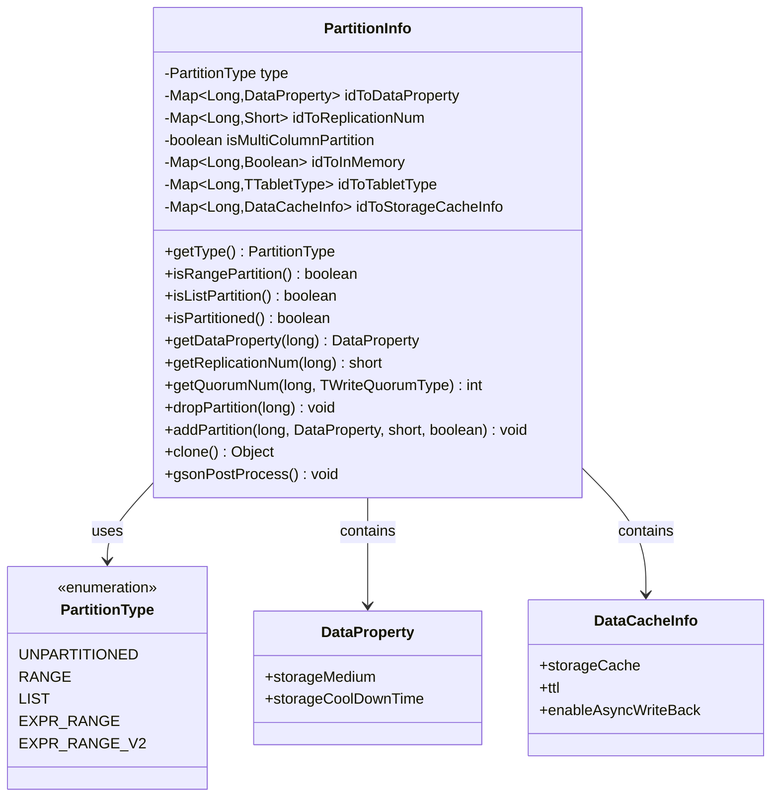
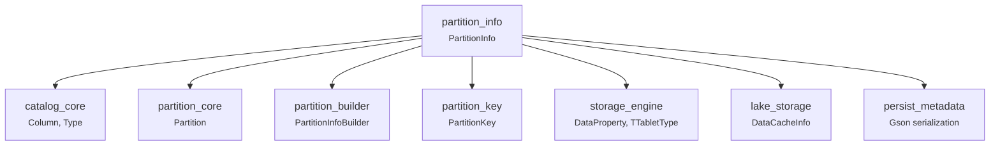
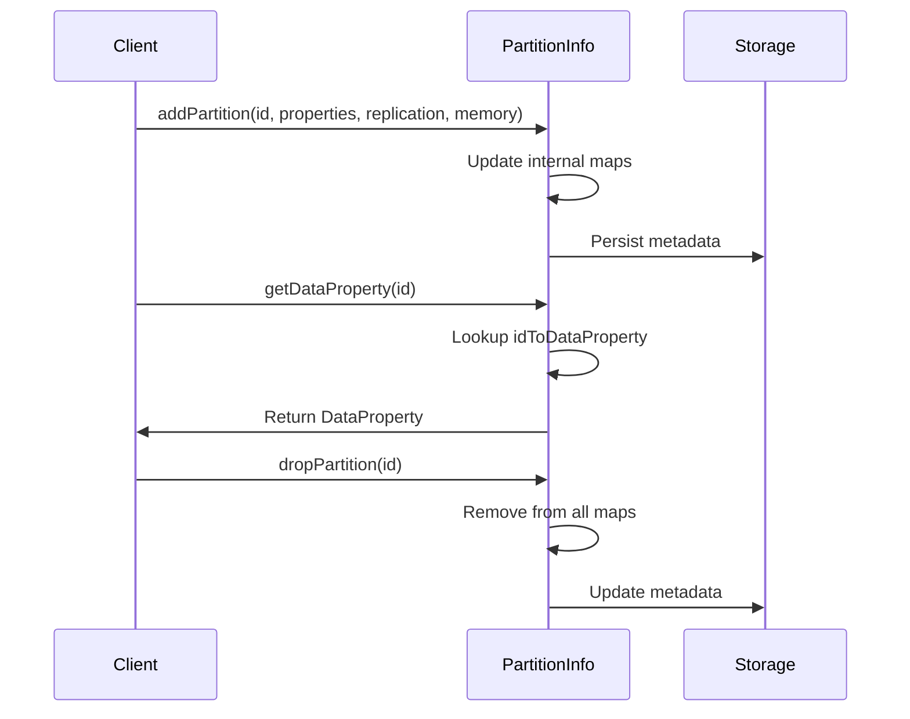
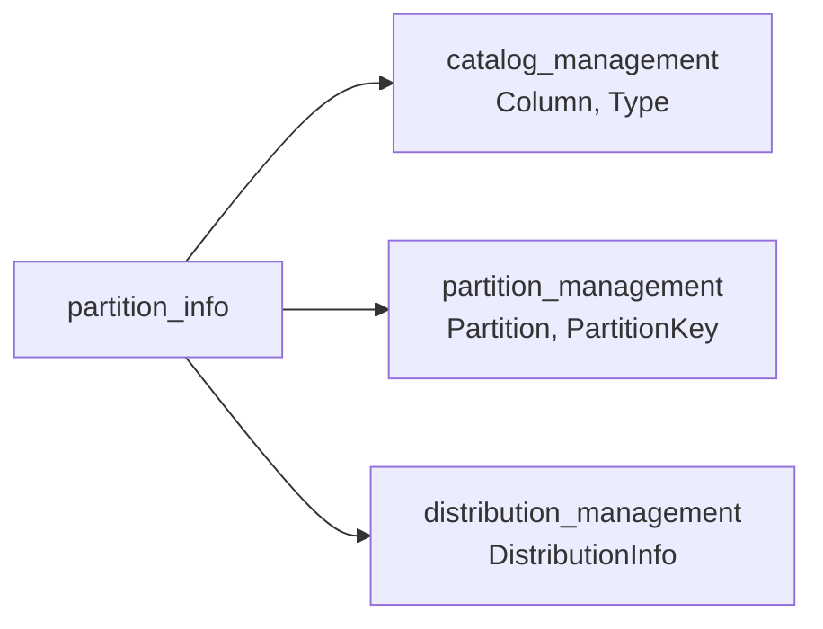
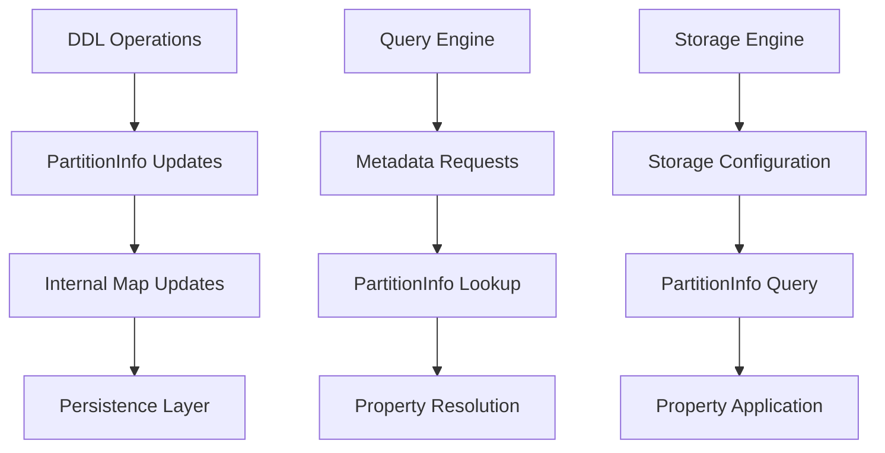
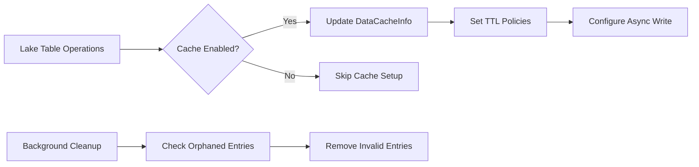

# Partition Info Module Documentation

## Overview

The `partition_info` module is a core component of StarRocks' catalog management system, providing the foundational data structures and logic for managing table partition metadata. This module serves as the central repository for partition-related information, handling partition properties, replication settings, storage configurations, and caching policies across different partition types.

The module implements the `PartitionInfo` class, which acts as a comprehensive container for all partition-specific metadata, supporting various partitioning strategies including range partitioning, list partitioning, expression-based partitioning, and unpartitioned tables.

## Architecture

### Core Component Structure



### Module Dependencies



## Core Functionality

### Partition Type Management

The module supports multiple partition types through the `PartitionType` enumeration:

- **UNPARTITIONED**: Tables without partitioning
- **RANGE**: Range-based partitioning with continuous value ranges
- **LIST**: List-based partitioning with discrete value sets
- **EXPR_RANGE**: Expression-based range partitioning for materialized views
- **EXPR_RANGE_V2**: Enhanced expression-based range partitioning

### Property Management

The `PartitionInfo` class maintains several key properties for each partition:

#### Data Properties
- **Storage Medium**: HDD, SSD, or other storage types
- **Storage Cooldown Time**: Automatic data lifecycle management
- **Data Property Mapping**: `idToDataProperty` map for partition-specific settings

#### Replication Configuration
- **Replication Number**: Number of data replicas per partition
- **Write Quorum**: Configurable write consistency levels (ALL, ONE, MAJORITY)
- **Replication Mapping**: `idToReplicationNum` for partition-level replication control

#### Memory Management
- **In-Memory Storage**: Boolean flag for memory-resident partitions
- **Memory Mapping**: `idToInMemory` for partition-specific memory settings

#### Lake Table Support
- **Storage Cache**: Caching configuration for lake tables
- **TTL Settings**: Time-to-live for cached data
- **Async Write Back**: Background write-back policies
- **Cache Mapping**: `idToStorageCacheInfo` for lake table cache management

### Partition Operations

#### Partition Lifecycle


#### Quorum Calculation
The module implements intelligent quorum calculation based on write quorum types:
- **ALL**: Requires all replicas to acknowledge writes
- **ONE**: Requires only one replica acknowledgment
- **MAJORITY**: Requires majority (N/2 + 1) replica acknowledgment

### Serialization and Persistence

#### JSON Serialization
- **Gson Integration**: Custom serialization using Gson annotations
- **Pre/Post Processing**: `GsonPreProcessable` and `GsonPostProcessable` interfaces
- **Data Cleanup**: Automatic cleanup of orphaned cache entries during deserialization

#### Clone Support
- **Deep Copy**: Complete replication of all internal data structures
- **Type Preservation**: Maintains partition type and properties during cloning
- **Restore Operations**: Support for partition ID remapping during restore operations

## Integration Points

### Catalog Integration

The module integrates with the broader catalog system through:



### Storage Engine Integration

Integration with storage engines includes:

- **Data Property Management**: Storage medium and lifecycle policies
- **Replication Control**: Replica count and distribution strategies
- **Cache Management**: Lake table caching and TTL policies
- **Tablet Type Support**: Different storage tablet configurations

### Query Engine Integration

The module supports query optimization through:

- **Partition Pruning**: Metadata for partition elimination during query planning
- **Replication Awareness**: Query routing based on replica availability
- **Cache Optimization**: Lake table cache utilization for performance

## Data Flow

### Partition Metadata Flow



### Cache Management Flow



## Configuration and Usage

### Basic Configuration

```java
// Create partition info for range partitioning
PartitionInfo partitionInfo = new PartitionInfo(PartitionType.RANGE);

// Set partition properties
partitionInfo.addPartition(
    partitionId,
    new DataProperty(TStorageMedium.HDD),
    (short) 3,  // replication number
    false       // in-memory storage
);

// Configure lake table caching
DataCacheInfo cacheInfo = new DataCacheInfo(true, 3600, true);
partitionInfo.setDataCacheInfo(partitionId, cacheInfo);
```

### Advanced Configuration

```java
// Multi-column partitioning setup
partitionInfo.setMultiColumnPartition(true);

// Custom tablet type for specific partitions
partitionInfo.setTabletType(partitionId, TTabletType.TABLET_TYPE_MEMORY);

// Write quorum configuration
int quorumNum = partitionInfo.getQuorumNum(partitionId, TWriteQuorumType.MAJORITY);
```

## Error Handling and Validation

### Data Consistency
- **Null Safety**: Safe handling of missing partition entries
- **Map Consistency**: Ensures all related maps stay synchronized
- **Type Validation**: Validates partition type compatibility

### Recovery Mechanisms
- **Orphaned Data Cleanup**: Automatic removal of inconsistent cache entries
- **Restore Operations**: Support for partition ID remapping during backup/restore
- **Clone Safety**: Deep copying prevents accidental data corruption

## Performance Considerations

### Memory Management
- **Efficient Maps**: HashMap-based storage for O(1) lookup performance
- **Lazy Initialization**: Deferred initialization of optional features
- **Memory Optimization**: Automatic cleanup of unused entries

### Scalability
- **Partition Scalability**: Supports large numbers of partitions efficiently
- **Concurrent Access**: Thread-safe operations for multi-user environments
- **Storage Optimization**: Efficient serialization for metadata persistence

## Related Documentation

- [partition_core.md](partition_core.md) - Core partition management
- [partition_builder.md](partition_builder.md) - Partition construction utilities
- [partition_key.md](partition_key.md) - Partition key handling
- [catalog_management.md](catalog_management.md) - Catalog integration
- [storage_engine.md](storage_engine.md) - Storage engine integration
- [lake_storage.md](lake_storage.md) - Lake table storage management