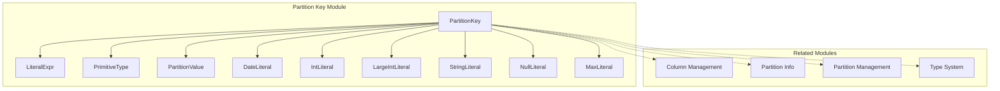
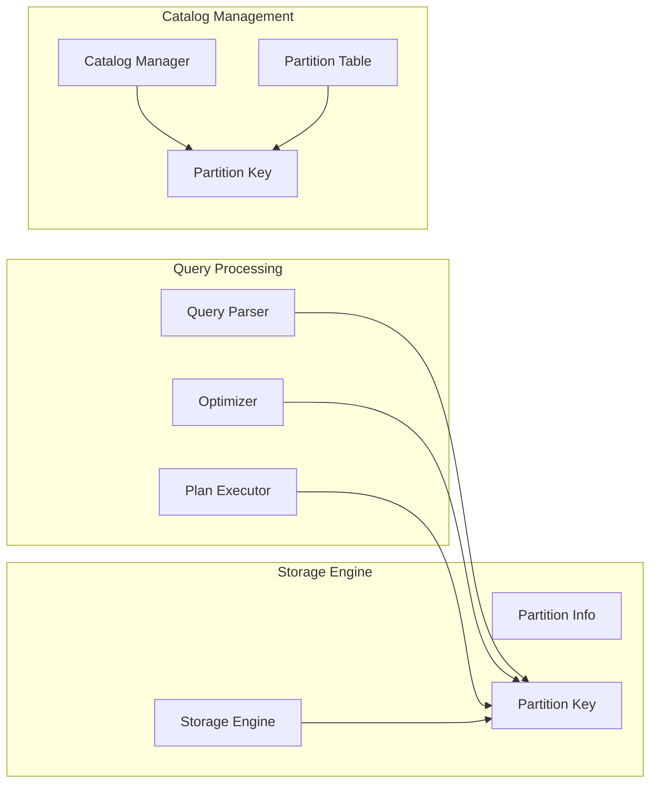
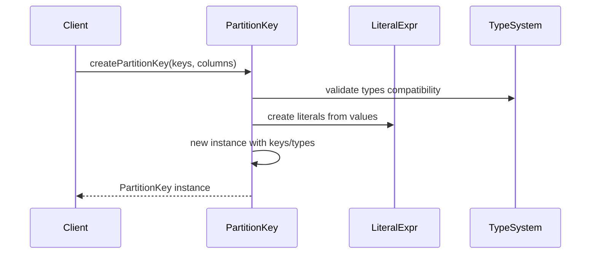
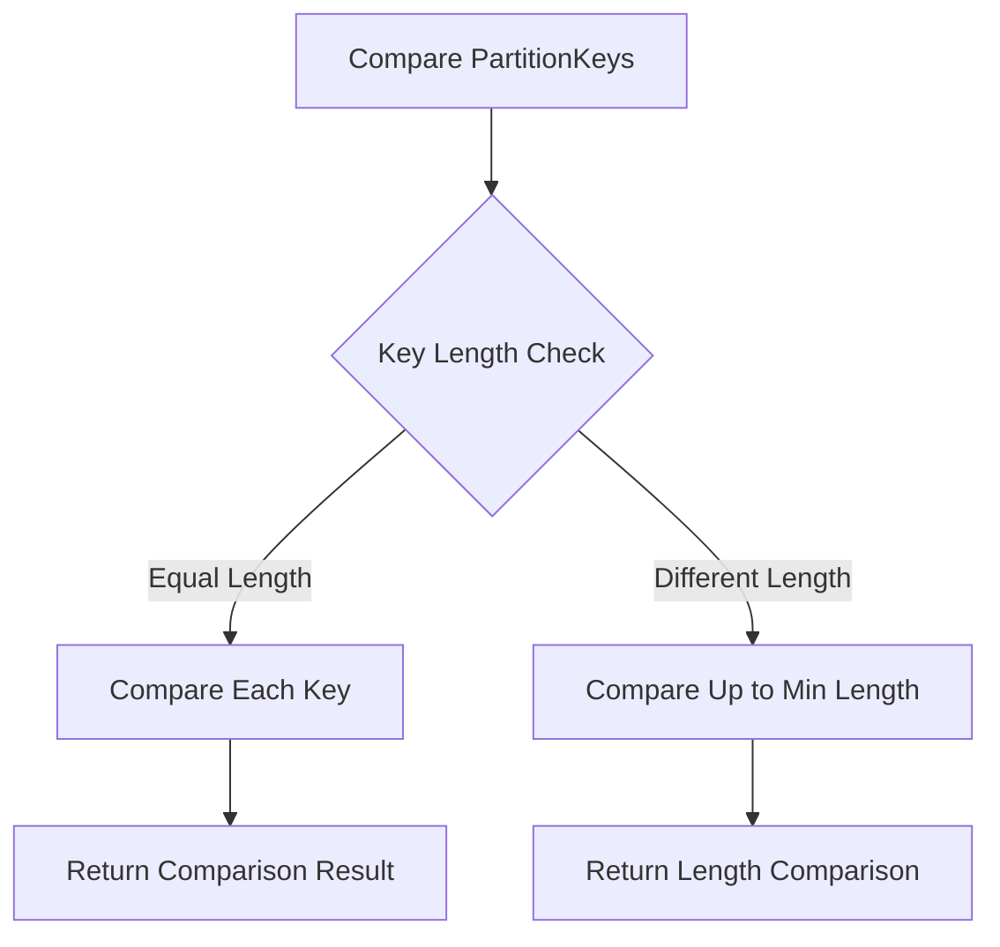
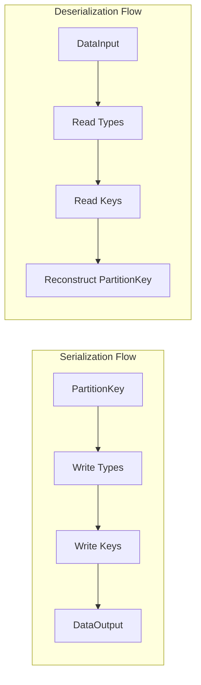
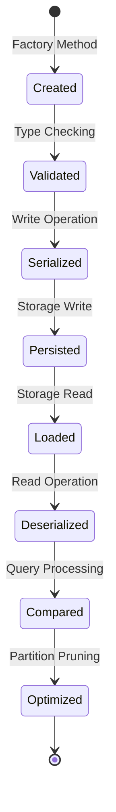
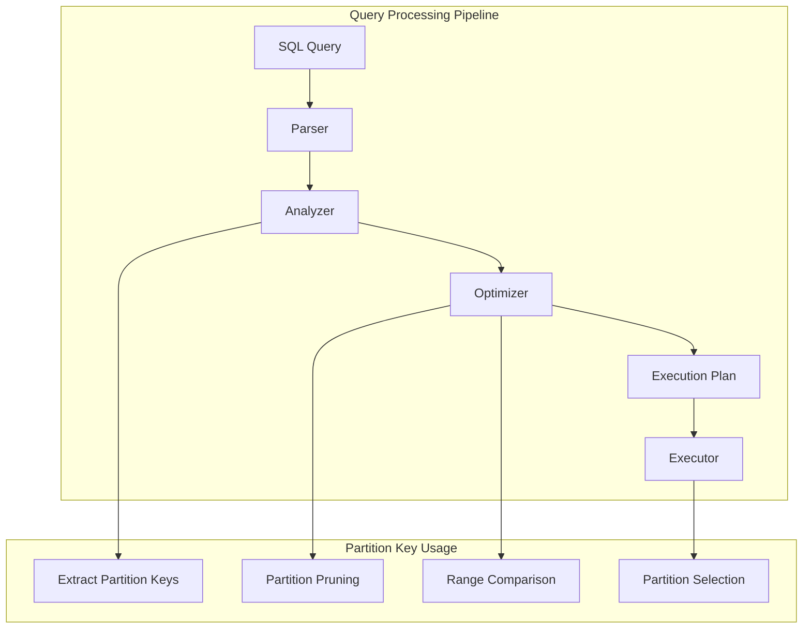
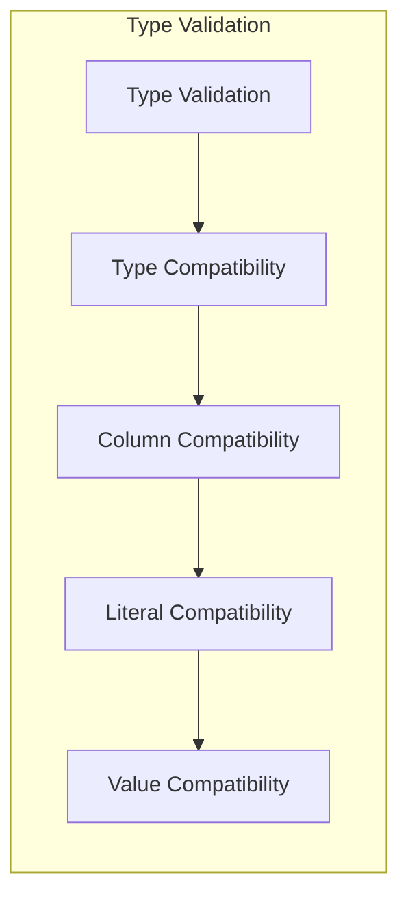

# Partition Key Module Documentation

## Overview

The `partition_key` module is a core component of StarRocks' partitioning system, providing the fundamental data structure and operations for managing partition keys in distributed table storage. This module implements the `PartitionKey` class which represents the boundary values that define individual partitions within partitioned tables.

Partition keys are essential for StarRocks' distributed storage architecture, enabling efficient data distribution, partition pruning, and query optimization across multiple nodes and storage systems.

## Architecture

### Core Component Structure



### System Integration



## Core Functionality

### Partition Key Representation

The `PartitionKey` class encapsulates:

1. **Key Values**: A list of `LiteralExpr` objects representing the actual partition boundary values
2. **Type Information**: A list of `PrimitiveType` objects defining the data types of each key column
3. **Null Handling**: Support for null partition values with configurable null representation strings

### Key Operations

#### Construction and Factory Methods



#### Comparison and Ordering



#### Serialization and Persistence



## Data Flow

### Partition Key Lifecycle



### Query Processing Integration



## Component Relationships

### Dependencies

The `partition_key` module depends on:

- **[column_management](column_management.md)**: For column type information and validation
- **[type_system](type_system.md)**: For primitive type definitions and compatibility checking
- **[partition_management](partition_management.md)**: For partition-level operations and metadata

### Dependents

The `partition_key` module is used by:

- **[partition_info](partition_info.md)**: For partition boundary definitions
- **[partition_builder](partition_builder.md)**: For constructing partition metadata
- **[partition_core](partition_core.md)**: For partition-level operations
- **[query_execution](query_execution.md)**: For partition pruning and optimization
- **[storage_engine](storage_engine.md)**: For data distribution and retrieval

## Key Features

### Type Safety



### Range Operations

- **Predecessor/Successor**: Calculate adjacent partition keys for range queries
- **Comparison**: Full ordering support for partition pruning
- **Infinity Support**: Handle minimum and maximum boundary values

### Null Value Handling

- **Configurable Null Representation**: Support for different null value strings
- **Hive Compatibility**: Default `__HIVE_DEFAULT_PARTITION__` support
- **Multi-Engine Support**: Adaptable null handling for different storage systems

## Performance Considerations

### Memory Efficiency

- **Lazy Initialization**: Components created only when needed
- **Immutable Design**: Thread-safe operations without synchronization overhead
- **Efficient Serialization**: Compact binary format for storage and network transfer

### Query Optimization

- **Partition Pruning**: Eliminate unnecessary partition scans
- **Range Pruning**: Efficient boundary comparisons
- **Index Utilization**: Support for partition-level indexing

## Error Handling

### Validation Exceptions

- **Type Mismatch**: Invalid type combinations rejected at construction
- **Value Overflow**: Numeric overflow detection and handling
- **Format Errors**: String-to-value conversion validation

### Runtime Exceptions

- **Cast Failures**: Graceful handling of incompatible type casts
- **Serialization Errors**: I/O exception propagation and handling
- **Comparison Errors**: Invalid comparison operations detection

## Usage Examples

### Basic Partition Key Creation

```java
// Create from partition values and columns
List<PartitionValue> values = Arrays.asList(new PartitionValue("2023-01-01"));
List<Column> columns = Arrays.asList(dateColumn);
PartitionKey key = PartitionKey.createPartitionKey(values, columns);
```

### Range Query Processing

```java
// Find partitions in range
PartitionKey start = PartitionKey.ofDate(startDate);
PartitionKey end = PartitionKey.ofDate(endDate);
List<Partition> matchingPartitions = partitionRange(start, end);
```

### Serialization for Storage

```java
// Write to storage
DataOutput output = new DataOutputStream(fileStream);
partitionKey.write(output);

// Read from storage
DataInput input = new DataInputStream(fileStream);
PartitionKey loadedKey = PartitionKey.read(input);
```

## Integration Points

### Catalog Integration

The partition key module integrates with the catalog system through:
- **Metadata Persistence**: Storage in catalog tables
- **Schema Evolution**: Support for partition key changes
- **Version Management**: Compatibility across system upgrades

### Storage Engine Integration

Integration with storage engines includes:
- **Data Distribution**: Partition-aware data placement
- **Scan Optimization**: Partition pruning during query execution
- **Index Support**: Partition-level index structures

### Connector Integration

External connector support through:
- **Format Conversion**: Adapter pattern for different partition formats
- **Type Mapping**: Cross-system type compatibility
- **Null Handling**: Consistent null value representation

## Future Enhancements

### Planned Improvements

- **Composite Key Optimization**: Enhanced multi-column partition key handling
- **Dynamic Partitioning**: Runtime partition key generation
- **Advanced Pruning**: Machine learning-based partition selection
- **Cross-System Compatibility**: Enhanced connector integration

### Scalability Considerations

- **Distributed Metadata**: Partition key metadata distribution
- **Caching Strategies**: Efficient partition key caching
- **Bulk Operations**: Optimized batch partition key processing

## References

- [Column Management](column_management.md) - Column type and metadata management
- [Partition Management](partition_management.md) - High-level partition operations
- [Type System](type_system.md) - Data type definitions and compatibility
- [Storage Engine](storage_engine.md) - Low-level storage operations
- [Query Execution](query_execution.md) - Query processing and optimization