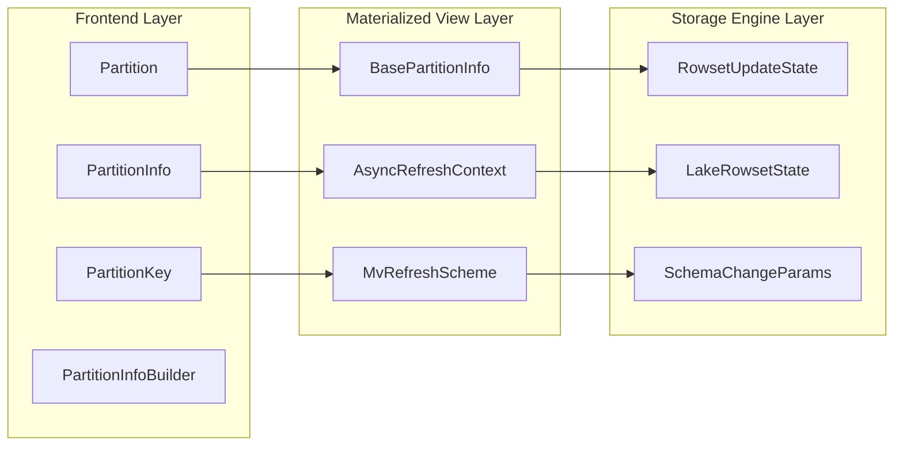
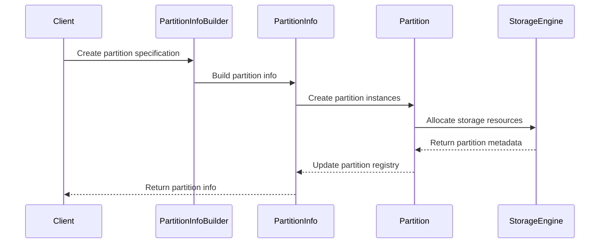
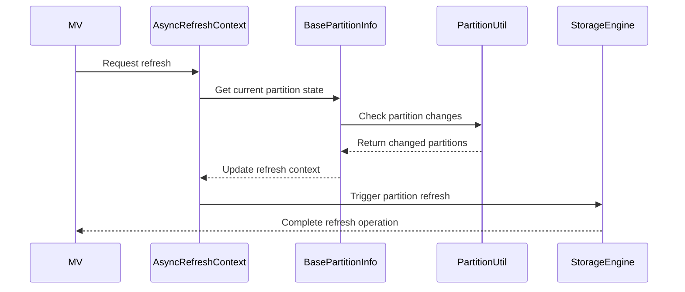

# Partition Management Module

## Introduction

The partition_management module is a core component of StarRocks that handles the organization, tracking, and management of data partitions across the system. It provides the foundational infrastructure for partitioning tables and materialized views, enabling efficient data distribution, query optimization, and maintenance operations.

## Overview

Partition management in StarRocks encompasses several key areas:

- **Table Partitioning**: Managing range and list partitions for OLAP tables
- **Materialized View Partitioning**: Handling partition synchronization between base tables and materialized views
- **Partition Metadata**: Tracking partition information, versions, and refresh states
- **Partition Operations**: Supporting partition creation, deletion, and modification operations

## Architecture

### Core Components

```mermaid
graph TB
    subgraph "Partition Management Core"
        PC[Partition Core<br/>fe.fe-core.src.main.java.com.starrocks.catalog.Partition.Partition]
        PI[Partition Info<br/>fe.fe-core.src.main.java.com.starrocks.catalog.PartitionInfo.PartitionInfo]
        PIB[Partition Info Builder<br/>fe.fe-core.src.main.java.com.starrocks.catalog.PartitionInfoBuilder.PartitionInfoBuilder]
        PK[Partition Key<br/>fe.fe-core.src.main.java.com.starrocks.catalog.PartitionKey.PartitionKey]
    end

    subgraph "Materialized View Extensions"
        BPI[Base Partition Info<br/>fe.fe-core.src.main.java.com.starrocks.catalog.MaterializedView.BasePartitionInfo]
        ARC[Async Refresh Context<br/>fe.fe-core.src.main.java.com.starrocks.catalog.MaterializedView.AsyncRefreshContext]
        MRS[Mv Refresh Scheme<br/>fe.fe-core.src.main.java.com.starrocks.catalog.MaterializedView.MvRefreshScheme]
    end

    subgraph "Storage Engine Integration"
        RSE[Rowset Update State<br/>be.src.storage.rowset_update_state.RowidSortEntry]
        LRS[Lake Rowset State<br/>be.src.storage.lake.rowset_update_state.RowidSortEntry]
        SCP[Schema Change Params<br/>be.src.storage.lake.schema_change.SchemaChangeParams]
    end

    PC --> PI
    PI --> PIB
    PK --> PI
    BPI --> ARC
    ARC --> MRS
    LRS --> SCP
```



### Component Relationships



## Core Functionality

### 1. Partition Core Management

The **Partition** class represents individual partitions within a table, managing:
- Partition identification and metadata
- Physical partition organization
- Partition state and lifecycle
- Relationship with parent tables

### 2. Partition Information Management

The **PartitionInfo** class handles:
- Partition scheme definitions (range, list, expression-based)
- Partition column specifications
- Partition boundaries and ranges
- Distribution strategies

### 3. Partition Key Handling

The **PartitionKey** class manages:
- Partition key values and types
- Key comparison and sorting
- Key generation from data
- Key validation and normalization

### 4. Materialized View Partition Integration

For materialized views, the module provides:

#### BasePartitionInfo
- Tracks partition-level metadata for base tables
- Manages partition versions and refresh timestamps
- Handles external table partition information
- Supports partition change tracking

#### AsyncRefreshContext
- Maintains refresh state for asynchronous materialized views
- Tracks base table partition versions
- Manages partition-to-partition mappings
- Handles time-based refresh scheduling

#### MvRefreshScheme
- Defines refresh strategies (AUTO, PCT, FULL, INCREMENTAL)
- Manages refresh timing and scheduling
- Coordinates with async refresh contexts
- Supports partition refresh strategies (FORCE, STRICT, ADAPTIVE)

## Data Flow

### Partition Creation Flow



### Materialized View Refresh Flow



## Integration Points

The partition management module integrates with several other StarRocks modules:

### Storage Engine Integration

The partition management module integrates with the storage engine through:

- **Rowset Management**: [rowset_management.md](rowset_management.md) - Coordinates with rowset lifecycle
- **Lake Storage**: [lake_storage.md](lake_storage.md) - Manages cloud-native partition storage
- **Schema Changes**: [schema_and_types.md](schema_and_types.md) - Handles partition schema evolution

### Query Engine Integration

Integration with query execution through:

- **Partition Pruning**: Works with [predicate_evaluation.md](predicate_evaluation.md) for query optimization
- **Scan Optimization**: Coordinates with [query_execution.md](query_execution.md) for efficient data access
- **Statistics**: Integrates with [statistics.md](statistics.md) for partition-level statistics

### Catalog Integration

The module works closely with:

- **Table Management**: [table_structure.md](table_structure.md) for table-partition relationships
- **Materialized Views**: [materialized_views.md](materialized_views.md) for MV partition synchronization
- **Distribution Management**: [distribution_management.md](distribution_management.md) for partition distribution

## Key Features

### 1. Multi-Table Partition Support

Supports partitioning across multiple base tables with:
- Cross-table partition correlation
- Multi-column partitioning
- Expression-based partitioning
- Dynamic partition management

### 2. Partition Change Tracking

Implements sophisticated change tracking for:
- Base table partition modifications
- Materialized view partition synchronization
- Incremental refresh capabilities
- Version-based consistency

### 3. Refresh Strategy Management

Provides flexible refresh strategies:
- **PCT (Partition Change Tracking)**: Refresh only changed partitions
- **FULL**: Complete refresh of all partitions
- **INCREMENTAL**: Row-level incremental refresh
- **AUTO**: Automatic strategy selection

### 4. Adaptive Partition Refresh

Supports adaptive refresh strategies:
- **STRICT**: Fixed number of partitions
- **ADAPTIVE**: Threshold-based selection
- **FORCE**: Complete refresh regardless of changes

## Configuration and Usage

### Partition Creation

```sql
-- Range partitioning
CREATE TABLE sales (
    id INT,
    sale_date DATE,
    amount DECIMAL(10,2)
)
PARTITION BY RANGE (sale_date) (
    PARTITION p1 VALUES LESS THAN ('2023-01-01'),
    PARTITION p2 VALUES LESS THAN ('2023-02-01'),
    PARTITION p3 VALUES LESS THAN ('2023-03-01')
);

-- List partitioning
CREATE TABLE regions (
    id INT,
    region VARCHAR(50),
    sales DECIMAL(10,2)
)
PARTITION BY LIST (region) (
    PARTITION p_north VALUES IN ('North', 'Northeast'),
    PARTITION p_south VALUES IN ('South', 'Southeast'),
    PARTITION p_west VALUES IN ('West', 'Midwest')
);
```

### Materialized View Partitioning

```sql
-- Partitioned materialized view
CREATE MATERIALIZED VIEW sales_summary
PARTITION BY sale_date
REFRESH ASYNC
AS
SELECT 
    sale_date,
    SUM(amount) as total_sales,
    COUNT(*) as transaction_count
FROM sales
GROUP BY sale_date;
```

## Performance Considerations

### 1. Partition Pruning

The module optimizes query performance through:
- Intelligent partition elimination
- Predicate pushdown to partition level
- Statistics-based partition selection
- Dynamic partition filtering

### 2. Refresh Optimization

Implements several optimization strategies:
- Incremental partition refresh
- Parallel partition processing
- Smart partition selection
- Resource-aware refresh scheduling

### 3. Memory Management

Efficient memory usage through:
- Lazy partition metadata loading
- Partition metadata caching
- Garbage collection of unused partitions
- Memory-efficient partition representations

## Monitoring and Maintenance

### Partition Health Monitoring

The module provides monitoring capabilities for:
- Partition freshness and staleness
- Refresh success/failure rates
- Partition size and growth trends
- Cross-partition data skew

### Maintenance Operations

Supports various maintenance tasks:
- Partition compaction and optimization
- Partition metadata cleanup
- Orphaned partition detection
- Partition statistics updates

## Error Handling and Recovery

### Partition Validation

Implements comprehensive validation:
- Partition key validation
- Boundary checking
- Cross-partition consistency
- Metadata integrity verification

### Recovery Mechanisms

Provides recovery capabilities for:
- Partition metadata corruption
- Refresh failure recovery
- Partition state reconciliation
- Automatic retry mechanisms

## Future Enhancements

### Planned Features

- **Subpartitioning Support**: Nested partitioning schemes
- **Dynamic Partitioning**: Automatic partition creation based on data patterns
- **Partition Archiving**: Automated partition lifecycle management
- **Cross-Cluster Partitioning**: Distributed partition management

### Performance Improvements

- **Parallel Partition Operations**: Concurrent partition processing
- **Intelligent Partition Placement**: Data locality optimization
- **Adaptive Partition Sizing**: Dynamic partition size adjustment
- **Predictive Refresh**: ML-based refresh scheduling

## Related Documentation

- [Storage Engine](storage_engine.md) - Underlying storage infrastructure
- [Materialized Views](materialized_views.md) - MV-specific partition handling
- [Query Execution](query_execution.md) - Partition-aware query processing
- [Schema Management](schema_and_types.md) - Partition schema evolution
- [Statistics](statistics.md) - Partition-level statistics collection