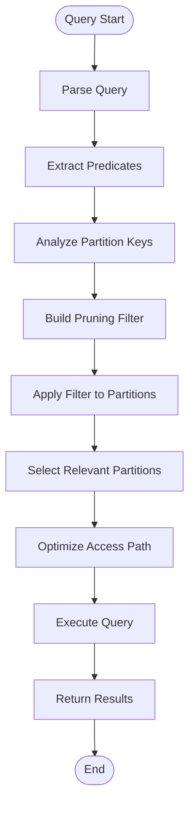

# Partition Management Module - Comprehensive Documentation

## Introduction

The partition_management module is a critical component of the StarRocks database system that handles the organization, storage, and management of table partitions. This module provides the foundational infrastructure for partitioning data across multiple storage units, enabling efficient data distribution, query optimization, and parallel processing capabilities.

Partition management is essential for handling large-scale datasets by dividing them into smaller, more manageable pieces based on partition keys. The module supports various partitioning strategies and integrates with different storage engines and connector frameworks to provide a unified partitioning interface across diverse data sources.

Based on the provided code analysis, the module includes core components such as `Partition`, `PartitionInfo`, `PartitionInfoBuilder`, and `PartitionKey` from the frontend catalog system, as well as connector-specific implementations like `HivePartition.Builder` for external table integration.

## Core Architecture

### Component Overview

The partition_management module consists of four primary architectural layers:

1. **Core Partition Layer**: Manages the fundamental partition objects and their lifecycle
2. **Partition Information Layer**: Handles metadata and configuration for partitioning schemes
3. **Builder Pattern Layer**: Provides flexible construction mechanisms for partition objects
4. **Key Management Layer**: Manages partition keys and their relationships

### Key Components

#### Partition Core (`fe.fe-core.src.main.java.com.starrocks.catalog.Partition.Partition`)
The central partition entity that represents a logical data partition within a table. This component maintains partition state, metadata, and provides the primary interface for partition operations.

#### Partition Information (`fe.fe-core.src.main.java.com.starrocks.catalog.PartitionInfo.PartitionInfo`)
Encapsulates the partitioning scheme configuration, including partition type, distribution strategy, and associated metadata. This component defines how data is distributed across partitions.

#### Partition Builder (`fe.fe-core.src.main.java.com.starrocks.catalog.PartitionInfoBuilder.PartitionInfoBuilder`)
Implements the builder pattern for constructing partition information objects with various configuration options. Provides a fluent interface for complex partition setup scenarios.

#### Partition Key (`fe.fe-core.src.main.java.com.starrocks.catalog.PartitionKey.PartitionKey`)
Manages the partition key definitions and their relationships to actual data distribution. Handles key parsing, validation, and comparison operations.

## Architecture Diagram


## Data Flow Architecture


## Component Interactions

### Partition Creation Flow


### Partition Query Flow


## Integration with Storage Engine

The partition_management module integrates deeply with the storage engine through several key interfaces:

### Storage Engine Integration Points

1. **Rowset Management**: Partitions coordinate with rowset management for data organization
2. **Persistent Index**: Partition keys are indexed for efficient lookup operations
3. **Compaction Policies**: Partition-aware compaction strategies optimize storage layout
4. **Lake Storage**: Integration with cloud-native storage formats

### Storage Engine Data Flow


## Connector Framework Integration

The partition_management module provides unified partition handling across different data source connectors:

### Connector Partition Traits

Each connector implements specific partition traits that define how partitioning is handled for that data source:

- **HivePartitionTraits**: Manages Hive-style partitioning with directory-based organization
- **IcebergPartitionTraits**: Handles Iceberg's hidden partitioning and metadata management
- **DeltaLakePartitionTraits**: Supports Delta Lake's partitioning with transaction log integration
- **JDBCPartitionTraits**: Provides partitioning capabilities for JDBC-connected databases

### Connector Integration Architecture


## Materialized View Integration

The partition_management module supports materialized views with partition-level refresh capabilities:

### Materialized View Partition Support


## Process Flows

### Partition Creation Process


### Partition Pruning Process



## Hive Partition Integration

Based on the provided code, the module includes specific support for Hive partitions through the `HivePartition.Builder` class:

### HivePartition Structure
```java
public class HivePartition {
    private final String databaseName;
    private final String tableName;
    private final List<String> values;
    private String location;
    private final HiveStorageFormat storage;
    private final List<Column> columns;
    private final Map<String, String> parameters;
    
    // Builder pattern for flexible construction
    public static class Builder {
        private String databaseName;
        private String tableName;
        private HiveStorageFormat storageFormat;
        private List<String> values;
        private List<Column> columns;
        private String location;
        private Map<String, String> parameters = ImmutableMap.of();
        
        // Fluent builder methods...
        public HivePartition build() {
            return new HivePartition(databaseName, tableName, values, location, 
                                   storageFormat, columns, parameters);
        }
    }
}
```

This design allows for flexible creation of Hive partitions with various configuration options while maintaining immutability of the final partition object.

## Key Features and Capabilities

### 1. Multi-Strategy Partitioning
- **Range Partitioning**: Divides data based on value ranges
- **List Partitioning**: Groups data based on discrete values
- **Hash Partitioning**: Distributes data using hash functions
- **Composite Partitioning**: Combines multiple partitioning strategies

### 2. Dynamic Partition Management
- **Automatic Partition Creation**: Creates partitions based on data ingestion
- **Partition Pruning**: Optimizes queries by eliminating irrelevant partitions
- **Partition Splitting**: Divides large partitions into smaller ones
- **Partition Merging**: Combines small partitions for efficiency

### 3. Cross-Connector Compatibility
- **Unified Interface**: Consistent API across different data sources
- **Connector-Specific Optimization**: Leverages native partitioning features
- **Metadata Synchronization**: Keeps partition metadata consistent
- **Hybrid Partitioning**: Supports partitioning across multiple systems

### 4. Performance Optimization
- **Partition Pruning**: Reduces data scanning during queries
- **Parallel Processing**: Enables concurrent partition operations
- **Caching**: Maintains partition metadata in memory
- **Index Integration**: Uses partition keys for efficient lookups

## Dependencies and Integration Points

### Internal Dependencies
- **Catalog Management**: Integrates with table and column metadata
- **Storage Engine**: Coordinates with rowset and persistent index systems
- **Query Execution**: Provides partition information for query planning
- **Transaction Management**: Ensures partition operations are transactional

### External Dependencies
- **Connector Framework**: Interfaces with various data source connectors
- **Lake Storage**: Supports cloud-native storage formats
- **Metadata Stores**: Persists partition information across sessions
- **Security Framework**: Enforces access control on partition operations

## Configuration and Usage

### Basic Partition Creation
```java
// Create partition information
PartitionInfo partitionInfo = PartitionInfoBuilder.builder()
    .setPartitionType(PartitionType.RANGE)
    .setPartitionColumns(Arrays.asList("date_column"))
    .setPartitionRange("2023-01-01", "2023-12-31")
    .build();

// Create partition
Partition partition = new Partition(
    partitionId,
    partitionName,
    partitionInfo,
    tabletIds
);
```

### Connector-Specific Partitioning
```java
// Hive partition
HivePartition hivePartition = HivePartition.builder()
    .setDatabaseName("hive_db")
    .setTableName("hive_table")
    .setValues(Arrays.asList("2023", "01", "01"))
    .setLocation("hdfs://path/to/partition")
    .setStorageFormat(HiveStorageFormat.PARQUET)
    .build();
```

## Error Handling and Recovery

### Common Error Scenarios
1. **Invalid Partition Key**: Validates key format and data types
2. **Storage Allocation Failure**: Handles insufficient storage scenarios
3. **Metadata Corruption**: Provides recovery mechanisms for damaged metadata
4. **Concurrent Modifications**: Implements optimistic locking for partition updates

### Recovery Strategies
- **Automatic Retry**: Retries failed operations with exponential backoff
- **Fallback Mechanisms**: Uses alternative storage or partitioning strategies
- **Metadata Reconstruction**: Rebuilds partition metadata from storage
- **Rollback Support**: Reverts incomplete partition operations

## Performance Considerations

### Optimization Strategies
1. **Partition Size**: Maintains optimal partition sizes for query performance
2. **Key Distribution**: Ensures even distribution of data across partitions
3. **Metadata Caching**: Caches frequently accessed partition metadata
4. **Parallel Operations**: Enables concurrent partition creation and management

### Monitoring and Metrics
- **Partition Count**: Tracks number of partitions per table
- **Partition Size**: Monitors individual partition sizes
- **Query Performance**: Measures partition pruning effectiveness
- **Storage Utilization**: Tracks storage efficiency across partitions

## Future Enhancements

### Planned Features
1. **Intelligent Partitioning**: ML-based partition size optimization
2. **Cross-Region Partitioning**: Support for geo-distributed partitions
3. **Real-time Partitioning**: Dynamic partition adjustment during query execution
4. **Advanced Pruning**: Enhanced partition elimination using statistics

### Scalability Improvements
- **Distributed Metadata**: Partition metadata across multiple nodes
- **Hierarchical Partitioning**: Support for nested partition structures
- **Elastic Partitioning**: Automatic partition resizing based on workload
- **Multi-Tenant Support**: Isolated partitioning for different tenants

## References

- [Storage Engine Documentation](storage_engine.md)
- [Catalog Management Documentation](catalog.md)
- [Connector Framework Documentation](connectors.md)
- [Query Execution Documentation](query_execution.md)
- [Materialized Views Documentation](materialized_views.md)